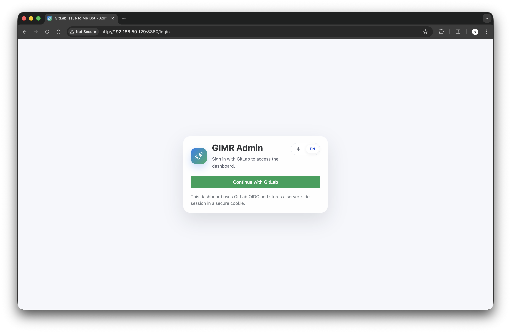
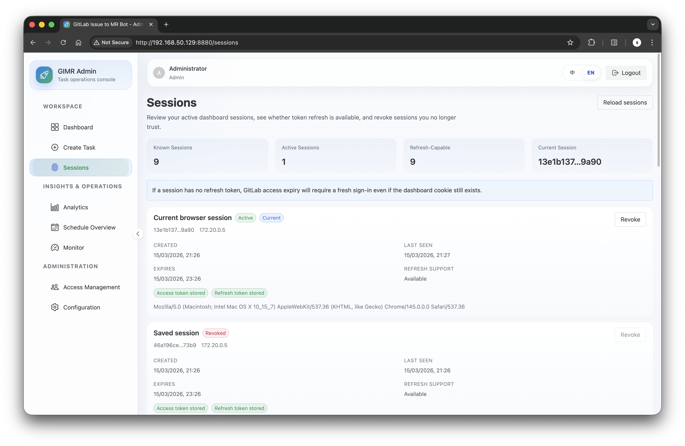
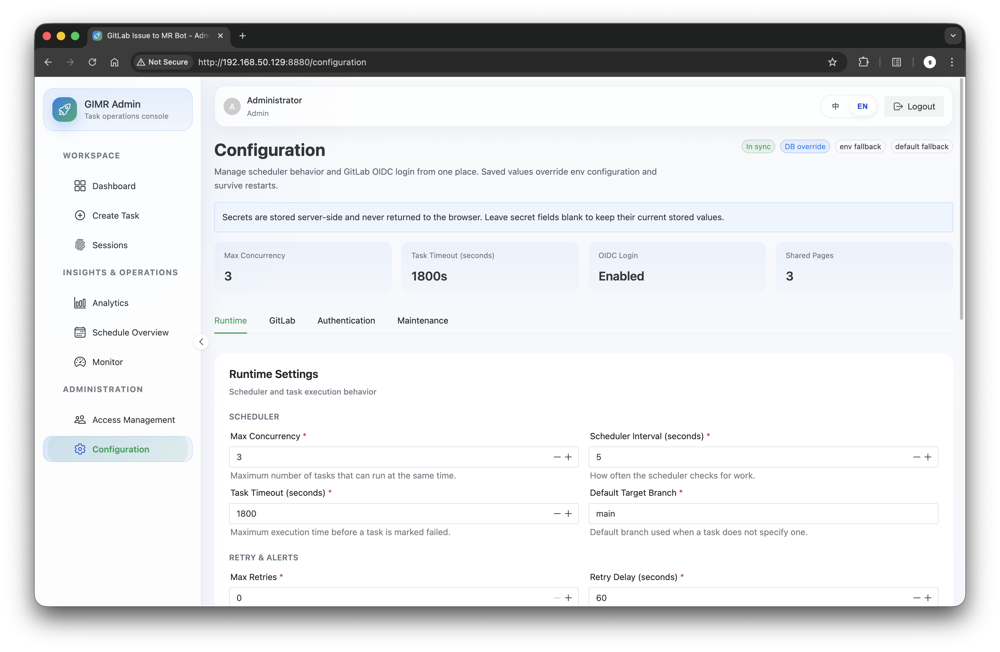
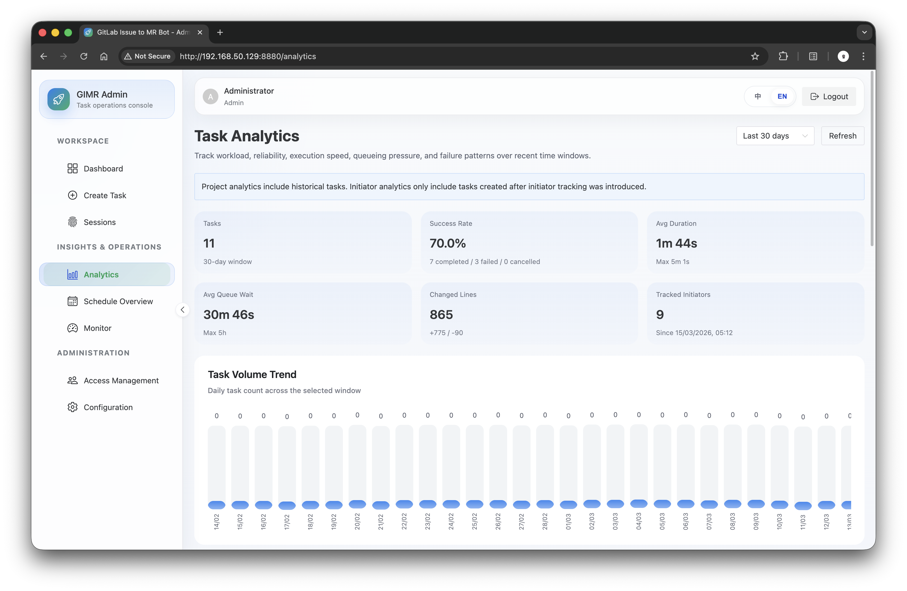

# Dashboard Screenshots

This document provides a visual overview of the GIMR dashboard interface.

## Login Page

The login page supports GitLab OIDC authentication for secure dashboard access.

---

## Task Dashboard

The main task dashboard displays all code generation tasks with filtering by project, priority, and status. Tasks are organized into P0, P1, and P2 priority tabs.

---

## Create Task

Manual task creation page allows operators to create code generation tasks without GitLab issue association. Supports priority, target branch, and scheduled execution time configuration.

---

## Schedule Overview

Visual timeline showing scheduled tasks and their execution windows. Allows operators to preview and manage upcoming task executions.

---

## Sessions Management

Active session management with login history and session lifecycle controls.

---

## Configuration

Runtime configuration page for managing:
- GitLab connection settings
- AI model parameters
- Worker concurrency limits
- OIDC authentication settings

---

## System Monitor

Real-time monitoring of:
- Active containers
- System resources
- Task execution status

---

## Access Management

User access control interface for managing:
- User roles (admin, operator, viewer)
- Project-level permissions
- Shared page access

---

## Analytics

Task analytics dashboard showing:
- Task completion rates
- Execution time trends
- Success/failure statistics
