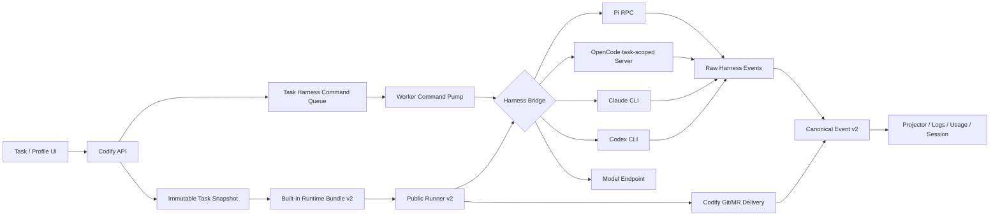

# Open-Harness V2 架构方案

**日期：** 2026-08-21 · **状态：** Approved for implementation planning · **成熟度：** Internal Preview

**取代：** [Codify 多 Harness 引擎分阶段实施总计划](../superpowers/plans/2026-08-01-multi-harness-engine-roadmap.md) 的后续方向

**实施计划：** [Open-Harness V2 分阶段实施计划](../superpowers/plans/2026-08-21-open-harness-v2-implementation-plan.md)

## 1. 决策摘要

Codify 将从“以 Claude/Codex 为中心的双引擎系统”演进为“以开源 Harness 为主、商业 Harness
保持兼容的任务控制平面”。V2 首次切换必须同时交付 Pi、OpenCode、Claude 和 Codex；Pi 是新建
Worker Profile 的唯一默认 Harness，OpenCode 是一级内置 Harness，Claude/Codex 保持现有核心能力。
Oh My Pi（OMP）在 V2 切换后以独立的实验 Harness 交付，不阻塞 V2。

V2 不是公开插件平台。所有 Harness 都由 Codify 内置、随 Worker 镜像和 Runtime Bundle 发布；
普通用户不能安装 Adapter、配置任意启动命令或从仓库注入新的 Harness 类型。开源 Harness 的主要
收益来自可审计、可固定版本、可 Fork 和模型中立，而不是开放任意代码安装入口。

V2 采用一次 Internal Preview 硬切：

- `codify.worker.harness/v1`、`codify.worker.event/v1` 和 V1 Runtime Bundle 不再调度或执行；
- V1 Task、日志、归档和统计继续可读，不迁移为 V2 事件；
- V2 首发前允许用独立 Worker Profile/Host 与 V1 并行 canary；
- 正式切换时排空 V1，之后只有 V2 可以创建和执行；
- 数据库首次升级到 V2 后只允许向前修复，不再回滚到依赖 V1 物理 schema 的 Backend/Scheduler；
- V2 后续仍可硬切到 V3/V4，不在本阶段承诺跨版本 retry、resume 或 N/N-1 制品保留。

## 2. 目标与非目标

### 2.1 目标

1. 让 Pi 成为真实可用、质量非劣、支持运行中纠偏的默认 Harness。
2. 首发提供 OpenCode 的 Task-scoped Server/SDK Bridge，而不是一次性 CLI 过渡层。
3. 复用现有 Scheduler、Docker 隔离、Issue 工作区、Task Snapshot、Canonical Event、Git/MR 交付、
   日志、归档、统计和 Worker Kit 基础。
4. 用统一核心合同承载四个 Harness，同时允许 Pi/OpenCode 暴露有类型的原生能力。
5. 将 Harness 控制协议和模型服务协议彻底分层，消除 `wire_protocol` 的概念混淆。
6. 建立四 Harness Conformance、真实 Host canary 和 Pi 同任务质量门禁。

### 2.2 非目标

- 不建设第三方 Harness 安装、签名市场或公开 Adapter ABI。
- 不支持 Google Generate Content、Bedrock、Vertex、Azure 专用协议或云原生认证链。
- 不建设 Credential Broker、模型出口代理或任务级短期 Token。
- 不把不可信用户、恶意仓库、恶意插件或私密 API Key 作为 V2 的威胁模型。
- 不为所有上游设置建立 Codify 字段或通用 JSON 编辑器。
- 不在 V2 首发提供 OpenCode steering/follow-up；只保留未来控制通道。
- 不在 V2 首发实现 OMP Subagent 或把 OMP 提升为一级支持。
- 不保证 V1/V2 双执行、V1 retry/resume 或 V2 跨未来 major 的执行兼容。

## 3. 信任模型与产品支持等级

V2 面向团队内部使用，信任团队成员、仓库内容、项目级 Harness 配置、插件、MCP 和现有环境变量
凭据。继续保留每 Task 容器边界、进程终止、日志清洗和 Git 交付隔离，但不为上述可信输入增加
插件审批、仓库 allowlist 或凭据 Broker。

Model Endpoint 仍由 Codify 控制。允许 Harness 读取原生项目配置，不代表仓库可以改变 Task
Snapshot 中冻结的模型协议、Base URL 或凭据。Adapter 必须显式传入冻结的 Endpoint；原生 Agent、
Command 或扩展声明的模型覆盖只能在与 Snapshot 一致时生效，否则使用 Snapshot 值。

| Harness | V2 支持等级 | 首发要求 | 控制传输 |
|---|---|---|---|
| Pi | 默认、一级 | 完整核心能力、质量非劣、steering/follow-up | `rpc_stdio` |
| OpenCode | 一级 | Server、Session、Agent、Command、Abort、事件、Git 交付 | `server_http` |
| Claude | 兼容、一级 | V1 核心能力无回退 | `cli_stream_json` |
| Codex | 兼容、一级 | V1 核心能力无回退 | `cli_jsonl` |
| OMP | 后续实验 | 独立 Harness、真实任务 A/B、LSP/Hashline | 后续 probe 冻结 |

“一级”描述 V2 内置支持责任；整个 V2 版本仍是 Internal Preview。

### 3.1 兼容性与收益复评

这里的“兼容性”评价的是与 Codify 现有 Task Snapshot、进程隔离、Session、Canonical Event、Skills、
usage 和 Git/MR delivery 的契合度，不是对 Harness 通用能力做排名。“收益”也只计算 Codify 能在
V2 实际交付和验证的部分，不把上游宣传指标直接算作收益。

| Harness | Codify 契合度 | 可兑现的主要收益 | 主要新增成本/不确定性 | V2 结论 |
|---|---|---|---|---|
| Pi | 高 | RPC JSONL 是稳定的进程边界；原生 steer/follow-up；模型中立；源码、制品和协议可审计/Fork | 需新增双向 command plane；三种 Endpoint 协议、Session 和 queue race 必须真实 probe | 最高即时收益，作为默认和 reference implementation |
| OpenCode | 中高 | 开源且模型中立；原生 client/server、OpenAPI/SDK、Agent/Command 生态；未来移动端控制空间大 | 每 Task Server 生命周期、事件订阅和 settled/abort 语义比一次性 CLI 更复杂 | 收益明确，首发一级；暂不开 live command |
| Claude | 高（已实现） | 保留现有 Anthropic 路径、Session 和已验证交付基线，作为 Pi 质量对照 | 单一模型协议，商业公司控制上游与分发 | 保持一级兼容，不再作为架构默认 |
| Codex | 高（已实现） | 保留 OpenAI Responses 路径、现有用户能力和第二条回归基线 | 商业公司控制上游；首版无通用运行中控制 | 保持一级兼容，不再作为架构默认 |
| OMP | 中，待 probe | 开源 Pi fork；LSP、Hashline 和 coding-first 工具可能提升编辑成功率与效率 | 与 Pi 收益重叠；额外原生工具/Subagent 生命周期扩大事件合同；独立演进可能造成协议漂移 | V2 后独立实验，以真实 A/B 决定是否晋级 |

复评后的优先级不是简单的“开源优先”：

1. Pi 同时具备最贴近现有进程 Adapter 的 RPC 边界和当前就可用的运行中控制，新增成本能够换来默认
   Harness、模型中立和交互能力三项核心收益，因此先做深、并作为 V2 的参考实现。
2. OpenCode 的 Server 成本高于 `run --format json`，但这部分成本主要是 Task-scoped 生命周期和事件
   收敛，不需要重建整个 Scheduler；它避免未来为了 steering/follow-up 再替换正式边界，首发即值得做。
3. OMP 的 LSP/Hashline 很有潜力，但它与 Pi 同源而新增的工具和 Subagent 语义尚未进入公共合同。把它
   塞入首次硬切会增加发布面，却不能替代 Pi/OpenCode/Claude/Codex 的任何一个必需位置，因此后移。
4. Claude/Codex 的边际新收益最低，但移除它们会失去已有能力、迁移对照和商业模型的原生路径；迁移
   V2 的成本显著低于重新引入，故继续一级支持，但产品默认转向 Pi。

上游依据：[Pi 源码](https://github.com/earendil-works/pi)、
[Pi RPC](https://pi.dev/docs/latest/rpc)、
[OpenCode 源码](https://github.com/anomalyco/opencode)、
[OpenCode Server](https://dev.opencode.ai/docs/server/)、
[OMP 源码](https://github.com/can1357/oh-my-pi)。

按当前源码估算，OpenCode Server/SDK 相比只做一次性 `run --format json` Adapter 约增加 3–5 人日，
主要花在 readiness、鉴权、事件订阅、settled 判定和进程收敛；这是 Phase 0 前的规划值。考虑到
steering/follow-up 已是明确后续需求，先做 run 再换 Server 会产生第二套 fixture、Session 迁移和
终态回归，累计成本反而更高。

## 4. 现有基础与需要改变的边界

### 4.1 直接复用

当前仓库已经具备以下可复用资产：

- 公共 Runner 与 Claude/Codex Adapter；
- `codify.worker.event/v1` 的有序、幂等、唯一终态和 raw archive 语义；
- `TaskHarnessAttempt`、event receipt、ingest cursor 和 Backend projector；
- Task 创建时冻结 Harness、Model Endpoint、CLI 来源（Worker Kit inventory 或显式 host_mount）、
  Worker 镜像 identity 和 Runtime Bundle；
- `issue_id + harness_key + session_namespace` 的会话兼容域；
- Worker Kit、Runtime Bundle 注入、远程 Docker Host 和 verify-runtime；
- Task 级 Harness 选择、Profile allowlist、Provider 兼容性和前端展示；
- 公共取消、timeout、Git commit/push/MR、Artifacts、日志和统计。

### 4.2 当前阻塞点

V2 不能只在现有常量中追加两个 key。当前实现仍有以下结构性限制：

- `harness_registry.py` 静态维护 Harness、能力和模型协议矩阵；
- Runtime manifest 只声明 Claude/Codex，Adapter digest 依赖固定文件列表；
- `verify-runtime.sh` 和环境变量映射按 Claude/Codex 分支；
- Runner 只有一次 `adapter_run`，没有双向命令生命周期；
- Backend 只有 SSE 日志下行和“停止整个容器”的取消操作，没有 Task command queue；
- `wire_protocol` 同时容易被理解为模型协议和 Harness 控制协议；
- Skills 源包仍以 `.claude/skills` 为中心，再由 Adapter 特判；
- 新建 Profile/Issue 的 fallback 仍是 Claude。

V2 的重点是升级这些公共边界，而不是重新实现 Scheduler、工作区或交付链。

## 5. 分层架构



### 5.1 Codify 保留的职责

- Task/Profile/Endpoint 选择与不可变 Snapshot；
- 内置 Harness 目录和 Runtime Bundle；
- command 持久化、权限检查、幂等投递和状态；
- Canonical Event、raw archive、投影和统计；
- 容器、timeout、取消、崩溃恢复和最终 Task 状态；
- Git commit/push/MR 与 Artifacts；
- V1 历史读取和 V2 硬切门禁。

### 5.2 Adapter/Bridge 职责
- 使用冻结 Worker Kit manifest 或显式 host_mount 声明的 CLI 路径启动 Harness；Kit inventory
  与 Adapter baseline 的 version/SHA 差异只产生脱敏 warning（advisory），不阻断执行；
- 校验 Kit inventory 中 `present` CLI 的实际 bytes/SHA 与 Kit manifest 一致；不一致时整 Kit
  fail closed，不做静默回退；
- 根据 Snapshot 生成 Harness 原生配置；
- 启动并管理 CLI/RPC/Server；
- 把原始事件映射为 Canonical Event；
- 解析 Session、模型、usage 和 failure；
- 接收通用 command，并映射到原生控制语义；
- 物化 Skills 和高频 Harness options；
- 在 Harness 结束时收敛子进程，但不承担 Git/MR 和最终 Task terminal。

## 6. V2 协议族

V2 将协议拆为四个独立、可版本化的合同：

| 合同 | Schema | 作用 |
|---|---|---|
| Harness Contract | `codify.worker.harness/v2` | Runner 与 Adapter/Bridge 生命周期 |
| Canonical Event | `codify.worker.event/v2` | Worker 到 Backend 的业务事件 |
| Harness Command | `codify.worker.command/v2` | Backend 到运行中 Harness 的控制命令 |
| Canonical Result | `codify.worker.result/v2` | Harness 结果与公共交付前状态 |

### 6.1 Harness Contract v2

V1 的 metadata、verify、config、Skills、event、result 和 terminate 语义继续保留。V2 增加双向运行期：

```text
metadata()
verify_runtime()
detect_capabilities()
prepare_config(snapshot)
materialize_skills(skills)
start(request)                 # 启动 Bridge，返回本地控制端点
send_command(command)          # 可选；按 capability 接受或拒绝
wait()                         # 等待 Harness settled/failed
normalize_result()
terminate()
run_text()?                    # 可选
```

公共 Runner 仍拥有 timeout、TERM/KILL、delivery、finalization 和唯一 Task terminal。Adapter 的
`wait()` 返回只代表 Harness settled，不能直接把 Task 标记成功。

### 6.2 Canonical Event v2

V2 继承 V1 的以下不变量：

- `(attempt_id, seq)` 幂等且从 1 连续递增；
- `event_id` 唯一；
- Harness identity 在 attempt 内不可改变；
- raw event 独立清洗归档；
- `harness.*`、`delivery.*` 不是 Task terminal；
- `worker.finalization` 后只能出现唯一且最后的 `run.completed` 或 `run.failed`；
- 缺 init、Harness terminal、Task terminal、缺序或双 terminal 都是 `protocol_error`。

新增控制事件：

```text
control.command.delivered
control.command.rejected
control.queue.updated
```

`control.command.delivered` 和 `control.command.rejected` 必须携带 `command_id`；
`control.queue.updated` 是 attempt 级审计事件，不强制携带 `command_id`。Pi 的原生 queue update 只有
队列内容而没有 Codify command ID，Bridge 只有在能证明关联时才可附带 ID 或顺序，不能按文本猜测。

`queued` 是 API 接受并写入数据库后的控制面状态。pump 先持久化 `dispatching`，然后才尝试 native
send；只有 Bridge 能证明尚未 native send 的失败才可回到 `queued` 重试。`delivered` 精确定义为 Harness
原生接口已经返回成功 ACK，即 accepted/queued/handled；它不保证该文本已经被模型消费、执行或改变结果。
UI 对该状态显示“Harness 已接收”，不显示“已执行”。原生接口确定性拒绝或 closing 前后确定性 gate 拒绝
产生 `rejected`。只有跨过 native-send 边界、结果无法证明时才产生不可重放的 `outcome_unknown`。

command 状态 API/数据库是 UI 恢复的事实源。创建后的状态迁移只由 command pump 以 CAS 写入；Canonical
control event 只用于审计、日志和投影展示，projector 不反向修改 command 行。`delivered`、`rejected` 和
`outcome_unknown` 是不可变终态。

### 6.3 Harness Command v2

首发命令仅支持文本：

```json
{
  "schema": "codify.worker.command/v2",
  "command_id": "01K...",
  "task_id": 123,
  "attempt_id": "task-123-attempt-1",
  "sequence_no": 7,
  "type": "steer",
  "payload": { "text": "先修复并发问题，再继续原计划" },
  "created_at": "2026-08-21T10:00:00Z"
}
```

首发类型只有 `steer` 和 `follow_up`，且只有 Pi manifest 声明支持：

- `steer`：由 Pi 在当前工具调用结束后、下一次模型调用前送达；
- `follow_up`：由 Pi 在当前工作结束后继续处理；
- `command_id` 由客户端生成；同一 ID 和同一规范化 payload 重试返回已有 command，同一 ID 配不同
  payload 返回 `409 Conflict`；
- `sequence_no` 在锁定 attempt 的事务内单调分配，同一 attempt 只允许一个 dispatcher 按序投递；
- 同一 `command_id` 重投不得产生两条用户消息；
- 只在当前 RUNNING attempt 的 `control_state=accepting` 时创建新命令；`starting`、`closing`、`closed`
  和 `disabled` 都拒绝；对已存在 ID 的幂等读取优先于这个新建检查；
- Scheduler 恢复运行中容器后继续投递尚未确认的 command；
- 首发不支持图片、撤回、编辑、排序、跨 Task 投递或其他 Harness 的模拟实现。

### 6.4 Model protocol 与 control transport

`wire_protocol` 在 V2 数据库和 API 中破坏性重命名为 `model_protocol`。V2 只允许：

```text
anthropic_messages
openai_responses
openai_chat_completions
```

`control_transport` 只存在于内置 Harness manifest，不属于 Model Endpoint。Endpoint 新增可选
`compat_profile`，描述 OpenAI-compatible 服务的已知差异；不能为每个兼容网关创造新的协议名。

目标兼容矩阵：

| Harness | Anthropic Messages | OpenAI Responses | OpenAI Chat Completions |
|---|---:|---:|---:|
| Pi | 是 | 否 | 否 |
| OpenCode | 是 | 否 | 否 |
| Claude | 是 | 否 | 否 |
| Codex | 否 | 是 | 否 |

矩阵由 Runtime Bundle manifest 的能力与 Endpoint 求交集，Task 创建和 verify-runtime 都要验证；
未知组合 fail closed。Backend/Frontend 不再维护两份不同矩阵。

## 7. 内置 Runtime manifest

V2 manifest 是内置运行时事实，不是第三方插件契约。Backend 仍只接受 Codify 编译期批准的 key：
`pi`、`opencode`、`claude`、`codex`，以及后续单独启用的 `omp`。

示意结构：

```json
{
  "schema": "codify.worker.runtime-manifest/v2",
  "maturity": "internal_preview",
  "contract_version": "codify.worker.harness/v2",
  "event_schema": "codify.worker.event/v2",
  "command_schema": "codify.worker.command/v2",
  "adapters": {
    "pi": {
      "support_tier": "default",
      "source": {
        "repository": "https://github.com/earendil-works/pi",
        "license": "MIT",
        "artifact_version": "<pinned>",
        "artifact_sha256": "<sha256>"
      },
      "adapter": {
        "version": "2.0.0",
        "digest": "<sha256>"
      },
      "control_transport": {
        "kind": "rpc_stdio",
        "protocol": "pi-rpc"
      },
      "model_protocols": [
        "anthropic_messages"
      ],
      "capabilities": {
        "resume": true,
        "task_skills": true,
        "usage_tokens": true,
        "steering": true,
        "follow_up": true
      },
      "options_schema": "pi/v1"
    }
  },
  "files": []
}
```

每个 Adapter digest 只覆盖该 Adapter 声明的文件和共享依赖，不再由一个硬编码文件列表为全部
Adapter 生成相同 digest。manifest 的所有文件仍需记录 path、size 和 SHA-256。

`adapters.<key>.source.artifact_version/artifact_sha256` 是 Adapter 声明的 tested/baseline，
不是运行时硬门禁：它与 Worker Kit harness inventory 观测到的 version/SHA 的任何差异都只产生
脱敏 compatibility warning 并继续 verify/start，不要求重建 Project Runtime Image。

## 8. Harness 实现选择

### 8.1 Pi：RPC stdio Bridge

Pi 使用官方 `--mode rpc` 作为正式边界，不直接绑定内部 TypeScript SDK。RPC 已覆盖 prompt、Session、
事件、abort、steer、follow_up 和 queue update，足以完成 V2；独立进程也更符合当前 Worker 的
timeout、日志和崩溃隔离模型。

Bridge 负责：

- 启动固定版本 Pi RPC 并保持 stdin/stdout；
- 将 Task Snapshot 生成 Pi Provider/model/config 参数；
- 转换 Pi Agent/turn/message/tool/usage/queue/settled 事件；
- 用 native request id 关联 `command_id`；该 ID 只用于响应关联，不能假设 Pi 会原生去重；
- 在原生发送前持久化 `dispatching` journal，ACK/确定性拒绝后写入终态；只有能证明未 native send 的失败
  才可重入 `queued`。若跨 native-send 边界后因 Bridge 崩溃而无法判定，则写入 `outcome_unknown`
  （public code `delivery_outcome_unknown`），不得冒险再次注入；
- 输出 Session ID 和最终 usage；
- 按 attempt control gate 完成 settled/closing/drain 握手后才返回 Harness terminal。

参考：[Pi RPC](https://pi.dev/docs/latest/rpc)、[Pi SDK](https://pi.dev/docs/latest/sdk)。SDK 仅作为
未来自定义工具或 ResourceLoader Profile 的候选，不进入首版。

### 8.2 OpenCode：Task-scoped Server/SDK Bridge

OpenCode 从 V2 开始使用每 Task 独立的 `opencode serve`，绑定容器 loopback 和随机端口；Bridge
通过官方 HTTP/SDK 创建或恢复 Session、选择 Agent/Command、发送 Prompt、订阅事件并执行 Abort。
Server 不跨 Task、Issue 或容器共享。

V2 首发不声明 OpenCode `steering`/`follow_up` capability。其 Server API 已提供异步 Prompt、事件、
Session status 和 Abort，但上游当前对 busy/idle、队列和 abort 后续消息仍存在演进和缺陷报告；首发
必须根据事件和最终消息共同判断 settled，不能只轮询 `session/status`。

参考：[OpenCode Server](https://dev.opencode.ai/docs/server/)、
[OpenCode CLI](https://dev.opencode.ai/docs/cli/)。后续只有在固定版本 probe 和 Conformance 证明
语义后，才把通用 command 映射为 OpenCode 原生运行中消息。

### 8.3 Claude/Codex：迁移现有 Adapter

Claude/Codex 不重写执行能力，只迁移到 Contract/Event/Result v2、manifest 驱动能力和
`model_protocol` 命名。两者不声明运行中 command 能力；公共 command API 对其确定性拒绝。

### 8.4 OMP：后续独立实验 Harness

OMP 使用独立 `omp` key、Adapter identity/digest、Session namespace、能力、统计和 canary；它随新的
content-addressed Runtime Bundle 版本交付，而不是建立第二套 Bundle 机制。它可以复用 Pi-family 的
归一化/控制库，但不能共享 Session，也不能假设协议永久兼容。首批验证聚焦 LSP、Hashline、编辑
成功率、Token、耗时和取消；Subagent 等生命周期未映射到 Canonical Event 前不启用。

## 9. 数据模型与 API

### 9.1 Model Endpoint

迁移将 `ai_providers.wire_protocol` 重命名为 `model_protocol`，并增加 nullable `compat_profile`。
Provider API、前端类型、筛选、标签、Task Snapshot、fingerprint、环境变量映射和统计统一改名；新 API
不保留 `wire_protocol` 别名。V1 Snapshot 内的旧字段保持原样；V2 控制面仅在 `dual_canary` 的 V1
compatibility reader 和历史展示中读取，切到 `v2_only` 后不再用于执行。

### 9.2 Worker Profile 与 Task options

新增 namespaced `harness_options`：

```json
{
  "pi": {
    "thinking_level": "medium",
    "steering_mode": "one-at-a-time",
    "follow_up_mode": "one-at-a-time"
  },
  "opencode": {
    "agent": "build",
    "command": null,
    "model_variant": null
  }
}
```

Worker Profile 保存默认值；Create Task 只允许 manifest 明确列出的高频 override；创建事务把合并结果
写入现有 `harness_config_snapshot`。低频选项继续由可信仓库的 Harness 原生配置提供。首版不提供任意
JSON 编辑器。

新建 Worker Profile 的默认值是：

```json
{
  "enabled_harnesses": ["pi"],
  "default_harness_key": "pi"
}
```

该默认值只在 Pi 质量门槛和四 Harness release gate 全部通过后的正式硬切中启用；验证期必须显式创建
V2 Profile，不能提前改变 ORM/API/数据库默认值。

现有 Profile 和 Issue 不批量迁移；若要使用 Pi/OpenCode，由管理员编辑 Profile。新建 Issue 继承
Profile 默认 Harness。

### 9.3 TaskHarnessCommand

新增持久表，最少包含：

```text
command_id          ULID/UUID，唯一
task_id
attempt_id
sequence_no         attempt 内单调递增
command_type        steer | follow_up
payload             JSON，首版仅 text
payload_digest      规范化 task/attempt/type/payload 的 SHA-256
status              queued | dispatching | delivered | rejected | outcome_unknown
created_by
created_at
delivery_attempts
last_attempt_at
dispatch_started_at
native_request_id    internal-only native correlation ID
native_sent_at       internal-only send-boundary evidence
native_ack_at
outcome_unknown_at
delivered_at
rejected_at
rejection_code
rejection_message
```

`TaskHarnessAttempt` 同时增加：

```text
control_state                disabled | starting | accepting | closing | closed
next_command_sequence        下一个可分配 sequence_no
command_dispatch_owner       nullable dispatcher lease owner
command_dispatch_expires_at  nullable dispatcher lease expiry
```

不支持 command 的 attempt 从创建起保持 `disabled`。支持 command 的 Pi attempt 从 `starting` 开始，
Bridge control endpoint ready 后进入 `accepting`；启动失败直接收敛到 `closed`。`closing -> accepting` 只
允许在已接受 follow-up 确实启动下一轮时发生，其余路径最终进入 `closed`。

API 使用幂等 `PUT /api/tasks/{task_id}/commands/{command_id}` 创建命令，并提供列表/状态读取；不提供
update/delete。创建事务先锁定 Task/attempt；若 ID 已存在，同 digest 返回原行，不同 digest 返回 409；
只有新 ID 才继续检查 RUNNING、V2、capability、项目权限和 `control_state=accepting`，再分配 sequence。

Command pump 使用独立 DB session，以 attempt 级 lease 保证同一 attempt 只有一个 dispatcher；它严格按
`sequence_no` 一次处理队首，前一条未进入终态时不得领取后一条，不能用 command 行 `SKIP LOCKED`
让并发 pump 越过队首。pump 通过远程 Docker exec 调用容器内固定 control client；Bridge 通过 Task
私有 Unix socket 接收并等待原生 ACK。Scheduler 恢复容器时重建 pump。API 只创建 `queued`；此后
pump 是 command 行的唯一状态迁移 writer：`queued -> dispatching -> delivered|rejected|outcome_unknown`；
仅在可证明 pre-send failure 时允许 `dispatching -> queued`，恢复发现遗留 `dispatching` 必须 fail closed 为
`outcome_unknown`，绝不重放。

Bridge 收到上游 settled candidate 时使用关闭握手解决最后一条 follow-up 的竞争：Worker 在 attempt 行锁内把
`accepting -> closing`，此后 API 不再创建新 command；pump 继续按序处理所有在锁前已分配的命令。
若其中已接受的 follow-up 让 Harness 开始下一轮，Worker 将 gate 重开为 `accepting`；否则队列排空后
进入 `closed`，才发出唯一 Harness terminal 并允许公共 finalization。取消/timeout 等强制结束进入 `closing`
后确定性拒绝剩余 queued command，再进入 `closed`。projector 不参与这些状态迁移。

### 9.4 Session

继续使用 `issue_id + harness_key + session_namespace`。只有 `session_mode=fresh` 才能切换 Harness；
`continue` 必须沿用当前 lineage。切换时不转换会话历史，只共享 Issue、工作区、Git 状态和显式 Task
上下文。V1 lineage 不允许 V2 continue，首次 V2 Task 必须 fresh。

### 9.5 执行协议门禁

V1 只读不能只靠操作路由或前端按钮。Backend 提供单一 execution contract policy，并在 Task 创建、
execute/schedule/retry/resume、Scheduler promotion/claim、Worker 载入绑定 Runtime Bundle 以及 crash
recovery 全部调用。策略必须同时核对 Snapshot、attempt schema、Bundle contract/version/digest，不能
只检查“存在绑定 Bundle”。

`HARNESS_EXECUTION_MODE` 必须显式配置且只允许 `dual_canary|v2_only`；Backend/Scheduler 各自启动时
校验取值，部署 preflight 比较两者一致。验证期只允许 `dual_canary` 和明确的 Profile/cohort 执行各自
冻结的 V1/V2 contract；不自动
升级、降级或跨 generation continue。正式硬切切换为 `v2_only`，只接受精确 V2 contract。意外残留的
V1 PENDING/QUEUED Task 幂等转为 CANCELLED，恢复时发现的 V1 RUNNING Task 不恢复、不执行，终止其
容器并标记 FAILED；统一使用 `legacy_contract_not_executable` 原因码。Task detail、日志、archive 和
统计查询不经过 execution guard。

V2 不新增 protocol generation 统计维度，也不改 `DeletedTaskStatistics` 归档 schema。V1/V2 数据继续
按现有 provider、`harness_key`、状态和时间等维度读取和聚合；同一 Harness 的跨 generation 记录可以
合并展示，本阶段只承诺历史统计不丢失，不承诺 V1/V2 筛选。

## 10. UI/UX

V2 保留统一 Task 流程，同时按 capability 展示原生选项：

- Profile 编辑器从 Backend manifest projection 获取 display name、支持等级、capabilities 和 options schema；
- 新建 Profile 初始只启用 Pi；管理员可加入其他内置 Harness；
- Task 创建页只有 fresh Session 时可切换 Harness，继续沿用现有约束；
- Pi 展示 thinking level、steering mode、follow-up mode；
- OpenCode 展示 Agent、Command 和 model variant；
- TaskView 只在 RUNNING Pi attempt 的 `control_state=accepting` 时展示可发送的文本输入和
  steer/follow-up 选择；`starting`/`closing` 显示真实过渡状态，不接受发送；
- 命令列表展示 queued、“Harness 已接收”和 rejected，并说明 ACK 不等于模型已执行；
- 不支持 command 的 Harness 不显示输入控件，不以 disabled 假按钮制造错误预期；
- OMP 显示 Experimental 标签和 capability warnings；
- V1 Task 显示 Legacy V1/Read-only，不显示 execute/retry/resume 操作。

移动端 TaskView 的命令输入必须验证安全区、键盘遮挡、发送按钮触摸面积、长文本和状态换行。

## 11. 制品与升级

### 11.1 Ownership

- Project Runtime Image 只提供 Java、Node、Playwright 等项目工具链，不携带任何 Harness CLI。
- Worker Kit 提供 launcher、Nix 工具链和四个内置 Harness（pi/opencode/claude/codex）的完整
  inventory。Kit 构建时可指定携带的 CLI 集合（默认 `pi+opencode`，也允许显式子集或 0–4 个），
  但 manifest 始终记录全部四个 key。
- Runtime Bundle 提供 Task 冻结的 Adapter、Bridge 和编排 bytes。
- execution identity 绑定 `image_identity + kit_identity + bundle_digest`；baseline CLI
  version/SHA 不作为 image 或 Task 的 hard gate。

### 11.2 Kit harness inventory

每个 key 记录 `availability=present|absent`；`absent` 必须带稳定 `reason_code`：

- 构建选择集未包含 → `not_selected`（预期，info 级）；
- 选择集包含但 payload 缺失 → `missing_payload`（warning 级，Kit/Profile degraded）；
- 只有实际写入并在安装/启动核验成功的 payload 才能标 `present`；
- `absent` 不要求存在 payload、path、version 或 SHA；`absent` 但仍携带对应 payload/path，或
  availability 与实际内容冲突 → 整 Kit fail closed；
- `present` 的文件缺失、unsafe path、不可执行或 self-integrity SHA 不符 → 整 Kit fail closed。

兼容性判定分三层且不可互相替代：Kit 制品完整性（fail closed）、Compatibility policy（任意
tested/baseline version/SHA 差异只输出脱敏 warning 并继续）、Functionality gate（仅对
`present` CLI 执行 `--version`、self-check 与 Adapter smoke；失败只使该 Harness unavailable，
不阻断其他 Harness）。

### 11.3 不可变 Kit 与升级

- 使用各项目官方发布包/二进制，固定精确版本与 SHA-256；Task 运行时不联网下载或自动升级；
- Kit 安装是 content-addressed、atomic rename/no-replace、root-owned 且不可覆盖的目录；
  构建选择集、实际 payload、manifest 或 archive 的任何变化都产生新的 content-addressed
  Kit identity，禁止覆盖既有 Kit；
- Adapter 只使用冻结 Kit manifest 指定的路径；显式 `host_mount` 是逐 Harness 授权的
  break-glass 单一来源；禁止同一 Harness 在 image、`PATH` 与 Kit 之间隐式回退或混装；
- 构建选择集、inventory availability 与 Profile `enabled_harnesses` 三者分离：选择 absent
  Harness 的 create/start/retry/resume/recovery 稳定拒绝 `harness_cli_unavailable`；UI/catalog
  必须展示 unavailable/disabled 及脱敏 reason；
- 有修复版漏洞时构建新的不可变 Kit 并升级该 CLI；暂时不带某 Harness 时从构建集合排除并写入
  release note/审计证据；高危时管理员可直接删除整个旧 Worker Kit，删除后的 retry/resume 失败
  走通用 `worker_kit_unavailable`，不新增任务迁移或专用错误码；
- 升级必须创建新镜像/Kit/Runtime Bundle 组合，并重新运行 probe、Conformance 和 canary；
  已核验、不可变且项目工具链未变的 Project Runtime Image 可复用为新组合的 `image_identity`；
- 首版不要求 Codify 从源码可复现构建，也不维护 Fork；
- V2 Internal Preview 不保留跨 V3/V4 的旧运行制品；切换时排空，旧 Task 变为只读。

## 12. V1 硬切与 Canary

### 12.1 V2 控制面切换与验证期

1. 预先构建 V2 Backend/Frontend、Worker 镜像、Kit 和 Runtime Bundle，不在维护窗口编译制品。
2. 暂停任务创建和 Scheduler 领取；排空或逐个终止正在执行的 Task，然后停止 Backend 与 Scheduler。
3. 备份数据库，由唯一的一次性 V2 migration owner 执行经过评审的精确 V2 schema revision（不使用
   漂移的 `head`）；Backend/Scheduler 等长驻服务均以 `AUTO_MIGRATE=false` 启动，不能竞争执行 migration。
4. migration 成功后部署 V2 Backend/Scheduler；从这一刻开始只允许向前修复，不允许启动依赖物理
   `wire_protocol` 列的 V1 Backend/Scheduler。
5. 在显式 `dual_canary` 策略下创建独立 V2 Worker Profile、Host 和测试 Issue cohort。V1 内测 Profile
   可以继续执行 V1 contract，但不能创建 V2 Snapshot；V2 Profile 也不能创建 V1 Snapshot。
6. 四 Harness 在真实 Host 上通过各自矩阵；Pi 完成同任务 benchmark 和交互测试。
7. 旧 Profile/Issue 默认值不迁移。

### 12.2 正式切换

1. 停止创建和调度 V1 Task。
2. 等待 RUNNING V1 Task 完成；超时后人工取消。
3. PENDING/QUEUED V1 Task 取消，不原地转换。
4. 确认 Pi 门槛已经通过，再把新建 Profile 的 ORM/API/数据库默认值切为 Pi；不更新现有行。
5. 将 execution contract policy 原子切换为 `v2_only`。
6. 只启用已完成 V2 verify-runtime 的 Profile。
7. V1 Task/attempt/archive 保持可读和可统计，execute/retry/resume 明确拒绝。
8. 新 Task 只生成 V2 Snapshot、Event 和 Result。

这是 roll-forward-only 切换。数据库升级后不能回滚 V1 应用；若 V2 发布异常，保持维护模式并部署修复
后的 V2。V2 数据必须保留，不能为了“回滚”删除、改写或让 V1 Worker 执行。数据库备份只用于灾难
恢复，不是日常应用回滚路径。

## 13. 验收门槛

V2 硬切前必须同时满足：

- Pi、OpenCode、Claude、Codex 的 Contract/Event/Result Conformance 全部通过；
- 四 Harness 都有真实 Worker Host canary；
- OpenCode 验证 Server、Session、Agent、Command、Abort、事件、usage 和 Git 交付，而不只是 Server 启动；
- Claude/Codex 的新任务、fresh/continue、取消、timeout、Skills、usage、archive 和 Git/MR 无回退；
- 不少于 20 个内部代表性场景覆盖 plan、execute、freeform、修复测试、无改动、Session、失败和取消；
- Pi 与当前较优的兼容 Harness 做同任务对比，成功率下降不超过 10 个百分点；
- Pi 的中位耗时和 Token 不得同时恶化超过 25%；
- Pi steering/follow-up 在真实 Host 上通过接受、队列、送达、拒绝、重投和 Scheduler 恢复测试；
- 任一首发 Harness 存在 P0/P1 缺陷时，V2 延迟，不临时把 Pi 降为 Beta 或切回其他默认。

以上指标是架构验收假设；Phase 0 必须冻结任务集、可比模型和统计方法，不能用上游宣传数据替代。

## 14. 已接受风险与后续方案

| 风险 | V2 处理 | 后续方向 |
|---|---|---|
| 环境变量长期 API Key 可被可信仓库读取 | 接受 | Credential Broker/短期 Token 独立方案 |
| 原生插件/MCP/项目配置可执行代码 | 内部可信模型下允许 | 外部用户前增加权限/供应链方案 |
| OpenCode Server busy/queue 语义仍演进 | 固定版本、首发不开 command | probe 后逐能力启用 |
| 开源项目 API/版本变化快 | 固定官方制品和 digest | 必要时 Fork、自建制品 |
| V2 无跨 major retry/resume | Internal Preview 接受 | GA 前设计稳定兼容和保留策略 |
| Pi/OMP 同源导致能力重复 | OMP 独立实验和 A/B | 以真实收益决定晋级或退出 |
| V2 物理 schema 无 V1 应用回滚 | 维护窗口、唯一 migration owner、roll-forward-only | GA 前评估 expand/contract 迁移 |

## 15. 不可变实施决策

实施计划不得自行改写以下结论：

1. V2 首发必须同时包含 Pi、OpenCode、Claude、Codex。
2. Pi 必须达到默认 Harness 的质量门槛并首发支持文本 steering/follow-up。
3. Pi 使用 RPC stdio；OpenCode 使用 Task-scoped Server/SDK。
4. OpenCode 首发不承诺 steering/follow-up，但控制面必须可扩展。
5. OMP 是独立的后续实验 Harness，不是 Pi Profile。
6. V2 只支持三种 `model_protocol`，不支持 Google 协议。
7. Provider/Endpoint 是 Codify 唯一事实源，Harness 和 Provider 保持分离。
8. 新建 Profile 只启用 Pi；现有 Profile/Issue 不批量迁移。
9. V1 只读，正式切换后不能调度、执行、retry 或 resume。
10. V2 是 Internal Preview，可继续硬切到 V3/V4，不提前建设长期版本保留。
11. 安全强化、Credential Broker、第三方 Harness 平台和源码自建不进入本方案。
12. 公共 Git/MR delivery 和唯一 Task terminal 继续由 Codify 所有。
13. command ID 由客户端生成并幂等 PUT；同 attempt 严格有序，数据库状态只能由 API 创建和 pump 收敛。
14. `delivered` 只表示 Harness 原生 ACK，不表示模型已执行；queue update 不伪造 command 关联。
15. V1 执行禁令由创建、调度、Worker 和恢复共用的中央策略强制，不能只守 API 路由。
16. 首次 V2 数据库迁移后 roll-forward-only，不回滚到 V1 Backend/Scheduler。
