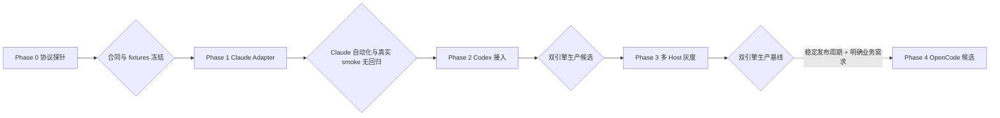

# Codify 多 Harness 引擎分阶段实施总计划

> 依据：[2026-07-31-multi-harness-engine-design.md](../specs/2026-07-31-multi-harness-engine-design.md)

**目标：** 在不破坏现有 Claude Code 生产行为的前提下，先建立 Codify 自有的 Harness 合同和 Canonical Event 协议，再交付 Claude Code + Codex 双引擎生产基线；OpenCode 仅在满足准入条件后启动。

**范围：** Phase 0–3 是双引擎主线，Phase 4 是条件性扩展。计划不把“源码测试通过”“Worker Kit 已导出安装”“真实 Docker Host 验收通过”混为同一完成状态。

**当前代码基线（2026-08-01）：**

- 最新 Alembic revision 为 `062_task_skills`；下文 `063`、`064` 是基于当前分支的建议编号，实施时如迁移头已变化必须顺延。
- Worker Kit 源码版本为 `0.3.6`，Skills 最低要求为 `0.3.5`。
- `deploy/ci-claude.sh` 产生 Claude 原始事件，`backend/app/core/worker_event_projector.py` 仍直接理解 Claude 事件。
- `TaskWorkerProfileSnapshot` 已冻结 Worker、Kit、Docker Host、环境变量和 Skills，但尚未冻结 Harness、Adapter、Model Endpoint、镜像 digest 和 Runtime Bundle。
- `Issue.claude_session_id` 与 `/home/codify/.claude` 仍是单 Harness 模型。

---

## 1. 阶段文档

| 阶段 | 计划文档 | 预计人日 | 进入条件 | 完成含义 |
|---|---|---:|---|---|
| Phase 0 | [协议探针与样本采集](2026-08-01-multi-harness-phase-0-protocol-probes.md) | 2–3 | 已确定 Claude/Codex 固定测试版本和隔离测试凭据 | Adapter 合同 v1、Canonical Event v1、golden fixtures 可回放 |
| Phase 1 | [Claude Adapter 无回归抽取](2026-08-01-multi-harness-phase-1-claude-adapter.md) | 4–6 | Phase 0 协议冻结 | 公共入口和 Backend 只消费 Canonical Event；Claude 行为无回归 |
| Phase 2 | [Codex 与公共产品能力接入](2026-08-01-multi-harness-phase-2-codex-integration.md) | 18–27 | Phase 1 回归门禁通过 | Claude + Codex 生产候选，自动化测试和单 Host smoke 完整 |
| Phase 3 | [多 Host 灰度与生产验收](2026-08-01-multi-harness-phase-3-production-rollout.md) | 2–4 | Phase 2 生产候选已冻结版本 | 双引擎生产基线，可回滚，有真实 Host 证据 |
| Phase 4 | [OpenCode 条件性候选接入](2026-08-01-multi-harness-phase-4-opencode-candidate.md) | 8–14 | 六项准入条件全部通过 | 仅 allowlist 能力范围内的第三 Harness 候选 |

当前状态（2026-08-01）：Phase 0 的 32 组真实 `deepseek-v4-flash` fixtures 与严格离线门禁
已经完成。Phase 1 的源码、迁移、不可变 Runtime Bundle、Claude Adapter、Kit `0.3.9` 导出、
目标 Host 安装验证和自动化回归已经完成；开发环境真实 Git/MR L4 因实际配置的 GitLab bot token 返回 401
尚未完成，历史 Issue/Profile 的发版硬切换也尚未执行。

Phase 1 当前证据达到 L1、L2 和 L3：Backend 全量 `2169 passed, 1 skipped, 70 subtests passed`，
mock E2E `371 passed`，Frontend focused `110 passed`，修正旧测试契约并重建镜像后的 mock
integration 全量 `246 passed, 2 deselected`；Kit `0.3.9-linux-amd64` 已校验并在目标 Host 使用
真实 Claude/runtime 验证通过。L4 仍必须产生真实 task ID、MR URL、archive 与 Canonical
Event replay 证据。

Phase 0 和 Phase 1 的 6–9 人日已包含在设计方案的 24–36 人日双引擎生产候选成本中；Phase 3 的 2–4 人日单独计算。

### 更新（2026-08-03）：开发环境 L4 已闭环，Phase 1 除发版硬切换外基本完成

开发环境（docker remote context → `192.168.50.129`）用真实任务把 Phase 1 的 L4 场景全部跑通，
并修复了回归中发现的三类问题：

- **GitLab 401 已解除**：`POST /api/config/gitlab/test` 返回 200（`ai-bot` / GitLab 18.5.5-ee）。
- **真实 L4 证据（Task 461–476）**：
  - 新任务 + Git/MR 成功：Task 463（execute，commit `31cac849`，MR 4）。
  - resume 续跑：Task 465（fresh）产出真实 session `2278bf1c-...`，Task 466（continue）以
    `--resume 2278bf1c-...` 续跑同一会话并 completed。
  - 取消：Task 469（RUNNING 时 cancel）→ canonical `harness.failed/run.failed(cancelled)`，DB 与 replay 一致。
  - timeout：Task 470（`task_timeout=60` 临时配置）→ canonical `harness.failed/run.failed(timeout)`。
  - retry 冻结复用：Task 471（retry 470）bundle digest 与 470 相同（`828343df...`），即使新版 bundle 已可用。
- **修复并提交（`4e1bf15e`）**：
  - resume：`claude_events.py` 保留真实 session_id（side file 持久化）并写进 canonical 事件；
    adapter 1.0.1。
  - cancel：`bootstrap.sh` TERM trap + `common.sh` finalizer 产出 `cancelled` 终态；
    `runner.sh` 后台运行 adapter 使 trap 及时触发。
  - cancel-race：`task_action_routes.py` 不再由 cancel handler 移除容器，改由 scheduler 在
    摄取终态后移除，极早取消的 runtime archive 得以保留。
- **新增交付物**：`docs/dev-env-api-regression.md`（开发环境 API 回归验证手册）。

Phase 1 剩余项：**发版硬边界切换**（关闭历史 Issue + 启用 Profile 全量切不可变 Kit）尚未执行；
开发环境可按「历史任务失败可接受」跳过仪式，仅作为生产收口演练。

### Phase 2（Codex 接入）进展

- **增量 1（2026-08-03，已提交 `a984d842`）**：落地「必须先合入」的数据地基 ——
  - 迁移 `064_multi_harness_runtime`:WorkerProfile Harness allowlist/约束/image digest/
    harness_runtimes;AIProvider Endpoint 字段 + `credential_ref`;新表 `model_credentials`、
    `issue_harness_sessions`;Task Snapshot 冻结字段;幂等回填(Profile→claude、Provider→独立
    ModelCredential、Snapshot→claude、Issue→legacy session lineage)。
  - `harness_registry.py`(内置 claude/codex + capability policy + bundle manifest 校验 +
    `harness_options` 兼容结构)、`model_endpoints.py`(secret-free fingerprint)、
    `model_credentials.py`(active/retired/revoked 生命周期 + 软退役 + ref 硬删保护)。
  - Worker Profile API 校验新字段。已在开发环境 Postgres 应用并验证回填(6 凭据 / 52 snapshot /
    63 session lineage)。Backend unit 全量 `2222 passed`。
- **增量 2（2026-08-03，已提交 `a036d623`）**：Task 2.3 Provider API 层 ——
  `providers.py` 支持 `provider_kind`/`wire_protocol`/`provider_driver`/`provider_options`(allowlist +
  kind↔protocol 配对校验,claude→anthropic_messages、codex→openai_responses,不做静默 Chat
  Completions 转换);创建时绑独立 `ModelCredential` 并写 `credential_ref`,更新时轮换(旧凭据退役),
  删除 Provider 只 soft-retire 凭据不硬删(既有 retry 仍可解析);响应暴露 `credential_ref` +
  `credential_status`。已在 dev 验证。Backend unit 全量 `2227 passed`。
- **后续增量**：2.4 verify-runtime + image digest → 2.5 Task 级 Harness 选择与冻结 retry → 2.6
  session namespace → 2.7–2.9 Codex Adapter + sandbox + Skills → 2.10 analytics → 2.11 frontend
  → 2.12 Kit 升级与单 Host smoke。

---

## 2. 不可变实施决策

以下决策贯穿所有阶段，阶段计划不得自行绕过：

1. **Harness 与 Model Endpoint 分离。** 不新增把 Provider 永久绑定到单一 Harness 的 `harness_type` 字段。
2. **Harness 是 Task 级选择。** Worker Profile 只声明允许范围、默认值和可收紧限制；Issue 继续固定 Worker Profile。
3. **Profile 可编辑，Task Snapshot 是执行真相。** Task 创建事务中一次性写入并立即冻结 Snapshot，不引入 revision 或 active pointer；Pending/Queued Task 也不能改写执行事实。重试复制原任务的 Harness、Adapter、Endpoint、Worker、镜像 digest、CLI runtime、Kit 和 Runtime Bundle 引用。
4. **切换 Harness 必须新建 Task。** 已创建 Task 和 retry API 不接受 Harness 切换；需要变更时取消原 Task 并从 Issue 新建。
5. **Canonical Event 是业务协议。** `event.jsonl` 只保存 `codify.worker.event/v1`；原始输出写入 `harness-events/<harness>.jsonl`。
6. **事件可幂等回放。** `(attempt_id, seq)` 去重并检测缺口；`harness.*` 和 `delivery.*` 是非 terminal，`worker.finalization` 后只能有一个且必须最后出现的 Task terminal `run.completed/run.failed`。
7. **Session 按兼容域隔离。** 查找键至少包含 `issue_id + harness_key + session_namespace`，禁止跨 Harness 转换 session ID。
8. **Skills 包保持中立和不可变。** Adapter 物化到目标 Harness 目录，不能写入 Git 工作区。
9. **能力缺失显式降级。** `max_turns`、cost、`run_text`、CodeGraph 等未支持时给出 warning 或确定性 fallback，不伪装成功。
10. **安全策略 fail closed。** 无人值守任务不能等待交互批准，也不能在 sandbox 不可用时静默放宽。
11. **长期模型密钥不默认进入仓库代码可继承的进程。** 生产优先代理、Broker 或任务级短期 token；旧容器环境变量只能作为有记录的受限过渡。
12. **版本不可变。** Runtime Bundle manifest 是实际 Adapter version/digest 的唯一事实源；Task Snapshot 保存镜像 digest、Kit、CLI source/path/version/binary digest 和 Runtime Bundle digest，不接受未经验证的 `latest` 或只按路径信任 host binary。
13. **Phase 1 采用发版硬边界。** 发版前关闭全部历史 Issue，发版前 Task 只读；无 Runtime Bundle 的 Task 不允许执行或 retry。每个可调度 Host 必须安装并验证新 Worker Kit，每个启用的 Worker Profile 必须切换到该不可变版本后才能恢复调度。

---

## 3. 跨阶段依赖与门禁



### Phase 0 → Phase 1

- Claude 和 Codex 的成功、失败、resume、timeout、取消、usage 样本齐全。
- Canonical Event 必需 init/terminal 语义、Harness 与 Task 终态边界、未知事件策略、usage null 语义已冻结。
- fixtures 经过敏感信息清洗，且回放测试可离线运行。

### Phase 1 → Phase 2

- Backend 和 Frontend 不再解析 Claude 原始事件。
- 现有 Claude 新任务、resume、取消、timeout、Skills、Git/MR 和归档测试通过。
- 同一原始 fixture 重放两次不会重复投影；缺序、双 Task terminal、无 Task terminal 均按协议失败。
- 新 Task 创建时已绑定固定 Runtime Bundle；scheduler 重启和 retry 后原样复用。

### Phase 2 → Phase 3

- Claude 与 Codex 都通过单元、fixture 回放、mock integration、前端和单目标 Host smoke。
- Task Snapshot 在创建时冻结 Harness、Adapter version/digest、Endpoint、credential ref、Worker、镜像 digest、CLI source/path/version/binary digest、Kit 与 Runtime Bundle。
- Provider 删除不影响旧 Task retry；credential ref 指向独立持久凭据，仍被 Snapshot 引用时不能硬删除。
- Codex sandbox/approval 的最终边界已记录；不能出现静默 `danger-full-access`。
- 生产凭据交付方式已明确。使用旧容器密钥模式时，必须有书面风险接受且不得作为不可信仓库默认值。

### Phase 3 → Phase 4

必须同时满足设计方案列出的六项条件；任何一项不满足，Phase 4 保持未启动，不用“先写 Adapter 再补安全”绕过准入。

---

## 4. 公共交付证据层级

每个阶段的完成报告必须分别记录下列证据，不允许只写“测试通过”：

| 层级 | 证据 | 示例 |
|---|---|---|
| L1 源码 | 静态检查、单元测试、fixture 回放 | pytest、Vitest、`bash -n` |
| L2 集成 | mock container、runtime archive、API/前端契约 | `make test-mock-e2e`、focused mock integration |
| L3 制品 | 固定版本 Worker Kit/镜像可导出、校验、安装 | archive checksum、manifest、image digest |
| L4 真实运行 | 目标 Docker Host、真实 Provider、持久工作区、Git/MR | smoke task ID、MR URL、archive 与事件回放 |
| L5 灰度 | 指标、告警、取消、回滚演练 | 时间窗口、样本数、阈值和回滚记录 |

Phase 2 最多交付到“生产候选”；只有 Phase 3 的 L4/L5 证据完整后，才称为双引擎生产基线。

---

## 5. 跨阶段测试命令

按改动范围先运行 focused tests，再运行阶段门禁：

```bash
cd backend
.venv/bin/python -m pytest tests/unit -q
```

```bash
cd frontend
npx vitest run
```

```bash
make test-mock-e2e
```

前端生产构建继续使用项目约定的 Docker 构建流程；Host 上的 Node/npm 只用于快速单测，不替代最终 Docker build 证据。

---

## 6. 分支与提交边界

- 每个 Phase 使用独立分支；Phase 2 可按“模型/API”“Worker/Adapter”“Frontend”拆成顺序可合并的短分支，但协议和迁移先合入。
- 不跨阶段提前提交 OpenCode 分支或 Provider 泛化代码。
- 每个任务先加失败测试，再实现最小行为，再运行相邻回归。
- 迁移、运行时协议、Adapter fixture 与文档必须在同一阶段内保持一致，不能只提交其中一半。
- 当前工作区已有未跟踪的设计文档和 `playwright.tar.xz`；实施与提交时必须使用明确路径，不能把无关文件纳入提交。

---

## 7. 总体完成定义

双引擎目标只有同时满足以下条件才完成：

- [ ] 用户可在 Issue 固定的 Worker Profile 允许范围内，为新 Task 选择 Claude 或 Codex。
- [ ] 创建后 Task Snapshot 完整冻结且 retry 原样复制；更改 Profile/Endpoint 不影响既有任务。
- [ ] Claude/Codex 原始事件均只由各自 Adapter 解析，Backend/Frontend 只消费 Canonical Event。
- [ ] 新任务、resume、fresh、namespace 变化和跨 Harness 切换语义有自动化与真实运行证据。
- [ ] usage 缺失使用 `null`，未知事件不误判成功，协议不完整明确失败为 `protocol_error`。
- [ ] Skills 不污染仓库，CodeGraph 仅 Claude 可用且其他 Harness 有明确提示。
- [x] 取消、timeout、SIGTERM/SIGKILL 能终止完整进程树并释放容器和工作区锁（2026-08-03 开发环境已验证：Task 469 cancel、Task 470 timeout，容器均清理）。
- [ ] 固定 Worker Kit、镜像 digest、Runtime Bundle Adapter digest 和 CLI binary digest 可在每个目标 Host 验证和回滚。
- [ ] 灰度指标满足阈值，按 Issue cohort 的旧 Profile/Kit 回滚演练成功。
