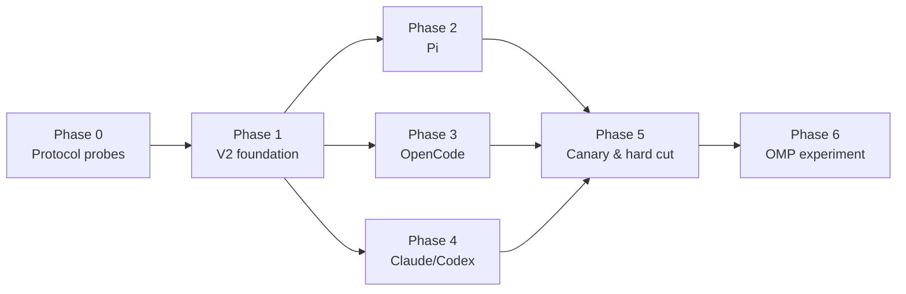

# Open-Harness V2 分阶段实施计划

**日期：** 2026-08-21 · **状态：** Approved for implementation

**架构依据：** [Open-Harness V2 架构方案](../../architecture/open-harness-v2.md)

**取代：** [2026-08-01 多 Harness 引擎路线图](2026-08-01-multi-harness-engine-roadmap.md) 的后续实施方向

## 1. 交付结论

本计划以一次 Internal Preview 硬切交付 `codify.worker.* /v2`。首次 V2 必须同时可运行 Pi、OpenCode、
Claude 和 Codex；Pi 达到默认 Harness 门槛并支持文本 steering/follow-up 后才能切换。OMP 不进入首发
关键路径，在 V2 稳定后作为独立实验 Harness 实施。

实施复用当前已完成的 V1 多 Harness 基础，不重做 Scheduler、Docker 工作区、Task Snapshot、Session
lineage、Canonical Event ingest、Runtime Bundle、Skills、日志/归档、统计和 Git/MR delivery。主要新增：

1. V2 协议族、manifest 驱动的内置 Harness 目录和 `model_protocol` 命名；
2. 持久化 Task command queue、Worker command pump 和 Bridge control endpoint；
3. Pi RPC Bridge 与完整交互能力；
4. OpenCode Task-scoped Server/SDK Bridge；
5. Claude/Codex V2 迁移和四 Harness 一致性门禁；
6. 新建 Profile 默认 Pi、V1 只读和硬切 runbook。

## 2. 约束、假设与成本

### 2.1 固定约束

- 只支持 Codify 内置 Harness，不接受数据库、仓库或用户提供任意 Adapter 命令。
- V2 模型协议只有 `anthropic_messages`、`openai_responses`、
  `openai_chat_completions`；不支持 `google_generate_content`。
- Model Endpoint Snapshot 是模型、Base URL 和 Credential 的唯一事实源。
- 继续用环境变量把内部共享 API Key 注入 Task 容器；安全强化不在本计划。
- Pi 用 RPC stdio；OpenCode 从第一版即用 Task-scoped Server/SDK。
- 只有 fresh Session 可以切换 Harness；continue 不做跨 Harness handoff。
- 正式硬切时，新建 Worker Profile 只启用 Pi、默认 Pi；现有 Profile 和 Issue 不迁移默认值。
- 正式硬切后 V1 Task 只可查看与统计，不能 execute、schedule、retry、resume 或作为 V2 continue 来源；
  硬切前仅显式 `dual_canary` Profile 可执行冻结的 V1 contract。
- 首次 V2 数据库迁移使用维护窗口和唯一 migration owner；迁移后只允许 V2 向前修复，不回滚 V1
  Backend/Scheduler。
- 任一首发 Harness 的 P0/P1 缺陷，以及 Pi 默认门槛失败，都会延迟硬切。

### 2.2 人日估算

| 阶段 | 内容 | 预计人日 |
|---|---|---:|
| Phase 0 | 固定上游版本、真实协议 probe、冻结 V2 schema | 3–5 |
| Phase 1 | V2 公共合同、数据迁移、manifest、严格有序 command plane、执行门禁 | 12–18 |
| Phase 2 | Pi RPC、三模型协议、steering/follow-up | 10–15 |
| Phase 3 | OpenCode Server/SDK、Session/Agent/Command/Abort | 9–14 |
| Phase 4 | Claude/Codex 迁移到 V2 并做无回归 | 5–8 |
| Phase 5 | 产品 UI、制品、全矩阵 canary、迁移与硬切 | 9–13 |
| Phase 6 | OMP 独立实验，不阻塞 V2 | 6–10 |

Phase 0–5 的顺序总和是 48–73 人日；在 Phase 1 接口冻结后，Pi、OpenCode 和 Claude/Codex 迁移可
并行，整体规划值为 **43–64 人日**。相比初稿，Phase 1/5 增加约 3–4 人日，用于 client-id
idempotency、attempt 严格顺序/control gate、全执行链 V1 guard 和 roll-forward-only migration runbook。
Phase 6 另计。这些是基于当前源码的规划假设，Phase 0 完成后必须用固定版本的真实 probe 重新估算，
不能直接当工期承诺。

### 2.3 关键依赖



Phase 2–4 可以由不同提交序列推进，但不得各自修改 V2 schema；协议变更必须回到 Phase 1 的共享
合同提交，更新四 Harness fixtures 后再继续。

## 3. Phase 0：上游协议探针与接口冻结

**目标：** 用固定官方版本的真实输出替代架构假设，冻结 V2 最小合同后才写生产 Bridge。

### 3.1 固定上游制品

- [ ] 选择 Pi、OpenCode、Claude CLI、Codex CLI 的精确版本。
- [ ] 记录官方下载来源、许可证、包名/二进制、平台、版本和 SHA-256。
- [ ] 验证目标 Worker 架构（至少当前 linux/amd64）能离线运行已安装制品。
- [ ] 记录 Pi RPC 和 OpenCode Server 的协议版本或版本探测结果。
- [ ] 确认 OpenCode Bridge 使用官方 SDK 还是稳定 HTTP API；只选一个生产路径，另一条仅用于诊断。

建议新增：

```text
docs/harness-probes/v2/README.md
docs/harness-probes/v2/pi/<scenario>/
docs/harness-probes/v2/opencode/<scenario>/
docs/harness-probes/v2/claude/<scenario>/
docs/harness-probes/v2/codex/<scenario>/
scripts/harness-probes/v2/
```

Probe 原始输出可脱敏提交；凭据和完整仓库内容不能进入 fixture。

### 3.2 Pi probe 矩阵

- [ ] RPC 初始化、版本/能力探测和 clean shutdown。
- [ ] fresh prompt、resume、无改动成功、工具成功/失败、模型错误和网络错误。
- [ ] Anthropic Messages、OpenAI Responses、OpenAI Chat Completions 各至少一个真实 Endpoint。
- [ ] assistant text、thinking、tool call/result、usage、model、Session ID 和 settled 事件。
- [ ] prompt 进行中发送 steer；多个 steer 的队列顺序和 ACK。
- [ ] prompt 进行中和 settled 边界发送 follow-up；queue update 与最终 settled。
- [ ] 证明 RPC success 只表示 accepted/queued/handled，不把它解释成模型已经消费或执行。
- [ ] 重复 RPC request id、断开 stdin、Bridge 在 native send/ACK/journal 各边界崩溃后的行为；不能假定
  Pi 会按 request id 原生去重。
- [ ] abort、SIGTERM、SIGKILL、timeout 和子进程清理。
- [ ] 原生项目配置、Skills、thinking level、steering/follow-up mode 的优先级。

### 3.3 OpenCode probe 矩阵

- [ ] `opencode serve` 的启动、健康检查、鉴权、随机端口和退出。
- [ ] 创建/恢复 Session、同步/异步 Prompt、事件订阅和最终消息获取。
- [ ] Agent、Command、model variant 的合法值、错误语义和模型覆盖行为。
- [ ] tool、usage、model、Session status、busy/idle 和最终 settled 的组合判定。
- [ ] Abort 在 thinking、tool 和 idle 阶段的行为；Server 崩溃与 HTTP 断线。
- [ ] 同 Task continue 和新容器 resume；禁止跨 Harness Session。
- [ ] 原生项目配置、插件、MCP 和 Skills 在可信仓库模型下的加载行为。
- [ ] Git 修改、无改动、失败后公共 Codify delivery 的输入状态。

### 3.4 Claude/Codex V2 回放

- [ ] 用现有 V1 fixture 生成等价 V2 fixture，不改变已验证的原生 CLI 行为。
- [ ] 列出 V1→V2 的字段映射和新增 `control_transport`/`model_protocol` 字段。
- [ ] 验证 V2 projector 对成功、无改动、resume、取消、timeout、鉴权、限流、工具失败、
  context compaction 和 usage/model 的回放。

### 3.5 冻结输出

Phase 0 必须形成并评审以下 schema：

```text
codify.worker.harness/v2
codify.worker.event/v2
codify.worker.command/v2
codify.worker.result/v2
codify.worker.runtime-manifest/v2
```

同时冻结：

- event type、必填字段、唯一终态和序列规则；
- client-generated command ID、payload digest、attempt 内 sequence、状态机、ACK/reject code 和重投语义；
- Bridge control endpoint 的请求/响应 framing 和最大文本长度；
- `delivered = Harness native ACK` 的精确定义，以及 queue update 无 command ID 时的审计边界；
- attempt control gate、单 dispatcher 严格顺序、Pi settled/closing/drain 与 follow-up 的竞争处理；
- OpenCode settled 判定和 Server crash 分类；
- 三模型协议的 Harness 兼容矩阵；
- 20 个代表性 benchmark 任务、模型、次数和统计方法。

**退出条件：** 四 Harness 的 raw fixture 可离线回放；Pi/OpenCode 的双向边界已用真实版本证明；所有
未知字段都能 fail closed 或明确 forward-compatible；成本完成一次重估。

## 4. Phase 1：V2 公共地基与 command plane

**目标：** 在不接具体新 Harness 行为前，让 Backend、Worker、Runtime Bundle 和测试框架完整理解 V2。

### 4.1 数据库迁移

以当前 Alembic head `073_task_freeform_mode` 为基线，建议新增
`074_open_harness_v2.py`；实施时若 head 已变化必须顺延，不能复用编号。

该 migration 包含物理列重命名，只能按 8.6 的首次 V2 控制面维护窗口执行。执行成功后 V1 二进制不再
兼容数据库，必须 roll forward。

- [ ] 将 `ai_providers.wire_protocol` 破坏性重命名为 `model_protocol`。
- [ ] 给 `ai_providers` 增加 nullable `compat_profile`。
- [ ] 给 `worker_profiles` 增加非空 JSON `harness_options`，默认 `{}`。
- [ ] 给 `task_harness_attempts` 增加 control gate、command sequence 和 attempt dispatcher lease 字段；
  历史 V1 attempt 回填为 `control_state=disabled`。
- [ ] 新建 `task_harness_commands` 表和索引。
- [ ] 保持现有 Provider 数据值不变，只改列名；不添加旧 API alias。
- [ ] Phase 1 不修改 Worker Profile 的 ORM/API/数据库默认 Harness；V2 canary 只使用显式创建的 Profile。
- [ ] 不更新现有 Profile 的 enabled/default Harness，不更新 Issue 默认值。
- [ ] 不改写 V1 Snapshot、attempt、receipt、raw archive 或统计行。

`task_harness_commands` 至少需要：

```text
command_id, task_id, attempt_id, sequence_no, command_type, payload, payload_digest, status,
created_by, created_at, delivery_attempts, last_attempt_at,
delivered_at, rejected_at, rejection_code, rejection_message
```

`task_harness_attempts` 至少增加：

```text
control_state, next_command_sequence,
command_dispatch_owner, command_dispatch_expires_at
```

约束与索引：

- `command_id` 全局唯一，`payload_digest` 非空；
- `(attempt_id, sequence_no)` 唯一，`sequence_no >= 1`，只能在 attempt 行锁内分配；
- `command_type IN ('steer', 'follow_up')`；
- `status IN ('queued', 'delivered', 'rejected')`；
- `control_state IN ('disabled', 'starting', 'accepting', 'closing', 'closed')`；
- delivered/rejected 字段与状态一致；
- Task/attempt 删除时 command 可级联删除，Issue 生命周期统计不依赖 command 明细。

测试建议：

```text
backend/tests/unit/test_074_migration.py
backend/tests/unit/test_task_harness_commands.py
```

### 4.2 Model Endpoint 重命名

修改：

```text
backend/app/models.py
backend/app/api/providers.py
backend/app/core/model_endpoints.py
backend/app/api/task_responses.py
backend/app/api/task_creation_service.py
backend/app/core/worker_runtime.py
frontend/src/api/index.ts
```

- [ ] 所有新请求/响应、Snapshot、fingerprint、日志标签和 UI 都使用 `model_protocol`。
- [ ] `compat_profile` 使用后端 allowlist；未知值在 Task 创建时拒绝。
- [ ] 全仓 `rg wire_protocol` 最终只允许出现在 migration、`dual_canary` V1 compatibility reader、V1
  历史读取和旧文档中。
- [ ] Provider 的 secret-free fingerprint 纳入 `model_protocol` 和 `compat_profile`。
- [ ] 环境变量注入从 `model_protocol` 决定 Anthropic/OpenAI 变量，不从 Harness key 猜测。

### 4.3 V2 协议与 projector

修改或新增：

```text
backend/app/core/harness_protocol.py
backend/app/core/harness_attempts.py
backend/app/core/worker_event_projector.py
backend/app/core/task_event_archive.py
backend/tests/fixtures/harness_events_v2/
deploy/worker-entrypoint/harness/events.py
deploy/worker-entrypoint/harness/runner.sh
deploy/worker-entrypoint/harness/common.sh
```

- [ ] V2 常量不覆盖 V1 常量；历史读取器仍能识别 V1。
- [ ] Projector 按 attempt 的 `event_schema` 选择解析器，V1 只读投影保持可用。
- [ ] 增加三个 control event 的 schema、幂等 receipt 和日志投影；command delivered/rejected 必须带
  `command_id`，attempt 级 queue update 不要求 ID，也不能按消息文本反推 ID。
- [ ] Projector 只做审计/日志展示，绝不写 `task_harness_commands.status`。
- [ ] `delivered` 只表示 Harness native ACK/accepted/queued/handled，不表示模型已经消费或执行。
- [ ] 上游 settled candidate 先触发 attempt `accepting -> closing`，此时不得提前发 canonical Harness
  terminal；排空锁前已接受的 command 后，若 follow-up 开始下一轮则重开 `accepting`，否则 `closed`
  并且只产生一个 Harness terminal。
  若 probe 证明上游有多 turn terminal，Bridge 必须收敛为一个 Harness terminal。
- [ ] 公共 Runner 最后生成且仅生成一个 Task terminal；delivery 仍在 Harness settled 之后。
- [ ] result v2 显式携带 Session、usage、model、outcome、failure category 和 raw archive locator。

### 4.4 Manifest 驱动的内置目录

修改：

```text
backend/app/core/harness_registry.py
backend/app/core/worker_runtime_bundle.py
backend/app/core/worker_runtime_readiness.py
deploy/worker-entrypoint/harness/manifest.json
deploy/worker-kit/verify-runtime.sh
```

- [ ] 编译期 allowlist 变为 `pi/opencode/claude/codex`；OMP 暂不 selectable。
- [ ] display name、support tier、control transport、模型协议、capability、options schema 从已验证
  manifest projection 读取。
- [ ] 系统 capability upper bound 仍在 Backend 代码内，manifest 只能收紧不能扩大。
- [ ] Runtime Bundle digest 从 manifest 的文件列表递归计算，移除固定 Adapter 文件数组。
- [ ] 每个 Adapter 有独立 digest，共享库变更会改变所有引用它的 Adapter digest。
- [ ] `verify-runtime.sh` 不再写死 claude/codex case；逐 manifest Adapter 验证官方制品、版本、摘要和
  Bridge self-check。
- [ ] Registry API 只返回可展示 schema，不暴露启动命令、宿主路径或任意插件入口。

### 4.5 Harness options

- [ ] Worker Profile 保存 namespaced `harness_options`。
- [ ] Backend 为 `pi/v1` 和 `opencode/v1` 写有类型 Pydantic 校验器。
- [ ] Task create/update 只接受当前 manifest options schema 中标记 `task_override=true` 的字段。
- [ ] Profile 默认与 Task override 做 deterministic deep merge，再冻结到
  `TaskWorkerProfileSnapshot.harness_config_snapshot`。
- [ ] Snapshot fingerprint 纳入 options；运行时不重新读取 Profile。
- [ ] 原生仓库配置可以提供低频设置，但 Endpoint 模型字段始终由 Snapshot 强制覆盖。

### 4.6 Command API 与状态机

建议新增：

```text
backend/app/api/task_command_routes.py
backend/app/core/task_harness_commands.py
backend/tests/unit/test_task_command_routes.py
frontend/src/api/taskCommands.ts
```

API：

```http
PUT /api/tasks/{task_id}/commands/{command_id}
GET /api/tasks/{task_id}/commands
GET /api/tasks/{task_id}/commands/{command_id}
```

- [ ] 客户端生成 ULID/UUID `command_id`；PUT 只接受 text `steer|follow_up`。
- [ ] path 是 `command_id` 的事实源；若请求 schema 同时携带该字段，必须与 path 完全一致。
- [ ] 对规范化 `{task_id, attempt_id, type, payload}` 计算 `payload_digest`。同 ID/同 digest 返回已有行
  （首次 201、重放 200），同 ID/不同 digest 返回 `409 Conflict`；唯一键竞争后重读并执行同一判断。
- [ ] 幂等查重在新建资格检查之前；已存在的 command 即使 Task 随后 closing/terminal 也返回原状态。
- [ ] 新建时在同一事务锁定 Task、当前 attempt 和 Issue access，检查 RUNNING、精确 V2、capability 和
  `control_state=accepting`，并从 `next_command_sequence` 分配 sequence。
- [ ] Task 非运行、attempt 不匹配、Harness 不支持或 gate 非 accepting 时确定性拒绝，不创建 queued 假象。
- [ ] 成功写入返回 `queued`；GET 可在前端断线后恢复状态，并按 sequence 排序。
- [ ] 首版不提供 update/delete/reorder；不把 Task 的 `trigger_source=follow_up` 与 Harness command 混淆。
- [ ] SSE 日志继续承载投影事件；command 状态 API 是恢复时的事实源。

### 4.7 Worker command pump

建议新增：

```text
backend/app/core/worker_command_pump.py
deploy/worker-entrypoint/harness/control_client.py
deploy/worker-entrypoint/harness/bridge.py
```

并扩展 `backend/app/core/docker_client.py` 的受限 exec 能力。

- [ ] Worker 在容器启动成功后并行启动 command pump；使用独立 AsyncSession，不能复用日志流 session。
- [ ] 无 command capability 的 attempt 初始化为 disabled；Pi 初始化为 starting，Bridge ready 后才
  accepting，启动失败进入 closed；只有 follow-up 确认开始下一轮才允许 closing→accepting。
- [ ] 在 attempt 行上获取短 dispatcher lease；可用 `SKIP LOCKED` 并行处理不同 attempt，但同一 attempt
  任一时刻只能有一个 dispatcher。
- [ ] dispatcher 严格处理最小非终态 `sequence_no`，前一条未 delivered/rejected 时不得领取后一条；
  不能用 command 行级 `SKIP LOCKED` 越过队首。Worker 崩溃后 attempt lease 到期才可重领。
- [ ] Docker exec 只能调用镜像内固定的 `control_client.py`，不拼接用户文本到 shell 命令。
- [ ] 文本通过 stdin JSON 传输；client 连接 Task 私有 Unix socket 并等待 Bridge ACK。
- [ ] pump 是创建后唯一 command 状态 writer，使用 CAS 只允许
  `queued -> delivered|rejected`；终态不可重开。Canonical event projector 不参与状态写入。
- [ ] 原生 ACK 后写 delivered；原生拒绝、settled 或确定性协议错误写 rejected；暂时性 Docker/DB 失败
  保持队首 queued 并重试，因此也阻塞后续 sequence。
- [ ] Bridge 在原生发送前 fsync 写入 `command_id -> dispatching` journal，ACK 后写入结果；重复 command
  返回原结果。若发送后崩溃导致结果不确定，返回 `delivery_outcome_unknown` 并拒绝，不能再次注入。
- [ ] native request id 只做关联，不当作 Harness 去重凭据。
- [ ] 正常 settled 在 attempt 行锁内切到 closing，停止接受新 command，pump 排空关闭前已分配队列；
  已 ACK 的 follow-up 启动下一轮时重开 accepting，否则 closed 后才 finalization。
- [ ] cancel/timeout/强制终止切到 closing，由 pump 确定性拒绝剩余 queued command，再 closed/终止 Bridge。
- [ ] Scheduler crash recovery 识别 V2 RUNNING 容器后恢复 log ingest 和 command pump。
- [ ] pump 故障不得直接绕过 Runner 生成 Task terminal；按 failure policy 通知 Runner 收敛。

并发/恢复测试至少覆盖：

- [ ] 两个相同 ID/同 digest 的并发 PUT 只产生一行和一个 sequence；同 ID/不同 digest 稳定返回 409。
- [ ] 多个不同 ID 并发创建得到唯一、连续 sequence；两个 pump 不能同时 dispatch 同一 attempt。
- [ ] 队首暂时失败时后一条不能越过；lease 到期恢复后仍按原顺序投递。
- [ ] PUT 与 accepting→closing 竞争的线性化结果只能是“已入库并被 drain”或“未入库且被拒绝”，不能
  留下 closing 后永远 queued 的 command。
- [ ] 在 journal fsync、native send、ACK 和 DB CAS 每个边界注入崩溃，最多原生注入一次；不确定结果
  收敛为 `delivery_outcome_unknown`。
- [ ] 重放/乱序 control event 不得改变 command 行；终态 CAS 不能被第二个 writer 覆盖。

### 4.8 中央 execution contract policy

建议新增：

```text
backend/app/core/harness_execution_policy.py
backend/tests/unit/test_harness_execution_policy.py
```

并接入现有执行入口：

```text
backend/app/api/task_creation_service.py
backend/app/api/tasks.py
backend/app/scheduler.py
backend/app/core/worker_runtime_bundle.py
backend/app/core/worker_task_lifecycle.py
```

- [ ] 提供单一 `require_executable_contract(...)`，同时验证 Task Snapshot、attempt schema、绑定 Runtime
  Bundle 的 contract/version/digest；`require_executable_contract_v2(...)` 要求精确 V2，不能只判断有 Bundle。
- [ ] Task 创建、execute/schedule/retry/resume 路由全部调用；创建事务不能生成被当前策略禁止的 Snapshot。
- [ ] Scheduler promotion/claim 在变更状态和分配 Worker 前调用，不能信任 API 已验证。
- [ ] Worker `load_bound_runtime_bundle` 后、启动容器前再次调用；crash recovery 也使用同一策略。
- [ ] 新增必填 `HARNESS_EXECUTION_MODE=dual_canary|v2_only`；Backend/Scheduler 各自启动时拒绝缺失或
  未知值，readiness/health 显示当前 mode，部署 preflight 比较两者取值一致。
- [ ] 验证期仅显式 `dual_canary` Profile/cohort 可执行各自冻结的 V1/V2 contract；正式切换配置为
  `v2_only`，不自动升级/降级或跨 generation continue。
- [ ] `v2_only` 下残留 V1 PENDING/QUEUED 幂等转 CANCELLED；恢复发现的 V1 RUNNING 不恢复，终止容器并
  FAILED；统一原因 `legacy_contract_not_executable`。所有只读查询不调用该 guard。
- [ ] 覆盖从 API 绕过、旧 queued row、Worker 直接调用和 Scheduler recovery 的测试，证明不是仅靠 UI/路由。

**Phase 1 退出条件：** 四个 stub Adapter 均可通过 V2 fixture；V1 Task 仍可读取；命令可在 fake Bridge
完成 queued→delivered/rejected、重复投递、Worker 重启和 settled race 测试；没有真实 Pi/OpenCode 也能
验证全部公共状态机。

## 5. Phase 2：Pi 默认 Harness

**目标：** 让 Pi 在真实 Worker 上达到默认可用，而不只是能启动。

### 5.1 Runtime 与 Bridge

建议新增：

```text
deploy/worker-entrypoint/harness/adapters/pi.sh
deploy/worker-entrypoint/harness/adapters/pi_bridge.py
deploy/worker-entrypoint/harness/adapters/pi_events.py
backend/tests/fixtures/harness_events_v2/pi/
backend/tests/unit/test_pi_harness_adapter.py
```

文件名可在 Phase 0 根据官方 SDK 语言调整，但 shell Adapter 仍只负责固定入口和进程信号。

- [ ] Worker 镜像安装固定官方 Pi 包，manifest 记录版本和制品 SHA。
- [ ] Bridge 启动 `pi --mode rpc`，验证版本/能力后才发送首个 prompt。
- [ ] stdout 只用于 RPC framing；stderr 和 Bridge 诊断进入 raw archive，不能污染协议流。
- [ ] fresh/resume、cwd、Session state、Skills、Task prompt 和 system/run instruction 显式映射。
- [ ] thinking、tool、assistant、usage、model、queue、settled、failure 映射为 V2 event/result。
- [ ] SIGTERM 先走原生 abort/close，再由公共 Runner 在 grace 后 KILL。
- [ ] Pi 不执行 Git commit/push/MR；结束后仍走公共 delivery。

### 5.2 三种 Model Endpoint

- [ ] 分别实现并验证 Anthropic Messages、OpenAI Responses、OpenAI Chat Completions 的环境变量/
  config 映射。
- [ ] 禁止 Pi 原生 config 覆盖 Snapshot 的 model、base URL 和 credential。
- [ ] 不可用的 provider driver/compat profile 在 verify-runtime 或 Task 创建时失败，不拖到运行中。
- [ ] usage 缺失时显式标记 unavailable，不用估算值冒充上游值。

### 5.3 Steering/follow-up

- [ ] 通用 `steer` 映射 Pi native steer；通用 `follow_up` 映射 native follow-up。
- [ ] 原生 request id 与 `command_id` 一一关联，ACK 才产生 delivered event；UI 语义是“Harness 已接收”，
  不承诺模型已消费或执行。
- [ ] 实现 one-at-a-time 首发模式；如果 Pi 支持其他模式，先保留在 manifest schema 外。
- [ ] 覆盖多条命令、工具执行期间、settled 边界、abort、重复投递、Bridge 重启和 Scheduler 恢复。
- [ ] Pi `agent_settled` 触发 accepting→closing；关闭前已入库的命令排空，follow-up 启动新一轮时重开
  accepting，没有 continuation 才 closed 并返回 Harness terminal。
- [ ] 命令文本经过现有日志清洗后才投影，不在诊断日志重复打印完整内容。

### 5.4 Pi options 与 Skills

- [ ] `thinking_level`、`steering_mode`、`follow_up_mode` 有枚举、默认值和 fixture。
- [ ] Task override 只开放这三个高频字段。
- [ ] Managed Skills 物化到 Task 私有目录，再由 Pi 原生加载机制引用；不继续以 `.claude/skills` 为公共
  中间格式。
- [ ] 仓库 Pi 配置和内置/Managed Skills 的加载顺序写入 probe 文档。

### 5.5 Pi 完成门槛

- [ ] fixture conformance、Backend unit、mock integration 全通过。
- [ ] 真实 Host 覆盖 execute、plan、freeform、fresh、continue、cancel、timeout、失败、无改动和 delivery。
- [ ] 真实运行中 steer/follow-up 覆盖 queued/delivered/rejected 和恢复。
- [ ] 在冻结 benchmark 上完成至少 20 个代表性任务；成功率下降不超过 10 个百分点。
- [ ] 中位耗时和 Token 不得同时比当前较优兼容 Harness 恶化超过 25%。

未满足这些门槛时不能执行 Pi 默认值迁移，也不能改用其他 Harness 绕过门槛后照常发布；V2 整体继续
处于 canary。

## 6. Phase 3：OpenCode 一级 Harness

**目标：** 用面向未来交互能力的 Server 边界交付 OpenCode，首发只开放非交互运行。

### 6.1 Task-scoped Server

建议新增：

```text
deploy/worker-entrypoint/harness/adapters/opencode.sh
deploy/worker-entrypoint/harness/adapters/opencode_bridge.*
deploy/worker-entrypoint/harness/adapters/opencode_events.*
backend/tests/fixtures/harness_events_v2/opencode/
backend/tests/unit/test_opencode_harness_adapter.py
```

- [ ] 每 Task 启动一个 Server，绑定 `127.0.0.1` 随机端口，生成 Task 私有认证值。
- [ ] readiness 有超时；端口/认证只保存在容器内，不进入用户日志。
- [ ] Bridge 用 Phase 0 选定的官方 SDK/HTTP 客户端创建或恢复 Session。
- [ ] Prompt 和 event subscription 建立顺序避免漏掉首事件。
- [ ] Server、Bridge 和子进程都在公共 Runner 信号树中；退出时不遗留 daemon。

### 6.2 Session、能力与事件

- [ ] 支持 fresh/continue、Agent、Command、model variant、Abort、usage 和 model。
- [ ] settled 同时参考事件、最终 assistant message 和 Session 状态，不以单一 busy/idle 字段决定。
- [ ] Server crash、HTTP timeout、Session missing、Agent/Command invalid 和 provider error 分类稳定。
- [ ] OpenCode 原生 Agent/Command 不能覆盖冻结 Endpoint；model variant 只改变 Snapshot 允许的变体。
- [ ] Managed Skills 使用 OpenCode 官方加载路径；仓库插件/MCP 按内部可信模型允许。
- [ ] 继续走公共 Git/MR delivery，并覆盖工具修改但最终消息失败等边缘场景。

### 6.3 首发 command 边界

- [ ] manifest 明确 `steering=false`、`follow_up=false`。
- [ ] Bridge 仍实现 control endpoint 的 capability negotiation 和 deterministic reject，证明以后无需改公共
  command plane。
- [ ] 保留 probe 和设计记录，但不通过“再发一条 prompt”模拟已承诺的 steering 语义。

### 6.4 OpenCode 完成门槛

- [ ] fixture conformance 与真实 Host canary 均通过。
- [ ] 至少覆盖 Server 启动、Session、Agent、Command、variant、Abort、crash、usage 和 Git delivery。
- [ ] fresh/continue 不串 Session；每 Task Server 不泄漏到下一 Task。
- [ ] Claude/Codex/Pi 的相同 Endpoint compatibility 结果由 Backend 单一矩阵给出。

## 7. Phase 4：Claude/Codex V2 迁移

**目标：** 保留当前双 Harness 行为，把它们迁入同一 V2 合同，不借机重写成熟路径。

### 7.1 Adapter 迁移

修改：

```text
deploy/worker-entrypoint/harness/adapters/claude.sh
deploy/worker-entrypoint/harness/adapters/claude_events.py
deploy/worker-entrypoint/harness/adapters/codex.sh
deploy/worker-entrypoint/harness/adapters/codex_events.py
backend/tests/fixtures/harness_events_v2/{claude,codex}/
```

- [ ] 输出 V2 init/event/result，并保留原始 Session、usage、model 和 failure 映射。
- [ ] Claude 声明 `anthropic_messages`；Codex 声明 `openai_responses`。
- [ ] 两者 `control_transport` 保持单向 CLI，`steering/follow_up=false`。
- [ ] 公共 command API 对这两个 Harness 在创建事务内拒绝。
- [ ] 迁移 Skills 公共物化层，Harness Adapter 再映射到各自原生目录。

### 7.2 无回归矩阵

- [ ] 新任务、fresh/continue、plan/execute/freeform。
- [ ] 取消、timeout、SIGTERM/SIGKILL、网络中断和 invalid Session。
- [ ] tool success/failure、context compaction、rate limit、authentication failure。
- [ ] usage/model、run text 能力差异、raw archive 和 replay。
- [ ] 有改动、无改动、commit/push/MR 和 require_changes。
- [ ] Profile allowlist、Endpoint compatibility、Runtime readiness 和 immutable retry guard。

**退出条件：** V2 fixture 与 V1 语义对照没有 P0/P1 差异，且两者在真实 Host 上完成至少一轮完整
Task/Session/delivery canary。

## 8. Phase 5：产品、制品、Canary 与硬切

### 8.1 Backend 产品边界

- [ ] Harness registry API 返回四个内置 Harness、支持等级、能力、模型兼容和 options schema。
- [ ] 只有 Phase 2 Pi 门槛和四 Harness release gate 均通过后，才新增独立硬切 migration（若 074 后
  head 未变化则为 `075_pi_profile_defaults.py`），同步修改新建 Worker Profile 的 ORM/API/数据库默认：
  `enabled_harnesses=["pi"]`、`default_harness_key="pi"`；不得 UPDATE 现有行。
- [ ] 复制/更新现有 Profile 保留原值；默认值切换不能混入 Phase 1 migration 或提前进入 canary。
- [ ] migration/API 测试证明新建行默认 Pi、复制保留原值、已有行在升级前后逐行不变。
- [ ] 新建 Issue 只继承所选 Profile 的默认 Harness；不额外增加独立全局 Issue 默认。
- [ ] fresh 才能选择 Harness；continue 保持现有 lineage 锁定并拒绝 V1 lineage。
- [ ] 创建、execute/schedule/retry/resume、Scheduler、Worker 和 recovery 统一调用中央 execution policy。
- [ ] V1 Task response 增加只读/legacy 能力提示；日志、archive、统计查询不受执行 guard 影响。
- [ ] V1/V2 当前行及删除归档继续按既有 provider、`harness_key`、状态和时间等维度可读/聚合；V2 不承诺
  protocol generation 产品筛选，也不为此修改 `DeletedTaskStatistics` schema。

### 8.2 Frontend

修改重点：

```text
frontend/src/api/index.ts
frontend/src/api/tasks.ts
frontend/src/components/TaskFormDrawer.vue
frontend/src/views/CreateIssue.vue
frontend/src/views/TaskView.vue
frontend/src/views/Config.vue
frontend/src/i18n/messages/en.ts
frontend/src/i18n/messages/zh-CN.ts
```

- [ ] 所有 Provider UI 使用 `model_protocol` 和 `compat_profile`。
- [ ] Profile Harness 列表和 Task options 从 Backend projection 渲染，不复制兼容矩阵。
- [ ] fresh Session 显示 Harness 选择；continue 只显示已锁定 Harness。
- [ ] Pi 显示 thinking、steering/follow-up mode；OpenCode 显示 Agent、Command、variant。
- [ ] RUNNING Pi Task 只有 `control_state=accepting` 时可发送；starting/closing 显示真实过渡状态。
- [ ] 命令列表显示发送中、queued、“Harness 已接收”、rejected；帮助文案说明 native ACK 不等于模型已执行。
- [ ] 页面重连后从 command list 恢复；同一 command 不重复显示。
- [ ] V1 Task 显示 `Legacy V1 · Read-only`，隐藏 execute/retry/schedule/resume。
- [ ] 桌面和 390×844 移动视口验证键盘遮挡、安全区、长文本换行和至少 44px 触摸目标。

重点测试：

```text
frontend/src/components/TaskFormDrawer.spec.ts
frontend/src/views/CreateIssue.spec.ts
frontend/src/views/TaskView.spec.ts
frontend/src/api/api.spec.ts
```

### 8.3 Worker 镜像、Kit 与离线制品

- [ ] Worker image 安装四个固定官方制品；运行时不下载。
- [ ] image build 校验 SHA，构建结果打印版本清单但不打印凭据。
- [ ] Runtime Bundle v2 包含四 Adapter、Bridge、control client、schema 和 manifest。
- [ ] Worker Kit 导出/导入保留平台、image digest、bundle digest 和四 Harness probe 结果。
- [ ] `verify-runtime` 在每个目标 Host 实际启动最小 probe，不只执行 `--version`。
- [ ] Profile readiness digest 覆盖 image、Kit、bundle、Endpoint compatibility 和 Harness options generation。

### 8.4 自动化验证命令

按增量先跑 focused tests，再跑完整门禁：

```bash
backend/.venv/bin/python -m pytest backend/tests/unit/test_074_migration.py
backend/.venv/bin/python -m pytest backend/tests/unit/test_harness_protocol.py
backend/.venv/bin/python -m pytest backend/tests/unit/test_harness_event_fixtures.py
backend/.venv/bin/python -m pytest backend/tests/unit/test_task_harness_commands.py
backend/.venv/bin/python -m pytest backend/tests/unit/test_harness_execution_policy.py
backend/.venv/bin/python -m pytest backend/tests/unit/test_pi_profile_default_migration.py
backend/.venv/bin/python -m pytest backend/tests/unit/test_pi_harness_adapter.py
backend/.venv/bin/python -m pytest backend/tests/unit/test_opencode_harness_adapter.py
backend/.venv/bin/python -m pytest backend/tests/unit/test_claude_harness_adapter.py
backend/.venv/bin/python -m pytest backend/tests/unit/test_codex_harness_adapter.py
make test-frontend
make test-backend
make test-mock-e2e
```

最终还必须运行 `frontend` 目录的 `npm run build`、Worker shell syntax/lint、镜像构建、Kit 导出校验和
真实 Docker Host canary。测试文件名可随实现调整，但覆盖项不能删除。

### 8.5 Canary 计划

1. 建立 V2 专用 Worker image、Kit、Runtime Bundle 和四个测试 Profile。
2. 保留 V1 Profile 供验证期内部任务使用；V1/V2 Task 不共享 continue lineage。
3. 先跑四 Harness 功能矩阵，再冻结 20 个 benchmark 任务和同一组 Endpoint/model 参数。
4. 每个任务记录成功/失败分类、人工验收、耗时、输入/输出/缓存 Token、工具调用和 delivery。
5. Pi 额外跑命令投递、重复投递、断线、Scheduler 重启和 settled race。
6. OpenCode 额外跑 Server crash、Abort、Agent、Command 和 Session 泄漏检查。
7. 修复后重新跑受影响矩阵；不把失败样本从 benchmark 删除。

### 8.6 硬切 Runbook

首次 V2 控制面部署（Canary 前，roll-forward-only）：

1. 预先构建 V2 Backend/Frontend、Worker image/Kit/Runtime Bundle，不在维护窗口下载或编译。
2. 暂停任务创建和 Scheduler 领取，排空或逐个终止运行任务，然后停止 Backend 与 Scheduler。
3. 备份数据库并验证恢复点；把 Backend/Scheduler 长驻服务都配置为 `AUTO_MIGRATE=false`。
4. 由唯一的一次性 V2 migration owner 执行精确、已评审的 V2 schema revision（例如
   `alembic upgrade 074_open_harness_v2`，实际编号顺延时同步替换）；禁止使用漂移的 `head`，也禁止两个
   compose service 竞争迁移。
5. migration 成功后启动 V2 Backend/Scheduler 的显式 `dual_canary` 模式，再部署 V2 Frontend 和 Worker
   制品；验证 V1 读取以及明确 V1/V2 Profile 各自的执行。
6. 从物理列重命名成功起禁止重新启动 V1 Backend/Scheduler。发布故障保持维护模式并 roll forward。

硬切前：

- [ ] 宣布 V1 创建/调度冻结窗口并暂停 Scheduler 领取新的 V1 Task。
- [ ] 列出所有 V1 RUNNING/PENDING/QUEUED Task 和当前容器，不使用模糊批量条件。
- [ ] 等待 RUNNING 完成；超过窗口的任务逐个确认后取消。
- [ ] 取消剩余 PENDING/QUEUED V1 Task；不自动转成 V2。
- [ ] 备份数据库并验证 V1 Task、archive、统计的只读查询。
- [ ] 确认所有将启用的 Profile 已通过 V2 readiness。
- [ ] 确认 Pi 默认门槛和四 Harness release gate 已通过，才允许执行默认值 migration。

部署顺序：

1. 进入维护模式并停止 Backend/Scheduler；
2. 由唯一 migration owner 执行 Pi 新行默认值 migration；
3. 以 `AUTO_MIGRATE=false` 和 `v2_only` 启动 V2 Backend/Scheduler；
4. 确认预置 Worker image/Kit/Runtime Bundle digest 并启用 V2 Profile；
5. 部署/确认 V2 Frontend；
6. 运行四个小型 smoke Task；
7. 恢复新 Task 创建与调度。

硬切后：

- [ ] API 和 UI 都拒绝 V1 execute/retry/schedule/resume。
- [ ] V1 Task detail、日志、archive 和统计仍可读取。
- [ ] 新建 Profile 默认只有 Pi；既有 Profile 没有被批量改值。
- [ ] 新 Task 的 Snapshot、attempt、event、result 全部为 V2。
- [ ] 监控四 Harness success/failure、protocol_error、command latency 和 rejected reason。

硬切后没有 V1 应用回滚路径。若发布异常，保持维护模式、停止新 Task 并部署修复后的 V2；不得删除或
改写已产生的 V2 数据，也不得让 V1 Worker 执行 V2 Task。数据库备份只用于灾难恢复。

**Phase 5 退出条件：** 架构方案第 13 节全部满足；V2 硬切完成；Pi 是新建 Profile 的唯一默认；
V1 历史可查看/统计且所有执行入口被拒绝。

## 9. Phase 6：OMP 独立实验

**进入条件：** V2 已硬切并稳定完成内部使用周期；Pi 默认质量数据可作为对照。

- [ ] 新增独立 `omp` key、Session namespace、manifest entry、Adapter digest 和统计维度，并随新的
  content-addressed Runtime Bundle 版本交付，不建立第二套 Bundle 机制。
- [ ] 固定官方版本并重新 probe，不假定与 Pi RPC/SDK 兼容。
- [ ] 优先验证 LSP、Hashline 编辑、诊断、取消、usage 和 Git delivery。
- [ ] 可以复用 Pi-family 的纯 normalization/control 库，但不能共享 Session 或能力声明。
- [ ] 首版不启用 Subagent；先定义子生命周期如何映射 Canonical Event。
- [ ] 用同一 benchmark 与 Pi A/B；只有证明有明确收益才晋级一级，否则保持 Experimental 或移除。

OMP 不得要求修改 V2 通用协议才能“伪装成 Pi”。如果真实 probe 暴露新的公共语义，应先判断是否值得
进入 V3，而不是给 V2 增加只有 OMP 使用的松散字段。

## 10. 推荐提交边界

为了让每个变更可独立评审并在部署前撤销，建议按以下提交拆分；V2 schema migration 一旦执行，生产
处置仍然只能 roll forward：

1. `docs(harness): freeze v2 probes and schemas`
2. `refactor(provider): rename wire protocol to model protocol`
3. `feat(harness): add v2 manifest and protocol foundation`
4. `feat(harness): add persistent task command plane`
5. `feat(harness): add worker command pump and fake bridge conformance`
6. `feat(harness): enforce execution contract policy at every writer`
7. `feat(pi): add rpc bridge and canonical events`
8. `feat(pi): add steering and follow-up`
9. `feat(opencode): add task-scoped server bridge`
10. `refactor(harness): migrate claude and codex to v2`
11. `feat(ui): add harness options and pi live commands`
12. `build(worker): pin four harness artifacts and v2 kit`
13. `chore(harness): switch pi defaults and enforce v1 read-only hard cut`

不要把数据库重命名、四 Adapter 和 UI 全塞进一个提交。每个生产 Adapter 提交都必须同时带 raw fixture、
expected canonical fixture、unit test 和 manifest digest 更新。

## 11. 全局完成定义

只有以下条件全部成立，才能宣布 Open-Harness V2 已交付：

- [ ] 架构方案中的全部不可变实施决策均未被实现细节悄悄改写。
- [ ] Pi、OpenCode、Claude、Codex 都由同一 V2 Runner/manifest/projector 执行。
- [ ] Pi 是好用的默认 Harness，并通过质量、性能和 live command 门槛。
- [ ] OpenCode 使用 Task-scoped Server/SDK，而非临时 `run --format json` Adapter。
- [ ] Model protocol 与 control transport 已分离，`wire_protocol` 不再出现在新 API。
- [ ] Endpoint Snapshot 对所有 Harness 都是 Provider 唯一事实源。
- [ ] command queue 使用 client ID、payload digest、严格 sequence 和 attempt control gate；在重复投递、
  Worker/Scheduler 重启和 terminal race 下保持幂等且不乱序。
- [ ] V1 只读边界在 API、Scheduler、Worker 和 recovery 的中央策略中强制，不能只靠前端隐藏按钮。
- [ ] V2 schema 切换由唯一 migration owner 执行，长驻服务不自动迁移，且发布路径 roll-forward-only。
- [ ] 四 Harness fixture、unit、mock integration、frontend build、Worker image/Kit 和真实 Host canary 通过。
- [ ] 20 个内部 benchmark 和原始验收结果可追溯。
- [ ] 硬切清单和部署证据已归档；没有依赖未记录的手工容器修改。
- [ ] OMP 未混入首发关键路径。
