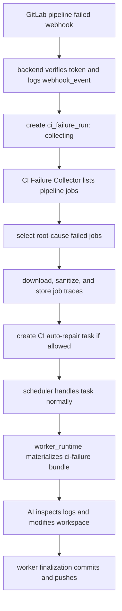

# CI Pipeline Failure Auto-Repair Design

**Date:** 2026-06-13
**Status:** Draft

## Context

Codify currently creates or updates Merge Requests after worker execution. GitLab then runs
project CI pipelines outside Codify. When a pipeline fails, users must leave Codify, inspect
GitLab jobs manually, copy failure details back into a new task, and ask Codify to repair the MR.

Codify already has the main integration pieces for a better loop:

- GitLab project webhooks with per-project secrets.
- Webhook event logging.
- Issue-to-MR linkage through `Issue.merge_request_iid` and `Issue.merge_request_url`.
- Issue-scoped task scheduling and worker execution.
- Runtime file handoff into `/tmp/codify-runtime`.
- Task retry and follow-up task patterns.

This design adds a controlled CI auto-repair path:

```text
Codify task creates MR
-> GitLab pipeline fails
-> GitLab sends pipeline failed webhook
-> Codify collects failed job evidence
-> Codify creates a CI repair task if allowed
-> Worker receives local CI logs
-> AI diagnoses the logs and modifies the workspace
-> Worker finalization commits, pushes, and updates the MR
```

## Goals

1. Allow users to opt in per issue to automatic CI repair after MR pipeline failure.
2. Receive GitLab pipeline failed webhooks and match them to Codify issues/MRs.
3. Collect root-cause failed job logs into a sanitized CI failure bundle.
4. Create a focused CI repair task that reads local job logs from the worker runtime directory.
5. Avoid duplicate, stale, concurrent, or unbounded repair attempts.
6. Extend GitLab webhook auto-configuration and health checks to include pipeline events.

## Non-Goals

- Automatically merging MRs after CI passes.
- Fixing pipeline failures for MRs not created or tracked by Codify.
- Fully modeling every GitLab DAG, child pipeline, or downstream pipeline in the first version.
- Creating repair tasks for obvious infrastructure failures by default.
- Passing full job logs directly in the prompt.
- Making the scheduler understand GitLab pipelines or CI job semantics.

---

## Product Decisions

### Issue-level opt-in

CI auto-repair is controlled by an issue-level field:

```text
issues.ci_auto_repair_enabled boolean not null default false
```

The issue creation page adds a toggle:

```text
MR pipeline failure auto-repair
```

When disabled:

- Pipeline failed webhooks are still authenticated and recorded.
- A `ci_failure_run` may be recorded for observability.
- Codify does not create an automatic repair task.

The first version defaults this toggle to off. A later project-level default can pre-select the
toggle in the issue creation form, but the persisted issue value remains authoritative.

### Configurable repair limit

The system configuration adds:

```text
ci_auto_repair_max_attempts integer not null default 2
```

The limit is counted per MR. Once the configured limit is reached, later pipeline failures are
recorded and ignored with:

```text
ignored_reason = "max_attempts_exceeded"
```

### Active execute task handling

If a pipeline failed webhook arrives while the same issue has an active `execute` task
(`pending`, `queued`, or `running`), Codify must not create a CI repair task.

Rationale:

- The active execute task may already be changing the same MR branch.
- The failed pipeline may belong to an older commit.
- Creating another execute-style task against the same branch risks concurrent branch writes.

MVP behavior:

```text
ci_failure_run.status = "ignored"
ignored_reason = "active_execute_task_exists"
```

The event remains visible in Codify. A later version can add deferred processing that re-checks
the MR head pipeline after the active task completes.

### Pipeline freshness

Codify should only auto-repair a failed pipeline if the pipeline SHA still matches the current MR
head SHA at the time Codify is ready to create the repair task.

If the failed pipeline is stale:

```text
ci_failure_run.status = "ignored"
ignored_reason = "stale_pipeline"
```

### Infrastructure failures

Codify should not create automatic code-repair tasks for likely infrastructure failures in the
MVP. These failures are recorded and displayed, but not repaired automatically.

The classification is conservative:

- Clear code/test/lint/build failures should create repair tasks.
- Clear runner/network/system failures should not.
- Unknown failures default to code-repair eligible only when they are not matched as infra.

---

## Architecture



### Component responsibilities

| Component | Responsibility |
|-----------|----------------|
| Webhook handler | Authenticate GitLab webhook, parse event, log event, create or reuse `ci_failure_run` |
| CI Failure Collector | Durably claim pending failure runs, match issue/MR, enforce gates, list jobs, classify failures, download traces, create repair task |
| Scheduler | Continue scheduling tasks only; no CI-specific logic |
| Worker runtime | Copy or mount the prepared CI failure bundle into `/tmp/codify-runtime/ci-failure` |
| Worker prompt | Tell AI where the local CI logs are and constrain the repair scope |
| Frontend | Expose issue opt-in, system max attempts, webhook health, and CI failure evidence |

The webhook handler must not perform long-running collection work. It should commit the
`webhook_event` and `ci_failure_run`, then return to GitLab. The collector must be durable: a
process scans claimable `ci_failure_runs` rows and resumes work after process restarts. It may run
as a separate loop in the scheduler service process or a dedicated backend startup loop, but it must
not rely on in-memory-only FastAPI background tasks. It should be implemented as its own module and
not mixed into `TaskScheduler`.

---

## Data Model

### `issues` table

| Column | Type | Default | Description |
|--------|------|---------|-------------|
| `ci_auto_repair_enabled` | Boolean | `false` | Whether this issue allows automatic CI repair tasks |

### `system_config`

Add a runtime-configurable key:

| Key | Type | Default | Description |
|-----|------|---------|-------------|
| `ci_auto_repair_max_attempts` | Integer | `2` | Maximum automatic CI repair tasks per MR |

### `tasks` table

CI repair tasks need explicit source metadata so counting, display, and future policy checks do not
depend on prompt text or retry flags.

| Column | Type | Default | Description |
|--------|------|---------|-------------|
| `trigger_source` | String | `manual` | `manual`, `retry`, `follow_up`, or `ci_auto_repair` |
| `ci_failure_run_id` | Integer nullable FK | `null` | Source CI failure run for CI repair tasks |

Existing retry behavior can keep `is_retry` and `retry_source_task_id`; `trigger_source` adds the
reason a task was created rather than replacing retry lineage.

### `ci_failure_runs` table

One row per failed pipeline event that Codify accepts for processing.

| Column | Type | Description |
|--------|------|-------------|
| `id` | Integer PK | Internal ID |
| `webhook_event_id` | Integer nullable FK | Source webhook event for audit and issue-level event linking |
| `project_id` | Integer | GitLab project ID |
| `issue_id` | Integer nullable FK | Matched Codify issue |
| `merge_request_iid` | Integer nullable | Matched MR IID |
| `source_branch` | String nullable | MR source branch |
| `target_branch` | String nullable | MR target branch |
| `pipeline_id` | Integer | GitLab pipeline ID |
| `pipeline_sha` | String(40) | Pipeline commit SHA |
| `pipeline_ref` | String nullable | Pipeline ref |
| `pipeline_status` | String | Pipeline status from webhook/API |
| `pipeline_url` | String nullable | GitLab pipeline URL |
| `status` | String | `collecting`, `collected`, `task_created`, `ignored`, `failed` |
| `root_cause_strategy` | String | First version: `first_failed_stage` |
| `bundle_path` | Text nullable | Host path to sanitized CI failure bundle |
| `repair_task_id` | Integer nullable FK | Created repair task |
| `ignored_reason` | String nullable | Reason no repair task was created |
| `error_message` | Text nullable | Collection failure details |
| `collection_attempts` | Integer | Number of collector attempts |
| `locked_at` | DateTime nullable | Timestamp when a collector claimed this run |
| `locked_by` | String nullable | Collector instance ID for diagnostics |
| `created_at` | DateTime | Creation time |
| `updated_at` | DateTime | Last update time |

Unique constraint:

```text
unique(project_id, pipeline_id)
```

### `webhook_events` additions

Pipeline webhooks must be linkable from both the global webhook-event view and issue detail.
Existing `webhook_events.issue_id` should be backfilled when the collector later matches an issue.
The payload summary should also include pipeline identifiers:

| Field | Description |
|-------|-------------|
| `payload_summary.pipeline_id` | GitLab pipeline ID |
| `payload_summary.pipeline_status` | GitLab pipeline status |
| `payload_summary.pipeline_sha` | Pipeline commit SHA |
| `payload_summary.pipeline_ref` | Pipeline ref |

The durable relation from `ci_failure_runs.webhook_event_id` to `webhook_events.id` is the primary
link. Issue-specific webhook-event queries use `webhook_events.issue_id`; the collector updates
that field after issue matching.

### `ci_failure_jobs` table

One row per failed or relevant job in a CI failure run.

| Column | Type | Description |
|--------|------|-------------|
| `id` | Integer PK | Internal ID |
| `ci_failure_run_id` | Integer FK | Parent failure run |
| `gitlab_job_id` | Integer | GitLab job ID |
| `name` | String | Job name |
| `stage` | String nullable | Job stage |
| `status` | String | GitLab job status |
| `failure_reason` | String nullable | GitLab failure reason |
| `allow_failure` | Boolean | Whether GitLab allows this job to fail |
| `web_url` | String nullable | GitLab job URL |
| `trace_path` | Text nullable | Sanitized trace path in bundle |
| `trace_size_bytes` | Integer | Stored trace size |
| `is_root_cause` | Boolean | Included as a repair target |
| `is_downstream_suppressed` | Boolean | Failed but not included as a root-cause target |
| `classification` | String | `code`, `infra`, `unknown` |
| `created_at` | DateTime | Creation time |

### `ci_failure_run_logs` table

One row per observable step in the CI failure collection and repair creation flow.

| Column | Type | Description |
|--------|------|-------------|
| `id` | Integer PK | Internal ID |
| `ci_failure_run_id` | Integer FK | Parent failure run |
| `issue_id` | Integer nullable FK | Matched Codify issue, duplicated for query convenience |
| `task_id` | Integer nullable FK | Repair task if the step relates to task creation/runtime handoff |
| `step` | String | Stable step key |
| `status` | String | `started`, `succeeded`, `skipped`, `failed` |
| `message` | Text nullable | Human-readable summary |
| `details` | JSON nullable | Structured metadata without raw trace content |
| `created_at` | DateTime | Creation time |

Expected step keys:

```text
webhook_received
issue_matched
auto_repair_gate_checked
active_task_checked
pipeline_freshness_checked
jobs_listed
root_cause_jobs_selected
failure_classified
trace_downloaded
trace_sanitized
bundle_written
repair_task_created
bundle_materialized_for_worker
```

These logs are product-visible operational logs, not only application logger lines. They should be
safe to show in the UI and should not contain raw job traces, full prompts, secrets, or tokens.

---

## Webhook Handling

### GitLab webhook configuration

Automatic webhook setup must enable pipeline events:

```text
merge_requests_events = true
pipeline_events = true
job_events = false
```

`job_events` remains off for the MVP because pipeline events are sufficient to trigger collection,
and job events can produce unnecessary webhook volume. After receiving a pipeline failure, Codify
uses the GitLab Jobs API to list jobs and retrieve traces.

The webhook status API and Config page must treat missing pipeline events as needing attention
when CI auto-repair is available.

Status detail examples:

```text
MR events enabled
Pipeline events missing
```

### Pipeline failed event routing

The webhook handler accepts at least:

```text
object_kind = "pipeline"
object_attributes.status = "failed"
```

Non-failed pipeline events are logged and ignored:

```text
result = "ignored_action"
result_detail = "Pipeline status 'success' ignored"
```

Pipeline failed events create or reuse a `ci_failure_run` keyed by `(project_id, pipeline_id)`.
Duplicate webhook deliveries must not create duplicate repair tasks.

The newly created run starts in:

```text
ci_failure_run.status = "collecting"
```

The collector claims rows with `status = "collecting"` that are unlocked or whose lock is stale.
Claiming must be atomic so multiple service instances cannot create duplicate repair tasks. A
claimed row should set `locked_at`, `locked_by`, and increment `collection_attempts`.

---

## Observability

This feature has a long asynchronous path, so every major step must be visible from Codify.
Application logs are not enough; the system should persist structured progress records that the UI
can render and that operators can query.

### Issue-level webhook visibility

Webhook events remain system-level records in the Config/System area, but events that can be
matched to an issue must also be visible on the issue detail page.

Issue detail should show a compact "Webhook events" or "Automation events" section containing:

- merge request merge events that closed the issue,
- pipeline failed events matched to this issue/MR,
- unsupported or ignored events only when they matched this issue,
- result and result detail,
- event time,
- pipeline/MR identifiers when present.

The system-level webhook event page remains the global audit view across all projects. The issue
detail view is a filtered operational view for the current issue.

### CI auto-repair timeline

Each `ci_failure_run` should expose a timeline built from `ci_failure_run_logs`.

Example timeline:

```text
10:00:01 webhook_received succeeded pipeline_id=678 status=failed
10:00:01 issue_matched succeeded issue_id=42 mr_iid=15
10:00:02 auto_repair_gate_checked succeeded enabled=true attempts=0 max=2
10:00:02 active_task_checked succeeded active_execute_task=false
10:00:03 pipeline_freshness_checked succeeded head_sha_matches=true
10:00:04 jobs_listed succeeded total=8 failed=2
10:00:04 root_cause_jobs_selected succeeded strategy=first_failed_stage root_jobs=1 suppressed=1
10:00:05 failure_classified succeeded classification=code
10:00:06 trace_downloaded succeeded job_id=12345 bytes=48122
10:00:06 trace_sanitized succeeded redactions=2 stored_bytes=47680
10:00:06 bundle_written succeeded path=/opt/codify-workspaces/ci-failures/91
10:00:07 repair_task_created succeeded task_id=314
```

Ignored paths should also be explicit:

```text
active_task_checked skipped active execute task #312 exists
```

or:

```text
failure_classified skipped infra_failure_detected
```

### Logging rules

- Log every gate decision, including skipped/ignored reasons.
- Log counts and IDs: pipeline ID, MR IID, job IDs, issue ID, task ID.
- Log byte sizes for downloaded and stored traces.
- Log sanitizer redaction counts, not redacted values.
- Do not log full trace bodies, full prompts, GitLab tokens, CI variables, or secrets.
- Keep `ci_failure_run.status` as the coarse state and `ci_failure_run_logs` as the detailed
  timeline.

### API exposure

Issue detail serialization can include a small recent-events summary, or the UI can call focused
endpoints:

```text
GET /api/issues/{issue_id}/webhook-events
GET /api/issues/{issue_id}/ci-failures
GET /api/ci-failures/{ci_failure_run_id}/logs
```

The endpoints must paginate where lists can grow and must not return raw job trace contents by
default.

---

## CI Failure Collector

### Gate sequence

The collector processes a failed pipeline in this order:

```text
1. Match project + pipeline/MR metadata to a Codify issue.
2. If no issue/MR match, ignore as no_match.
3. If issue.ci_auto_repair_enabled is false, ignore as ci_auto_repair_disabled.
4. If repair attempts for the MR reached ci_auto_repair_max_attempts, ignore.
5. If same issue has active execute task, ignore for MVP.
6. If pipeline SHA is not current MR head SHA, ignore as stale_pipeline.
7. List failed pipeline jobs.
8. Select root-cause failed jobs.
9. Classify root-cause jobs as code/infra/unknown.
10. If all root-cause jobs are infra, ignore as infra_failure_detected.
11. Download and store root-cause job traces.
12. Create a CI auto-repair task.
```

Each step must append a `ci_failure_run_logs` entry with a stable step key and outcome before
moving to the next step. If the collector fails midway, the last log entry should make the failure
point clear without requiring container logs.

### Issue and MR matching

Preferred match:

```text
project_id + merge_request_iid
```

If the pipeline webhook does not include MR IID, the collector should query GitLab for the pipeline
or commit/MR relationship, then match against Codify issues by:

```text
project_id + merge_request_iid
```

Fallback matching by source branch is allowed only when the branch belongs to a tracked Codify
issue and resolves to a single issue.

When a match is found, the collector updates both:

```text
ci_failure_runs.issue_id = issue.id
webhook_events.issue_id = issue.id
```

This makes the same webhook event visible in the global webhook event page and the issue detail
page.

### Repair attempt counting

Repair attempts are counted by tasks with:

```text
task.trigger_source = "ci_auto_repair"
task.issue_id = issue.id
```

`ci_failure_runs.repair_task_id is not null` remains the audit relation from a pipeline failure to
the task it created.

Repair attempts should count only repair tasks that were actually created. Ignored, stale, infra,
or failed collection runs do not consume the max-attempt budget.

### Active execute task query

An active execute task is:

```text
task.issue_id = issue.id
task.task_mode = "execute"
task.status in ("pending", "queued", "running")
```

If found, do not create a repair task in the MVP.

### Collector retry behavior

Collector failures should leave enough state for diagnosis and safe retry:

- Transient GitLab API failures mark the run `failed` with `error_message` and a failed step log.
- A later explicit retry or future retry loop may reset the run to `collecting`.
- If a repair task has already been created, collector retry must not create another task.
- Duplicate prevention uses both `unique(project_id, pipeline_id)` and the presence of
  `repair_task_id`.

---

## Root-Cause Job Selection

### MVP strategy: first failed stage

1. List all jobs for the pipeline.
2. Filter to jobs where:
   - `status == "failed"`
   - `allow_failure == false`
3. Sort failed jobs by `started_at`, then `created_at`, then job ID.
4. Treat the earliest failed job's stage as the root-cause stage.
5. Mark failed jobs in that same stage as root cause.
6. Mark failed jobs in later stages as downstream suppressed.

This handles common stage-ordered pipelines where later failures are often caused by missing
artifacts or previous build failures. The selected strategy is stored in
`ci_failure_runs.root_cause_strategy`.

### Later strategy: DAG-aware selection

A later version can parse `.gitlab-ci.yml` or use available job dependency metadata to select
failed jobs that have no failed upstream dependency. This matters for pipelines using DAG
execution with `needs`.

### Parallel failures

If multiple jobs fail in the same root-cause stage, include all of them. For example, `lint` and
`unit-test` can both be real root causes.

---

## Infrastructure Failure Classification

### Inputs

Classification uses:

- GitLab job `failure_reason`.
- Job status and `allow_failure`.
- Runner fields when available.
- Sanitized trace snippets.
- Optional future project-level patterns.

### Conservative MVP categories

Likely code failures:

```text
script_failure
unknown_failure without infra keywords
```

Likely infrastructure failures:

```text
runner_system_failure
stuck_or_timeout_failure
scheduler_failure
api_failure
missing_dependency_failure
runner_unsupported
data_integrity_failure
```

Trace keywords that can classify a job as infra:

```text
no runners available
runner system failure
stuck
timeout waiting for runner
cannot pull image
image pull back-off
TLS handshake timeout
connection reset
temporary failure in name resolution
service unavailable
rate limit exceeded
docker daemon unavailable
```

MVP rule:

```text
if failure_reason in infra_like:
    classification = "infra"
elif trace matches infra keywords and has no obvious build/test/lint error:
    classification = "infra"
elif failure_reason == "script_failure":
    classification = "code"
else:
    classification = "unknown"
```

Only `code` and `unknown` root-cause failures are eligible for automatic repair.

---

## CI Failure Bundle

### Host storage

Store sanitized bundles under the worker workspace root:

```text
/opt/codify-workspaces/ci-failures/{ci_failure_run_id}/
  pipeline.json
  failed-jobs.json
  jobs/
    12345-build.log
    12346-unit-test.log
```

If deployments use a different `WORKER_WORKSPACE_HOST_PATH`, derive the bundle root from that
setting. The bundle must live on a path visible to the worker container host.

### Retention and cleanup

CI failure bundles are sanitized but still operational evidence. They must not accumulate
indefinitely.

MVP retention rule:

- Store bundles under the worker workspace root so they are visible to worker containers.
- Run simple TTL cleanup for all CI failure bundles; default retention can be 30 days.
- Do not couple MVP cleanup to issue workspace cleanup or task archive retention.

Database rows should remain as audit records after bundle deletion, with `bundle_path` cleared or a
log entry noting cleanup. APIs must handle missing bundle files gracefully.

### Worker runtime layout

Before creating the worker container for a CI auto-repair task, `worker_runtime` materializes the
bundle into:

```text
/tmp/codify-runtime/ci-failure/
  pipeline.json
  failed-jobs.json
  jobs/
    12345-build.log
```

### Bundle metadata

`pipeline.json` includes:

```json
{
  "project_id": 123,
  "merge_request_iid": 45,
  "pipeline_id": 678,
  "pipeline_sha": "abc123...",
  "pipeline_ref": "codify/issue-12",
  "pipeline_url": "https://gitlab.example.com/group/project/-/pipelines/678"
}
```

`failed-jobs.json` includes root-cause jobs and suppressed downstream jobs:

```json
{
  "root_cause_strategy": "first_failed_stage",
  "root_cause_jobs": [
    {
      "id": 12345,
      "name": "build",
      "stage": "build",
      "failure_reason": "script_failure",
      "classification": "code",
      "trace_path": "jobs/12345-build.log",
      "web_url": "https://gitlab.example.com/group/project/-/jobs/12345"
    }
  ],
  "downstream_suppressed_jobs": []
}
```

### Sanitization and size limits

All traces must be sanitized before storage using the existing sensitive-data redaction approach,
extended for CI logs.

Limits:

- Maximum stored trace size per root-cause job: configurable later; MVP can use 5 MB.
- If a trace exceeds the limit, store:
  - the beginning of the log,
  - the end of the log,
  - windows around error keywords when possible.
- Never store raw unsanitized traces in task logs or database JSON.

---

## Repair Task Creation

### Task source

CI repair tasks must use explicit source fields:

```text
tasks.trigger_source = "ci_auto_repair"
tasks.ci_failure_run_id = ci_failure_run.id
```

### Task mode and branch

CI repair tasks are always:

```text
task_mode = "execute"
require_changes = true
```

They must run against the existing MR source branch. The AI modifies the checked-out workspace; the
worker's existing finalization path remains responsible for commit creation, pushing, and MR
updates. The repair task must not create a new branch or new MR.

Hard invariants:

- `Issue.branch_name` must be present.
- `Issue.merge_request_iid` must be present.
- The current GitLab MR source branch must equal `Issue.branch_name`.
- The current GitLab MR head SHA must equal the failed pipeline SHA before task creation.
- Worker checkout must use `Issue.branch_name` as the working branch.
- Worker finalization must update the existing MR identified by `Issue.merge_request_iid`.

If any invariant fails, record an ignored or failed `ci_failure_run` instead of creating a repair
task.

### Attribution, quota, and notifications

CI repair tasks are system-triggered but issue-scoped.

MVP policy:

- Inherit `provider_id`, priority, and target branch behavior from the latest completed execute
  task for the issue when available; otherwise use the default provider and issue defaults.
- Set initiator fields from the original issue initiator when available so task detail and
  notifications have an owner.
- Mark `trigger_source = "ci_auto_repair"` so analytics and task detail can distinguish automated
  tasks.
- Count CI repair tasks against the system max-attempt limit, but do not count them against
  per-user create quota in the MVP unless product policy later requires it.
- Notify the issue initiator when a CI repair task is created, skipped, or fails to collect
  evidence, using existing notification channels where available.

### Prompt contract

The repair task prompt should be short and file-oriented:

```text
The GitLab pipeline for this MR failed.

Use the local CI failure bundle:
- /tmp/codify-runtime/ci-failure/pipeline.json
- /tmp/codify-runtime/ci-failure/failed-jobs.json
- /tmp/codify-runtime/ci-failure/jobs/

Inspect the root-cause job logs before changing files.
Fix only the CI failure on the current MR branch.
Do not broaden the original task scope.
Do not modify unrelated files.
Leave the workspace changes for the worker finalization process; do not run git commit or git push.
```

The prompt should not inline full job logs. Commit, push, and MR update actions belong to the
worker finalization flow.

---

## Frontend

### Create Issue

Add a toggle in the MR/branch workflow area:

```text
MR pipeline failure auto-repair
```

Default: off.

Request body includes:

```json
{
  "ci_auto_repair_enabled": true
}
```

### Issue Detail

Display CI auto-repair state and recent CI failure runs:

- Whether CI auto-repair is enabled for the issue.
- Latest pipeline failure status.
- Root-cause failed jobs.
- Whether a repair task was created.
- Ignored reason when no task was created.
- Matched webhook events for this issue.
- CI failure collection/repair timeline.

### Task Detail

For CI auto-repair tasks, show source metadata:

- Pipeline URL.
- Root-cause jobs.
- Link back to the triggering CI failure run.

### Config

System configuration adds:

- `ci_auto_repair_max_attempts`.

GitLab webhook overview adds pipeline-event health:

- MR events enabled.
- Pipeline events enabled.
- Warning when pipeline events are missing and CI auto-repair is available.

---

## API Changes

### Issue APIs

Issue create/update/serialize paths include:

```text
ci_auto_repair_enabled
```

### Webhook event query

Webhook event logs should show pipeline events, including:

- pipeline ID
- pipeline status
- pipeline SHA
- matched issue/MR when available
- result/ignored reason

Issue-specific webhook event queries should filter the same underlying webhook events by
`issue_id`. Events that were matched only after asynchronous collector processing should still be
backfilled with `issue_id` when possible so they appear on the issue detail page.

### CI failure logs query

CI failure log APIs return step logs, not raw traces:

```text
GET /api/ci-failures/{ci_failure_run_id}/logs
```

Response items include:

- step
- status
- message
- details
- created_at

### Optional CI failure endpoints

The UI can initially reuse issue detail serialization. If a separate API is needed:

```text
GET /api/issues/{issue_id}/ci-failures
GET /api/ci-failures/{ci_failure_run_id}
```

These endpoints must not return full raw traces by default. They can return paths, sizes, and
sanitized excerpts.

---

## Error Handling

| Scenario | Behavior |
|----------|----------|
| Duplicate pipeline webhook | Reuse existing `ci_failure_run`, do not create another task |
| No matching issue/MR | Log `no_match`, do not create task |
| Issue auto-repair disabled | Record `ignored`, reason `ci_auto_repair_disabled` |
| Active execute task exists | Record `ignored`, reason `active_execute_task_exists` |
| Max attempts reached | Record `ignored`, reason `max_attempts_exceeded` |
| Pipeline is stale | Record `ignored`, reason `stale_pipeline` |
| Failed jobs are infra only | Record `ignored`, reason `infra_failure_detected` |
| MR branch invariant fails | Record `ignored` or `failed`, reason `mr_branch_invariant_failed` |
| Job trace API returns 404 | Record job error; if no root-cause trace can be collected, mark run `failed` |
| GitLab API temporary failure | Mark run `failed` with error; no repair task |
| Bundle path not visible to worker host | Mark repair task failed early with clear error |
| Bundle file was cleaned up before UI access | Return metadata with `bundle_available=false`; do not 500 |

Every error row above should also produce a `ci_failure_run_logs` entry at the failing step.

---

## Files Expected To Change

### Backend

- `backend/app/models.py` - add issue field and CI failure models.
- `backend/alembic/versions/...` - add migration.
- `backend/app/api/webhook_handler.py` - route pipeline failed events.
- `backend/app/api/project_webhooks.py` - status should include pipeline events.
- `backend/app/core/gitlab_client.py` - pipeline jobs and job trace APIs; webhook payload update.
- `backend/app/core/ci_failure_collector.py` - new collector module.
- `backend/app/core/ci_failure_logs.py` - helper for appending structured CI failure step logs.
- `backend/app/core/system_data_cleanup.py` - remove expired CI failure bundles.
- `backend/app/core/worker_runtime.py` - materialize CI failure bundle for repair tasks.
- `backend/app/api/issues.py` - create/serialize `ci_auto_repair_enabled`.
- `backend/app/api/tasks.py` - serialize task trigger/source metadata.
- `backend/app/api/ci_failures.py` - optional focused endpoints for failure runs and step logs.
- `backend/app/runtime_config.py` / config schemas - add max attempts.

### Frontend

- `frontend/src/views/CreateIssue.vue` - issue-level toggle.
- `frontend/src/views/IssueView.vue` - CI failure status/evidence and matched webhook events.
- `frontend/src/views/TaskView.vue` or task metadata component - CI repair source metadata.
- `frontend/src/views/config/...` - system max attempts and webhook health.
- `frontend/src/api/index.ts` - API types.
- `frontend/src/i18n/messages/en.ts` and `frontend/src/i18n/messages/zh-CN.ts` - copy.

---

## Testing

### Backend unit tests

- Pipeline webhook with valid token creates `ci_failure_run`.
- Non-failed pipeline event is logged and ignored.
- Duplicate failed pipeline webhook does not create duplicate repair tasks.
- Collector can resume a persisted `collecting` run after process restart.
- Collector atomically claims a run so concurrent collectors do not duplicate work.
- Auto-repair disabled issue records ignored reason.
- Active execute task causes ignored reason `active_execute_task_exists`.
- Max attempts blocks repair task creation.
- Stale pipeline SHA blocks repair task creation.
- MR branch invariant failure blocks repair task creation.
- First failed stage root-cause selection suppresses later failed jobs.
- Root-cause selection uses the earliest failed job's stage without parsing `.gitlab-ci.yml`.
- Infra failure classification blocks automatic repair.
- Code-like failure downloads sanitized trace and creates repair task.
- CI repair task uses `trigger_source = "ci_auto_repair"` and links to `ci_failure_run_id`.
- CI repair task inherits attribution/provider policy as specified.
- Webhook auto-configuration enables `pipeline_events`.
- Webhook status reports missing pipeline events.
- Collector writes step logs for success, ignored, and failed paths.
- Issue webhook-event endpoint returns only events matched to the issue.
- Collector backfills `webhook_events.issue_id` after matching the issue.
- CI failure log endpoint never returns raw trace content.
- CI failure bundle cleanup removes files without breaking API responses.

### Frontend tests

- Create issue form defaults CI auto-repair toggle off.
- Create issue request includes `ci_auto_repair_enabled`.
- Issue detail shows CI failure run status and ignored reasons.
- Issue detail shows matched webhook events.
- Issue detail shows CI failure timeline steps.
- Config page renders and saves max attempts.
- Webhook overview shows pipeline event health.

### Integration/E2E tests

- Simulate MR pipeline failed webhook for a tracked MR.
- Mock failed job trace.
- Verify a CI auto-repair task is created.
- Verify the repair task reuses the existing MR source branch and does not create a new MR.
- Verify worker runtime receives `/tmp/codify-runtime/ci-failure`.

---

## Rollout Plan

1. Add schema and serialization for issue opt-in and CI failure records.
2. Update webhook auto-configuration and health checks for pipeline events.
3. Route pipeline failed webhook and record `ci_failure_run` without creating tasks.
4. Add durable collector claiming/resume behavior and structured step logs.
5. Add collector job listing, root-cause selection, trace download, sanitization, and bundle storage.
6. Create CI auto-repair tasks behind the issue-level opt-in, max-attempt gate, and MR branch
   invariants.
7. Materialize the CI failure bundle into worker runtime.
8. Add simple TTL cleanup for CI failure bundles.
9. Add UI surfaces for opt-in, max attempts, webhook health, matched webhook events, and CI
   failure evidence.
10. Add deferred processing only after MVP behavior is stable.

## Open Follow-Ups

- Whether to add project-level default for `ci_auto_repair_enabled`.
- Whether to support manual "Create repair task from this CI failure" when auto-repair is disabled.
- Whether to add DAG-aware root-cause selection in the first implementation or keep it for v2.
- Whether to retry likely infra failures by re-running GitLab jobs instead of creating code repair tasks.
