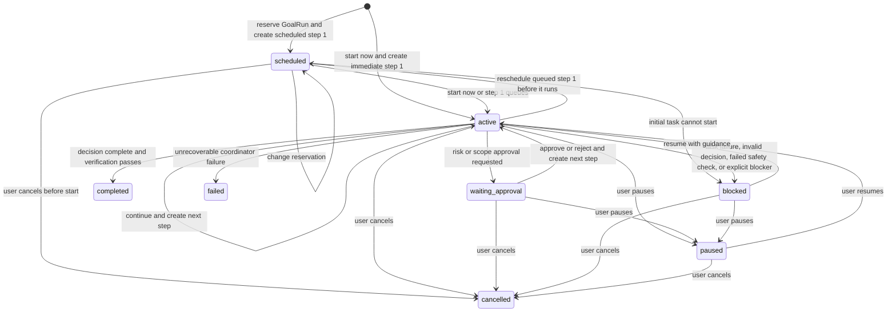
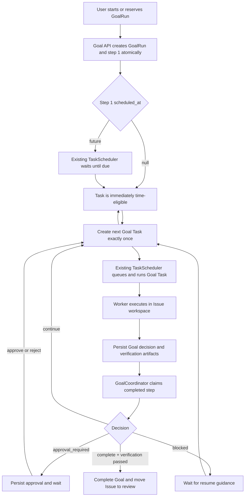

# Serial Goal Mode Design

**Date:** 2026-07-18

**Updated:** 2026-07-19

**Status:** Draft

**Scheduling dependency:** [Issue Task Ordered Turns Design](2026-08-08-issue-task-ordered-turns-design.md)

## Summary

Codify currently uses an Issue as the requirement and delivery boundary, while each Task is one
worker execution. Users can create multiple Tasks under the same Issue, but they must decide when
to add each follow-up Task and what the next prompt should contain.

This design adds an opt-in serial Goal mode. A GoalRun belongs to one Issue and automatically
advances through one Task at a time until it:

- reaches a verifiable stopping condition;
- needs approval for a risky operation;
- needs approval to expand the agreed scope;
- becomes blocked;
- is paused or cancelled by a user; or
- reaches a system safety limit.

Goal mode does not replace Issue or Task:

```text
Issue   = requirement, branch, MR, workspace, and delivery lifecycle
GoalRun = one durable automatic execution loop under an Issue
Task    = one persisted execution step in that loop
```

The first version is strictly serial. It continues to use the existing Issue workspace, Claude
session, branch, MR, Worker affinity, Task scheduler, and Issue execution lock.

A GoalRun may start immediately or at a user-selected future time. Goal start scheduling is a
Goal-level product action, but the first Goal Task carries the actual `scheduled_at` value and is
dispatched by the existing Task scheduler. Goal continuations and CI auto-repair Tasks are created
only when their triggering event occurs, append to the Issue input stream, and are immediately
time-eligible for the same scheduler once they reach the Issue head.

## Context

Codify already provides most of the execution foundation required by a durable Goal loop:

- `Issue` groups Tasks and owns one branch and one MR.
- Every Task belongs to an Issue and represents one worker/CLI execution.
- Tasks under the same Issue reuse the persistent repository workspace.
- Claude session state is persisted at Issue scope.
- Previous Task summaries are included when preparing later Task runtime context.
- The ordered-turn scheduler selects only the earliest active Task for an Issue, while
  `IssueExecutionLock` separately ensures that no two Tasks mutate the Issue workspace at once.
- `Task.scheduled_at` is the existing time-eligibility clock: null means immediately
  time-eligible, while a future value means the Task is reserved for that time. Issue turn order
  remains a separate prerequisite for entering the global queue.
- Scheduled Task creation, slot-capacity enforcement, rescheduling, execute-now, queue analytics,
  and notifications already operate on the Task row.
- CI auto-repair creates a Task only after a qualifying CI event and marks it with
  `trigger_source="ci_auto_repair"`; it does not create a future reservation.
- Task runtime configuration and rendered prompts are persisted as execution-time facts.
- Task token usage is recorded by the existing usage ledger and enforced by existing user quotas.

The missing layer is a durable coordinator that can interpret a completed Goal Task, decide whether
the Goal should continue, create the next Task exactly once, and stop safely when user input is
required.

## Goals

1. Let an Issue operator start a durable GoalRun with an explicit objective, scope, success
   criteria, and verification commands.
2. Automatically create one Goal Task at a time and reuse the Issue workspace, branch, MR, and
   Claude session.
3. Require every successful Goal completion to pass configured verification commands.
4. Persist a structured decision after every Goal Task: `complete`, `continue`, `blocked`, or
   `approval_required`.
5. Support approval only for risky operations and scope expansion.
6. Support pause, resume, and cancel without losing Task history or workspace state.
7. Recover safely after backend, scheduler, worker, or container restarts without creating
   duplicate continuation Tasks.
8. Keep GoalRun status separate from Issue delivery status and Task execution status.
9. Let a user start a GoalRun immediately or reserve its start for a future time by reusing the
   existing Task scheduling infrastructure.
10. Preserve existing manual Issue/Task behavior when Goal mode is not active.

## Non-Goals

- Parallel subgoals.
- Git worktrees or multiple concurrent Tasks under one Issue.
- A generic DAG or dependency scheduler.
- Token budgets, per-Goal monetary budgets, or budget approval.
- Recursive subgoal planning.
- Multiple unfinished GoalRuns under one Issue.
- Recurring Goals or cron-like Goal creation.
- Reserving an entire Goal duration or a separate slot for every continuation step.
- User scheduling of Goal continuation or CI auto-repair Tasks.
- Automatic MR merge, production deployment, or branch deletion.
- Waiting for GitLab CI as a Goal completion condition in the first version.
- Live interception and approval of individual model tool calls.
- Replacing the existing Task retry, CI auto-repair, or manual follow-up flows.
- Allowing the Goal objective or scope snapshot to mutate after the GoalRun starts.

---

## Terminology

### Goal contract

The immutable user-approved contract captured when a GoalRun starts:

- objective;
- allowed scope;
- success criteria;
- constraints;
- verification commands.

### Goal step

One Task created for a GoalRun. Goal steps are numbered from `1` and execute strictly in sequence.

### Goal decision

The structured result produced by a Goal Task and persisted before the container is removed.

### Goal coordinator

A durable backend loop that processes completed Goal Tasks and advances GoalRun state. It is
separate from `TaskScheduler`; it decides whether and when another Goal Task should be created.
The Task scheduler remains the only component that decides when an already-created Task becomes
queued and runs.

### Task trigger

The event or actor that causes a Task row to be created. `trigger_source` records this origin, such
as `manual`, `retry`, `goal_initial`, `goal_continue`, or `ci_auto_repair`. Every created Task is
appended to the Issue's immutable `issue_sequence`; trigger source does not grant insertion or
preemption rights and does not replace `scheduled_at`.

### Execution eligibility

The earliest time an already-created Issue-head Task may enter the queue:

```text
earliest active issue_sequence
+ scheduled_at = null or due
-> eligible for QUEUED
```

Later Issue Tasks remain pending even when their own schedule is due. Immediate execution still
passes through Issue-head ordering, Task priority, global concurrency limits, the scheduler, and
`IssueExecutionLock`.

### Scheduling control

The workflow-level permission to change a Task's execution time. Scheduling control is derived
from Task lineage, step, status, and the caller's authorization; it is not a new Task type and
must not be inferred from `scheduled_at` alone.

### Approval request

A persisted request to approve either:

- `risk_operation`; or
- `scope_expansion`.

Approval is a workflow control, not a replacement for container isolation, project authorization,
or tool-level security.

---

## Product Decisions

### GoalRun is an Issue child, not a new top-level delivery entity

An Issue already owns the repository, branch, MR, Worker affinity, workspace, and execution
history. Creating a separate top-level Goal entity would duplicate those responsibilities.

A GoalRun therefore belongs to one Issue:

```text
Issue 1
├── ordinary Task 1
├── ordinary Task 2
├── GoalRun 1
│   ├── Goal Task step 1
│   ├── Goal Task step 2
│   └── Goal Task step 3
└── GoalRun 2 (allowed only after GoalRun 1 is terminal)
```

Historical GoalRuns remain visible after completion. Only one unfinished GoalRun may exist for an
Issue.

### Goal mode is explicitly started

Creating an Issue does not automatically create a GoalRun. Goal mode is an explicit action on the
Issue detail page.

Starting a GoalRun requires:

- Goal mode is enabled by runtime configuration.
- The Issue is not closed.
- The user can manage the Issue.
- The Issue has no active `pending`, `queued`, or `running` Task.
- The Issue has no unfinished GoalRun.
- The pinned Worker Profile and selected provider are available.
- Objective, scope, success criteria, and at least one verification command are non-empty.
- When a future start is requested, the datetime is valid and the existing Task slot has capacity.

An Issue in either `open` or `in_review` may start a GoalRun. Starting from `in_review` supports a
new automated follow-up loop on the existing branch and MR.

### All Tasks share one scheduler; workflows own scheduling control

> All Tasks are dispatched by the scheduler; not all Tasks are user-schedulable.

Codify must not add a Goal timer or a second queue. Every persisted Task, regardless of origin,
uses the current `TaskScheduler` and the same ordered-turn eligibility rule:

```text
PENDING
+ earliest active issue_sequence
+ (scheduled_at is null or scheduled_at <= now)
-> QUEUED
```

Task creation trigger, execution timing, and user control are separate dimensions:

| Task lineage | Creation trigger | `scheduled_at` | User timing control |
|--------------|------------------|----------------|---------------------|
| Ordinary manual Task | User creates Task | Null or future | Task API/UI |
| Manual retry Task (`trigger_source=retry`) | User requests retry | Null or future | Task API/UI |
| Initial Goal Task | User starts GoalRun | Null or future | GoalRun API/UI only |
| Goal continuation | Prior Goal step decides to continue | Null | None |
| Goal resume/approval continuation | User resolves Goal workflow state | Null | None |
| CI auto-repair Task | Qualifying CI failure event | Null | None |

System-generated Tasks are not pre-created to wait for a workflow event. A Goal continuation does
not exist until the previous Goal decision has been processed, and a CI repair Task does not exist
until the CI failure gate has passed. Once created, both are appended to the Issue input stream.
They become immediately time-eligible because `scheduled_at=null`, but can enter the global queue
only after all earlier active Issue turns are terminal.

Do not persist a `schedule_mode` enum. The API/UI choice `now | scheduled` maps to the existing
nullable `Task.scheduled_at` field. A shared scheduling policy function determines available
actions from Task lineage and status, for example:

```text
get_task_schedule_capabilities(task, goal_run, current_user)
-> can_reschedule
-> can_execute_now
-> mutation_owner: task | goal_run | none
```

Generic Task mutation endpoints reject Goal-owned Tasks and return the owning GoalRun ID. This
prevents a user from rescheduling or executing the first Goal Task without updating GoalRun state.
Goal-specific endpoints reuse the same datetime normalization, slot-capacity, execute-now,
reschedule, notification, and serialization services used by ordinary Tasks. They also reuse the
Issue ordered-turn schedule constraints: a scheduled initial Goal Task or manual retry cannot choose
a time earlier than an active scheduled predecessor, and rescheduling cannot cross an active
scheduled successor. The ordered-turn design remains the authoritative definition of this window.

CI auto-repair Tasks expose no reschedule/execute-now capability. If one fails and a user invokes
the existing manual retry flow, that newly created `trigger_source=retry` Task is user-controlled
and may again choose immediate or scheduled timing.

### A GoalRun can be reserved for a future start

At the product/API boundary, the user schedules the GoalRun. At the execution boundary, the first
Goal Task is the single source of truth for the actual reservation:

```text
GoalRun(status=scheduled)
└── Goal Task step 1(status=pending, scheduled_at=2026-07-19 22:00)
        -> existing TaskScheduler
GoalRun(status=active)
└── Goal Task step 1(status=queued|running)
```

The mutable reservation time is not duplicated on `goal_runs`. Goal responses project
`scheduled_at` from the initial Task. `GoalRun.started_at` records the actual first execution start,
not the requested start.

Before the first Task starts, an operator may:

- move the reservation to another future slot;
- start the Goal immediately; or
- cancel the Goal.

These actions update the first Task and GoalRun atomically. Rescheduling a `queued` but not yet
running initial Task moves it back to `pending`, matching existing Task behavior. Pausing a
scheduled Goal is not offered because reschedule and cancel already express the useful pre-start
controls.

The reservation promises only when the Goal becomes time-eligible to start. It does not reserve
continuous capacity until completion. All continuation Tasks are created with
`scheduled_at=null`, append to the Issue input stream, and compete under normal global priority
and concurrency rules only after reaching the Issue head.

### The Goal contract is immutable

The GoalRun stores a snapshot of the objective, scope, success criteria, constraints, and
verification commands. Later edits to `Issue.title` or `Issue.description` do not change the active
Goal.

Changing the objective or agreed scope requires cancelling the current GoalRun and starting a new
one. Pause/resume guidance may clarify the next step but must not silently replace the Goal
contract.

### Goal-created Tasks are serial execute Tasks

Every Goal step:

- uses `task_mode="execute"`;
- uses `session_mode="continue"` after the first step;
- sets `require_changes=false`, because a valid verification or diagnosis step may complete
  without producing a new diff;
- uses the GoalRun creator as the Task initiator for authorization, attribution, quotas, and
  audit;
- uses the GoalRun priority;
- runs on the Issue-pinned Worker;
- reuses the same Issue branch, MR, workspace, and shared directory.

Only the initial Goal Task may have a non-null `scheduled_at`. Goal continuation, resume, and
approval Tasks are created immediately after their triggering transition with
`scheduled_at=null`.

The first step may start with either `session_mode="continue"` or `session_mode="fresh"`, chosen
when the GoalRun starts. A successful first fresh step updates the Issue session pointer normally;
later steps continue from the resulting session.

### Runtime and provider behavior is pinned for the whole GoalRun

Long-running Goals must not drift because a Worker Profile or default provider changes between
steps.

At Goal start:

- resolve and store the provider ID;
- create the first Task and its `TaskWorkerProfileSnapshot`;
- persist the selected run-instruction template.

Continuation Tasks:

- reuse the pinned provider ID;
- clone the first Goal Task's Worker snapshot into a new per-Task snapshot;
- reuse the first Goal Task's run-instruction template;
- render a new prompt containing the immutable Goal contract and current progress.

The snapshot remains a per-Task execution fact, but all Tasks in one GoalRun are derived from the
same Goal-start runtime snapshot.

### No Goal budget in the first version

The first version does not expose:

- token budget;
- cost budget;
- remaining budget;
- budget increase approval; or
- budget exhaustion status.

Goal Tasks continue to count toward the existing daily/weekly Task and token quotas. Existing
creation-time and pre-execution quota checks remain authoritative.

The system still needs an anti-loop safety limit. Add one global runtime setting:

```text
goal_max_auto_steps = 10
```

This is a platform safety fuse, not a user-allocated budget. Reaching it moves the GoalRun to
`blocked` with `blocked_reason="safety_step_limit_reached"`. It does not create an approval
request.

### Only two approval gates

#### Risky operation

`risk_operation` applies when the Agent determines that completion requires an operation outside
ordinary Codify code-delivery behavior, for example:

- destructive database or data migration;
- deleting branches, tags, environments, or external artifacts;
- changing secrets, access control, authentication, or security policy;
- production deployment;
- merging an MR;
- writing to an external system beyond the integrations already authorized by the Goal contract.

Normal repository edits, tests, commits, pushes, and creation/update of the Issue MR are part of
Codify's existing delivery contract and do not require Goal approval.

#### Scope expansion

`scope_expansion` applies when the Agent believes the Goal cannot be completed without changing
the approved scope. The approval payload must identify:

- the current scope;
- the requested additional scope;
- why the current scope is insufficient;
- the proposed changes;
- expected impact.

#### Approval behavior

The Agent must stop before the proposed operation, leave the workspace in a consistent state, and
write `decision="approval_required"`.

Approving creates the next Goal step with explicit authorization for the proposed operation.
Rejecting also creates the next Goal step, but injects the rejection and requires the Agent to seek
an in-scope/non-risky alternative. If no alternative exists, the next step should return
`blocked`.

An approval applies only to the described action. It does not grant a reusable permission for
later steps.

The first version does not intercept individual shell/tool calls. These approval gates are
therefore application-level workflow controls. Container permissions, credentials, project access,
and future tool hooks remain the hard security boundaries.

### Manual Task mutation is restricted while a GoalRun is unfinished

While a GoalRun is `scheduled`, `active`, `waiting_approval`, `paused`, or `blocked`:

- users cannot create a new ordinary Task under the Issue;
- users cannot retry or reschedule an existing Task under the Issue;
- users cannot edit a pending/queued ordinary Task under the Issue;
- a second GoalRun cannot start.

These operations return HTTP `409` with the unfinished GoalRun ID and status.

Users can still:

- inspect all Tasks and logs;
- reschedule, start now, or cancel a `scheduled` GoalRun through Goal-level actions;
- pause, resume, or cancel the GoalRun after it starts;
- resolve a pending approval.

Generic Task execute-now, reschedule, retry, edit, and cancel endpoints reject Goal-owned Tasks.
Cancelling an active Goal Task is performed through GoalRun cancellation; an internal Worker or
system cancellation instead blocks the Goal with `blocked_reason="current_task_cancelled"` so that
it cannot silently create another step.

### Intermediate Goal steps are not final delivery

Each successful execute Task may commit and push to the shared Issue branch, but the MR remains in
Draft while the GoalRun is unfinished.

Existing finalization behavior must be adjusted:

- do not remove MR Draft status after an intermediate Goal step;
- do not transition the Issue to `in_review` between Goal steps;
- do not emit ordinary final-delivery success notification for every intermediate step;
- remove MR Draft status and emit Goal completion only after the GoalRun reaches `completed`.

Task detail still shows each step as `completed`; Goal completion is a separate lifecycle fact.

---

## GoalRun State Machine

### Status values

| Status | Meaning | Terminal |
|--------|---------|----------|
| `scheduled` | Initial Goal Task is reserved for a future start | No |
| `active` | Goal may run or create the next step | No |
| `waiting_approval` | A risk/scope approval request is pending | No |
| `paused` | User stopped automatic advancement | No |
| `blocked` | External input, failed execution, invalid result, or safety intervention is required | No |
| `completed` | Stopping condition is verified | Yes |
| `failed` | Goal orchestration failed irrecoverably | Yes |
| `cancelled` | User cancelled the GoalRun | Yes |

`blocked` remains resumable. A user must cancel a blocked GoalRun before starting a different Goal.

### Transition diagram



### Pause semantics

Pause prevents future automatic advancement; it does not terminate a running container.

- A `scheduled` Goal is not pausable; it can be rescheduled, started now, or cancelled.
- If the current Task is still active, it finishes normally.
- The coordinator persists its result but creates no continuation while the GoalRun is paused.
- Resume processes the persisted result exactly once and either advances or stops.

Cancel requests cancellation of the current Goal Task, if any, and permanently marks the GoalRun
`cancelled`.

### Blocked semantics

The GoalRun becomes `blocked` when:

- a Goal Task fails or is cancelled;
- a successful Task has a missing or invalid Goal decision;
- the Agent returns `blocked`;
- the system safety step limit is reached;
- existing usage limits prevent execution;
- the coordinator detects inconsistent Goal/Task state;
- verification cannot be executed reliably.

Resuming a blocked GoalRun requires a user guidance message. The guidance is appended to the next
step but cannot alter the immutable objective or scope.

---

## Relationship to Issue Status

GoalRun status must not be stored in `issues.status`.

Existing Issue status remains:

```text
open | in_progress | in_review | closed
```

Required behavior:

| GoalRun state | Issue status behavior |
|---------------|-----------------------|
| `scheduled` with future `pending` step 1 | Preserve the existing `open` or `in_review` status |
| `active` | Move to/remain `in_progress` when the current Task is queued or running |
| `waiting_approval` | remain `in_progress` |
| `paused` | remain `in_progress` |
| `blocked` | remain `in_progress` |
| `completed` | `in_review` after verified execute delivery |
| `failed` or `cancelled` | existing no-active-task rule: `in_review` if an execute Task delivered, otherwise `open` |

`maybe_update_issue_status()` must check for an unfinished GoalRun before transitioning an Issue
after a terminal Task. This prevents a completed intermediate step from moving the Issue to
`in_review`.

Creating a future reservation does not itself mean execution is in progress. The existing
Scheduler moves the Issue to `in_progress` when the initial Task becomes `queued`. Cancelling a
scheduled Goal before its first Task runs leaves the Issue under the existing no-active-task rule,
so an untouched `open` Issue remains `open` and an existing delivered Issue remains `in_review`.

Issue ownership and Issue execution status use different predicates:

- conflict/ownership checks treat future `pending` reservations as active, so another Task or
  GoalRun cannot claim the Issue;
- Issue `in_progress` checks treat a future `pending` reservation as not yet executing;
- `queued` and `running` Tasks are executing and keep the Issue `in_progress`.

Refactor the existing status helper to expose this distinction instead of treating every
`pending` Task identically. Apply the execution-status predicate consistently to ordinary
scheduled Tasks and scheduled Goal starts, preserving the current rule that an Issue becomes
`in_progress` when Scheduler queues the Task.

If a due/execute-now initial Task was already queued and moved the Issue to `in_progress`, then an
operator reschedules it before it starts, the Goal-level reschedule transaction moves the Task
back to `pending`, returns the GoalRun to `scheduled`, and recomputes the Issue with the same
no-active-task rule.

Closing an Issue with an unfinished GoalRun is rejected with HTTP `409`; the GoalRun must be
cancelled first.

---

## Execution Flow

### Starting a GoalRun

```text
POST /api/issues/{issue_id}/goal-runs
-> lock Issue row
-> validate Issue, permissions, active Tasks, and active GoalRuns
-> normalize optional scheduled_datetime and claim/check the existing Task slot
-> resolve provider and Worker Profile
-> create GoalRun as scheduled or active with immutable contract
-> create Task step 1 with scheduled_at=future or null
-> create Task Worker snapshot
-> render and persist Goal prompt
-> set GoalRun.current_task_id and current_step_index=1
-> commit atomically
```

The GoalRun and first Task must be visible together or not at all.

For a scheduled start, `GoalRun.status=scheduled` and the Issue keeps its current non-executing
status. For an immediate start, `GoalRun.status=active`; the existing Scheduler transitions the
Issue to `in_progress` when it queues the first Task.

### Running a Goal step

Every Goal Task follows the existing Task scheduler and Worker lifecycle:

1. Scheduler queues the Task when `scheduled_at` is null or due, then runs it under existing
   priority, concurrency, and Issue-lock rules.
2. Worker reuses the Issue workspace and branch.
3. Worker materializes Goal context under `/tmp/codify-runtime`.
4. The Agent executes the current step.
5. The Agent writes a structured Goal decision.
6. Worker runs the configured verification commands and records their results.
7. Worker commits and pushes ordinary code changes.
8. Backend persists Task results, Goal artifacts, and raw logs.
9. Goal coordinator processes the terminal Task.

### Decision processing

The coordinator accepts a Goal Task only after:

- the Task is terminal;
- raw log finalization is complete, or terminal failure has no container;
- Goal decision artifact processing is finalized;
- no newer Goal Task exists.

Decision rules:

| Task/result | Coordinator behavior |
|-------------|----------------------|
| Task failed/cancelled | Goal becomes `blocked` |
| Decision missing/invalid | Goal becomes `blocked` |
| `continue` | Create the next step if safety checks pass |
| `blocked` | Persist blocker and set Goal `blocked` |
| `approval_required` | Create approval request and set `waiting_approval` |
| `complete` + all verification passed | Set Goal `completed` |
| `complete` + verification failed | Convert to continuation with failed verification evidence |

Verification failure overrides an Agent claim of completion.

### Completion

When a GoalRun completes:

1. Persist final progress summary and completion timestamp.
2. Transition the Issue to `in_review`.
3. Remove MR Draft status using the existing Issue/MR delivery path.
4. Emit Goal completion notification.
5. Leave all Goal Tasks, commits, logs, decisions, and verification artifacts available for audit.

---

## Runtime Artifact Contract

### Goal context

Backend materializes:

```text
/tmp/codify-runtime/goal-context.json
```

Example:

```json
{
  "schema_version": 1,
  "goal_run_id": 42,
  "step_index": 3,
  "objective": "Migrate the authentication client to the new API.",
  "scope": "backend/app/auth and its focused tests only.",
  "success_criteria": [
    "The new client path is used in production code.",
    "Legacy behavior remains covered by regression tests."
  ],
  "constraints": [
    "Do not change external API response shapes."
  ],
  "verification_commands": [
    "backend/.venv/bin/python -m pytest backend/tests/unit/test_auth.py",
    "git diff --check"
  ],
  "previous_progress_summary": "Steps 1-2 migrated token refresh and added compatibility tests.",
  "resume_guidance": null,
  "approval_resolution": null
}
```

The rendered Task prompt includes the same immutable contract plus an instruction to write the Goal
decision artifact. The persisted `rendered_prompt` remains the authoritative input for that Task.

### Goal decision

The Agent writes:

```text
/tmp/codify-runtime/goal-decision.json
```

Schema:

```json
{
  "schema_version": 1,
  "decision": "complete | continue | blocked | approval_required",
  "summary": "What this step changed or verified.",
  "evidence": [
    "Focused backend tests pass."
  ],
  "remaining_work": [
    "Migrate the final compatibility adapter."
  ],
  "next_prompt": "Migrate the compatibility adapter and rerun the focused suite.",
  "blocker": null,
  "user_action_required": null,
  "approval": null
}
```

For `approval_required`, `approval` is:

```json
{
  "kind": "risk_operation | scope_expansion",
  "title": "Short approval title",
  "reason": "Why the action is required",
  "proposed_action": "The exact action to approve",
  "current_scope": "Current approved scope",
  "requested_scope": "Additional scope, for scope expansion",
  "risk_detail": "Risk and reversibility, for risky operations"
}
```

Validation requirements:

- reject unknown decision values;
- require decision-specific fields;
- cap string and list sizes;
- sanitize sensitive values before persistence;
- archive the original JSON with the Task runtime archive;
- persist a normalized copy on the Task for coordinator queries;
- never infer `complete` from prose when the artifact is missing.

### Verification results

Worker writes:

```text
/tmp/codify-runtime/goal-verification.json
```

Example:

```json
{
  "schema_version": 1,
  "commands": [
    {
      "command": "backend/.venv/bin/python -m pytest backend/tests/unit/test_auth.py",
      "exit_code": 0,
      "duration_ms": 12430,
      "output_tail": "18 passed"
    }
  ],
  "all_passed": true
}
```

Rules:

- commands run in `/workspace` after the Agent step and before final Goal decision processing;
- commands execute in the order stored in the Goal contract;
- each command has a timeout;
- output persisted in the JSON is bounded to a sanitized tail;
- command failure does not erase Task changes;
- a `complete` decision is rejected unless every command exits `0`;
- an empty verification command list is invalid when starting a GoalRun.

`goal-decision.json` and `goal-verification.json` are added to the existing runtime archive file
list when present.

---

## Architecture



### Component responsibilities

| Component | Responsibility |
|-----------|----------------|
| Goal API | Start/reserve, reschedule, start now, read, pause, resume, cancel, and resolve approvals |
| Goal creation service | Validate invariants, reuse Task scheduling policy, and create GoalRun/Task/snapshots atomically |
| Shared Task scheduling service | Normalize time, check/claim slots, reschedule, execute now, and derive mutation capabilities |
| TaskScheduler | Enforce Issue turn order, then apply the same eligibility, priority, concurrency, and Issue-lock rules to every Task source |
| Worker runtime | Materialize Goal context and persist decision/verification artifacts |
| GoalCoordinator | Reconcile scheduled-to-active state, process terminal steps, and advance Goal state |
| Task status helper | Distinguish reserved ownership from active execution and preserve intermediate Goal state |
| Notification service | Reuse scheduling context and notify on Goal schedule/action-required/terminal events |
| Frontend | Goal start schedule, status card, approval controls, history labels, and schedule-overview projection |

The GoalCoordinator runs in the scheduler service process but remains a separate module and loop.
It must not add Goal-specific ordering to the Task priority queue. The Scheduler remains
source-agnostic: Goal and CI semantics decide when a Task is created and who may mutate it, not how
the queue executes it.

---

## Data Model

### `goal_runs`

| Column | Type | Description |
|--------|------|-------------|
| `id` | Integer PK | GoalRun ID |
| `issue_id` | Integer FK | Parent Issue, cascade on Issue deletion |
| `status` | String(32) | GoalRun lifecycle status |
| `objective` | Text | Immutable objective snapshot |
| `scope` | Text | Immutable allowed-scope snapshot |
| `success_criteria` | JSON list | Immutable success conditions |
| `constraints` | JSON list | Immutable constraints |
| `verification_commands` | JSON list | Immutable shell verification commands |
| `provider_id` | Integer nullable FK | Provider pinned at Goal start |
| `worker_profile_id` | Integer nullable FK | Worker Profile identity pinned at Goal start |
| `initial_task_id` | Integer nullable FK | First Goal Task |
| `current_task_id` | Integer nullable FK | Current/latest Goal Task |
| `last_processed_task_id` | Integer nullable FK | Idempotency checkpoint |
| `current_step_index` | Integer | Current Goal step |
| `priority` | Integer | Priority used by every Goal Task |
| `initial_session_mode` | String(16) | `continue` or `fresh` for step 1 |
| `progress_summary` | Text nullable | Bounded cumulative progress |
| `last_decision` | String nullable | Last normalized decision |
| `blocked_reason` | String nullable | Stable machine-readable reason |
| `blocked_detail` | Text nullable | User-readable blocker |
| `resume_guidance` | Text nullable | One-shot guidance for next step |
| `initiator_user_id` | Integer nullable FK | Goal creator |
| `initiator_username` | String nullable | Audit/display fallback |
| `started_at` | DateTime nullable | Actual first Task execution start; null while scheduled |
| `completed_at` | DateTime nullable | Terminal completion time |
| `cancelled_at` | DateTime nullable | Cancellation time |
| `created_at` | DateTime | Creation time |
| `updated_at` | DateTime | Last update time |

Partial unique index:

```text
unique(issue_id)
where status in ('scheduled', 'active', 'waiting_approval', 'paused', 'blocked')
```

This is the authoritative one-unfinished-Goal-per-Issue invariant.

### `goal_approval_requests`

| Column | Type | Description |
|--------|------|-------------|
| `id` | Integer PK | Approval request ID |
| `goal_run_id` | Integer FK | Parent GoalRun |
| `task_id` | Integer FK | Goal Task that requested approval |
| `kind` | String(32) | `risk_operation` or `scope_expansion` |
| `status` | String(16) | `pending`, `approved`, `rejected`, or `cancelled` |
| `title` | String(255) | Short title |
| `reason` | Text | Why approval is needed |
| `proposed_action` | Text | Exact proposed action |
| `current_scope` | Text nullable | Current scope |
| `requested_scope` | Text nullable | Requested additional scope |
| `risk_detail` | Text nullable | Risk/reversibility details |
| `resolution_comment` | Text nullable | User response |
| `requested_at` | DateTime | Request time |
| `resolved_at` | DateTime nullable | Resolution time |
| `resolved_by_user_id` | Integer nullable FK | Resolving operator |

Only one `pending` approval may exist for one GoalRun.

### `tasks` additions

| Column | Type | Description |
|--------|------|-------------|
| `goal_run_id` | Integer nullable FK | Owning GoalRun |
| `goal_step_index` | Integer nullable | One-based serial step |
| `goal_outcome` | String nullable | Normalized Goal decision |
| `goal_decision` | JSON nullable | Sanitized normalized decision |
| `goal_verification` | JSON nullable | Sanitized bounded verification result |
| `goal_artifacts_finalized_at` | DateTime nullable | Coordinator readiness marker |

Unique constraint:

```text
unique(goal_run_id, goal_step_index)
```

Multiple ordinary Tasks remain valid because both values are null.

No Goal-specific scheduling column is added to `tasks`, and no mutable reservation time is added
to `goal_runs`. The existing `Task.scheduled_at` remains the only time-eligibility source; the
base `issue_sequence` remains the separate Issue-order prerequisite:

- initial Goal Task: null for immediate start or a future time for reserved start;
- every continuation Task: null;
- CI auto-repair Task: null under the current event-triggered flow.

GoalRun serializers obtain the current reservation from `initial_task.scheduled_at`. This avoids
two mutable timestamps that could disagree after reschedule or execute-now.

Goal Task trigger sources:

```text
goal_initial
goal_continue
goal_resume
goal_approval
```

The trigger source describes why the Task was created; `goal_run_id` and `goal_step_index` provide
the durable lineage.

### Migration

Add one migration after the current Alembic head:

```text
059_serial_goal_mode.py
```

The migration creates Goal tables, Task columns, foreign keys, indexes, and constraints. Existing
Issues and Tasks require no backfill.

---

## Coordinator and Idempotency

### Durable scan

The GoalCoordinator uses two durable claim paths:

1. Scheduling reconciliation selects `scheduled` GoalRuns whose initial Task became `queued`,
   `running`, or terminal.
2. Decision processing selects `active` GoalRuns whose current Task is terminal, whose Goal
   artifacts are finalized (or whose terminal failure has no container), and whose
   `current_task_id != last_processed_task_id`.

Rows are claimed with `SELECT ... FOR UPDATE SKIP LOCKED`.

For a scheduled Goal, the initial Task remains the scheduling authority. The coordinator:

- changes the GoalRun to `active` after the initial Task becomes `queued` or `running`;
- records `started_at` from the initial Task's actual `started_at` when available;
- if a fast initial Task is already terminal with `started_at` set, promotes the Goal to `active`
  and processes that terminal result normally;
- blocks/cancels consistently if the initial Task terminates without ever starting; and
- repairs stale GoalRun projection state after a process restart.

This reconciliation does not decide whether the Task is due; only `TaskScheduler` does that.

### Atomic continuation

For `continue`, one transaction:

1. Revalidates Goal status and current Task.
2. Checks there is no active Task for the Issue.
3. Checks the system step limit.
4. Creates Task at `current_step_index + 1` with `scheduled_at=null`.
5. Clones the pinned Goal runtime snapshot.
6. Renders and stores the continuation prompt.
7. Updates `current_task_id`, `current_step_index`, progress, and `last_processed_task_id`.
8. Commits.

The `(goal_run_id, goal_step_index)` unique constraint is the final duplicate-creation guard.

### Crash cases

| Crash point | Recovery |
|-------------|----------|
| Before terminal Task result commit | Existing Worker/scheduler recovery owns the Task |
| After Task terminal commit, before Goal processing | Coordinator finds the unprocessed Task |
| During Goal processing before commit | Transaction rolls back; coordinator retries |
| After continuation commit | `last_processed_task_id` and unique step constraint prevent duplicate Task |
| After approval request commit | Goal remains `waiting_approval`; no Task is created |
| After approval resolution, before next Task commit | Resolution/continuation transaction rolls back together |
| After scheduled Task becomes queued, before Goal status update | Coordinator observes the Task and changes Goal to `active` |
| After Goal reschedule, before response | Goal/Task scheduling transaction rolls back together |

The coordinator must never depend on an in-memory timer or FastAPI background task for correctness.

---

## API Design

### Start GoalRun

```text
POST /api/issues/{issue_id}/goal-runs
```

Request:

```json
{
  "objective": "Migrate the authentication client to the new API.",
  "scope": "backend/app/auth and focused backend tests.",
  "success_criteria": [
    "Production code uses the new client.",
    "Focused regression tests pass."
  ],
  "constraints": [
    "Do not change external response shapes."
  ],
  "verification_commands": [
    "backend/.venv/bin/python -m pytest backend/tests/unit/test_auth.py",
    "git diff --check"
  ],
  "provider_id": null,
  "priority": 1,
  "session_mode": "continue",
  "scheduled_datetime": "2026-07-19T22:00:00+08:00"
}
```

`scheduled_datetime` is optional. Null/omitted means immediately time-eligible after the Task
reaches the Issue head; a future value uses the same timezone normalization, future-time
validation, advisory slot lock, capacity enforcement, and warning payload as ordinary scheduled
Task creation.

Response includes the GoalRun and first Task summary. GoalRun `scheduled_at` is a response
projection from the first Task, not a `goal_runs` column.

### List Issue GoalRuns

```text
GET /api/issues/{issue_id}/goal-runs
```

Returns active and historical GoalRuns ordered newest first.

### Get GoalRun

```text
GET /api/goal-runs/{goal_run_id}
```

Returns:

- Goal contract;
- status and progress;
- projected scheduled start and actual `started_at`;
- current Task;
- ordered Goal Tasks;
- pending/latest approval;
- latest verification summary;
- available user actions.

### Reschedule reserved Goal

```text
PATCH /api/goal-runs/{goal_run_id}/schedule
```

Request:

```json
{
  "scheduled_datetime": "2026-07-20T09:00:00+08:00"
}
```

Allowed only while the initial Task is `pending` or `queued` and has not started, whether it was
previously scheduled or immediately time-eligible. The operation reuses the current Task reschedule
service, moves a queued initial Task back to `pending`, sets GoalRun status to `scheduled`, and
recomputes Issue status atomically.

### Start reserved Goal now

```text
POST /api/goal-runs/{goal_run_id}/start-now
```

Clears the initial Task's `scheduled_at` and changes the GoalRun to `active` atomically. The Task
does not bypass the Issue turn queue; it becomes immediately time-eligible for the existing
Scheduler once it reaches the Issue head.

### Pause

```text
POST /api/goal-runs/{goal_run_id}/pause
```

Pause does not cancel the current Task.

### Resume

```text
POST /api/goal-runs/{goal_run_id}/resume
```

Request:

```json
{
  "guidance": "Use the existing compatibility adapter; do not add a new dependency."
}
```

Guidance is required when resuming `blocked` and optional when resuming `paused`.

### Cancel

```text
POST /api/goal-runs/{goal_run_id}/cancel
```

Requests cancellation of the current Goal Task and prevents any later continuation.

For a `scheduled` Goal, cancel marks the unstarted initial Task and GoalRun cancelled in one
transaction and does not move the Issue to `in_progress`.

### Resolve approval

```text
POST /api/goal-runs/{goal_run_id}/approvals/{approval_id}/resolve
```

Request:

```json
{
  "decision": "approved | rejected",
  "comment": "Approved only for the described migration."
}
```

Resolution and creation of the next Goal Task occur atomically.

No endpoint allows directly setting arbitrary GoalRun status. Generic
`/tasks/{task_id}/execute`, `/tasks/{task_id}/schedule`, retry, edit, and cancel APIs reject a
Goal-owned Task and return a conflict payload containing `goal_run_id` and the permitted
Goal-level action.

---

## Authorization, Attribution, and Quotas

- Starting/reserving, rescheduling, starting now, pausing, resuming, cancelling, or resolving
  approval requires Issue operator permission.
- Read access follows existing project access.
- Automatically created Tasks use the GoalRun initiator for `initiator_user_id`, GitLab sudo
  attribution, notifications, and usage ledger ownership.
- Existing user Task/token quotas apply when the Goal reservation and first Task are created, at
  continuation creation, and during scheduler pre-execution checks. A future reservation does not
  guarantee that later quota checks will pass.
- If quota enforcement prevents a Goal Task from running, the Goal becomes `blocked` with the
  existing structured usage-limit detail.
- Approval resolution records the acting user even when they differ from the Goal initiator.
- Public Task creation APIs must reject client-supplied `goal_run_id`, step index, Goal outcome, or
  Goal trigger source. Only the Goal creation/coordinator services may set them.

---

## Frontend Design

### Issue detail placement

Add a compact Goal card above `IssueCurrentExecution`.

When no GoalRun is unfinished, the Issue header shows:

```text
Start Goal
```

The start drawer contains:

- objective;
- allowed scope;
- success criteria list;
- constraints list;
- verification command list;
- provider;
- priority;
- continue/fresh session choice;
- start timing: execute now or schedule for a future datetime;
- existing slot-capacity preview/heatmap when scheduled.

Reuse the current Task create-mode schedule cards, datetime semantics, and heatmap rather than
introducing a Goal-specific time picker. The form explains that the reservation covers Goal start
only; continuation Tasks run automatically as soon as their trigger occurs and queue capacity
allows.

### Goal card

Show:

- status;
- current step number;
- compact objective;
- progress summary;
- current Task link and status;
- latest verification result;
- scheduled start while waiting;
- actual started time after execution begins;
- primary action required.

Actions:

| Status | Actions |
|--------|---------|
| `scheduled` | Change time, Start now, Cancel |
| `active` + initial Task not started | Schedule/change time, Cancel |
| `active` + Task running or later step | Pause, Cancel |
| `waiting_approval` | Approve, Reject, Cancel |
| `paused` | Resume, Cancel |
| `blocked` | Resume with guidance, Cancel |
| terminal | View history |

Approval UI shows proposed action, reason, risk/scope detail, and a required confirmation before
approval.

### Manual Task controls

While a GoalRun is unfinished:

- disable the Issue "Create Task" action;
- explain which GoalRun currently owns automatic execution;
- keep Task history and current Task navigation available.

Task detail and Issue execution history show:

```text
Goal #42 · Step 3
```

and map the Goal trigger source to a localized label.

### Schedule overview

The initial scheduled Goal Task remains in the existing global schedule query, statistics,
capacity heatmap, and hourly ordering because it has a normal `Task.scheduled_at`. Render it as:

```text
Goal #42 · Start
Issue #18
2026-07-19 22:00
```

The row may still link to Task detail for logs/metadata, but schedule mutations call GoalRun
reschedule/start-now/cancel APIs. Goal continuation and CI auto-repair Tasks do not appear in the
future schedule because they are event-created with `scheduled_at=null`.

### Copy and density

The Goal card should be operational and compact. Do not duplicate the full Issue description or
full Task logs. Long objective, scope, and approval details use explicit expand/collapse or a detail
drawer.

Add keys to both English and Chinese locale files.

---

## Notifications

Intermediate Goal Task success should not emit the ordinary "delivery complete" notification.

Add Goal-level events:

```text
goal_scheduled
goal_rescheduled
goal_started
goal_waiting_approval
goal_blocked
goal_completed
goal_failed
goal_cancelled
```

Scheduling events reuse the current scheduled-time and schedule-change notification fields but
link to the GoalRun/Issue and use Goal language rather than presenting step 1 as an ordinary
user-managed Task.

`goal_waiting_approval` and `goal_blocked` are action-oriented and include a link to the Issue.
Goal completion includes final step count, verification summary, and MR link when available.

Existing Task failure logs and Task detail remain available even when the user receives only the
Goal-level notification.

---

## Compatibility with Existing Features

### Manual Tasks and retries

Ordinary manual Task creation, scheduling, execute-now, reschedule, and retry continue to use the
generic Task APIs when an Issue has no unfinished GoalRun, but all such Tasks follow the base Issue
ordered-turn contract. Retry creates a new tail Task and does not insert at the source Task's
historical position. System-generated Tasks gain explicit scheduling capabilities, so a queued CI
auto-repair Task can no longer be repurposed into a user reservation through the generic schedule
endpoint. Generic retry is unavailable for a Goal Task; users resume the Goal instead so lineage
and state remain consistent.

Ordinary manual creation and retry continue accepting immediate or scheduled timing. A scheduled
GoalRun immediately owns the Issue, so it conflicts with an existing active scheduled Task on that
Issue and blocks creation of another Task. The API returns `409`; it must not silently convert,
cancel, or absorb an existing reservation.

### CI auto-repair

CI auto-repair does not create a repair Task while a GoalRun is unfinished. It records/ignores the
event using an explicit reason such as:

```text
active_goal_run_exists
```

Goal completion does not wait for GitLab CI in the first version. Existing CI auto-repair may act
after the Goal becomes terminal and the Issue enters review.

When CI auto-repair is allowed to act, it preserves the current event-driven behavior:

- the CI failure gate creates the Task only after the qualifying event;
- `trigger_source="ci_auto_repair"` records why it exists;
- `scheduled_at=null` makes it immediately time-eligible;
- the Task appends to the Issue input stream and reaches Scheduler priority, concurrency, and the
  Issue lock only after earlier active turns are terminal; and
- users cannot reschedule it as if it were a manual reservation.

Goal continuations use the same pattern: the coordinator event creates the next Task with
`scheduled_at=null`, but Goal lineage and Goal-level controls remain distinct from CI lineage.

### Workspace and Claude session

No workspace layout change is required. Goal Tasks reuse:

```text
issue repo   -> /workspace
issue Claude -> /home/codify/.claude
issue shared -> /opt/codify-issue-shared
```

Serial execution preserves the current single Issue session pointer.

### Worker Profile snapshots

Ordinary Tasks continue snapshotting the current Issue Worker Profile at Task creation. Goal
continuations instead clone the snapshot captured by the first Goal Task.

### Issue close and branch cleanup

Issue close is blocked while a GoalRun is unfinished. Cancelling the GoalRun does not automatically
close the Issue or delete its branch.

### Raw logs and archives

Goal artifacts are included in the existing Task runtime archive. Existing raw-log finalization
remains authoritative before the coordinator processes a terminal Task.

---

## Failure Handling

| Failure | Goal behavior |
|---------|---------------|
| Invalid/past scheduled start | Reject Goal creation/reschedule without creating partial state |
| Scheduled slot is full | Reuse existing warning/enforcement behavior; reject atomically when enforced |
| Restart before reserved start | Persisted initial Task remains pending and runs only when due |
| Scheduled Task cannot pass pre-execution quota/runtime checks | `blocked` with existing structured detail |
| Worker/container failure | `blocked`, retain Task error and workspace |
| Task cancelled outside GoalRun cancellation | `blocked`, require explicit resume or cancel |
| Missing Goal decision | `blocked`, do not infer continuation |
| Invalid Goal decision schema | `blocked`, show validation error |
| Verification command timeout | treat command as failed |
| Verification fails after `complete` | create continuation with failure evidence |
| Provider/Worker snapshot unavailable | `failed` before creating next Task |
| Usage limit exceeded | `blocked` with usage detail |
| Step safety limit reached | `blocked` with safety-limit reason |
| Duplicate coordinator processing | unique step constraint prevents duplicate Task |
| Approval rejected | create next step with rejection constraint |
| Notification failure | log and continue; state transition remains authoritative |

Repeated failed verification should not create unbounded Tasks. The system step limit is the final
fuse. A later version may add explicit no-progress detection.

---

## Testing

### Backend model and migration tests

- Alembic upgrade/downgrade succeeds from the current head.
- Existing Issues/Tasks require no backfill.
- Partial unique index prevents two unfinished GoalRuns for one Issue.
- Unique `(goal_run_id, goal_step_index)` prevents duplicate steps.
- Approval kind/status constraints reject unknown values.
- `scheduled` is included in the one-unfinished-Goal partial unique index.
- GoalRun has no duplicated mutable reservation timestamp.

### Goal API tests

- Start validates permissions, Issue status, active Tasks, active GoalRun, provider, Worker, and
  contract fields.
- Immediate start creates an `active` GoalRun and a first Task with `scheduled_at=null`.
- Future start reuses datetime normalization and slot locking, creates a `scheduled` GoalRun and a
  first Task with the requested `scheduled_at`, and preserves the Issue's non-executing status.
- Slot rejection rolls back GoalRun, first Task, snapshot, and prompt together.
- Reschedule updates the initial Task and Goal state atomically and moves a queued Task to pending.
- Rescheduling a queued initial Task recomputes an `in_progress` Issue back to the existing
  no-active-task status.
- Start-now clears `scheduled_at`, marks the Goal active, and does not bypass TaskScheduler.
- Cancelling before start cancels both GoalRun and initial Task without moving the Issue to
  `in_progress`.
- Pause does not cancel a running Task.
- Resume requires guidance for blocked Goals.
- Cancel prevents later continuation and requests current Task cancellation.
- Approval approve/reject creates exactly one next step.
- Manual Task creation/retry/update is rejected while Goal is unfinished.
- Generic Task schedule/execute-now/cancel APIs reject Goal-owned Tasks with GoalRun guidance.
- Schedule capability policy allows manual/retry timing control, rejects CI auto-repair timing
  control, and preserves existing CI cancellation/retry policy.
- Goal metadata cannot be injected through public Task APIs.

### Coordinator tests

- Scheduled Goal becomes active after the initial Task becomes queued/running.
- A fast scheduled initial Task that is terminal before reconciliation is still processed normally
  when `started_at` proves execution occurred.
- Restart repairs stale scheduled/active projection without changing Task due-time semantics.
- `continue` creates the next Task with the next step index.
- Every continuation Task has `scheduled_at=null`.
- Continuation reuses provider, Worker snapshot, template, workspace, branch, and session.
- `complete` requires all verification commands to pass.
- Failed verification overrides `complete` and generates a continuation.
- `blocked` and `approval_required` create no next Task.
- Task failure, cancellation, invalid artifact, usage limit, and safety limit stop the loop.
- Reprocessing the same Task is idempotent.
- Concurrent coordinator instances cannot create duplicate Tasks.
- Crash/restart between Task completion and Goal processing resumes correctly.

### Worker/runtime tests

- Goal context is materialized only for Goal Tasks.
- Decision and verification artifacts are archived and sanitized.
- Verification commands execute in order with timeouts and bounded output.
- Missing/invalid decision is finalized explicitly.
- Intermediate Goal steps keep the MR in Draft.
- Final Goal completion removes Draft status through the existing delivery path.

### Issue status tests

- Ordinary and Goal future reservations block conflicting Issue work without marking the Issue
  `in_progress`.
- Future scheduled Goal preserves an `open` or `in_review` Issue until its Task queues.
- Rescheduling a queued initial Task back to the future removes the transient `in_progress` state.
- Cancelling a scheduled Goal before execution preserves the existing no-active-task status.
- Intermediate Goal Task completion keeps Issue `in_progress`.
- Waiting approval, paused, and blocked Goal remain `in_progress`.
- Completed Goal moves Issue to `in_review`.
- Failed/cancelled Goal falls back to existing delivered/no-delivery behavior.
- Issue close rejects an unfinished Goal.

### Frontend tests

- Goal start form validates objective, scope, criteria, and verification commands.
- Goal start form reuses now/scheduled cards, datetime validation, slot preview, and heatmap.
- Goal card renders every status and primary action.
- Scheduled Goal exposes change-time/start-now/cancel and does not expose pause.
- Schedule overview labels the initial Task as a Goal start and routes mutations to Goal APIs.
- Approval details and approve/reject flows are visible and permission-gated.
- Manual Task creation is disabled with a useful explanation.
- Task history displays Goal and step identity.
- Resume guidance is required for blocked Goals.
- English and Chinese copy stays aligned.

### End-to-end scenarios

1. Start Goal now -> step 1 continues -> step 2 completes -> verification passes -> Issue enters review.
2. Reserve Goal for tonight -> it appears in the existing schedule -> due time queues step 1 ->
   Goal becomes active -> continuations run immediately.
3. Reserve Goal -> change time -> start now -> the first Task runs once and occupies one slot only
   while scheduled.
4. Existing scheduled Task on the Issue -> scheduled Goal start is rejected without mutation.
5. Step requests risky-operation approval -> approve -> next step completes.
6. Step requests scope expansion -> reject -> next step seeks in-scope alternative.
7. Step claims complete -> verification fails -> continuation fixes failure -> verification passes.
8. Scheduler restarts after step completion -> coordinator creates only one continuation.
9. User pauses during a running step -> step finishes -> no continuation until resume.
10. User cancels Goal -> current Task is cancelled -> no later Task is created.

---

## Rollout Plan

1. Add `goal_mode_enabled=false` and `goal_max_auto_steps=10` runtime settings.
2. Extract shared Task scheduling-policy helpers from ordinary create/reschedule/execute-now paths
   without changing current Task behavior.
3. Add migration, models, `scheduled` Goal status, constraints, and serializers.
4. Add immediate/reserved Goal creation and Goal-level reschedule/start-now/cancel APIs behind the
   feature flag.
5. Add Goal prompt/context and decision artifact persistence.
6. Add verification command execution and artifact persistence.
7. Add durable GoalCoordinator, scheduled-state reconciliation, and idempotent immediate
   continuation creation.
8. Integrate Issue status, MR Draft, Task mutation ownership, CI auto-repair, and notification
   gates.
9. Add the compact Issue Goal card, schedule controls, schedule-overview projection, and
   approval/resume flows.
10. Enable internally and exercise due-time restart, reschedule races, cancellation,
    malformed-artifact, and quota failures.
11. Review Goal completion accuracy and operational logs before enabling by default.

No parallel workspace, new timer service, or Goal-specific priority-queue algorithm is included in
this rollout.

---

## Expected Affected Files

Backend:

- `backend/alembic/versions/059_serial_goal_mode.py`
- `backend/app/models.py`
- `backend/app/config.py`
- `backend/app/api/config_runtime.py`
- `backend/app/api/goal_runs.py`
- `backend/app/api/goal_schemas.py`
- `backend/app/api/tasks.py`
- `backend/app/api/task_creation_service.py`
- `backend/app/api/task_action_routes.py`
- `backend/app/api/task_operations.py`
- `backend/app/api/task_update_service.py`
- `backend/app/api/issues.py`
- `backend/app/core/goal_coordinator.py`
- `backend/app/core/goal_creation.py`
- `backend/app/core/goal_prompt.py`
- `backend/app/core/scheduling.py`
- `backend/app/core/slot_capacity.py`
- `backend/app/core/task_helpers.py`
- `backend/app/core/worker_runtime.py`
- `backend/app/core/worker_task_lifecycle.py`
- `backend/app/core/worker_task_artifacts.py`
- `backend/app/scheduler_service.py`
- Goal, scheduler, task, worker, notification, and migration tests

Worker:

- `deploy/worker-entrypoint/runtime.sh`
- `deploy/worker-entrypoint/main.sh`
- a focused Goal artifact/verification helper under `deploy/worker-entrypoint/`
- `backend/tests/unit/test_worker_coverage.py`

Frontend:

- `frontend/src/api/goalRuns.ts`
- `frontend/src/api/tasks.ts`
- `frontend/src/views/IssueView.vue`
- `frontend/src/views/TaskView.vue`
- `frontend/src/views/ScheduleOverview.vue`
- `frontend/src/features/tasks/useTaskScheduleContext.ts`
- focused components under `frontend/src/components/issue-detail/`
- the existing runtime-settings panel for the feature flag and safety fuse
- `frontend/src/components/TaskMetadataPanel.vue`
- `frontend/src/i18n/messages/en.ts`
- `frontend/src/i18n/messages/zh-CN.ts`
- focused Vitest suites

The exact module split may change during implementation, but Goal coordination must remain
separate from the core Task scheduler.

---

## Cost Estimate

Assuming one unfinished serial GoalRun per Issue, no parallelism, no Goal budget, and only the two
approval kinds in this document:

| Area | Estimate |
|------|---------:|
| Data model, migration, API, authorization | 2-3 person-days |
| Shared scheduling policy and Goal reservation controls | 1.5-2.5 person-days |
| Goal coordinator, state machine, and idempotency | 3-4 person-days |
| Prompt, decision artifact, and verification execution | 2-3 person-days |
| Issue status, MR, quota, CI, and notification integration | 1-2 person-days |
| Frontend Goal card, schedule integration, approval, and controls | 2.5-3.5 person-days |
| Recovery, backend/frontend tests, and rollout hardening | 2-3 person-days |
| **Total** | **14-21 person-days** |

The main uncertainty is not Task creation; it is reliable artifact finalization, restart recovery,
preventing existing Issue/MR completion behavior from firing between Goal steps, and keeping
Goal-level schedule actions atomic with the existing Task scheduling row.

---

## Risks and Mitigations

### Risk: Agent incorrectly claims completion

Mitigation: require verification commands and allow verification failure to override
`decision="complete"`.

### Risk: duplicate continuation after restart

Mitigation: row locking, `last_processed_task_id`, one transaction, and a unique Goal step
constraint.

### Risk: Issue or MR appears complete between Goal steps

Mitigation: make Issue status and MR Draft logic explicitly aware of unfinished GoalRuns.

### Risk: approval happens after the risky action

Mitigation: Goal prompt requires the Agent to stop before the action and describes approval as
single-use. Clearly document that v1 is a workflow gate rather than a tool-call security boundary.
Keep true authority constrained by container credentials and project access.

### Risk: Goal runs indefinitely without a budget

Mitigation: existing usage quotas plus the global `goal_max_auto_steps` safety fuse. Do not add
per-Goal budget UI or budget approval.

### Risk: runtime/profile edits change later steps

Mitigation: pin provider, Worker snapshot, and run-instruction template at Goal start, then clone
that snapshot for every continuation.

### Risk: manual Tasks race with Goal advancement

Mitigation: reject manual Task creation/mutation while a GoalRun is unfinished and preserve the
existing Issue execution lock.

### Risk: GoalRun and initial Task show different reservation times

Mitigation: keep the mutable timestamp only in `Task.scheduled_at`; GoalRun APIs and views project
it from the initial Task. Perform Goal-level reschedule/start-now/cancel in one transaction.

### Risk: users interpret reserved start as reserved completion capacity

Mitigation: label the action "Schedule Goal start", state that only the first Task occupies the
selected slot, and explain that continuations remain subject to normal queue priority and
concurrency.

### Risk: system-generated Tasks accidentally become user-schedulable

Mitigation: centralize scheduling capabilities by Task lineage and status. Generic Task mutation
APIs reject Goal-owned Tasks, while Goal continuations and CI auto-repair expose no timing actions.

### Risk: verification commands are expensive or unsafe

Mitigation: only Issue operators can start Goals; commands execute in the same authorized worker
boundary as normal Task commands, with timeouts and bounded persisted output.

---

## Acceptance Criteria

The first serial Goal mode is complete when:

1. An authorized user can start one GoalRun immediately or reserve it for a future time on an
   eligible Issue.
2. Goal contract fields are immutable and every Goal has at least one verification command.
3. A scheduled Goal uses the initial Task's `scheduled_at`, existing slot capacity, schedule
   overview, and TaskScheduler without a second timer or duplicated mutable timestamp.
4. All Goal Tasks execute one at a time in the existing Issue workspace and branch.
5. A `continue` result creates exactly one immediately time-eligible tail Task, including after
   service restart; it runs only after reaching the Issue head.
6. Goal continuation and CI auto-repair Tasks are event-created with `scheduled_at=null` and are
   not user-reschedulable.
7. A Goal cannot complete until every verification command passes.
8. Only risky operations and scope expansion produce approval requests.
9. Approving or rejecting creates one audited continuation with the resolution context.
10. Pause stops future advancement without killing the current step; resume continues safely.
11. Cancel prevents all later continuation and requests cancellation of the current step.
12. Intermediate steps keep the Issue `in_progress` and MR in Draft.
13. Final completion moves the Issue to `in_review` and finalizes MR readiness.
14. Manual Tasks, retries, and CI auto-repair cannot race with an unfinished GoalRun.
15. Existing manual Task and retry workflows without a GoalRun keep their generic APIs but follow
    the Issue ordered-turn contract; retry appends a new tail Task.
16. No parallel subgoal, worktree, DAG, or Goal budget behavior is present.

## Deferred Follow-Ups

- Parallel subgoals using Git worktrees.
- Goal dependency DAGs and integration steps.
- Tool-call interception for hard approval enforcement.
- CI pipeline state as a completion verifier.
- Recurring/cron Goal creation.
- User scheduling or capacity reservation for individual Goal continuation steps.
- Per-Goal token/cost budgets.
- Dynamic scope amendments without starting a new GoalRun.
- No-progress similarity detection beyond the step safety limit.
- Project-level Goal templates and default verification commands.
