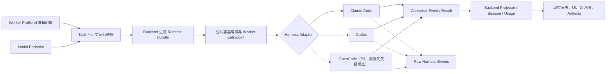

# Codify 多 Harness 引擎可切换架构调研与实施评估

**Date:** 2026-07-31
**Status:** Research complete; implementation pending
**Review:** 2026-07-31，已完成合理性与自洽性审查
**Scope:** Claude Code CLI、Codex CLI；OpenCode 仅作为最低优先级候选 Harness

## 1. 结论

可行，但不是把 `claude` 命令替换为另一个二进制那么简单。

Codify 现有的调度、Docker 隔离、Issue 持久工作区、Git/MR 交付、任务快照、日志存储和运行时制品都可以复用；真正需要重构的是 Worker 内部围绕 Claude Code 建立的执行协议，包括命令构造、事件解析、会话恢复、权限模型、Skills 注入、用量统计、版本检查及若干一次性模型调用。

综合判断：

| 优先级 | 目标 | 可行性 | 预计成本 | 说明 |
|---|---|---:|---:|---|
| P0 | 抽取 Claude Adapter，行为不变 | 高 | 包含在双引擎成本中 | 先建立稳定公共协议并消除后端 Claude 事件耦合 |
| P1 | Claude Code + Codex 概念验证 | 高 | 5–8 人日 | 基本执行、日志和提交，不追求完整能力对齐 |
| P1 | Claude Code + Codex 生产候选 | 高 | 24–36 人日 | 包含协议探针、会话、Skills、权限、事件、测试和 UI/API |
| P2 | 双引擎多 Worker 主机灰度与验收 | 高 | 额外 2–4 人日 | 完整双引擎生产基线合计 26–40 人日 |
| P3，最低 | 在稳定双引擎架构上增加 OpenCode | 中高 | 额外 8–14 人日 | 仅在存在明确业务需求且通过准入门槛后启动 |
| 条件性目标 | 三引擎生产化 | 高 | 34–54 人日 | 不是当前主线交付承诺 |

以一名熟悉当前 Worker 的工程师计算，完整三引擎约 7–11 周；两名工程师并行约 4–7 周。核心事件协议和任务快照设计存在前后依赖，无法完全并行。

推荐路线是先把现有 Claude Code 执行逻辑完整抽成适配器，在行为不变的前提下建立 Codify 自己的稳定协议；然后只接入 Codex，并完成双引擎生产灰度。OpenCode 不进入当前关键路径，只有在双引擎协议已经稳定、存在 Claude/Codex 无法满足的明确需求且投入产出比成立时，才作为最低优先级扩展启动。不要同时实现 Codex 和 OpenCode。

审查后的总体判断是：分层方向合理，但生产成立依赖五个不可省略的约束：Harness 与 Provider 分离、Task Snapshot 不可变、Canonical Event 可幂等回放、session 按兼容域隔离、长期模型密钥不直接暴露给可执行仓库代码的进程。本文后续章节已按这些约束修正。

## 2. 术语与边界

本文区分以下概念：

- **Harness**：负责驱动代码代理完成任务的 CLI 或运行时，例如 Claude Code、Codex、OpenCode。
- **Model Endpoint**：模型服务、认证和协议配置，例如 Anthropic Messages、OpenAI Responses 或兼容服务。
- **Worker Profile**：可编辑的运行配置，描述镜像、资源、环境及允许使用的 Harness。
- **Task Snapshot**：任务创建时冻结的可配置执行事实。重试和恢复必须继续使用该快照。
- **Runtime Bundle Snapshot**：新 Task 创建时物化并绑定的编排脚本、Adapter 和协议文件；后续执行、恢复和重试复用相同内容与校验摘要。迁移前遗留且尚未绑定 Bundle 的 Task 只允许在首次执行时走一次兼容冻结。
- **Canonical Event**：由 Codify 定义的稳定事件，屏蔽不同 Harness 的原始事件格式。
- **Raw Event**：Harness 原始 JSON/JSONL/SSE 事件，仅用于审计、排障和兼容性回放。

关键边界是：**Harness 不等于 Model Provider**。Claude Code 可以使用 Anthropic 或兼容端点；Codex 的自定义 Provider 以 Responses 语义为主；OpenCode 又有自己的 Provider 注册和模型命名方式。把两者绑定为同一个字段会很快产生不可维护的组合分支。

## 3. 当前实现调研

### 3.1 可以直接复用的能力

以下能力与具体 Harness 关系较弱，可继续作为公共控制面：

- Scheduler 的优先级、并发限制、同一 Issue 互斥及崩溃恢复。
- Docker 容器创建、取消、超时、清理和远程 Docker Host 支持。
- Issue 持久工作区和 Git 仓库复用。
- 分支、提交、Push、Merge Request 交付流程。
- Worker Profile 和 Task Worker Profile Snapshot。
- 原始日志、终端归档和任务运行时制品。
- 前端任务状态、日志流和交付结果的大部分展示。

### 3.2 现有 Claude 耦合点

当前没有独立 Harness 接口，Claude Code 同时渗透在镜像、入口脚本、后端事件解析和数据模型中。

| 区域 | 当前行为 | 多 Harness 影响 |
|---|---|---|
| Worker 入口 | `deploy/worker-entrypoint/main.sh` 直接检查 Claude 版本并执行 `CODIFY_CI_CLAUDE` | 入口需要改为选择并调用 Harness Adapter |
| 主执行脚本 | `deploy/ci-claude.sh` 负责参数拼装、`stream-json` 解析、会话、用量和最终结果 | 应先原样迁入 Claude Adapter，再抽取公共协议 |
| 后端投影 | `backend/app/core/worker_event_projector.py` 直接理解 Claude 的 `system`、`assistant`、`user`、`result`、`stream_event` | 后端应只消费 Canonical Event |
| Provider 环境 | `backend/app/core/worker_runtime.py` 把 Provider 映射成 `ANTHROPIC_*`、`CLAUDE_MAX_TURNS` 等变量 | 需要由各 Adapter 生成认证与模型配置 |
| Issue 会话 | `Issue.claude_session_id` | 不能保存多个 Harness 的独立会话 |
| 工作区状态 | Issue 工作区固定使用 `claude` 状态目录并挂载到 `/home/codify/.claude` | 应改成按 Harness 隔离的 agent state |
| Skills | 任务 Skills 只物化到 `.claude/skills`，执行时使用 `--add-dir` | Adapter 应选择 `.claude/skills`、`.agents/skills` 等目标 |
| CodeGraph | 安装目标固定为 `claude` | 初期应作为 Claude-only capability |
| 版本验证 | `verification.sh` 要求 `CODIFY_CLAUDE_BIN` 并检查 Skills 所需 Claude 版本 | 改成每个 Adapter 自己的版本和能力矩阵 |
| 辅助模型调用 | 提交信息、交付摘要、Mermaid 修复直接调用 Claude | 应改为通用 `run_text` 能力或确定性降级 |

仓库中约有 100 个文件包含 Claude 相关引用，其中约一半是测试。数量本身不是主要问题，风险在于当前 Worker、后端投影和会话模型共同依赖 Claude 的事件语义。

当前源码中的 Worker Kit 版本为 0.3.6，Skills 最低要求为 0.3.5。该结论只代表源码状态，不代表所有 Docker Host 已经安装或正在运行同一版本；生产改造必须把 Worker Kit 导出、安装和真实 Host smoke test 作为独立验收层级。

## 4. 三种 Harness 的能力差异

| 能力 | Claude Code CLI | Codex CLI | OpenCode |
|---|---|---|---|
| 非交互执行 | `claude -p` | `codex exec` | `opencode run` |
| 机器可读流 | JSON / `stream-json` | `--json` JSONL | `--format json` |
| 会话恢复 | 支持 session resume | `codex exec resume` | `--continue` / `--session` |
| Provider 配置 | Anthropic 及兼容端点 | OpenAI Responses 及自定义 model provider | Provider 范围最广，模型名通常为 `provider/model` |
| 权限控制 | permission mode / allowed tools | sandbox + approval policy | allow / ask / deny；`--auto` 会自动批准 ask |
| Skills 路径 | `.claude/skills` | `.agents/skills` | 可读取 `.opencode/skills`、`.claude/skills`、`.agents/skills` |
| 原生最大轮数 | 当前实现已使用 | 未发现等价的稳定通用参数 | 不应假设与 Claude 等价 |
| 用量与成本 | 可从结果事件取得较完整数据 | 有 usage 事件，但字段应按实际版本适配 | 需要按版本和 Provider 验证 |
| 主要接入风险 | 当前行为回归 | 容器内 sandbox、Responses Provider、事件版本 | Provider 组合、权限默认值、事件演进速度 |

这三个 CLI 都能满足“非交互执行 + 结构化输出 + 会话恢复”的最低条件，因此架构上可统一；但它们不能共享同一套命令行参数、权限语义或会话 ID。

## 5. 目标架构



职责划分：

- Backend 负责选择和冻结 Harness、校验 Harness 与 Model Endpoint 的兼容性、生成 Runtime Bundle、调度和持久化 Canonical Event。
- Worker Entrypoint 负责通用的仓库准备、信号处理、超时、调用 Adapter、Git/MR 交付和清理。
- Harness Adapter 负责二进制检查、配置生成、命令构造、事件转换、会话恢复、权限策略、Skills 路径和用量归一化。
- 原始 Harness 输出独立归档，不能再直接作为后端和前端的业务协议。

Backend 与 Worker 之间继续采用“生成 Runtime Bundle，由 Docker API 注入容器”的方式，避免依赖 Backend 本机路径。创建新 Task 时把确切版本的编排脚本和 Adapter 实现固化并绑定到 Task；执行、重试和恢复复用该 Bundle。只有迁移前遗留且没有 Bundle 引用的 Task 可以在首次执行时兼容冻结一次。Runtime Bundle manifest 是实际执行的 Adapter 版本、内容 digest、事件 schema 和编排版本的唯一事实源；Worker Kit manifest 只声明 bootstrap、Runtime Bundle 合同和 CLI runtime 的兼容范围，不能覆盖或重新声明另一个“当前 Adapter”。

Harness CLI 和镜像同样属于 Task Snapshot：必须冻结镜像 digest，以及每个 Harness 的二进制来源、容器内路径、已验证版本和内容 digest。CLI 可以来自固定镜像，也可以来自只读 host mount；后一种方式必须在 Profile 验证和每次启动时核对内容 digest，不能只相信路径或版本字符串。这个边界对远程 Docker Host、离线 Worker Kit 和不可变运行快照都很重要。

## 6. Harness Adapter 合同

建议每个 Adapter 实现以下能力；具体可以是 Shell 合同，也可以在 Worker Kit 中使用 Python 实现：

```text
metadata()                   # key、adapter version、CLI 版本范围、capabilities
verify_runtime()             # 二进制、版本、认证和必要目录检查
detect_capabilities(events)  # 优先根据启动事件做运行时能力检测
prepare_config(snapshot)     # 生成 CLI 配置和凭据映射
build_command(request)       # 构造启动或恢复命令
materialize_skills(skills)   # 选择 Harness 所需的 Skills 目录
stream_events(process)       # 原始输出 -> Canonical Event
normalize_result(exit_state) # 最终结果、usage、session、failure
terminate(process_tree)      # SIGTERM/SIGKILL 与子进程清理
run_text(request)?           # 可选的一次性文本生成能力
```

Adapter 必须显式声明 capability，不能靠 Harness 名称在公共逻辑中写分支：

```json
{
  "resume": true,
  "task_skills": true,
  "max_turns": false,
  "usage_tokens": true,
  "usage_cost": false,
  "run_text": true,
  "codegraph": false,
  "sandbox_mode": "container-boundary"
}
```

公共逻辑只依据 capability 决定允许、拒绝或降级。比如 Harness 不支持 `max_turns` 时，仍使用全局 wall-clock timeout 和可选 tool-call ceiling，不能静默把 `max_turns` 当成已生效。版本范围只用于启动前快速拒绝；Harness 能提供启动 capability 时，应优先 feature detection，并忽略未知 capability，而不是把所有行为硬编码到版本号。

无人值守配置必须是 hermetic 的：不读取 Worker Host 上任意用户的全局配置。Claude Adapter 使用官方推荐的 `--bare` 并显式传入所需 settings、权限及经过协议探针验证的 Skills 注入参数；Codex Adapter 使用任务隔离的 `CODEX_HOME`，或在可行时使用 `--ignore-user-config` 加显式配置。

OpenCode 的官方配置模型会合并多个来源，且项目 `opencode.json` 与 `.opencode` 目录会参与加载，普通 `OPENCODE_CONFIG` 不能替换它们。OpenCode Adapter 在进入支持范围前，必须证明能够通过容器级 managed config、禁用开关或受控 wrapper 阻止仓库注入未授权插件、工具和 Provider；如果目标 CLI 版本无法形成这个边界，则不能支持不可信仓库。这是其保持最低优先级的额外原因。

## 7. Canonical Event 与结果协议

### 7.1 事件原则

- `event.jsonl` 只保存 Codify Canonical Event，Backend 和 Frontend 不理解 Harness 原始结构。
- 原始事件另存为 `harness-events/<harness>.jsonl`，用于审计和离线回放。
- 事件协议独立版本化，例如 `codify.worker.event/v1`。
- 不保存模型未明确允许暴露的隐藏推理内容；只保留可展示的 reasoning summary。
- 单个未知原始事件不得立即使任务失败，应被记录为带版本信息的 diagnostic event；但 EOF 前缺少必需的 init/Harness 结束/Task terminal 语义或违反协议不变量时，必须以 `protocol_error` 失败，不能猜测成功。
- 每次执行生成独立 `attempt_id`；`(attempt_id, seq)` 是幂等键，Backend 必须容忍重复投递并检测序号缺口。
- 高频 delta 可以进入有界流式归档，但数据库投影应合并消息增量和工具状态，避免按 token 形成无上限记录。

建议的稳定事件集：

```text
run.started
model.resolved
message.delta
message.completed
reasoning_summary.delta
reasoning_summary.completed
tool.started
tool.completed
context.compacted
provider.retry
usage.updated
usage.final
harness.completed
harness.failed
delivery.started
delivery.completed
delivery.failed
worker.finalization
run.completed
run.failed
```

`harness.completed`/`harness.failed` 只描述代理 CLI 本身，是非 terminal 事件；成功的 Harness 后面仍可能发生 commit、Push 或 MR 失败。公共交付层随后输出 `delivery.*`，清理和最终退出信息写入 `worker.finalization`，最后才由公共 runner 输出唯一的 Task terminal：`run.completed` 或 `run.failed`。terminal 必须是该 attempt 的最后一个事件，之后禁止再追加 canonical event；进程或节点在 terminal 前异常退出时，Backend 以缺 terminal 的 `protocol_error` 收敛，不能把 Harness 成功误判为 Task 成功。

统一事件外壳：

```json
{
  "schema": "codify.worker.event/v1",
  "event_id": "01K1...",
  "attempt_id": "task-123-attempt-2",
  "seq": 42,
  "occurred_at": "2026-07-31T10:00:00Z",
  "type": "tool.completed",
  "task_id": 123,
  "harness": {
    "key": "codex",
    "adapter_version": "1.0.0",
    "cli_version": "x.y.z"
  },
  "payload": {},
  "raw_ref": {
    "stream": "harness-events/codex.jsonl",
    "line": 87
  }
}
```

`event_id` 用于跨归档和排障引用，`(attempt_id, seq)` 用于投影去重与有序处理。重试必须创建新的 `attempt_id`，不能把新事件追加到旧执行轮次的序列中。最终状态通过唯一约束或等价机制保证每个 attempt 只接受一个 Task terminal result；`harness.*` 和 `delivery.*` 不计入 terminal 唯一性约束。

### 7.2 统一结果

最终结果至少包含：

```json
{
  "status": "completed",
  "success": true,
  "result": "任务摘要",
  "harness_key": "codex",
  "adapter_version": "1.0.0",
  "cli_version": "x.y.z",
  "session_id": "engine-specific-session-id",
  "model": "resolved-model-name",
  "usage": {
    "input_tokens": 0,
    "cached_input_tokens": 0,
    "output_tokens": 0,
    "reasoning_tokens": 0,
    "cost": null,
    "currency": null,
    "engine_fields": {}
  },
  "failure": null,
  "capability_warnings": []
}
```

Token 字段可以归一化，成本不保证所有 Harness 和 Provider 都能提供；缺失时必须为 `null`，不能用零冒充。原始的 Provider 特有统计放在 `engine_fields`，避免丢失审计信息。

## 8. 数据模型建议

以下是逻辑模型，具体迁移可在实现阶段结合现有 `AIProvider` 和 `TaskWorkerProfileSnapshot` 做最小变更。

### 8.1 Harness Definition

Harness Definition 来自 Worker Kit 内置 Adapter manifest，不建议把任意执行命令开放给普通用户编辑：

```text
key                 claude | codex | opencode
adapter_version     Codify Adapter 版本
cli_version_range   已测试的 CLI 版本范围
event_schema        输出的 Canonical Event 版本
capabilities        能力声明
provider_protocols  支持的 Model Endpoint 协议
```

Worker Profile 只配置允许启用的 Harness、每个 Harness 的受控 CLI runtime 描述及可收紧的限制。CLI runtime 描述至少包括 `source=image|host_mount`、容器内 executable path、已验证 CLI version 和 binary digest；不允许录入任意启动命令。Worker 实际启动时应同时验证 Task Snapshot、Runtime Bundle manifest 和 Kit compatibility manifest。

### 8.2 Model Endpoint

现有 `AIProvider` 实际上更接近 Anthropic Endpoint。推荐逐步演进为 Harness 无关的 Model Endpoint，并区分 Provider 身份与网络协议：

```text
provider_kind
wire_protocol = anthropic_messages
              | openai_responses
              | openai_chat_completions
              | null
provider_driver
base_url
credential_ref
model
provider_options
```

`provider_kind` 描述 OpenAI、Anthropic、Bedrock、Vertex 或兼容网关等 Provider；`wire_protocol` 描述可明确识别的请求语义。由 SDK 或云认证链处理、没有统一 HTTP 语义时，`wire_protocol` 为 `null`，并由明确的 `provider_driver` 描述实现。OpenCode 自己的 Provider catalog 或 SDK package 属于 Adapter 配置，不是新的 wire protocol。

第一阶段可以保留表名和 API 名以降低迁移成本，但不应新增 `harness_type` 把 Provider 永久绑定到单一 Harness。任务创建和启动时根据 Runtime Bundle manifest 校验 `provider_kind + wire_protocol` 兼容性。OpenCode 即使后续接入，也只支持显式验证过的 Provider 子集，不承诺直接透传其完整 Provider 目录。

`credential_ref` 必须引用独立、持久的凭据记录或 Broker secret，而不是依赖可被物理删除的 `AIProvider` 行。删除 Endpoint 不得级联删除仍被 Task Snapshot 引用的 credential。`retired` 只禁止新 Endpoint/Task 选择，保留既有 Snapshot 的 retry 解析；安全事件可将其标记为 `revoked`，此时既有 retry 必须 fail closed 并记录显式安全失败。只有不存在任何可重试 Snapshot 引用且满足保留策略后才能硬删除。凭据轮换可以在同一 ref 下生成新版本，但每次解析必须把实际凭据版本元数据写入审计记录。

### 8.3 Task Snapshot

Task 必须冻结以下执行事实：

```text
harness_key
harness_adapter_version
harness_adapter_digest
harness_config_snapshot
model_endpoint_snapshot       # 只含非敏感配置
credential_ref                # 引用，不保存密钥值
worker_profile_snapshot
worker_kit_version
image_digest
cli_source                    # image | host_mount
cli_executable_path
cli_version
cli_binary_digest
runtime_contract_version
orchestration_version
runtime_bundle_digest
```

Worker Profile 是可编辑配置，Task Snapshot 才是执行真相。Snapshot 在创建 Task 的事务中一次性写入并立即冻结，不引入 active revision 或原地编辑；要改变 Harness、Endpoint、CLI 或其他执行配置必须从 Issue 创建新 Task。重试、恢复和继续执行必须使用原任务快照；修改 Profile、Provider 默认值或 Worker Kit 默认 Harness 不得改变既有任务。

Task Snapshot 不得复制 API Key、OAuth token 或云凭据明文。它冻结非敏感 Endpoint 配置和 `credential_ref`；执行时解析该引用的当前有效凭据。密钥轮换是允许影响重试的安全例外，应记录凭据版本元数据用于审计，但不保留历史密钥值。

### 8.4 Issue 会话

不同 Harness 的 session ID 不可互相转换。`Issue.claude_session_id` 应演进为按 Harness 隔离的会话状态，例如：

```text
issue_harness_sessions
  issue_id
  harness_key
  session_namespace
  session_id
  model_endpoint_fingerprint
  state_version
  updated_at
  metadata
```

同一 Issue 从 Claude 切到 Codex 时，创建或恢复 Codex 自己的会话；以后切回 Claude 时仍可恢复原 Claude 会话。禁止把一个 Harness 的 session ID 传给另一个 Harness。

只用 `issue_id + harness_key` 仍然不够：同一 Harness 更换不兼容的 Provider、认证域、工作区身份或重大 Adapter 状态版本时，也可能无法安全恢复。Adapter 应生成 `session_namespace`，并以 `issue_id + harness_key + session_namespace` 查找会话；不兼容时显式开始新 lineage，而不是试错恢复后静默降级。

Issue 工作区状态也应从固定 `issue_root/claude` 迁移为：

```text
issue_root/agent-state/claude
issue_root/agent-state/codex
issue_root/agent-state/opencode
```

仓库工作区仍由同一 Issue 共享，代理状态目录按 Harness 隔离。

## 9. 选择、切换与重试语义

建议产品规则如下：

1. Worker Profile 声明支持哪些 Harness，并可设置默认 Harness。
2. 创建新 Task 时，用户可以在该 Profile 支持且与 Model Endpoint 兼容的范围内选择 Harness。
3. Harness、Adapter、CLI runtime 和 Model Endpoint 在 Task 创建事务中写入 Task Snapshot 并立即冻结。
4. 已创建 Task 不允许原地切换 Harness 或改写其他执行事实；重试继续使用原快照。
5. 如需更换 Harness，应从 Issue 创建一个新 Task。
6. 新 Task 可复用同一 Git 工作区，但只恢复目标 Harness、当前 `session_namespace` 下的 Issue session。
7. 若目标 Worker Host 不具备快照要求的 Adapter/CLI 版本，任务在启动前失败，不能自动换用其他 Harness。

当前 Issue 对 Worker Profile 有亲和性约束。仅通过“每个 Profile 固定一种 Harness”可以快速做出 MVP，但无法提供同一 Issue、同一 Worker Profile 下真正的逐 Task 切换。因此生产方案仍需把 Harness 作为 Task 级选择，并由 Worker Profile 提供支持范围。

## 10. Skills、辅助调用和 CodeGraph

### 10.1 Skills

继续使用已有的不可变 SkillVersion 和 Task Skill 快照，Adapter 只负责将同一份中立包物化到 Harness 需要的位置：

- Claude Code：任务隔离目录下的 `.claude/skills`。
- Codex：任务隔离目录下的 `.agents/skills`。
- OpenCode：优先采用 `.agents/skills` 或 `.opencode/skills`，由版本兼容测试决定。

Skills 不应写入 Git 仓库工作区，否则会污染 `git status` 和最终提交；继续放在密封的任务运行时目录并以只读方式注入。

### 10.2 提交信息、交付摘要和 Mermaid 修复

当前入口和交付脚本包含直接 Claude 调用。建议分两类处理：

- 提交信息优先使用确定性模板降级，例如 `codify: complete task <id>`；有 `run_text` capability 时再生成更友好的文本。
- 交付摘要和 Mermaid 修复走 Adapter 的可选 `run_text`，若不支持则保留原始结果或跳过修复，并输出 capability warning。

公共交付逻辑不得再执行固定的 `claude -p`。

### 10.3 CodeGraph

第一阶段明确标记为 Claude-only capability。Codex/OpenCode 任务选择不启用 CodeGraph，UI 和日志给出明确提示。等目标工具有稳定、可测试的集成方式后再单独扩展，不为表面功能对齐增加隐式 fallback。

## 11. 安全与无人值守策略

- Docker 容器继续作为最外层强隔离边界，限制挂载、网络、用户、资源和敏感环境变量。
- 无人值守任务不能卡在交互批准。Adapter 必须生成显式、可审计的预批准策略；遇到策略外操作时 fail closed。
- Codex 默认使用显式的最小 sandbox 权限。容器内启用自身 Linux sandbox 时，要验证 `bwrap`、seccomp 和容器权限是否兼容。只有在仓库可信、容器已硬化且网络出口受控时，才能把容器作为最终边界并在容器内显式使用 `danger-full-access`；该选择必须进入 Profile Snapshot 和审计日志，不能静默降级。
- OpenCode 默认权限较宽，不能只传 `--auto`。必须生成明确的 allow/deny 规则，特别限制外部目录、危险 shell、网络和密钥访问。
- 长期 Provider 密钥继续以加密配置保存，但不应作为容器级环境变量暴露给会执行仓库代码的 Harness。生产优先使用模型出口代理或凭据 Broker，让 Worker 只持有短期、任务级、最小权限 token；长期密钥留在受信边界之外。
- 如果 MVP 暂时沿用容器内密钥，必须把它标记为显式风险接受：使用独立低权限凭据、限制模型和额度、缩短有效期、限制网络出口，并确保日志清洗覆盖 OpenAI、Anthropic 和自定义 Provider 的 token 形态。该过渡方案不能作为公网或不可信仓库的默认配置。
- Raw Event 可能包含命令参数、路径或模型输出，归档前同样经过敏感信息清洗，并受运行时制品权限与保留策略约束。

## 12. 版本、兼容和发布策略

- Runtime Bundle manifest 固定实际执行的 Adapter 版本、内容 digest、事件 schema 和 capability；Worker Kit manifest 只固定受支持的 Runtime Bundle 合同/schema 范围、bootstrap 版本和 CLI runtime 约束。
- Task 创建时固化 Adapter/编排 Bundle，执行和重试复用同一份内容；Task Snapshot 冻结镜像 digest 和 CLI source/path/version/binary digest，两者共同组成可重现运行时。
- 镜像不能只冻结可变 tag；Task Snapshot 应保存解析后的 image digest 或等价不可变标识。Worker 启动时核对实际 CLI 版本和 binary digest，任一不匹配都在启动前失败。
- 不直接支持不可控的 `latest`；镜像和离线包固定 CLI 版本。
- 能力判断优先使用 Harness 启动事件或探针，版本范围作为兼容下限和回归矩阵，不替代 feature detection。
- 为每个 Harness 保存 golden JSONL fixture，并以回放方式测试解析器。
- CLI 升级先经过 fixture 更新、镜像 smoke、真实 Provider smoke，再进入 Worker Host 灰度。
- 新 Worker Kit 先部署到独立 Worker Profile 或 canary Host；通过“创建时选择该 Profile 的新 Issue”形成 canary cohort，确认其新 Task 成功后再扩大新 Issue 分配范围。
- 保留旧 Kit、Runtime Bundle 和 Adapter 制品，以便把后续新 Issue 的 Profile 分配恢复到旧版本；已经创建的 Task 不做版本热切换。

## 13. 分阶段实施方案

### Phase 0：Claude/Codex 协议探针与样本采集（2–3 人日，计入双引擎总成本）

先对 Claude Code 和 Codex 采集以下真实输出：

- 普通成功、无文件变更。
- 工具调用成功和失败。
- 新会话、正常恢复、无效 session 恢复。
- Provider 认证失败、限流、网络中断。
- timeout、SIGTERM、SIGKILL 和容器取消。
- 上下文压缩或续写。
- usage、cost、模型解析结果。

产出 Adapter 合同 v1、Canonical Event v1 和 golden fixtures。该 2–3 人日已包含在 14.1 的“Harness 合同、Canonical Event、Claude 回归”工作项中，不与 24–36 人日重复相加。OpenCode 样本留到最低优先级阶段再采集，避免当前主线为候选引擎承担前置成本。

### Phase 1：抽取 Claude Adapter，保持行为不变（Phase 0 后增量 4–6 人日）

- 把 `ci-claude.sh` 的 Claude 特有命令、事件和会话逻辑迁入 Adapter。
- Worker Entrypoint 改为公共入口。
- 后端 Projector 只读取 Canonical Event。
- 保留原始 Claude Event 归档。
- 现有 Claude 测试和部署行为必须无回归。

这是整个项目风险最高、也最有价值的一步。完成后即使暂不增加新 Harness，Worker 协议也会更稳定、可回放和可测试。

### Phase 2：接入 Codex（18–27 人日，含公共产品改造）

- 数据模型迁移、API 和前端选择器。
- Codex Adapter、Responses Provider、认证配置和会话恢复。
- 容器 sandbox / approval policy 验证。
- Skills 物化、辅助调用降级和 usage 归一化。
- Worker Kit、离线包、远程 Docker Host 及端到端测试。

完成后形成具备完整功能和自动化验证的 Claude + Codex 生产候选；只有通过 Phase 3 的真实 Host 灰度与验收后，才称为生产基线。

### Phase 3：Claude + Codex 多 Host 灰度和生产验收（2–4 人日）

- 为每个目标 Docker Host 导出并安装固定 Worker Kit。
- 验证镜像、Adapter、CLI、CA、PATH、Provider 网络和持久工作区。
- 只把新创建的内部可信 Issue 分配到 canary Profile，按新 Issue cohort 小流量灰度；现有 Issue 不迁移 Profile。
- 观测成功率、平均耗时、取消成功率和解析错误；回滚时恢复新 Issue 的旧 Profile 分配规则，既有 canary Issue 通过关联 replacement Issue 继续，不改写原 Profile。

Phase 3 完成后，Claude + Codex 已经独立构成完整交付。OpenCode 不阻塞双引擎上线。

### Phase 4：OpenCode 候选接入（最低优先级，8–14 人日）

只有同时满足以下准入条件时才进入 Phase 4：

1. Claude + Codex 已完成真实 Host 灰度，并至少经过一个稳定 Worker Kit 发布周期。
2. Backend Projector、Task API 和 Frontend 不再包含按 Claude/Codex 原始事件分支。
3. Canonical Event v1 的恢复、取消、限流、usage、Harness 结束和 Task terminal result 均有回放与真实运行证据。
4. 没有未解决的 P0/P1 双引擎运行缺陷。
5. 存在明确业务需求，例如必须支持双引擎无法覆盖的本地模型或特定 Provider，而不是只为数量对齐。
6. 已验证项目级 OpenCode 配置、插件和自定义工具不能绕过 Codify 生成的权限与 Provider allowlist。

进入后再执行：

- 采集 OpenCode golden fixtures，并确认 CLI JSON event 的版本兼容策略。
- OpenCode Adapter 和 Provider 配置映射。
- 显式权限策略和 `--auto` 行为验证。
- session、事件、usage、Skills 和取消语义适配。
- 使用 OpenCode 验证公共层中是否残留 Claude/Codex 分支。
- 只对 allowlist 内的 Provider 做真实 Host smoke 和 canary，不承诺完整 Provider catalog。

## 14. 成本拆分

### 14.1 Claude + Codex 生产候选研发

| 工作项 | 人日 |
|---|---:|
| 数据模型、迁移、API、前端选择 | 4–6 |
| Harness 合同、Canonical Event、Claude 回归 | 6–9 |
| Codex 认证、Provider、session、sandbox | 5–7 |
| Skills、辅助调用、状态目录、能力降级 | 4–6 |
| Worker Kit、mock、单测、集成和远程运行 smoke | 5–8 |
| **合计** | **24–36** |

上述 24–36 人日包含 Phase 0 和 Phase 1，不包含双引擎多 Host 灰度的额外 2–4 人日。完整双引擎生产基线因此为 26–40 人日。

### 14.2 OpenCode 增量

OpenCode 是最低优先级、条件性投入，不进入 Claude + Codex 的主线预算。

| 工作项 | 人日 |
|---|---:|
| Adapter、命令和事件映射 | 3–5 |
| Provider、权限、session、usage | 2–4 |
| fixture、集成测试、Kit 和真实运行 smoke | 3–5 |
| **合计** | **8–14** |

估算假设：

- 保留远程 Docker、mounted Worker Kit、离线分发和 Issue 持久工作区。
- 支持 Task 级选择、不可变重试、按 session namespace 隔离的 Issue session。
- 保留结构化实时日志、任务 Skills 和当前 Git/MR 交付能力。
- 不要求三个 Harness 的所有专有功能完全对齐，而是明确 capability 和降级行为。

成本估算默认已有可复用的模型网关或可接受受限凭据的过渡风险。如果需要从零建设生产级凭据 Broker/模型出口代理，预计再增加 4–7 人日；该成本属于安全基础设施，不应隐藏在 Adapter 开发估算中。

如果只做“不同 Worker Profile 写死不同 CLI、只展示纯文本日志、无 session/Skills/usage”的演示版，可压缩到 5–8 人日；该方案不适合作为生产架构继续扩展。

## 15. 主要风险与缓解

| 风险 | 影响 | 缓解措施 |
|---|---|---|
| CLI 原始事件格式升级 | 日志丢失或任务误判 | 固定版本、golden fixture、未知事件容错、Raw Event 回放 |
| 将 Provider 与 Harness 混为一体 | 配置组合爆炸、无法复用 | 独立 Model Endpoint 协议和 Harness capability |
| 重试事件重复或乱序 | 最终状态和用量重复计算 | `attempt_id + seq` 幂等投影，检测缺口，Task terminal result 唯一且最后出现 |
| Harness 成功但 Git/MR 交付失败 | 事件显示成功而 Task 实际失败 | `harness.*` 与最终 `run.*` 分离，delivery/finalization 后才输出 Task terminal |
| session 跨兼容域误用 | 恢复失败或上下文串线 | `issue_id + harness_key + session_namespace` 隔离，禁止 ID 转换 |
| Codex 容器内 sandbox 不兼容 | 任务启动失败或安全降级 | 在真实 Worker 镜像测试，显式记录最终安全边界 |
| 长期密钥暴露给仓库命令 | 供应链脚本或恶意代码窃取凭据 | 优先代理/短期 token；过渡期使用低权限凭据和受控出口 |
| 删除 Provider 导致旧 Task 无法重试 | 不可变 Snapshot 引用失效 | credential 独立持久化、soft-retire、Snapshot 引用保护和轮换版本审计 |
| OpenCode 权限默认过宽 | 无人值守任务越权 | 生成显式 deny/allow，不把 `--auto` 当安全策略 |
| Skills 写入仓库 | 污染提交和工作区 | 密封 runtime 目录、只读挂载、Adapter 物化 |
| 辅助调用仍硬编码 Claude | 新 Harness 交付阶段失败 | 通用 `run_text` capability + 确定性 fallback |
| 远程 Docker 路径假设 | 本机通过、远程 Host 失败 | Runtime Bundle 注入，不依赖 Backend 本地 bind path |
| “源码已支持”被误当成“生产已部署” | 上线后版本不一致 | 将源码测试、Kit 安装、真实 Host smoke 分层验收 |

## 16. 测试与验收标准

### 16.1 自动化测试

- 每个 Adapter 的命令构造、版本判断、Provider 映射和 capability 测试。
- 已进入当前阶段的 Harness golden event parser 回放测试；OpenCode fixture 不阻塞双引擎交付。
- Canonical Event schema、重复投递、乱序、序号缺口、Task terminal 唯一且最后出现，以及 Harness 成功但 delivery 失败测试。
- 新任务、resume、无效 session、切换 Harness、session namespace 变化、重试冻结快照测试。
- timeout、取消、SIGTERM、子进程清理和容器崩溃恢复测试。
- Skills 路径、只读注入及 Git 工作区无污染测试。
- credential ref 解析、短期 token/代理边界、删除 Provider 后 retry、referenced credential 删除保护、Provider secret 清洗、Raw Event 权限和归档保留测试。
- API 权限、Profile/Harness/Provider 兼容性和前端选择器测试。

### 16.2 生产前验收

每个已进入生产支持范围的 Harness 至少在一个真实目标 Docker Host 上完成；OpenCode 未通过 Phase 4 准入前不属于此范围：

1. 新 Issue 的首个 Task 成功创建分支、修改、提交、Push 并创建或更新 MR。
2. 同一 Issue 的后续 Task 能恢复该 Harness、同一 session namespace 下的 session；不兼容 namespace 会显式新建 lineage。
3. 从 Claude 切到 Codex 后不会复用 Claude session；切回 Claude 可以恢复原会话。
4. Task 重试仍使用原 Harness、Runtime Bundle Adapter digest、CLI binary digest、Provider credential ref 和 Worker Profile Snapshot。
5. 日志实时可见，最终状态、用量和失败原因正确；Raw Event 可用于回放。
6. 取消和超时能终止完整进程树，工作区锁和容器均被清理。
7. 任务 Skills 可发现，且不会出现在 Git diff 中。
8. 离线 Worker Kit 可导出、安装、验证并回滚。

只有源码和单元测试通过不等于完成生产验收；Worker Kit 安装和真实 Host 运行必须单独记录证据。

## 17. 推荐决策

建议直接采纳以下默认决策，减少实现阶段反复讨论：

1. 名称统一使用 **Harness**，不把 CLI 称为 AI Provider。
2. Harness 是 Task 级选择，Worker Profile 只限定允许范围和默认值。
3. Profile 可编辑，Task 创建时一次性冻结 Snapshot 和 Runtime Bundle；Pending/Queued Task 也不原地改写执行事实。
4. 重试不切换 Harness；切换通过创建新 Task 完成。
5. Issue session 按 Harness 和 session namespace 隔离，agent state 按 Harness 隔离。
6. Backend/Frontend 只消费可幂等回放的 Canonical Event，Raw Event 独立归档。
7. 全局安全上限由系统控制，Profile 只能收紧，不能放宽。
8. CodeGraph 首期保持 Claude-only；缺失能力显式提示，不伪装成功。
9. 先完成 Claude Adapter 无回归重构，再接 Codex 并完成生产灰度；OpenCode 是最低优先级且不在当前关键路径。
10. 长期 Provider 密钥不进入不可信仓库代码可继承的进程环境；优先代理或任务级短期凭据。
11. Runtime Bundle manifest 是实际 Adapter 的唯一事实源；固定并验证 CLI source/path/version/binary digest、镜像 digest 和 Kit compatibility，不支持未验证的 `latest`，同时优先运行时 capability 检测。

## 18. 自洽性审查记录

本轮 review 发现并处理了以下问题：

| 优先级 | 原方案问题 | 修正结果 |
|---|---|---|
| P1 | 文本要求先稳定双引擎，但阶段顺序把 OpenCode 放在双引擎生产灰度之前 | 先完成 Claude + Codex 灰度；OpenCode 改为带准入门槛的最低优先级 Phase 4 |
| P1 | `opencode_provider` 被当成 wire protocol，与 Harness/Provider 分离原则冲突 | 拆为 `provider_kind`、可空 `wire_protocol` 和 `provider_driver` |
| P1 | Canonical Event 只有 `seq`，无法区分重试并防止重复投影 | 增加 `event_id`、`attempt_id`、幂等键、序号缺口和唯一 Task terminal result 约束 |
| P1 | 长期模型密钥默认进入会执行仓库命令的容器环境 | 改为优先模型代理/凭据 Broker/短期 token，并把旧方式标为受限过渡风险 |
| P1 | OpenCode 自定义配置被假设为可以覆盖所有项目配置 | 根据官方合并与优先级规则，将项目插件/工具隔离设为准入阻断项 |
| P2 | Issue session 只按 Harness 隔离，未覆盖同 Harness 更换不兼容 Endpoint | 增加 Adapter 生成的 `session_namespace` 和显式 session lineage |
| P2 | Phase 0、Phase 1 与 24–36 人日总成本存在重复计算歧义 | 明确 Phase 0 + Phase 1 合计对应成本表中的 6–9 人日 |
| P2 | “生产可用”成本未包含真实 Host 灰度，交付口径偏宽 | 24–36 人日改称生产候选；完整双引擎生产基线为 26–40 人日 |
| P2 | 只写“冻结镜像版本”仍可能引用可变 tag | 要求保存 image digest，并在启动时同时校验 CLI version 和 binary digest |
| P2 | reasoning event 名称可能暗示持久化隐藏推理 | 只保留 `reasoning_summary.*`，不保存隐藏推理内容 |
| P1 | Harness terminal 早于 Git/MR 交付，成功事件可能与最终 Task 失败冲突 | 增加非 terminal `harness.*`/`delivery.*`，`worker.finalization` 后才输出唯一 Task terminal |
| P1 | 灰度计划按 Task 切换 Profile，与 Issue Profile 亲和性冲突 | 灰度单位改为新 Issue cohort；回滚恢复新 Issue 分配，既有 canary Issue 使用关联 replacement Issue |
| P1 | 只冻结 CLI 路径/版本，host binary 可在 retry 前被替换 | Snapshot 增加 CLI source/path/version/binary digest，verify-runtime 和启动时双重校验 |
| P1 | Provider 物理删除会使旧 Task 的 credential ref 失效 | 凭据独立持久化、soft-retire，并禁止硬删除仍被可重试 Snapshot 引用的记录 |
| P1 | Backend Runtime Bundle 与 Kit manifest 都声明 Adapter 版本 | Runtime Bundle manifest 成为执行事实源，Kit 只声明合同和 CLI runtime 兼容范围 |
| P1 | 实施计划同时存在 Task 创建冻结和 attempt 前 revision 两种语义 | 删除 revision/active pointer，Task 创建时一次性冻结，变更必须新建 Task |
| P2 | Claude 抽取修改 CI、entrypoint 和 archive，却遗漏对应回归测试 | Phase 1 加入现有 CI 脚本、entrypoint paths、archive streaming 测试及 `make test-backend` |
| P2 | Alembic downgrade 示例可能误用共享开发数据库 | 限定一次性 migration test PostgreSQL，并要求显式测试数据库变量和执行后销毁 |

修正后没有发现阻止 Claude + Codex 双引擎方案进入 Phase 0 的架构级矛盾。尚未解决的内容均已转化为显式探针、兼容门槛或安全基础设施前置条件，而不是隐式假设。

## 19. 调研依据

### 19.1 本地代码

- `deploy/worker-entrypoint/main.sh`
- `deploy/worker-entrypoint/delivery.sh`
- `deploy/worker-entrypoint/verification.sh`
- `deploy/worker-entrypoint/codegraph.sh`
- `deploy/ci-claude.sh`
- `backend/app/core/worker_runtime.py`
- `backend/app/core/worker_event_projector.py`
- `backend/app/core/worker_workspace.py`
- `backend/app/models.py`
- `Makefile`

### 19.2 官方文档

- Claude Code：[Headless mode](https://code.claude.com/docs/en/headless)、[Sessions](https://code.claude.com/docs/en/sessions)
- Codex：[Non-interactive mode](https://learn.chatgpt.com/docs/non-interactive-mode)、[`codex exec`](https://learn.chatgpt.com/docs/developer-commands?surface=cli#cli-codex-exec)、[Sandboxing](https://learn.chatgpt.com/docs/sandboxing)
- OpenCode：[CLI](https://opencode.ai/docs/cli/)、[Config](https://opencode.ai/docs/config/)、[Permissions](https://opencode.ai/docs/permissions/)、[Providers](https://opencode.ai/docs/providers/)、[Skills](https://opencode.ai/docs/skills/)、[Server](https://opencode.ai/docs/server/)

本文是架构调研和实施评估，不表示上述能力已经在当前 Worker Kit 或生产 Docker Host 中实现。
