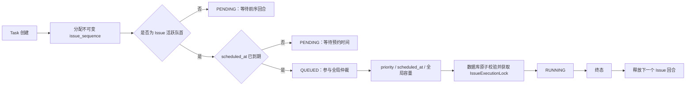

# Issue Task 有序回合设计与实施方案

**Date:** 2026-08-08

**Status:** Revised Draft（Stage 1 审查修订）

**Scope:** 同一 Issue 下普通 Task、重试 Task、CI 自动修复 Task，以及未来由 Goal 等工作流创建的 Task

**Related:** [Serial Goal Mode Design](2026-07-18-serial-goal-mode-design.md)、[Persistent Issue Workspace Design](2026-05-05-persistent-issue-workspace-design.md)、[Multi-Harness Engine Design](2026-07-31-multi-harness-engine-design.md)

本次修订收敛 Stage 1 审查中的 Blocking 和 Important 项，主要落点如下：

| 审查项 | 修订位置 |
|---|---|
| B1：`068` nullable 期间失败关闭 | §3.2、§5.2–§5.4、§6.1、§6.4–§6.6、§10.1、§11.2 |
| B2：统一所有权协议 | §3.2、§6.6–§6.7、§10.2、§11.1 |
| B3：projected lineage | §4.6、§5.1–§5.2、§6.2、§6.8、§7.5、§10.4 |
| B4：不放弃顺序不变量的回滚 | §11.4、§14 |
| 409 包络、静态路由 | §6.3、§7.5、§10.3 |
| 可观测性实际落点 | §9、§10.6、§11.1–§11.3 |
| 终态容器锁队列投影 | §6.4、§6.7、§7、§8.3、§10.2 |

## 1. 结论

Codify 本质上是把 Claude Code、Codex 等交互式代码代理 CLI 搬到 Web，并补充持久化、
预约、并发调度、Docker 隔离、日志和 Git/MR 交付能力。

因此，同一 Issue 下的 Task 不应建模为一组相互独立的后台 Job，而应建模为一条可暂存、
可预约的 CLI 输入流：

```text
Issue = 一条持续的交互会话、工作区、分支、MR 和交付生命周期
Task  = 这条输入流中的一个持久化 CLI 回合
```

目标规则是：

> Issue 内严格按不可变回合序号执行；Issue 间继续按优先级、预约时间和全局容量调度。

`priority`、`scheduled_at`、重试来源和系统触发来源都不能改变同一 Issue 的回合顺序。
它们只决定当前队首 Task 何时以及以什么全局优先级竞争 Worker。

严格 Task 顺序只是必要条件，不足以单独保证会话顺序。每个 Task 创建时还必须冻结按
`issue_sequence` 推导的 **projected lineage**；它明确 Harness、Endpoint 对应的 session namespace、
lineage generation 和最近 reset 点。后续 `continue` 继承队尾投影，不能在未决 `fresh` 尚未产出
session 时回退到 reset 前的旧会话。

对于允许用户预约的 Task，预约时间还必须与 Issue 输入流保持一致：后序活跃 Task 的
`scheduled_at` 不得早于前序活跃 Task 的 `scheduled_at`。这个限制只排除已知不可能兑现的时间，
不承诺后序 Task 能在所选时间准时开始。

本期生产运行约束为：**同一时刻仅允许一个 Scheduler 实例活跃**。全局 `MAX_CONCURRENCY` 仍由该
实例管理；本期不声称提供多 Scheduler 间的全局容量原子化。数据库中的 Issue 行锁、Task 状态 CAS
和带 owner 的 `IssueExecutionLock` 仍是强制不变量，因为 API 取消、Worker finalizer、recovery 和
cleanup 会与 Scheduler 并发。部署文档和 Compose/编排配置必须显式禁止 Scheduler 横向扩容；未来若
需要多实例，必须先另行设计全局容量租约与 leader election。

## 2. 问题与现状

当前系统已经保证同一 Issue 不会并行运行两个 Task，但没有保证先创建的 Task 先执行：

1. 所有到期的 `PENDING` Task 会批量变为 `QUEUED`。
2. Scheduler 再按 `priority`、是否预约、`scheduled_at`、`created_at` 全局挑选。
3. `IssueExecutionLock` 只阻止并发，不阻止后创建的 Task 先获得锁。

这会让后创建 Task 因更高优先级、更早预约时间或“立即执行”而越过前序 Task。

乱序与当前运行时基础存在直接冲突：

- 同一 Issue 的 Task 共享持久仓库工作区、分支和 MR。
- 会话恢复在 Task 真正执行时根据 Issue 当前 Harness lineage 解析。
- `fresh` Task 是会话重置点，后续 `continue` Task 必须发生在该重置之后。
- 前序摘要当前按较小 Task ID 构造，隐含假定创建顺序就是执行顺序。
- Task 创建时冻结 Prompt、Harness、Endpoint、Worker Profile 和 Runtime Bundle；乱序会让冻结的
  用户意图与真正看到的工作区、会话上下文不一致。

例如：

```text
Task A：先创建，预约明天，要求建立基础模块
Task B：后创建，立即执行，要求在基础模块上增加接口
```

当前 B 可能先执行。B 会把尚未执行的 A 当作“前序 Task”，但工作区中没有 A 的改动；明天 A
再执行时，它又不会把 ID 更大的 B 当作前序回合，虽然工作区已经包含 B 的修改。

这不是展示顺序问题，而是会话、工作区和执行历史的因果关系不一致。

## 3. 领域模型

### 3.1 Task 是回合，不是独立 Job

| Task 状态 | CLI 输入流语义 |
|---|---|
| `PENDING` | 已保存但尚未发送的输入，可编辑、取消或预约 |
| `QUEUED` | 当前 Issue 队首已经到期，等待全局 Worker |
| `RUNNING` | 输入已经发送给 Harness |
| `COMPLETED` / `FAILED` / `CANCELLED` | 该回合已经结束，CLI 可以接收下一回合 |

Web 允许用户在前一回合运行期间继续创建 Task，相当于终端中的输入缓冲；缓冲输入可以提前准备，
但不能越过前面的输入。

### 3.2 不变量

实现必须始终满足以下不变量：

1. 每个 Task 创建时获得同一 Issue 内不可变且唯一的 `issue_sequence`。
2. 同一 Issue 只有最早的非终态 Task 可以进入 `QUEUED` 或 `RUNNING`。
3. 任一 `RUNNING` Task 之前不存在 `PENDING`、`QUEUED` 或 `RUNNING` 的较小序号 Task。
4. 同一 Issue 最多存在一个 `RUNNING` Task，继续由 `IssueExecutionLock` 保证。
5. `priority` 只参与不同 Issue 队首之间的全局排序。
6. `scheduled_at` 是该 Task 的最早发送时间 `not_before`，不改变 `issue_sequence`。
7. 对新建或修改后的用户可预约 Task，活跃且有预约时间的 Task 按 `issue_sequence` 保持
   `scheduled_at` 非递减；`scheduled_at=null` 的立即或事件驱动 Task 不参与时间单调约束。
8. 终态 Task 不阻塞后续回合；终态 Task 遗留容器时，物理工作区锁继续阻塞后续执行，直到清理完成。
9. 重试、CI 自动修复、Goal continuation 等所有新 Task 都追加到 Issue 输入流尾部。
10. `068` 兼容期内，只要 Issue 存在活动 `issue_sequence=NULL`，该 Issue 的 promote、claim 和依赖
    顺序的查询一律失败关闭；不得利用 SQL 的 NULL 排序偶然选择 Task。
11. 每个 Task 的 projected lineage 在创建事务中冻结；`continue` 继承队尾 lineage，`fresh` 创建
    新 generation/reset 点，执行时不得回退到其他 generation 或 legacy session 指针。
12. `IssueExecutionLock` 的释放必须同时匹配 `issue_id` 和当前 `owner_task_id`；任何旧 owner、取消
    请求或清理任务都不能删除后来 owner 已重新取得的锁。
13. 全局并发容量由唯一活跃 Scheduler 维护；数据库所有权协议不依赖该部署假设，且必须防御
    Scheduler 与 API/Worker/cleanup 的并发。

### 3.3 明确不提供的语义

第一版不提供：

- Task 拖拽重排或任意插队；
- 重试自动插回原 Task 后面；
- Task 失败后自动暂停整个 Issue 队列；
- DAG 或显式 Task 依赖图；
- 预约时间的准点完成承诺；
- 通过高优先级绕过同一 Issue 前序回合。

如果用户希望改变尚未执行的输入顺序，应取消相关 Task，再按目标顺序重新创建。失败暂停可以作为
后续独立策略设计，不能由 `retry_source_task_id` 隐式推导。

## 4. 顺序、预约和调度语义

### 4.1 两层调度

调度分为两个明确层次：

1. **Issue 内选队首**：选出 `issue_sequence` 最小的非终态 Task。
2. **Issue 间全局仲裁**：只在各 Issue 已到期的队首之间比较优先级、预约时间和全局容量。



### 4.2 预约

`scheduled_at` 定义为当前回合的最早可发送时间：

- 队首预约在未来时，整个 Issue 输入流等待。
- 非队首预约时间即使已经到达，也仍等待前序回合。
- 后创建的立即 Task 不得越过未来预约的队首。
- 队首实际开始时间可能因前一终态容器清理、全局并发或更高优先级 Issue 而延后。

为了不让用户选择一个根据当前队列已知必然无法兑现的时间，用户可预约 Task 还必须遵守 Issue 内
预约时间窗口。对 Task `T_i`：

```text
schedule_floor(T_i) = max(
    现有“必须选择未来时间”的最早值,
    所有活跃且 scheduled_at 非空的前序 Task 的 scheduled_at
)

schedule_ceiling(T_i) = min(
    所有活跃且 scheduled_at 非空的后序 Task 的 scheduled_at
)
```

- 新建普通 Task 和预约重试都追加到队尾，因此只有 `schedule_floor`，没有后序上限。
- 修改已有预约 Task 时必须同时满足下限和上限；边界时间允许相等。
- `PENDING`、`QUEUED`、`RUNNING` 属于活跃 Task；终态和已取消 Task 不参与窗口计算。
- `scheduled_at=null` 表示“前序完成后尽快执行”，不参与预约时间比较，也不会为后序 Task 提供已知下限。
- 前端禁用窗口外时间并说明约束来源；后端在持有 Issue 行锁后重新计算并做最终校验。
- 修改前序 Task 不自动顺延后序预约。若新时间超过后序 Task 的上限，操作失败，用户应先修改、取消
  或对相应后序 Task 执行“前序完成后立即执行”。

例如：

```text
T1 scheduled_at = 明天 10:00
T2 scheduled_at = 明天 12:00
T3 scheduled_at = 明天 14:00
```

新建 T2 时不得选择 10:00 之前；修改已有 T2 时可选窗口为 `[10:00, 14:00]`。允许 T2 选择
10:00 只表示它在时间上已经到期，真实执行仍必须等待 T1 终态和工作区锁释放。

现有每小时 Slot Capacity 继续限制用户选择的预约时间数量，但产品文案必须说明它是预约提交容量，
不是执行时长或准点完成保证。若未来需要保证执行时间，需要单独引入执行时长预测和容量预留，
不属于本方案。

### 4.3 立即执行和重新预约

- 对队首执行“立即执行”：清除其 `scheduled_at`，由 Scheduler 在下一周期正常领取。
- 对非队首执行“立即执行”：只清除该 Task 自身的 `scheduled_at`；它仍等待前序回合。API/UI 必须返回
  “前序完成后立即执行”，不能宣称已经绕过队列。
- 重新预约队首到未来：队首从 `QUEUED` 回到 `PENDING`，并阻塞全部后续 Task；新时间不得晚于现有
  活跃后序 Task 的最早预约时间。
- 重新预约非队首：只改变其在成为队首后的 `not_before` 条件，并必须落在前序下限与后序上限之间。
- 清除 `scheduled_at` 不会改写其他 Task 的预约时间；预约窗口在下一次打开或提交时按最新活跃队列
  重新计算。

### 4.4 优先级

优先级只在不同 Issue 的可运行队首之间生效。例如：

```text
Issue A：A1(P2) -> A2(P0)
Issue B：B1(P1)
```

全局可以先运行 B1，再运行 A1；A2 即使是 P0，也不能越过 A1。A1 终态后，A2 才以 P0 身份参与
下一次全局仲裁。

### 4.5 重试和系统回合

- 手工重试创建新 Task，获得当前最大 `issue_sequence + 1`。
- 重试保留 `retry_source_task_id` 和冻结的执行快照，但不继承源 Task 的队列位置。
- 普通重试使用 `scheduled_at=null`，成为队首后立即具备时间资格；预约重试必须选择不早于所有活跃
  前序预约时间的时间。
- CI 自动修复在 CI 事件通过门禁后创建，并追加到当时的队尾。
- Goal initial、continue、resume、approval continuation 等 Task 也使用同一追加规则。
- `trigger_source` 只记录 Task 为什么被创建，不决定顺序或插队权。

这符合交互式 CLI：失败回合已经发生；用户稍后点击重试，是输入流中新的回合，而不是重写历史。

### 4.6 Projected lineage 与会话模式

严格执行顺序不能代替会话 lineage 顺序，因为用户可以在未决 `fresh` 执行前继续缓冲 Task。为此，
每个 Task 创建时持久化以下 projected lineage 元组：

```text
ProjectedLineage = (
    harness_key,
    session_namespace,       # harness + endpoint fingerprint + adapter state major
    lineage_generation,      # Issue 内单调递增的会话代际
    reset_task_id             # 建立本代际的 fresh/兼容重置 Task
)
```

投影只描述“该回合预计属于哪条 lineage”，`input_session_id` / `output_session_id` 仍记录执行事实。
`session_namespace` 必须从 Task 已冻结的 Worker/Endpoint snapshot 计算后持久化，不能在执行时根据最新
Provider 配置重算。`lineage_generation` 用于区分同一 Harness、同一 Endpoint 上 reset 前后的两个会话，
因此仅以 `(harness_key, session_namespace)` 查找 session 不足以安全恢复。

在持有 Issue 行锁、完成序号完整性检查后，创建服务按 `issue_sequence` 读取最后一个 Task 的投影：

1. Issue 没有历史 Task 时，首个 `continue` 建立 generation `0`，`reset_task_id=null`；首个 `fresh`
   建立 generation `1`。
2. 新 `continue` 的冻结 Harness/namespace 必须与队尾投影一致，并原样继承 generation/reset 点。
   队尾包括终态和已取消 Task，因为已经创建的后续回合语义不能因取消或失败被静默改写。
3. 新 `fresh` 使用自己的冻结 Harness/namespace，建立 `tail.generation + 1`，并以自身 Task ID 作为
   `reset_task_id`。它不要求前一 namespace 相同。
4. 新 `continue` 与队尾 Harness/namespace 不匹配时返回结构化
   `409 issue_lineage_conflict`，提示用户显式选择 fresh；不得静默创建 `fresh_no_match` Task。
5. `fresh` 后已经缓冲的 `continue` 即使在 fresh 失败或取消后仍保留新 generation。执行时若本代际
   尚无 session，以无 resume ID 的方式启动，并把 Task 的输入决策记录为 `fresh_no_match`；绝不查询
   reset 前 generation 的 session，也不使用 `Issue.claude_session_id` 兜底。

执行时，`fresh` 总是清空本 generation 的 resume 输入并记录 `fresh`；`continue` 只读取完全匹配
上述四元组、且由较小 `issue_sequence` Task 产生的 session。Task 成功产生 session 后，只更新本
generation 的实际 session 行，并记录产出 Task ID/序号。异常处理不得回退到 legacy 指针；lineage
记账失败必须在启动 Worker 前失败关闭，而不是用旧会话“尽量执行”。

重试同样追加到队尾，并先比较源 Task 投影与当前队尾投影：

- 默认会 `continue` 的重试，只有源投影与队尾四元组完全一致时才允许创建；
- fresh 源 Task 未产生 output session 时，沿用现有语义创建显式 fresh retry，并建立新的 generation；
- 若源 Task 属于 reset 前的旧 lineage，返回 `409 retry_lineage_conflict`，同时返回源和队尾投影摘要；
- UI/API 只有在用户显式选择 `fresh_retry` 后，才可用源 Task 的冻结 Harness/Endpoint snapshot 在队尾
  建立新的 generation。不得静默恢复旧会话，也不得把旧源 Task 自动改绑到新 lineage。

即使 Task 使用不同 Harness、Endpoint 或 fresh session，它们仍共享 Issue 仓库工作区，因此不能绕过
Issue 顺序。历史迁移中发现的 namespace 变化按 §5.2 形成显式兼容 reset；新写入不再允许隐式变化。

## 5. 数据模型与迁移

### 5.1 Task 字段

`Task` 新增：

```python
issue_sequence: Mapped[int] = mapped_column(Integer, nullable=False)
projected_harness_key: Mapped[str] = mapped_column(String(64), nullable=False)
projected_session_namespace: Mapped[str] = mapped_column(String(128), nullable=False)
projected_lineage_generation: Mapped[int] = mapped_column(Integer, nullable=False)
projected_reset_task_id: Mapped[int | None] = mapped_column(
    ForeignKey(
        "tasks.id", ondelete="NO ACTION", deferrable=True, initially="DEFERRED"
    ),
    nullable=True,
)
lineage_projection_reason: Mapped[str] = mapped_column(String(32), nullable=False)
input_lineage_reason: Mapped[str | None] = mapped_column(String(32), nullable=True)
```

新增约束和索引：

```text
UNIQUE (issue_id, issue_sequence)
INDEX  (issue_id, status, issue_sequence)
INDEX  (issue_id, projected_lineage_generation, issue_sequence)
```

`issue_sequence` 是领域顺序，Task 全局 `id` 继续作为资源标识。`created_at` 继续用于审计和展示，
不再承担执行顺序约束。`lineage_projection_reason` 的值限定为 `initial`、`inherited`、`fresh`、
`legacy_namespace_change`；`input_lineage_reason` 记录执行时的 `fresh`、`resumed` 或
`fresh_no_match`，不得用投影字段冒充实际恢复成功。

新增 `IssueSessionLineage` 表保存每个 generation 的实际 session 事实：

```text
issue_id, lineage_generation       UNIQUE
harness_key, session_namespace
reset_task_id
session_id                         nullable
last_output_task_id                nullable
last_output_issue_sequence         nullable
lineage_reason, metadata, created_at, updated_at
```

新 Scheduler 只通过 `(issue_id, lineage_generation)` 加 Harness/namespace 一致性校验解析 session；
`last_output_issue_sequence` 必须小于当前 Task 序号。现有 `IssueHarnessSession` 和
`Issue.claude_session_id` 在 `068` 期间仅作为旧 Backend/UI 的兼容镜像，不能作为新 Worker 的兜底读源。
保留独立新表而不是改变现有唯一键，可让 `068` 混部期的新旧代码互不覆盖 session 行。

### 5.2 回填规则

在每个 Issue 的 `FOR UPDATE` 行锁内，按下列顺序为历史 Task 分配连续序号：

```sql
row_number() over (
  partition by issue_id
  order by created_at asc, id asc
)
```

迁移只建立历史逻辑顺序，不尝试重写已经发生的 `started_at` 或真实执行历史。部署前已经乱序完成的 Task
保持原审计事实；新规则只阻止后续继续乱序。

同一次按序遍历还必须从 Task 的冻结 Worker snapshot 和 Endpoint fingerprint 计算 namespace，并回填
projected lineage：

1. 首个 Task 建立 generation `0`；如果它是 `fresh`，则建立 generation `1` 并以自身为 reset 点。
2. `fresh` 总是递增 generation 并以自身为 reset 点。
3. `continue` 与队尾 Harness/namespace 相同时继承队尾 generation/reset。
4. 历史 `continue` 与队尾 namespace 不同，按既有 `fresh_no_match` 事实建立新的兼容 generation，
   `reset_task_id` 指向自身，reason=`legacy_namespace_change`；这只允许在历史回填中发生。
5. 活跃 Task 若缺少可验证的冻结 Harness/Endpoint snapshot，整个 Issue 标记为
   `sequence_repair_required` 并阻止发布；不得猜测为最新 Provider。仅终态历史可以在审计记录后映射到
   `legacy` namespace。
6. `IssueSessionLineage` 只从同 generation 已完成 Task 的 `output_session_id` 回填。没有 Task 产出证据时，
   仅 generation `0` 可从完全匹配的旧 `IssueHarnessSession` 导入；reset 后 generation 禁止导入旧指针。

该顺序同时用于 `068` 运行期修复旧 Backend 新插入的 NULL Task，保证 sequence 和 projected lineage
不会各自回填出相互矛盾的顺序。

### 5.3 兼容迁移

当前迁移头为 `067_harness_key`。推荐分两阶段发布：

1. `068_issue_sequence_lineage`：新增 nullable sequence/投影字段与 `IssueSessionLineage`，回填
   历史数据，建立允许 null 的唯一索引；新代码始终同时写入序号和投影。
2. `068` 兼容期允许旧 Backend 继续插入 NULL，但**不允许任何代码把 NULL 当成可排序值**。新 Scheduler
   在每次 promote/claim 前通过 Issue 行锁修复或拒绝；依赖顺序的查询检测到活动 NULL 时失败关闭。
3. **第二阶段（收紧 `NOT NULL`）当前显式延期，未实现**。原计划 `069_task_issue_sequence_lineage_not_null`
   收紧 `issue_sequence` 与 projected 关键列为 `NOT NULL` 并建立正式唯一/检查约束
   （`projected_reset_task_id` 在 generation `0` 合法为 NULL；generation `> 0` 时必须非 NULL 且指向
   同一 Issue 中不大于当前序号的 reset Task）。因 069 迁移已被 system lifecycle statistics（EEE-18）占用，
   且 ordered-turn 尚未稳定（运行时 lineage 强制 EEE-23 仍在返修），第一阶段预检条件
   “稳定观察一个发布周期后”尚未满足，故收紧阶段被明确取消/推迟。待 ordered-turn 稳定后，由独立迁移
   `070_task_issue_sequence_lineage_not_null` 执行：先停掉所有旧 Backend，确认 sequence 与必填投影字段
   NULL 均为零且投影断言通过，再收紧；届时再移除对应的 NULL-repair 分支（`ensure_issue_order_integrity_locked`
   的 repair 路径、`sequence_repair_required` 拒绝语义可保留为防御）。

`068` 的混部兼容对象仅是旧 Backend 写入路径；生产仍只能有一个新 Scheduler。若无法实现以下运行期
repair/fail-closed 协议，就必须改成停写、停调度、一次性回填再切换，不得继续声称支持混部。第二阶段
以后若回滚应用版本，必须使用理解 sequence 和 projected lineage 的兼容版本，不能直接回滚到旧逻辑。

统一 `ensure_issue_order_integrity_locked(issue_id, repair_nulls)` 协议如下：

- 调用方已持有 Issue `FOR UPDATE`，再按 `(created_at,id)` 读取并锁定该 Issue 的 Task；
- 对完整序列计算确定性 rank。已非 NULL 的 sequence 必须与该 rank 一致；一致时为 NULL Task 补号，
  并在同一遍历中补 projected lineage；
- 若非 NULL 值与确定性 rank 冲突、存在重复、活动 Task 无法推导投影，事务回滚并返回/记录
  `issue_sequence_repair_required`，不得重排已分配序号；
- append 路径调用 `repair_nulls=true` 后才能分配尾号；promote/claim 可以修复后继续，也可以在本周期
  拒绝并等待下一次 repair，但绝不能跳过 NULL；
- 单 Issue 预约约束、队列上下文等强一致查询返回结构化 `409 issue_sequence_repair_required`；批量列表
  不让一个坏 Issue 拖垮全页，而是为该 Issue 返回 `queue_position=null`、
  `waiting_reason=sequence_repair_required`，并从 ready 候选中排除。

### 5.4 序号分配

抽取统一的 Task 追加服务。服务必须：

1. `SELECT Issue ... FOR UPDATE`；
2. 调用 `ensure_issue_order_integrity_locked(..., repair_nulls=true)`；修复或拒绝旧写入的 NULL；
3. 校验 Issue 状态和调用方权限；
4. 查询该 Issue 当前最大 `issue_sequence` 和最后一个 Task 的 projected lineage；
5. 解析即将冻结的 Worker/Endpoint snapshot material，计算 Harness/namespace；再按 §4.6 校验/分配
   generation/reset 点；
6. 若请求带预约，计算新队尾 Task 的 `schedule_floor` 并校验 `scheduled_at`；
7. 使用 `max + 1` 创建 Task；fresh Task flush 出 ID 后在同一事务内把 `reset_task_id` 指向自身；
8. 在同一事务中持久化与第 5 步 material 一致的 Task Snapshot、Runtime Bundle 绑定及其他来源记录；
9. 一并提交。

当前普通创建、重试和 CI 自动修复路径已经锁定 Issue 行，应复用统一 helper，避免未来新增 Task 来源
忘记分配序号或 projected lineage。唯一约束是最后一道并发保护，冲突不得静默改序，应回滚并重试
整个追加事务。

所有带预约的创建和修改路径必须统一锁顺序：先获取 Issue 行锁并计算预约窗口，再获取 Slot advisory
lock，最后分配序号或修改时间并写入 Task。当前普通创建、retry 和 reschedule 的锁顺序必须一并收敛，
避免两个事务分别持有 Issue 锁和 Slot 锁后相互等待，也避免校验后队列变化造成预约窗口失效。

## 6. 后端实施方案

### 6.1 新增顺序领域服务

新增 `backend/app/core/issue_task_order.py`，集中维护：

- `ACTIVE_TASK_STATUSES = (PENDING, QUEUED, RUNNING)`；
- `ensure_issue_order_integrity_locked()`；
- `allocate_issue_sequence()`；
- `active_predecessor_exists()`；
- `get_issue_queue_head()`；
- `build_issue_queue_context()`；
- `get_task_schedule_constraints()`；
- `validate_task_schedule_constraints()`；
- 执行前 `validate_issue_head_for_claim()`；
- Scheduler 启动和周期性的缺失序号/投影与非法 `QUEUED` 状态审计。

新增 `backend/app/core/issue_task_lineage.py`，集中维护：

- `session_namespace_from_frozen_snapshot()`；
- `project_lineage_for_append()`；
- `validate_retry_lineage()`；
- `resolve_projected_resume_session()`；
- `record_projected_output_session()`。

所有 API、Scheduler、序列化和 UI 投影必须使用同一套定义，禁止分别实现“队首”判断。
所有 Worker/Harness 路径必须使用 projected lineage 解析服务，禁止捕获异常后退回
`Issue.claude_session_id`。

### 6.2 创建路径

修改：

- `backend/app/api/task_creation_service.py`
  - 普通 Task 和 retry Task 使用统一追加服务；
  - retry 永远追加，保留源快照和 Runtime Bundle 规则，并执行 §4.6 的源/队尾 lineage 校验；
  - 普通创建和预约重试在 Issue 行锁内校验队尾 `schedule_floor`。
- `backend/app/core/ci_failure_collector.py`
  - CI repair Task 在 Issue 行锁内追加；
  - CI priority 只在它成为队首后生效。
- 后续 Goal coordinator 或其他自动化
  - 必须调用同一追加服务；
  - 禁止直接 `Task(...)` 后提交。

旧 Backend 在 `068` 期间可能仍直接创建 NULL Task；它不是推荐路径，只由 §5.3 repair 协议兜底。
CI/Goal 创建如果遇到 sequence 或 lineage 冲突必须记录结构化失败并重试整个事务，不能降级为直接插入。

### 6.3 预约约束与修改

普通 Task 创建、预约重试和 `PATCH /tasks/{task_id}/schedule` 必须复用同一预约约束服务：

1. 锁定 Issue 行；
2. 按 `issue_sequence` 加载活跃且 `scheduled_at` 非空的 Task；
3. 先复用现有 datetime normalization/`resolve_scheduled_at()` 转为统一 UTC 时间，再在创建时计算队尾
   下限、修改时计算前序下限和后序上限；
4. 校验请求时间，再检查并占用 Slot Capacity；
5. 写入 `scheduled_at` 并提交。

约束失败返回 FastAPI 统一的结构化 `409 Conflict` 包络；顶层固定为 `detail`，其内部至少包含错误码、
人类可读 message、当前时间窗口和产生边界的 Task：

```json
{
  "detail": {
    "code": "issue_schedule_order_conflict",
    "message": "Scheduled time is outside the current Issue queue window",
    "has_valid_window": true,
    "min_scheduled_at": "2026-08-09T10:00:00Z",
    "min_source_task_id": 101,
    "max_scheduled_at": "2026-08-09T14:00:00Z",
    "max_source_task_id": 103
  }
}
```

前端加载后队列可能发生变化，因此禁用时间只用于即时反馈，提交时的后端事务校验才是最终真相。
失败后前端刷新约束，保留用户其他表单内容，不自动修改为边界时间。

若历史数据或时间流逝导致 `schedule_floor > schedule_ceiling`，返回 `has_valid_window=false`。此时没有
合法的重新预约时间，UI 禁用提交并引导用户先调整、取消后序预约，或清除当前/相邻 Task 的预约；
系统不得自动覆盖任何已保存时间。

### 6.4 入队

将 `_mark_eligible_as_queued()` 改为按 Issue 小事务只提升活动队首。初筛和最终更新都必须显式排除
活动 NULL，逻辑条件为：

```text
task.status = PENDING
AND task.issue_sequence is not null
AND task.scheduled_at is null or task.scheduled_at <= now
AND NOT EXISTS (
    same issue active task with issue_sequence is null
)
AND NOT EXISTS (
    same issue active task with smaller issue_sequence
)
AND NOT EXISTS active IssueExecutionLock for this issue
```

Scheduler 每周期先单独扫描“存在活动 NULL”的 Issue。对每个 Issue 获取 Issue 行锁并调用 §5.3 repair；
修复失败时整个 Issue 保持不可运行，并发出一次状态变化日志。同一周期再将存在活动前序的历史
`QUEUED` Task 降回 `PENDING`，最后提升合法队首。规范化主要处理发布前遗留数据和异常恢复，不应
成为正常状态转换路径。任何批量 UPDATE 都必须带上述 NULL/前序 `NOT EXISTS`，不能只依赖 Python 初筛。

queue context 统一使用有限枚举 `waiting_reason`：`predecessor`、`scheduled`、`global_capacity`、
`workspace_cleanup`、`sequence_repair_required`。当活动队首本身已到期，但 Issue lock 的 owner 是终态
且仍持有 `container_id` 或原始日志尚未固化的 Task 时，投影为：

```json
{
  "waiting_reason": "workspace_cleanup",
  "lock_owner_task_id": 99,
  "waiting_since": "2026-08-08T09:00:00Z"
}
```

该等待只由 recovery/finalizer 在确认容器和日志已收敛后清除；UI 不把它误诊为前序 Task 永久阻塞，
Monitor 在超过 §9 的 cleanup SLO 时标记 overdue，但不得为了满足 SLO 强制释放工作区锁。

Issue 状态沿用现有行为：只有到期队首进入 `QUEUED` 或真正 `RUNNING` 时才进入 `in_progress`；
未来预约或仅因前序阻塞的 Task 不应让 Issue 提前显示为执行中。

### 6.5 全局候选选择

`_get_next_task()` 只选择合法 `QUEUED` 队首。为兼容升级期间已经存在的非法 `QUEUED` 数据，查询本身
仍必须带 `task.issue_sequence IS NOT NULL`、`NOT EXISTS active NULL` 和
`NOT EXISTS active predecessor`，不能只相信入队步骤已经清理完毕。查询到候选只表示“可能可领取”，
不能替代 §6.6 的 Issue 行锁内重验。

队首之间继续使用现有全局规则：

1. `priority ASC`，即 P0、P1、P2；
2. 已到期预约 Task 优先于立即 Task；
3. `scheduled_at ASC`；
4. `created_at ASC, id ASC` 作为跨 Issue 稳定 tie-breaker。

### 6.6 原子领取

当前 `_running_issues` 只是唯一 Scheduler 进程的快速缓存，不能作为顺序或锁所有权真相。所有
claim/cancel/finalize/recovery/cleanup 的数据库状态转换统一遵守：**先锁 Issue，再锁 Task 或以 Task
状态 CAS，最后按 owner 条件操作 IssueExecutionLock**。禁止先锁 Task 再找 Issue，也禁止使用调用开始
时缓存的 Task 状态决定锁释放。

领取 Task 时必须在一个数据库事务内：

1. 锁定 Issue 行；
2. 调用 `ensure_issue_order_integrity_locked()`，活动 NULL 无法修复则拒绝；
3. `SELECT Task ... FOR UPDATE` 或等价 CAS，重新加载状态、预约时间和 projected lineage；
4. 再次确认它是到期活动队首，并且不存在较小序号活动 Task；
5. 使用 `INSERT ... ON CONFLICT DO NOTHING RETURNING` 获取
   `IssueExecutionLock(issue_id, task_id)`；不得让唯一冲突回滚一个外层共享 session；
6. CAS `QUEUED -> RUNNING` 并写入 `started_at`；CAS 失败则回滚整个事务，或仅以
   `(issue_id, owner_task_id)` 条件删除刚取得的锁；
7. 同一事务提交锁和 Task 状态，提交成功后才启动 Worker。

如果重新校验失败：

- 不启动 Worker；
- 释放或回滚本事务；
- 非法 `QUEUED` Task 恢复为 `PENDING`；
- 记录结构化原因，例如 `sequence_repair_required`、`predecessor_active`、`schedule_not_due`、
  `issue_locked`、`task_state_changed`。

单 Scheduler 是本期受支持的容量拓扑；上述数据库事务仍保证 Scheduler 与 API/Worker/cleanup 并发时，
不会为同一 Issue 领取两个 owner。若误启动第二 Scheduler，per-Issue owner 条件仍应保护工作区，但
`MAX_CONCURRENCY` 可能被两个进程分别消耗，因此属于部署故障而非受支持的高可用模式。

锁 API 改为显式 owner 合约：

```python
async def release_issue_execution_lock(
    db: AsyncSession, *, issue_id: int, owner_task_id: int
) -> bool:
    # DELETE ... WHERE issue_id=:issue_id AND task_id=:owner_task_id
    # 返回 rowcount == 1；false 表示已释放或 owner 已变化，不得扩大删除条件
```

现有只接收 `issue_id` 的 release helper 必须删除；所有调用点必须传递它真正完成清理的 Task ID。
当前 Task ID 对一次所有权已足够充当 fencing token；如果未来允许同一 Task 多次重新领取，则迁移到
独立 generation/token，并把它加入 acquire/release 条件，不能继续仅用 Task ID。

### 6.7 终态与物理清理

Task 变为 `COMPLETED`、`FAILED` 或 `CANCELLED` 后，逻辑上不再阻塞下一回合。但如果终态 Task 仍有
`container_id`，现有 retained-container 机制和 `IssueExecutionLock` 继续阻塞工作区，直到原始日志完成
固化并清理容器。

不能为了尽快释放队列而绕过容器清理锁，否则前后两个 Worker 仍可能同时修改同一个 daemon-local
Issue 工作区。

各转换路径采用同一协议：

- **cancel（两阶段）**：阶段 A 获取 Issue 锁，再锁 Task 并重读权威状态。`PENDING/QUEUED` 可直接
  CAS 为 `CANCELLED`；`RUNNING` 只持久化 `cancel_requested_at`，保留 owner 锁。提交后才执行 Docker
  stop/log drain。阶段 B 再次按 Issue→Task 顺序加锁和重读；只在 Task 已终态且 `container_id=null`
  时按 owner 条件释放。不得根据阶段 A 之前读到的状态释放。
- **Worker finalizer**：Issue→Task 加锁，写终态、固化日志并清除容器引用；只有完成这些事实后才执行
  `DELETE WHERE issue_id=? AND task_id=?`。迟到的旧 finalizer 删除不到新 owner 是正常幂等结果。
- **recovery**：先枚举候选，不在快照上直接删除。逐 Issue 加锁，重读 lock owner，再锁 owner Task；
  恢复合法 RUNNING/retained container，或在收敛后按观察到的 owner 条件删除。
- **cleanup**：读取 owner A 后必须在 Issue 锁内重新确认 lock 仍为 A、Task A 已终态且无容器，再执行
  owner 条件删除。即使 cleanup 读取后 A 释放、Task B 重新获取，cleanup 也不能删除 B。
- **Issue/system data cleanup**：删除 Issue 前先取得 Issue 行锁并停止/收敛 owner；依赖 FK cascade
  删除整条 Issue 时不与新 claim 并发。禁止用 `DELETE ... WHERE issue_id IN (...)` 清理活动锁。

终态 owner 的 queue context 持续返回 `waiting_reason=workspace_cleanup` 和 `lock_owner_task_id`。清理完成
后，由同一事务条件释放，下一轮 promote 自动推进队首；无需人工修改 Task 状态。

### 6.8 前序摘要、MR 和会话投影

- `build_previous_task_summaries()` 改为按 `issue_sequence` 查询较小序号 Task。
- Issue Task relationship、MR Task 历史和 overall summary 改为按 `issue_sequence` 排序。
- Worker 启动前验证当前 Task 之前不存在活动前序，且 sequence/投影字段完整；失败时不创建容器。
- `worker_task_lifecycle.py` 通过 `resolve_projected_resume_session()` 读取
  `IssueSessionLineage`。当前 `except Exception -> issue.claude_session_id` 的兼容兜底必须移除。
- `fresh` 启动时在本 generation 写入 `session_id=null, lineage_reason=fresh`；`continue` 找不到本
  generation session 时以 `input_session_id=null, input_lineage_reason=fresh_no_match` 启动并记录原因。
- Task 产出 session 后，`record_projected_output_session()` 校验 Task 的 Harness/namespace/generation 和
  当前行一致，再写 `last_output_task_id/issue_sequence`；不得更新其他 generation。
- 前序摘要、MR 和工作区顺序仍看 `issue_sequence`；session 恢复同时看 projected lineage。两者任一
  校验失败都必须在 Worker 启动前失败关闭。

## 7. API 契约

Task 响应新增：

```json
{
  "issue_sequence": 3,
  "queue_position": 2,
  "blocked_by_task_id": 101,
  "waiting_reason": "predecessor",
  "lock_owner_task_id": null,
  "waiting_since": null,
  "projected_lineage": {
    "harness_key": "codex",
    "session_namespace": "codex-a1b2c3d4e5f60708",
    "generation": 2,
    "reset_task_id": 100
  },
  "schedule_constraints": {
    "has_valid_window": true,
    "min_scheduled_at": "2026-08-09T10:00:00Z",
    "min_source_task_id": 101,
    "max_scheduled_at": "2026-08-09T14:00:00Z",
    "max_source_task_id": 103
  }
}
```

字段含义：

| 字段 | 含义 |
|---|---|
| `issue_sequence` | Task 在 Issue 输入流中的不可变回合序号 |
| `queue_position` | Task 在当前非终态队列中的动态位置；终态为 `null` |
| `blocked_by_task_id` | 非队首时指向当前活跃队首；队首和终态为 `null` |
| `waiting_reason` | 有限枚举等待原因；可运行或终态为 `null` |
| `lock_owner_task_id` | `workspace_cleanup` 时的终态锁 owner；其他情况为 `null` |
| `waiting_since` | 当前锁等待的起点，用于 Monitor 的 cleanup SLO；其他情况为 `null` |
| `projected_lineage` | Task 冻结的非敏感 lineage 摘要；不包含 session ID 或 Endpoint secret |
| `schedule_constraints` | 当前可预约时间窗口及产生上下界的 Task；不可预约 Task 为 `null` |

队列信息必须由后端批量计算，避免列表接口产生 N+1 查询。Issue 详情已经加载全部 Task，可在内存中
一次计算；Task 列表、预约列表和 Monitor 数据使用按 Issue ID 批量查询的 queue context。

新建 Task 尚无 Task 响应，新增 `GET /tasks/schedule-constraints?issue_id={id}` 返回队尾创建约束；修改
已有 Task 时传入 `task_id` 返回双向窗口。该接口与创建、重试、reschedule 提交接口复用同一领域函数，
但查询结果不替代提交事务中的再次校验。传入 `task_id` 时必须校验 Task 属于该 Issue、调用者有项目
权限且 Task 仍允许修改预约；不匹配时不得泄露其他 Issue 的时间或 Task 信息。

`/tasks/schedule-constraints` 必须作为静态路由声明在 `/tasks/{task_id}` 之前，或拆到优先挂载的静态
router；否则 `schedule-constraints` 可能被当成 Task ID。路由测试必须直接请求该 URL，并断言不会得到
Task ID path validation 错误。

### 7.1 创建和重试响应

创建或重试响应同时返回队列字段。若新 Task 不是队首，前端成功提示应为：

```text
Task #102 已加入 Issue 队列第 3 位，当前等待 Task #100。
```

带预约的创建和预约重试若早于 `schedule_floor`，返回
`issue_schedule_order_conflict`，不得创建 Task、占用 Slot 或产生通知。普通 `continue` 若与队尾
Harness/namespace 不一致，返回 `issue_lineage_conflict`，不得创建 Task。

重试请求新增显式 `lineage_strategy="inherit" | "fresh_retry"`，默认 `inherit`。`inherit` 触发旧源/
当前队尾冲突时返回 `retry_lineage_conflict`；只有用户再次提交 `fresh_retry` 才建立新 generation。

### 7.2 Execute-now 响应

非队首 Task 清除预约后返回成功，但响应必须包含阻塞事实：

```json
{
  "status": "success",
  "message": "Task will run after its predecessors complete",
  "queue_position": 2,
  "blocked_by_task_id": 101
}
```

### 7.3 Reschedule 响应

重新预约队首时返回 `blocked_successor_count`，供 UI 在提交前后显示影响范围。所有 reschedule 响应
返回更新后的 `schedule_constraints`；请求越过前序下限或后序上限时返回
`issue_schedule_order_conflict`，不得静默顺延相邻 Task。

### 7.4 兼容性

- 不新增 `BLOCKED` Task 状态；前序阻塞是由队列字段投影出的等待原因。
- 不改变现有 Task 状态枚举和终态判断。
- 旧 API 客户端可以忽略新增字段。
- `trigger_source`、`retry_source_task_id` 和 `scheduled_at` 保持现有存储含义。
- 预约顺序是写入规则和 API 校验，不新增数据库字段，也不复制第二份预约时间。
- `068` 期间旧客户端创建的 NULL Task 可由新 Scheduler 修复，但新 API 不返回没有完整 sequence/lineage
  的成功响应；无法修复时返回 `issue_sequence_repair_required`。

### 7.5 统一冲突包络与前端解析

本方案新增的所有结构化 `409` 使用 FastAPI 现有 `HTTPException(detail=dict)` 约定：HTTP 响应固定为
`{"detail": ConflictDetail}`，不再出现顶层 `{code,...}`。公共 Pydantic/TypedDict 模型至少包含：

```json
{
  "detail": {
    "code": "retry_lineage_conflict",
    "message": "Retry source belongs to an older session lineage",
    "issue_id": 42,
    "task_id": 88,
    "source_lineage": {
      "harness_key": "claude",
      "session_namespace": "claude-old",
      "generation": 1,
      "reset_task_id": 70
    },
    "tail_lineage": {
      "harness_key": "codex",
      "session_namespace": "codex-new",
      "generation": 2,
      "reset_task_id": 80
    },
    "allowed_actions": ["fresh_retry"]
  }
}
```

错误码使用稳定小写 snake_case：

- `issue_schedule_order_conflict`：预约窗口冲突；
- `issue_sequence_repair_required`：活动 sequence/投影不完整且无法在线修复；
- `issue_lineage_conflict`：新 continue 与队尾 Harness/namespace 不一致；
- `retry_lineage_conflict`：重试源投影与队尾不一致；
- 现有 `SLOT_FULL` 暂时保持兼容，不在本变更中改名，但仍位于 `response.data.detail`。

前端新增统一 `extractTaskConflict(error)`，只从 `error.response.data.detail` 解析 object，并以 string detail
作为旧错误回退。TaskForm、retry 和 Reschedule 共用该 helper；未知 `code` 显示 `detail.message`，不能把
object 直接渲染成 `[object Object]`。API/前端契约测试对每个新增 code 断言 HTTP 409、`detail.code`、
必要字段以及表单保留行为。

## 8. 前端实施方案

### 8.1 Issue 详情

修改 `IssueView.vue` 和 `issue-detail` 组件：

- Task 历史按 `issue_sequence` 展示，序号相同或缺失时才用 `(created_at, id)` 兼容排序。
- 当前执行卡优先展示 `RUNNING` Task，否则展示最小 `queue_position` 的活跃 Task，不能再选择最新创建
  的 `PENDING` Task。
- 非队首记录显示“排队第 N 位 · 等待 Task #X”。
- 队首未来预约显示“队首 · 预约等待”。
- 队首已到期显示“队首 · 等待 Worker”。
- 创建 Task 后提示其回合序号和动态队列位置。
- 打开新建 Task Drawer 时按 `issue_id` 获取队尾预约下限；预约控件禁用下限之前的日期和时间，并显示
  “不得早于 Task #X 的最早执行时间”。
- Harness/Endpoint 选择变化时展示队尾 projected lineage；`continue` 不兼容时要求改选 fresh，不允许
  前端自行把模式静默改成 fresh。

### 8.2 Task 详情

- 元数据增加 Issue 回合序号、当前队列位置和阻塞来源。
- 非队首的“立即执行”文案改为“前序完成后立即执行”。
- 重新预约队首时确认框提示会阻塞多少后续 Task。
- `RescheduleDrawer.vue` 根据 `schedule_constraints` 同时禁用下限之前和上限之后的时间；边界允许选择。
- 若提交时收到 `issue_schedule_order_conflict`，刷新窗口并保留用户输入，提示由哪个前序或后序 Task
  改变了可选范围。
- 旧源 Task 重试收到 `retry_lineage_conflict` 时展示源/当前 Harness 与 reset 点差异；只有用户确认
  “使用源配置开启新会话重试”后提交 `lineage_strategy=fresh_retry`。
- Priority 帮助文案明确“只影响不同 Issue 队首之间的调度”。

### 8.3 Monitor 和 Schedule

Monitor 当前不能只用 `status + scheduled_at` 判断 ready：

- `queue_position = 1` 且预约已到的 Task 才属于 ready/queued。
- `queue_position > 1` 的 Task 归入“等待前序”分组。
- 未来队首归入“等待预约”分组。
- `waiting_reason=workspace_cleanup` 显示“等待 Task #X 清理工作区”，并用 `waiting_since` 标注持续时间；
  未超过 cleanup SLO 时不是健康故障，超过后进入 overdue 告警分组。
- `waiting_reason=sequence_repair_required` 属于顺序完整性故障，不能显示为普通等待或 ready。
- Schedule/Heatmap 仍展示所有有 `scheduled_at` 的 Task，但非队首显示“实际开始受前序影响”。
- `ScheduleOverview.vue` 的批量重新预约也必须使用同一时间窗口，不得通过另一个入口绕过限制。

中英文 i18n 同步增加队首、等待前序、预约上下限、约束来源、预约影响、Issue 内不可插队等文案。

## 9. 可观测性与告警

当前仓库没有 Prometheus exporter 或统一 metrics collector。本期可验收交付物是**结构化日志事件、基于
数据库 queue context 的 Monitor 投影和发布审计**，不声称交付 `*_total` 指标或 `/metrics`。未来接入
exporter 时可从这些稳定事件名派生 counter/gauge，但不属于本期。

Scheduler 使用现有 `scheduler_service.py` Python logging，把单行 JSON payload 写入容器 stdout/stderr；
Backend API 的冲突事件写入 backend stdout/stderr。采集入口分别是 Docker logging driver，现场读取命令
为 `docker logs codify-scheduler` 和 `docker logs codify-backend`。若生产平台已有 Loki/ELK 等日志采集，
直接采集这两个容器流；本方案不假设其必然存在。`docs/DEPLOYMENT.md` 必须记录日志驱动、轮转/保留配置
和查询示例，避免只存在容器本地的无限增长日志。

稳定事件名为：

- `issue_queue_head_promoted`；
- `issue_task_predecessor_blocked`；
- `issue_queue_invalid_queued_normalized`；
- `issue_task_claim_rejected`；
- `issue_sequence_repaired` / `issue_sequence_integrity_failed`；
- `issue_workspace_cleanup_waiting` / `issue_workspace_cleanup_cleared`；
- `issue_lock_release_owner_mismatch`；
- `issue_lineage_fresh_no_match` / `issue_lineage_conflict`。

每个事件至少包含 `event`、`occurred_at`、`scheduler_boot_id`、`issue_id`、`task_id`、
`issue_sequence`、`reason`；适用时增加 `blocked_by_task_id`、`owner_task_id`、`observed_owner_task_id`、
`lineage_generation`、`reset_task_id` 和 `waiting_since`，不得包含 session ID、Endpoint secret 或 Prompt。

Scheduler 每次启动生成新的 `scheduler_boot_id`。进程内“只在状态变化时记录”的去重缓存随重启清空；
启动审计会用 `recovered=true` 为当时仍存在的异常/等待状态各重发一次。因此日志消费者必须用
`scheduler_boot_id + event + issue_id + task_id + observed state` 识别重启重复，不能把事件行当成跨重启
单调 counter。持久事实以数据库 sequence、Task 状态和 owner lock 为准，Monitor 每次从数据库重算。

默认告警/人工发布门槛如下；有日志平台时配置相同窗口规则，没有时由发布 runbook 查询日志并由 Monitor
展示 overdue：

| 级别 | 条件 | 动作 |
|---|---|---|
| Critical | 5 分钟内任意 `issue_sequence_integrity_failed`，或 claim 因 `predecessor_active`/投影不完整被拒绝 1 次 | 停止继续发布和新 claim，保留兼容 Scheduler 排查 |
| Critical | `069` 切换后任意活动 sequence/必填投影字段 NULL，或 reset/generation 约束失败 | 不执行约束收紧或立即回滚 API/UI |
| Warning | `068` 混部期同一 Issue 10 分钟内 repair 超过 5 次；旧 Backend 下线后任意 repair | 排查仍在运行的旧 writer |
| Warning | `workspace_cleanup` 持续超过 `ISSUE_WORKSPACE_CLEANUP_SLO_SECONDS`（默认 600 秒） | Monitor 标红并检查 Docker/log finalizer；不得无条件释放锁 |
| Warning | 同一 Task 10 分钟内 owner mismatch 超过 3 次 | 排查迟到 finalizer/recovery 循环 |

不要在每个轮询周期重复打印相同阻塞日志；仅在状态、阻塞者、SLO 是否 overdue 变化，或启动恢复审计时
记录。发布证据必须保留查询时间窗、boot ID 和数据库审计结果，而不是只截取“未见错误”的空日志。

## 10. 测试方案

### 10.1 模型与迁移

- 历史 Task 按 `(created_at, id)` 正确回填序号。
- 同一 Issue 不允许重复序号，不同 Issue 可使用相同序号。
- 历史 fresh、同 namespace continue、namespace 变化分别回填正确 generation/reset/reason；reset 后 generation
  不导入旧 `IssueHarnessSession` 指针。
- 并发普通创建、重试和 CI 自动修复在 Issue 行锁内得到唯一递增序号和一致的队尾 projected lineage。
- 第一阶段兼容迁移能修复 sequence/必填投影字段 NULL；已有非 NULL rank 冲突或活动 Task 无冻结 snapshot 时
  失败关闭，不重排已分配序号。
- **混部 PostgreSQL 测试**：新 Scheduler 已启动并完成审计后，模拟旧 Backend 插入活动
  `issue_sequence=NULL` Task；在 repair 提交前，promote、claim 和强一致 queue query 都不得返回该
  Issue 的任何 Task。repair 在 Issue 行锁内按 `(created_at,id)` 补 sequence 和 projected lineage 后，
  只能提升真实队首。
- `069` 收紧前断言 sequence/必填投影字段 NULL 为零、重复为零、reset/generation 引用有效；任一断言失败时
  migration 中止。

### 10.2 Scheduler、所有权与 PostgreSQL 并发测试

1. 同一 Issue 先建 P2、后建 P0，仍先选择 P2。
2. 队首预约未来，后续立即 Task 保持 `PENDING`。
3. 队首预约到期后，仅队首进入 `QUEUED`。
4. 队首失败、完成或取消后，下一 Task 成为队首。
5. 非队首历史 `QUEUED` 会被规范化为 `PENDING`。
6. 查询自身即使面对非法历史状态或活动 NULL，也不会返回非队首；NULL Issue 投影为
   `sequence_repair_required`。
7. 两个独立 DB client 防御性地同时 claim 同一队首时，只有一个能原子取得 per-Issue owner；该测试
   不代表支持两个生产 Scheduler，也不验证跨进程全局容量。
8. 不同 Issue 仍可并行，并继续遵守 P0、P1、P2 全局优先级。
9. 终态 Task 遗留容器时，下一 Task 返回 `waiting_reason=workspace_cleanup`、owner 和 waiting_since；
   清理完成后自动推进。
10. Crash recovery 不会恢复或启动非队首 Task。
11. **claim-vs-cancel**：用两个 PostgreSQL `AsyncSession` 和 barrier 交错执行。cancel 先提交时 claim CAS
    失败且不留锁；claim 先提交时 cancel 重读为 RUNNING，只写取消意图并保留 owner，直到 finalizer
    收敛。两种顺序均不得出现 CANCELLED+新 Worker 或无 owner 的 RUNNING。
12. **旧 owner 迟到释放 vs 新 owner 获取**：owner A finalizer 在释放前暂停；A 已由另一收敛路径释放、
    B 获取锁后，A 的 `DELETE(issue_id,A)` rowcount 为 0，B 的 owner 行仍存在。
13. **cleanup-vs-reacquire**：cleanup 快照读到 A 后暂停；A 释放、B 获取；cleanup 取得 Issue 锁并重读
    owner 时不得按旧快照删除，最终 B 仍持锁。
14. cancel、finalizer、recovery、cleanup 的锁顺序测试/超时测试证明没有 Task→Issue 的反向加锁路径。

### 10.3 API 测试

- 创建、重试、CI repair 都追加序号。
- `queue_position` 和 `blocked_by_task_id` 在创建、取消、终态转换后正确变化。
- T1 预约 10:00 后，新建 T2 或预约重试选择 10:00 之前会返回结构化 `409`，选择 10:00 或之后成功。
- T1/T2/T3 分别预约 10:00、12:00、14:00 时，T2 只能改到 `[10:00, 14:00]`。
- 将 T1 改到 T2 之后会失败且不会级联修改 T2；取消 T2 或清除其预约后窗口按最新活跃队列重算。
- 时间流逝或历史冲突造成下限晚于上限时返回 `has_valid_window=false`，不得提交或自动改写其他 Task。
- 立即和事件驱动 Task 的 `scheduled_at=null` 不参与窗口计算；终态 Task 也不参与。
- 并发创建和 reschedule 在 Issue 行锁内重新校验，不能提交单调顺序冲突。
- 非队首 execute-now 只清除自身预约，不插队。
- 重新预约队首会让其从 `QUEUED` 回到 `PENDING` 并报告受影响后续数量。
- Task 列表批量投影不产生逐 Task 查询。
- `/tasks/schedule-constraints` 在 `/tasks/{task_id}` 存在时仍命中静态 handler，不返回 Task ID path
  validation 错误。
- 所有新增冲突返回 HTTP 409 和 `response.json()["detail"]["code"]`；前端按同一路径解析
  `issue_schedule_order_conflict`、`issue_sequence_repair_required`、`issue_lineage_conflict` 和
  `retry_lineage_conflict`。
- continue 创建只继承队尾 projected lineage；Harness/namespace 不匹配时事务内不创建 Task、Snapshot、
  Slot 占用或通知。

### 10.4 Worker 和会话测试

- 前序摘要只包含较小 `issue_sequence` Task，并按序输出。
- **异 Harness fresh 后预创建 continue**：Claude 历史后先缓冲 Codex fresh，再在 fresh 尚未执行时创建
  Codex continue；后者继承 fresh 的 generation/reset，fresh 产出 session 后 continue 恢复该 session。
- **同 Harness 不同 Endpoint namespace**：同 Harness Endpoint A 的队尾不允许直接创建 Endpoint B
  continue；显式 B fresh 后，预创建 B continue 继承 B namespace，绝不恢复 A session。
- **fresh 未产出 session**：旧 generation 已有 session，新的 fresh 失败/取消且无 output session；
  后续 continue 的 `input_session_id` 必须为 null、reason=`fresh_no_match`，不得回退旧 generation，产出
  新 session 后只更新新 generation。
- **fresh 后重试旧源 Task**：源投影与队尾不兼容时默认 retry 返回包络化
  `409 retry_lineage_conflict` 且不创建 Task；用户显式 `fresh_retry` 后才以源冻结 snapshot 建立新
  generation/reset。
- 同 namespace 的两次 fresh 仍由不同 generation 隔离，第二次 fresh 后不得恢复第一次 session。
- 不同 Harness 的 Task 仍按 Issue 序号共享工作区顺序。
- 乱序执行保护在 Worker 启动前能够拒绝异常 Task。
- projected lineage 解析异常时 Worker 不创建容器，且不访问 `Issue.claude_session_id` 兜底。

### 10.5 前端测试

- Issue 当前执行卡选择队首而不是最新 PENDING Task。
- Task 历史正确显示队列位置和阻塞者。
- Monitor 不把非队首立即 Task 计入 ready。
- Monitor 把终态 owner 锁展示为 `workspace_cleanup`，超过 SLO 标红但不提供强制解锁快捷操作。
- 非队首 execute-now 和队首 reschedule 文案准确。
- 新建和预约重试禁用前序下限之前的时间，修改 Task 同时禁用上下界之外的时间，边界可选。
- 提交时队列变化导致 `409` 后刷新约束、保留表单内容并显示约束来源。
- retry lineage 冲突保留页面状态，只有二次显式确认才发送 `fresh_retry`；未知结构化 code 使用 message
  回退且不显示 `[object Object]`。
- 中英文文案和窄屏布局通过。

### 10.6 集成验收

至少运行以下真实序列：

```text
Issue A:
  A1 P2 immediate
  A2 P0 immediate
  A3 scheduled

Issue B:
  B1 P1 immediate
```

验收：

- A 的 `started_at` 顺序严格为 A1、A2、A3。
- B1 可以依据全局优先级在 A 的相邻回合之间运行。
- A 内任何时刻最多一个容器。
- A2/A3 使用与顺序一致的工作区和 session lineage。
- 重启 Scheduler 后顺序不改变。
- Scheduler 重启后结构化事件使用新 boot ID，Monitor 从数据库恢复 `workspace_cleanup`/repair 状态。
- 部署清单确认只存在一个活跃 Scheduler；测试不把启动第二实例作为容量或 HA 验收。

## 11. 发布与回滚

### 11.1 发布前审计

输出并人工确认：

- sequence 和 projected lineage 必填字段的 NULL 数量，按终态/活动状态拆分，并单独审计 generation
  `0` 之外的 NULL reset；
- 重复 `(issue_id, issue_sequence)`、非法 generation/reset 引用和 Task/session lineage 不一致数量；
- 同一 Issue 多个 `RUNNING` 数量；
- 非队首 `QUEUED` 数量；
- `IssueExecutionLock.task_id` 与 RUNNING/retained-container owner 不一致数量；
- 已经存在的 `started_at` 乱序历史，仅记录不修改；
- 活跃预约 Task 中 `scheduled_at` 不符合序号单调顺序的历史数量；只审计，不自动改写用户预约；
- 终态但仍有容器引用的 Issue 数量及等待时长；
- 生产编排中活跃 Scheduler 实例数严格等于 1，且部署配置没有 autoscaling/replica > 1；
- §10.2 的 PostgreSQL owner 并发测试、§10.4 的四组 lineage 测试和回滚演练证据。

审计脚本必须以非零退出码阻止以下发布：活动 NULL/重复、非队首 RUNNING、无 owner 的 RUNNING、owner
指向错误 Task、无法推导的活动 lineage、或活跃 Scheduler 数不等于 1。审计输出包含执行时间、应用/
migration 版本和 SQL 断言结果，作为上线证据归档。

### 11.2 第一阶段发布

1. 在 `docs/DEPLOYMENT.md` 和实际 Compose/编排中固定一个 Scheduler 实例，禁用横向扩容；记录回滚和
   日志采集配置。
2. 发布兼容迁移 `068`，运行回填和发布前审计；此时不得启动旧 Scheduler 的第二副本。
3. 停止旧 Scheduler claim loop，确认只有一个新 Scheduler，再部署理解 sequence、projected lineage 和
   owner release 的兼容 Scheduler。不得停止已经运行的容器，新 Scheduler 通过 recovery 接管。
4. Scheduler 启动审计，在线修复旧 Backend 新插入的 NULL，规范化非队首 `QUEUED`；修复失败的 Issue
   失败关闭。
5. 滚动部署新 Backend/API；混部窗口内旧 Backend 可继续写 NULL，但只有新 Scheduler 调度。然后部署
   UI，启用预约窗口、queue context 和统一冲突解析。
6. 历史预约冲突不自动改写；严格执行顺序仍保证安全，用户后续修改时必须修复或清除冲突。
7. 运行 PostgreSQL 并发/混部测试、Mock E2E 和至少一个真实 Docker Host smoke；检查 §9 事件和数据库
   断言后才结束混部窗口。

### 11.3 观察与收紧

观察一个发布周期：

- 旧 Backend 全部下线；没有 sequence/必填投影字段 NULL、重复序号或非法 generation/reset；
- 没有非队首领取；
- 没有未解释的队列永久阻塞；`workspace_cleanup` 均有 owner，超 SLO 项已处置；
- 新建和修改没有产生新的预约时间单调冲突；
- Monitor 的 ready/waiting 数量与 Scheduler 一致；
- 预约和重试的用户提示没有歧义；
- §9 Critical 事件为零，repair 事件在旧 Backend 下线后为零；
- 每次部署采样都证明只有一个活跃 Scheduler。

满足后再发布 `069` 收紧非空约束。`069` migration 自身重复执行同一组断言，失败时保持 `068` schema，
不部分收紧。

### 11.4 保持不变量的回滚

回滚目标也必须理解 `issue_sequence`、projected lineage 和 owner 条件释放；“暂时失去顺序保证”不是
可接受回滚策略。

推荐路径是保持兼容 Scheduler 和数据库 migration 不动，只回滚 API/UI：

1. 新 Scheduler 继续按 sequence 运行并修复 `068` NULL；
2. API 回滚版本必须至少包含 sequence/投影写入兼容层；若 UI 不理解新增字段可先回滚 UI，旧客户端
   忽略字段；
3. 保留 nullable 字段、索引和 `IssueSessionLineage`，不执行破坏性 downgrade；
4. 回滚后重新运行发布审计、单 Scheduler 断言和真实队列 smoke。

若 Scheduler 本身必须回滚，首选回滚到仍理解完整顺序/lineage/owner 协议的前一兼容构建。只有所有兼容
Scheduler 都不可运行时，才允许进入“旧 Scheduler 紧急只读排空模式”，且必须完成以下全局 quiesce：

1. 关闭普通创建、retry、execute-now、reschedule、CI repair、Goal continuation 等所有 Task writer；
2. writer 关闭期间先让兼容 Scheduler 依序排空，或由操作员显式取消多余缓冲 Task，直到 SQL 证明
   每个 Issue 至多一个
   `PENDING/QUEUED/RUNNING` Task；不能为了赶时间重排或批量改终态；
3. 全局停止新的 claim，但让当前 Worker finalizer 收敛已经领取的 RUNNING 和 retained container；
4. 停止全部 Scheduler，确认无 claim 事务、每个 Issue 最多一个活动 Task、每个 RUNNING/retained Task
   的 owner 一致、无活动 NULL、无非队首 QUEUED；剩余 Task 还必须是 fresh，或其 projected lineage
   与旧运行时可见的当前 session 完全一致。无法证明 lineage 安全的 Task 保持暂停；
5. 才可启动一个旧 Scheduler，并在它运行的整个窗口保持所有 writer 关闭。它只能排空每 Issue 唯一
   剩余回合，不能恢复正常缓冲服务；
6. 任一断言无法满足时保持调度暂停，不能启动旧 Scheduler。恢复服务必须重新部署兼容 Scheduler。

`069` 后不允许任何不写 sequence/投影的 Backend 或不理解它们的 Scheduler 启动；数据库不做 downgrade。
已经运行或终态的 Task 不重排、不改写时间戳、不删除历史。

上线前必须在预生产演练两条回滚路径，保存 quiesce 前后 SQL 断言、唯一 Scheduler 证据、owner 锁结果、
回滚后 Task 启动顺序和 lineage 解析结果。演练与数据断言失败即阻止生产上线。

## 12. 预计影响文件

Backend：

- `backend/app/models.py`
- `backend/alembic/versions/068_issue_sequence_lineage.py`
- `backend/alembic/versions/069_system_lifecycle_statistics.py`（非 ordered-turn；ordered-turn 收紧阶段见 §5.3，后续为 `070_task_issue_sequence_lineage_not_null`）
- `backend/app/core/issue_task_order.py`
- `backend/app/core/issue_task_lineage.py`
- `backend/app/core/harness_sessions.py`
- `backend/app/core/scheduling.py`
- `backend/app/core/issue_execution_locks.py`
- `backend/app/scheduler.py`
- `backend/app/api/task_creation_service.py`
- `backend/app/api/task_action_routes.py`
- `backend/app/api/task_responses.py`
- `backend/app/api/tasks.py`
- `backend/app/api/issues.py`
- `backend/app/core/ci_failure_collector.py`
- `backend/app/core/worker_gitlab.py`
- `backend/app/core/worker_task_lifecycle.py`
- Scheduler、Task API、CI repair、Worker 和迁移测试

Frontend：

- `frontend/src/api/tasks.ts`
- `frontend/src/api/index.ts`
- `frontend/src/utils/taskConflict.ts`
- `frontend/src/views/IssueView.vue`
- `frontend/src/views/TaskView.vue`
- `frontend/src/components/TaskFormDrawer.vue`
- `frontend/src/components/RescheduleDrawer.vue`
- `frontend/src/components/issue-detail/IssueTaskPanel.vue`
- `frontend/src/components/issue-detail/IssueTaskRecord.vue`
- `frontend/src/views/ScheduleOverview.vue`
- `frontend/src/features/monitor/useMonitorRuntimeState.ts`
- `frontend/src/i18n/messages/en.ts`
- `frontend/src/i18n/messages/zh-CN.ts`
- 对应组件和页面单元测试

Deployment / operations：

- `deploy/docker-compose.yml`
- `deploy/offline-bundle/docker-compose.yml`
- `docs/DEPLOYMENT.md`
- migration/ordering 审计与 rollback runbook

## 13. 成本评估

| 工作 | 预计成本 |
|---|---:|
| sequence + projected lineage 模型、迁移、统一追加服务 | 2–3 人日 |
| Scheduler 队首选择、owner 协议、恢复和并发测试 | 2.5–3.5 人日 |
| API queue context、预约/lineage 冲突和操作语义 | 1.5–2 人日 |
| Issue、Task、Monitor、Schedule UI 和测试 | 1.5–2.5 人日 |
| PostgreSQL 混部/并发、Mock E2E、真实 Host、回滚演练 | 1.5–2 人日 |

完整交付预计 9–13 人日，主要增量来自 projected lineage 持久化、所有权并发测试和回滚演练。Backend
顺序约束、lineage、预约窗口、数据库迁移、owner 领取/释放和上线断言都是门槛；不能只上线 UI 排序，
也不能只修改 `_get_next_task()` 的 `ORDER BY`。

## 14. 验收标准

1. `issue_sequence` 成为同一 Issue Task 顺序的唯一领域真相；同一 Issue 不存在后序活动 Task 越过
   前序活动 Task 的 promote、claim、execute 或 recovery 路径。
2. `068` 期间任何活动 sequence/必填投影字段 NULL 都使整个 Issue 失败关闭；旧 Backend 在新 Scheduler 启动后
   插入 NULL 的 PostgreSQL 混部测试证明修复前不可领取、修复后只领取真实队首。
3. `069` 仅在 sequence/必填投影字段 NULL、重复、非法 generation/reset 全部为零后收紧；旧 writer 已下线。
4. 普通 Task、retry、CI repair 和未来 Goal Task 使用同一 Issue 锁内追加、序号、预约和 projected
   lineage 服务。
5. 新建或修改用户可预约 Task 时，活动预约时间按 `issue_sequence` 非递减；前后端使用同一窗口规则，
   Priority 和预约只在队首阶段生效，预约仍只是 `not_before`。
6. 每个 Task 持久化 Harness、session namespace、generation 和 reset 点；continue 继承队尾投影，fresh
   建立新 generation，执行时只读取本 generation 的较早产出。
7. 异 Harness fresh 后预创建 continue、同 Harness 不同 Endpoint、fresh 无 output session、fresh 后
   重试旧源四组 lineage 测试全部通过；任何路径都不回退 `Issue.claude_session_id`。
8. 默认重试旧 lineage 返回包络化 `409 retry_lineage_conflict`；只有用户显式 `fresh_retry` 才建立
   新 generation，不静默恢复旧会话或改绑源 Task。
9. claim/cancel/finalize/recovery/cleanup 全部先锁 Issue，再锁/CAS Task；release 必须匹配
   `(issue_id, owner_task_id)`。三组 PostgreSQL 并发测试证明迟到 owner/cleanup 不能删除新 owner。
10. 单一活跃 Scheduler 是部署硬约束并有启动/发布断言；本期不宣称多 Scheduler 全局容量原子化。
11. 前序摘要、MR 历史、工作区执行、API/UI 展示按 `issue_sequence`；session 恢复额外遵守 projected
    lineage，任一不变量失败都在容器启动前关闭。
12. 非队首、预约等待、sequence repair 和终态 owner cleanup 在 API/UI/Monitor 中有互斥等待原因；
    `workspace_cleanup` 显示 owner 和时长，清理完成前保护工作区，完成后自动推进。
13. 新增结构化 409 固定为 `{"detail": {...}}`，前端统一解析；静态
    `/tasks/schedule-constraints` 不会被 `/{task_id}` 捕获。
14. §9 的结构化事件、采集入口、重启语义、Monitor cleanup SLO 和告警阈值均有测试/运行手册；不把
    未实现的 Prometheus 指标列为交付物。
15. 推荐回滚保持兼容 Scheduler；紧急旧 Scheduler 路径只有在全局 quiesce、所有 writer 关闭、每
    Issue 至多一个活动 Task，且 owner/NULL/lineage 安全断言通过后才允许。两条回滚演练、真实 Docker
    Host smoke 和数据断言均有可复查证据，否则不得上线。
