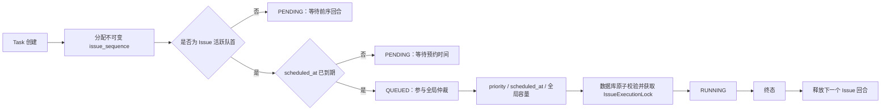

# Issue Task 有序回合设计与实施方案

**Date:** 2026-08-08

**Status:** Draft

**Scope:** 同一 Issue 下普通 Task、重试 Task、CI 自动修复 Task，以及未来由 Goal 等工作流创建的 Task

**Related:** [Serial Goal Mode Design](2026-07-18-serial-goal-mode-design.md)、[Persistent Issue Workspace Design](2026-05-05-persistent-issue-workspace-design.md)、[Multi-Harness Engine Design](2026-07-31-multi-harness-engine-design.md)

## 1. 结论

Codify 本质上是把 Claude Code、Codex 等交互式代码代理 CLI 搬到 Web，并补充持久化、
预约、并发调度、Docker 隔离、日志和 Git/MR 交付能力。

因此，同一 Issue 下的 Task 不应建模为一组相互独立的后台 Job，而应建模为一条可暂存、
可预约的 CLI 输入流：

```text
Issue = 一条持续的交互会话、工作区、分支、MR 和交付生命周期
Task  = 这条输入流中的一个持久化 CLI 回合
```

目标规则是：

> Issue 内严格按不可变回合序号执行；Issue 间继续按优先级、预约时间和全局容量调度。

`priority`、`scheduled_at`、重试来源和系统触发来源都不能改变同一 Issue 的回合顺序。
它们只决定当前队首 Task 何时以及以什么全局优先级竞争 Worker。

对于允许用户预约的 Task，预约时间还必须与 Issue 输入流保持一致：后序活跃 Task 的
`scheduled_at` 不得早于前序活跃 Task 的 `scheduled_at`。这个限制只排除已知不可能兑现的时间，
不承诺后序 Task 能在所选时间准时开始。

## 2. 问题与现状

当前系统已经保证同一 Issue 不会并行运行两个 Task，但没有保证先创建的 Task 先执行：

1. 所有到期的 `PENDING` Task 会批量变为 `QUEUED`。
2. Scheduler 再按 `priority`、是否预约、`scheduled_at`、`created_at` 全局挑选。
3. `IssueExecutionLock` 只阻止并发，不阻止后创建的 Task 先获得锁。

这会让后创建 Task 因更高优先级、更早预约时间或“立即执行”而越过前序 Task。

乱序与当前运行时基础存在直接冲突：

- 同一 Issue 的 Task 共享持久仓库工作区、分支和 MR。
- 会话恢复在 Task 真正执行时根据 Issue 当前 Harness lineage 解析。
- `fresh` Task 是会话重置点，后续 `continue` Task 必须发生在该重置之后。
- 前序摘要当前按较小 Task ID 构造，隐含假定创建顺序就是执行顺序。
- Task 创建时冻结 Prompt、Harness、Endpoint、Worker Profile 和 Runtime Bundle；乱序会让冻结的
  用户意图与真正看到的工作区、会话上下文不一致。

例如：

```text
Task A：先创建，预约明天，要求建立基础模块
Task B：后创建，立即执行，要求在基础模块上增加接口
```

当前 B 可能先执行。B 会把尚未执行的 A 当作“前序 Task”，但工作区中没有 A 的改动；明天 A
再执行时，它又不会把 ID 更大的 B 当作前序回合，虽然工作区已经包含 B 的修改。

这不是展示顺序问题，而是会话、工作区和执行历史的因果关系不一致。

## 3. 领域模型

### 3.1 Task 是回合，不是独立 Job

| Task 状态 | CLI 输入流语义 |
|---|---|
| `PENDING` | 已保存但尚未发送的输入，可编辑、取消或预约 |
| `QUEUED` | 当前 Issue 队首已经到期，等待全局 Worker |
| `RUNNING` | 输入已经发送给 Harness |
| `COMPLETED` / `FAILED` / `CANCELLED` | 该回合已经结束，CLI 可以接收下一回合 |

Web 允许用户在前一回合运行期间继续创建 Task，相当于终端中的输入缓冲；缓冲输入可以提前准备，
但不能越过前面的输入。

### 3.2 不变量

实现必须始终满足以下不变量：

1. 每个 Task 创建时获得同一 Issue 内不可变且唯一的 `issue_sequence`。
2. 同一 Issue 只有最早的非终态 Task 可以进入 `QUEUED` 或 `RUNNING`。
3. 任一 `RUNNING` Task 之前不存在 `PENDING`、`QUEUED` 或 `RUNNING` 的较小序号 Task。
4. 同一 Issue 最多存在一个 `RUNNING` Task，继续由 `IssueExecutionLock` 保证。
5. `priority` 只参与不同 Issue 队首之间的全局排序。
6. `scheduled_at` 是该 Task 的最早发送时间 `not_before`，不改变 `issue_sequence`。
7. 对新建或修改后的用户可预约 Task，活跃且有预约时间的 Task 按 `issue_sequence` 保持
   `scheduled_at` 非递减；`scheduled_at=null` 的立即或事件驱动 Task 不参与时间单调约束。
8. 终态 Task 不阻塞后续回合；终态 Task 遗留容器时，物理工作区锁继续阻塞后续执行，直到清理完成。
9. 重试、CI 自动修复、Goal continuation 等所有新 Task 都追加到 Issue 输入流尾部。

### 3.3 明确不提供的语义

第一版不提供：

- Task 拖拽重排或任意插队；
- 重试自动插回原 Task 后面；
- Task 失败后自动暂停整个 Issue 队列；
- DAG 或显式 Task 依赖图；
- 预约时间的准点完成承诺；
- 通过高优先级绕过同一 Issue 前序回合。

如果用户希望改变尚未执行的输入顺序，应取消相关 Task，再按目标顺序重新创建。失败暂停可以作为
后续独立策略设计，不能由 `retry_source_task_id` 隐式推导。

## 4. 顺序、预约和调度语义

### 4.1 两层调度

调度分为两个明确层次：

1. **Issue 内选队首**：选出 `issue_sequence` 最小的非终态 Task。
2. **Issue 间全局仲裁**：只在各 Issue 已到期的队首之间比较优先级、预约时间和全局容量。



### 4.2 预约

`scheduled_at` 定义为当前回合的最早可发送时间：

- 队首预约在未来时，整个 Issue 输入流等待。
- 非队首预约时间即使已经到达，也仍等待前序回合。
- 后创建的立即 Task 不得越过未来预约的队首。
- 队首实际开始时间可能因前一终态容器清理、全局并发或更高优先级 Issue 而延后。

为了不让用户选择一个根据当前队列已知必然无法兑现的时间，用户可预约 Task 还必须遵守 Issue 内
预约时间窗口。对 Task `T_i`：

```text
schedule_floor(T_i) = max(
    现有“必须选择未来时间”的最早值,
    所有活跃且 scheduled_at 非空的前序 Task 的 scheduled_at
)

schedule_ceiling(T_i) = min(
    所有活跃且 scheduled_at 非空的后序 Task 的 scheduled_at
)
```

- 新建普通 Task 和预约重试都追加到队尾，因此只有 `schedule_floor`，没有后序上限。
- 修改已有预约 Task 时必须同时满足下限和上限；边界时间允许相等。
- `PENDING`、`QUEUED`、`RUNNING` 属于活跃 Task；终态和已取消 Task 不参与窗口计算。
- `scheduled_at=null` 表示“前序完成后尽快执行”，不参与预约时间比较，也不会为后序 Task 提供已知下限。
- 前端禁用窗口外时间并说明约束来源；后端在持有 Issue 行锁后重新计算并做最终校验。
- 修改前序 Task 不自动顺延后序预约。若新时间超过后序 Task 的上限，操作失败，用户应先修改、取消
  或对相应后序 Task 执行“前序完成后立即执行”。

例如：

```text
T1 scheduled_at = 明天 10:00
T2 scheduled_at = 明天 12:00
T3 scheduled_at = 明天 14:00
```

新建 T2 时不得选择 10:00 之前；修改已有 T2 时可选窗口为 `[10:00, 14:00]`。允许 T2 选择
10:00 只表示它在时间上已经到期，真实执行仍必须等待 T1 终态和工作区锁释放。

现有每小时 Slot Capacity 继续限制用户选择的预约时间数量，但产品文案必须说明它是预约提交容量，
不是执行时长或准点完成保证。若未来需要保证执行时间，需要单独引入执行时长预测和容量预留，
不属于本方案。

### 4.3 立即执行和重新预约

- 对队首执行“立即执行”：清除其 `scheduled_at`，由 Scheduler 在下一周期正常领取。
- 对非队首执行“立即执行”：只清除该 Task 自身的 `scheduled_at`；它仍等待前序回合。API/UI 必须返回
  “前序完成后立即执行”，不能宣称已经绕过队列。
- 重新预约队首到未来：队首从 `QUEUED` 回到 `PENDING`，并阻塞全部后续 Task；新时间不得晚于现有
  活跃后序 Task 的最早预约时间。
- 重新预约非队首：只改变其在成为队首后的 `not_before` 条件，并必须落在前序下限与后序上限之间。
- 清除 `scheduled_at` 不会改写其他 Task 的预约时间；预约窗口在下一次打开或提交时按最新活跃队列
  重新计算。

### 4.4 优先级

优先级只在不同 Issue 的可运行队首之间生效。例如：

```text
Issue A：A1(P2) -> A2(P0)
Issue B：B1(P1)
```

全局可以先运行 B1，再运行 A1；A2 即使是 P0，也不能越过 A1。A1 终态后，A2 才以 P0 身份参与
下一次全局仲裁。

### 4.5 重试和系统回合

- 手工重试创建新 Task，获得当前最大 `issue_sequence + 1`。
- 重试保留 `retry_source_task_id` 和冻结的执行快照，但不继承源 Task 的队列位置。
- 普通重试使用 `scheduled_at=null`，成为队首后立即具备时间资格；预约重试必须选择不早于所有活跃
  前序预约时间的时间。
- CI 自动修复在 CI 事件通过门禁后创建，并追加到当时的队尾。
- Goal initial、continue、resume、approval continuation 等 Task 也使用同一追加规则。
- `trigger_source` 只记录 Task 为什么被创建，不决定顺序或插队权。

这符合交互式 CLI：失败回合已经发生；用户稍后点击重试，是输入流中新的回合，而不是重写历史。

### 4.6 会话模式

`session_mode="fresh"` 是输入流中的显式会话重置点。严格顺序保证：

1. fresh Task 在自己的序号位置启动新 lineage；
2. 它成功产出 session 后更新 Issue 当前 lineage；
3. 后续 continue Task 才能恢复该 session；
4. 不允许后续 continue Task 在 fresh Task 前执行并污染旧 lineage。

即使 Task 使用不同 Harness 或 fresh session，它们仍共享 Issue 仓库工作区，因此不能绕过 Issue 顺序。

## 5. 数据模型与迁移

### 5.1 Task 字段

新增：

```python
issue_sequence: Mapped[int] = mapped_column(Integer, nullable=False)
```

新增约束和索引：

```text
UNIQUE (issue_id, issue_sequence)
INDEX  (issue_id, status, issue_sequence)
```

`issue_sequence` 是领域顺序，Task 全局 `id` 继续作为资源标识。`created_at` 继续用于审计和展示，
不再承担执行顺序约束。

### 5.2 回填规则

按下列顺序为历史 Task 分配连续序号：

```sql
row_number() over (
  partition by issue_id
  order by created_at asc, id asc
)
```

迁移只建立历史逻辑顺序，不尝试重写已经发生的 `started_at` 或真实执行历史。部署前已经乱序完成的 Task
保持原审计事实；新规则只阻止后续继续乱序。

### 5.3 兼容迁移

当前迁移头为 `067_harness_key`。推荐分两阶段发布：

1. `068_task_issue_sequence`：新增 nullable 字段、回填历史数据、建立允许 null 的唯一索引；新代码始终写入
   序号，并能在启动审计中修复回滚期间旧代码插入的 null。
2. 稳定观察一个发布周期后，`069_task_issue_sequence_not_null`：确认 null 数量为零，再收紧 `NOT NULL`
   和正式唯一约束。

这样第一阶段仍可回滚到不认识该字段的旧 Backend。第二阶段以后若回滚应用版本，必须使用理解
`issue_sequence` 的兼容版本，不能直接回滚到旧创建逻辑。

### 5.4 序号分配

抽取统一的 Task 追加服务。服务必须：

1. `SELECT Issue ... FOR UPDATE`；
2. 校验 Issue 状态和调用方权限；
3. 查询该 Issue 当前最大 `issue_sequence`；
4. 若请求带预约，计算新队尾 Task 的 `schedule_floor` 并校验 `scheduled_at`；
5. 使用 `max + 1` 创建 Task；
6. 在同一事务中创建 Task Snapshot、Runtime Bundle 绑定及其他来源记录；
7. 一并提交。

当前普通创建、重试和 CI 自动修复路径已经锁定 Issue 行，应复用统一 helper，避免未来新增 Task 来源
忘记分配序号。唯一约束是最后一道并发保护，冲突不得静默改序，应回滚并重试整个追加事务。

所有带预约的创建和修改路径必须统一锁顺序：先获取 Issue 行锁并计算预约窗口，再获取 Slot advisory
lock，最后分配序号或修改时间并写入 Task。当前普通创建、retry 和 reschedule 的锁顺序必须一并收敛，
避免两个事务分别持有 Issue 锁和 Slot 锁后相互等待，也避免校验后队列变化造成预约窗口失效。

## 6. 后端实施方案

### 6.1 新增顺序领域服务

新增 `backend/app/core/issue_task_order.py`，集中维护：

- `ACTIVE_TASK_STATUSES = (PENDING, QUEUED, RUNNING)`；
- `allocate_issue_sequence()`；
- `active_predecessor_exists()`；
- `get_issue_queue_head()`；
- `build_issue_queue_context()`；
- `get_task_schedule_constraints()`；
- `validate_task_schedule_constraints()`；
- 执行前 `validate_issue_head_for_claim()`；
- Scheduler 启动时的缺失序号和非法 `QUEUED` 状态审计。

所有 API、Scheduler、序列化和 UI 投影必须使用同一套定义，禁止分别实现“队首”判断。

### 6.2 创建路径

修改：

- `backend/app/api/task_creation_service.py`
  - 普通 Task 和 retry Task 使用统一追加服务；
  - retry 永远追加，保留源快照和 Runtime Bundle 规则；
  - 普通创建和预约重试在 Issue 行锁内校验队尾 `schedule_floor`。
- `backend/app/core/ci_failure_collector.py`
  - CI repair Task 在 Issue 行锁内追加；
  - CI priority 只在它成为队首后生效。
- 后续 Goal coordinator 或其他自动化
  - 必须调用同一追加服务；
  - 禁止直接 `Task(...)` 后提交。

### 6.3 预约约束与修改

普通 Task 创建、预约重试和 `PATCH /tasks/{task_id}/schedule` 必须复用同一预约约束服务：

1. 锁定 Issue 行；
2. 按 `issue_sequence` 加载活跃且 `scheduled_at` 非空的 Task；
3. 先复用现有 datetime normalization/`resolve_scheduled_at()` 转为统一 UTC 时间，再在创建时计算队尾
   下限、修改时计算前序下限和后序上限；
4. 校验请求时间，再检查并占用 Slot Capacity；
5. 写入 `scheduled_at` 并提交。

约束失败返回结构化 `409 Conflict`，至少包含错误码、当前时间窗口和产生边界的 Task：

```json
{
  "code": "issue_schedule_order_conflict",
  "has_valid_window": true,
  "min_scheduled_at": "2026-08-09T10:00:00Z",
  "min_source_task_id": 101,
  "max_scheduled_at": "2026-08-09T14:00:00Z",
  "max_source_task_id": 103
}
```

前端加载后队列可能发生变化，因此禁用时间只用于即时反馈，提交时的后端事务校验才是最终真相。
失败后前端刷新约束，保留用户其他表单内容，不自动修改为边界时间。

若历史数据或时间流逝导致 `schedule_floor > schedule_ceiling`，返回 `has_valid_window=false`。此时没有
合法的重新预约时间，UI 禁用提交并引导用户先调整、取消后序预约，或清除当前/相邻 Task 的预约；
系统不得自动覆盖任何已保存时间。

### 6.4 入队

将 `_mark_eligible_as_queued()` 改为只提升 Issue 活跃队首。逻辑条件为：

```text
task.status = PENDING
AND task.scheduled_at is null or task.scheduled_at <= now
AND NOT EXISTS (
    same issue active task with smaller issue_sequence
)
AND NOT EXISTS active IssueExecutionLock for this issue
```

同一周期先将存在活跃前序的历史 `QUEUED` Task 降回 `PENDING`，再提升合法队首。该规范化主要处理
发布前遗留数据和异常恢复，不应成为正常状态转换路径。

Issue 状态沿用现有行为：只有到期队首进入 `QUEUED` 或真正 `RUNNING` 时才进入 `in_progress`；
未来预约或仅因前序阻塞的 Task 不应让 Issue 提前显示为执行中。

### 6.5 全局候选选择

`_get_next_task()` 只选择合法 `QUEUED` 队首。为兼容升级期间已经存在的非法 `QUEUED` 数据，查询本身
仍必须带 `NOT EXISTS active predecessor`，不能只相信入队步骤已经清理完毕。

队首之间继续使用现有全局规则：

1. `priority ASC`，即 P0、P1、P2；
2. 已到期预约 Task 优先于立即 Task；
3. `scheduled_at ASC`；
4. `created_at ASC, id ASC` 作为跨 Issue 稳定 tie-breaker。

### 6.6 原子领取

当前 `_running_issues` 只能作为单 Scheduler 进程的快速缓存，不能作为顺序真相。领取 Task 时必须在
数据库事务内：

1. 锁定 Issue 行；
2. 重新加载 Task 状态和预约时间；
3. 再次确认不存在较小序号活跃 Task；
4. 尝试插入 `IssueExecutionLock`；
5. 将 Task 从 `QUEUED` 更新为 `RUNNING`；
6. 同一事务提交锁和状态。

如果重新校验失败：

- 不启动 Worker；
- 释放或回滚本事务；
- 非法 `QUEUED` Task 恢复为 `PENDING`；
- 记录结构化原因，例如 `predecessor_active`、`schedule_not_due`、`issue_locked`。

这保证多个 Scheduler 实例、重启恢复以及 API 并发修改时都不会领取同一 Issue 的不同回合。

### 6.7 终态与物理清理

Task 变为 `COMPLETED`、`FAILED` 或 `CANCELLED` 后，逻辑上不再阻塞下一回合。但如果终态 Task 仍有
`container_id`，现有 retained-container 机制和 `IssueExecutionLock` 继续阻塞工作区，直到原始日志完成
固化并清理容器。

不能为了尽快释放队列而绕过容器清理锁，否则前后两个 Worker 仍可能同时修改同一个 daemon-local
Issue 工作区。

### 6.8 前序摘要、MR 和会话投影

- `build_previous_task_summaries()` 改为按 `issue_sequence` 查询较小序号 Task。
- Issue Task relationship、MR Task 历史和 overall summary 改为按 `issue_sequence` 排序。
- Worker 启动前增加不变量日志：当前 Task 之前不应存在活跃前序。
- 会话 ID 不需要复制到 Task 顺序字段；严格执行顺序会让现有运行时 session resolution 获得确定输入。

## 7. API 契约

Task 响应新增：

```json
{
  "issue_sequence": 3,
  "queue_position": 2,
  "blocked_by_task_id": 101,
  "schedule_constraints": {
    "has_valid_window": true,
    "min_scheduled_at": "2026-08-09T10:00:00Z",
    "min_source_task_id": 101,
    "max_scheduled_at": "2026-08-09T14:00:00Z",
    "max_source_task_id": 103
  }
}
```

字段含义：

| 字段 | 含义 |
|---|---|
| `issue_sequence` | Task 在 Issue 输入流中的不可变回合序号 |
| `queue_position` | Task 在当前非终态队列中的动态位置；终态为 `null` |
| `blocked_by_task_id` | 非队首时指向当前活跃队首；队首和终态为 `null` |
| `schedule_constraints` | 当前可预约时间窗口及产生上下界的 Task；不可预约 Task 为 `null` |

队列信息必须由后端批量计算，避免列表接口产生 N+1 查询。Issue 详情已经加载全部 Task，可在内存中
一次计算；Task 列表、预约列表和 Monitor 数据使用按 Issue ID 批量查询的 queue context。

新建 Task 尚无 Task 响应，新增 `GET /tasks/schedule-constraints?issue_id={id}` 返回队尾创建约束；修改
已有 Task 时传入 `task_id` 返回双向窗口。该接口与创建、重试、reschedule 提交接口复用同一领域函数，
但查询结果不替代提交事务中的再次校验。传入 `task_id` 时必须校验 Task 属于该 Issue、调用者有项目
权限且 Task 仍允许修改预约；不匹配时不得泄露其他 Issue 的时间或 Task 信息。

### 7.1 创建和重试响应

创建或重试响应同时返回队列字段。若新 Task 不是队首，前端成功提示应为：

```text
Task #102 已加入 Issue 队列第 3 位，当前等待 Task #100。
```

带预约的创建和预约重试若早于 `schedule_floor`，返回
`issue_schedule_order_conflict`，不得创建 Task、占用 Slot 或产生通知。

### 7.2 Execute-now 响应

非队首 Task 清除预约后返回成功，但响应必须包含阻塞事实：

```json
{
  "status": "success",
  "message": "Task will run after its predecessors complete",
  "queue_position": 2,
  "blocked_by_task_id": 101
}
```

### 7.3 Reschedule 响应

重新预约队首时返回 `blocked_successor_count`，供 UI 在提交前后显示影响范围。所有 reschedule 响应
返回更新后的 `schedule_constraints`；请求越过前序下限或后序上限时返回
`issue_schedule_order_conflict`，不得静默顺延相邻 Task。

### 7.4 兼容性

- 不新增 `BLOCKED` Task 状态；前序阻塞是由队列字段投影出的等待原因。
- 不改变现有 Task 状态枚举和终态判断。
- 旧 API 客户端可以忽略新增字段。
- `trigger_source`、`retry_source_task_id` 和 `scheduled_at` 保持现有存储含义。
- 预约顺序是写入规则和 API 校验，不新增数据库字段，也不复制第二份预约时间。

## 8. 前端实施方案

### 8.1 Issue 详情

修改 `IssueView.vue` 和 `issue-detail` 组件：

- Task 历史按 `issue_sequence` 展示，序号相同或缺失时才用 `(created_at, id)` 兼容排序。
- 当前执行卡优先展示 `RUNNING` Task，否则展示最小 `queue_position` 的活跃 Task，不能再选择最新创建
  的 `PENDING` Task。
- 非队首记录显示“排队第 N 位 · 等待 Task #X”。
- 队首未来预约显示“队首 · 预约等待”。
- 队首已到期显示“队首 · 等待 Worker”。
- 创建 Task 后提示其回合序号和动态队列位置。
- 打开新建 Task Drawer 时按 `issue_id` 获取队尾预约下限；预约控件禁用下限之前的日期和时间，并显示
  “不得早于 Task #X 的最早执行时间”。

### 8.2 Task 详情

- 元数据增加 Issue 回合序号、当前队列位置和阻塞来源。
- 非队首的“立即执行”文案改为“前序完成后立即执行”。
- 重新预约队首时确认框提示会阻塞多少后续 Task。
- `RescheduleDrawer.vue` 根据 `schedule_constraints` 同时禁用下限之前和上限之后的时间；边界允许选择。
- 若提交时收到 `issue_schedule_order_conflict`，刷新窗口并保留用户输入，提示由哪个前序或后序 Task
  改变了可选范围。
- Priority 帮助文案明确“只影响不同 Issue 队首之间的调度”。

### 8.3 Monitor 和 Schedule

Monitor 当前不能只用 `status + scheduled_at` 判断 ready：

- `queue_position = 1` 且预约已到的 Task 才属于 ready/queued。
- `queue_position > 1` 的 Task 归入“等待前序”分组。
- 未来队首归入“等待预约”分组。
- Schedule/Heatmap 仍展示所有有 `scheduled_at` 的 Task，但非队首显示“实际开始受前序影响”。
- `ScheduleOverview.vue` 的批量重新预约也必须使用同一时间窗口，不得通过另一个入口绕过限制。

中英文 i18n 同步增加队首、等待前序、预约上下限、约束来源、预约影响、Issue 内不可插队等文案。

## 9. 可观测性

新增 Scheduler 日志和指标：

- `issue_queue_head_promoted_total`
- `issue_task_predecessor_blocked_total`
- `issue_queue_invalid_queued_normalized_total`
- `issue_task_claim_rejected_total{reason}`
- 缺失或重复 `issue_sequence` 的启动审计数量

日志至少包含 `issue_id`、`task_id`、`issue_sequence`、`blocked_by_task_id` 和拒绝原因。不要在每个轮询
周期重复打印相同阻塞日志；仅在状态或阻塞者变化时记录，避免污染 Scheduler 日志。

## 10. 测试方案

### 10.1 模型与迁移

- 历史 Task 按 `(created_at, id)` 正确回填序号。
- 同一 Issue 不允许重复序号，不同 Issue 可使用相同序号。
- 并发普通创建、重试和 CI 自动修复得到唯一递增序号。
- 第一阶段兼容迁移能修复 null；第二阶段收紧前检查 null 为零。

### 10.2 Scheduler 单元测试

1. 同一 Issue 先建 P2、后建 P0，仍先选择 P2。
2. 队首预约未来，后续立即 Task 保持 `PENDING`。
3. 队首预约到期后，仅队首进入 `QUEUED`。
4. 队首失败、完成或取消后，下一 Task 成为队首。
5. 非队首历史 `QUEUED` 会被规范化为 `PENDING`。
6. 查询自身即使面对非法历史状态，也不会返回非队首。
7. 两个 Scheduler 同时领取时，只有一个能原子领取队首。
8. 不同 Issue 仍可并行，并继续遵守 P0、P1、P2 全局优先级。
9. 终态 Task 遗留容器时，下一 Task 继续等待 Issue 锁。
10. Crash recovery 不会恢复或启动非队首 Task。

### 10.3 API 测试

- 创建、重试、CI repair 都追加序号。
- `queue_position` 和 `blocked_by_task_id` 在创建、取消、终态转换后正确变化。
- T1 预约 10:00 后，新建 T2 或预约重试选择 10:00 之前会返回结构化 `409`，选择 10:00 或之后成功。
- T1/T2/T3 分别预约 10:00、12:00、14:00 时，T2 只能改到 `[10:00, 14:00]`。
- 将 T1 改到 T2 之后会失败且不会级联修改 T2；取消 T2 或清除其预约后窗口按最新活跃队列重算。
- 时间流逝或历史冲突造成下限晚于上限时返回 `has_valid_window=false`，不得提交或自动改写其他 Task。
- 立即和事件驱动 Task 的 `scheduled_at=null` 不参与窗口计算；终态 Task 也不参与。
- 并发创建和 reschedule 在 Issue 行锁内重新校验，不能提交单调顺序冲突。
- 非队首 execute-now 只清除自身预约，不插队。
- 重新预约队首会让其从 `QUEUED` 回到 `PENDING` 并报告受影响后续数量。
- Task 列表批量投影不产生逐 Task 查询。

### 10.4 Worker 和会话测试

- 前序摘要只包含较小 `issue_sequence` Task，并按序输出。
- fresh Task 后的 continue Task 恢复 fresh 产生的 session。
- 不同 Harness 的 Task 仍按 Issue 序号共享工作区顺序。
- 乱序执行保护在 Worker 启动前能够拒绝异常 Task。

### 10.5 前端测试

- Issue 当前执行卡选择队首而不是最新 PENDING Task。
- Task 历史正确显示队列位置和阻塞者。
- Monitor 不把非队首立即 Task 计入 ready。
- 非队首 execute-now 和队首 reschedule 文案准确。
- 新建和预约重试禁用前序下限之前的时间，修改 Task 同时禁用上下界之外的时间，边界可选。
- 提交时队列变化导致 `409` 后刷新约束、保留表单内容并显示约束来源。
- 中英文文案和窄屏布局通过。

### 10.6 集成验收

至少运行以下真实序列：

```text
Issue A:
  A1 P2 immediate
  A2 P0 immediate
  A3 scheduled

Issue B:
  B1 P1 immediate
```

验收：

- A 的 `started_at` 顺序严格为 A1、A2、A3。
- B1 可以依据全局优先级在 A 的相邻回合之间运行。
- A 内任何时刻最多一个容器。
- A2/A3 使用与顺序一致的工作区和 session lineage。
- 重启 Scheduler 后顺序不改变。

## 11. 发布与回滚

### 11.1 发布前审计

输出并人工确认：

- 缺失 `issue_sequence` 数量；
- 同一 Issue 多个 `RUNNING` 数量；
- 同一 Issue 多个 `QUEUED` 数量；
- 已经存在的 `started_at` 乱序历史，仅记录不修改；
- 活跃预约 Task 中 `scheduled_at` 不符合序号单调顺序的历史数量；只审计，不自动改写用户预约；
- 终态但仍有容器引用的 Issue 数量。

### 11.2 第一阶段发布

1. 发布兼容迁移 `068`。
2. 部署写入 `issue_sequence` 的 Backend 和 Scheduler。
3. Scheduler 启动审计并规范化非队首 `QUEUED`；不得停止已经运行的容器。
4. 启用新写入的预约窗口校验、API queue context 和 UI 展示；历史冲突仍由严格执行顺序保证安全，
   用户后续修改时必须修复或清除冲突，不自动改写时间。
5. 运行 PostgreSQL、Mock E2E 和至少一个真实 Docker Host smoke。

### 11.3 观察与收紧

观察一个发布周期：

- 没有 null 或重复序号；
- 没有非队首领取；
- 没有队列永久阻塞；
- 新建和修改没有产生新的预约时间单调冲突；
- Monitor 的 ready/waiting 数量与 Scheduler 一致；
- 预约和重试的用户提示没有歧义。

满足后再发布 `069` 收紧非空约束。

### 11.4 回滚

- `068` 阶段可以回滚应用，保留新增 nullable 字段和索引，不执行破坏性 downgrade。
- 回滚到旧 Scheduler 后顺序保证会暂时失效；回滚窗口应暂停在同一 Issue 创建多个活跃 Task。
- `069` 后只允许回滚到仍会写入 `issue_sequence` 的兼容版本。
- 已经运行或终态的 Task 不重排、不改写时间戳、不删除历史。

## 12. 预计影响文件

Backend：

- `backend/app/models.py`
- `backend/alembic/versions/068_task_issue_sequence.py`
- `backend/alembic/versions/069_task_issue_sequence_not_null.py`
- `backend/app/core/issue_task_order.py`
- `backend/app/core/scheduling.py`
- `backend/app/core/issue_execution_locks.py`
- `backend/app/scheduler.py`
- `backend/app/api/task_creation_service.py`
- `backend/app/api/task_action_routes.py`
- `backend/app/api/task_responses.py`
- `backend/app/api/tasks.py`
- `backend/app/api/issues.py`
- `backend/app/core/ci_failure_collector.py`
- `backend/app/core/worker_gitlab.py`
- `backend/app/core/worker_task_lifecycle.py`
- Scheduler、Task API、CI repair、Worker 和迁移测试

Frontend：

- `frontend/src/api/tasks.ts`
- `frontend/src/api/index.ts`
- `frontend/src/views/IssueView.vue`
- `frontend/src/views/TaskView.vue`
- `frontend/src/components/TaskFormDrawer.vue`
- `frontend/src/components/RescheduleDrawer.vue`
- `frontend/src/components/issue-detail/IssueTaskPanel.vue`
- `frontend/src/components/issue-detail/IssueTaskRecord.vue`
- `frontend/src/views/ScheduleOverview.vue`
- `frontend/src/features/monitor/useMonitorRuntimeState.ts`
- `frontend/src/i18n/messages/en.ts`
- `frontend/src/i18n/messages/zh-CN.ts`
- 对应组件和页面单元测试

## 13. 成本评估

| 工作 | 预计成本 |
|---|---:|
| 数据模型、迁移、统一追加服务 | 1–2 人日 |
| Scheduler 队首选择、原子领取、恢复和测试 | 2–3 人日 |
| API queue context、预约窗口和操作语义 | 1–1.5 人日 |
| Issue、Task、Monitor、Schedule UI 和测试 | 1.5–2 人日 |
| PostgreSQL、Mock E2E、真实 Host smoke 和发布观察 | 1 人日 |

完整交付预计 6–8 人日。Backend 顺序约束、预约窗口、数据库迁移和原子领取是上线门槛；不能只上线 UI 排序，
也不能只修改 `_get_next_task()` 的 `ORDER BY`。

## 14. 验收标准

1. `issue_sequence` 成为同一 Issue Task 顺序的唯一领域真相。
2. 同一 Issue 不存在后创建活跃 Task 越过前序活跃 Task 的路径。
3. 新建或修改用户可预约 Task 时，活跃预约时间按 `issue_sequence` 非递减，前后端使用同一窗口规则。
4. Priority 和预约只在队首阶段生效，不改变 Issue 输入流；预约时间仍只是 `not_before`，不是准点承诺。
5. 普通 Task、retry、CI repair 和未来 Goal Task 使用同一追加和队首规则。
6. 多 Scheduler、重启恢复和历史非法 `QUEUED` 数据不能绕过顺序约束。
7. 前序摘要、MR 历史、会话恢复和前端展示与 `issue_sequence` 一致。
8. 非队首 Task 在 API 和 UI 上明确显示阻塞者，Monitor 不将其计为 ready。
9. 终态容器清理完成前仍保护共享工作区，完成后队列自动推进。
10. 不同 Issue 保持全局优先级调度和并行能力。
11. 迁移、回滚边界和真实 Docker Host 验证均有可复查证据。
