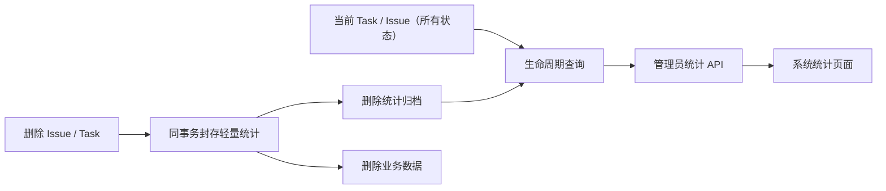

# 系统生命周期统计设计（参考版）

**Date:** 2026-08-09

**Status:** Revised Draft — 低成本 MVP

**Scope:** 面向平台管理员的系统级参考统计，覆盖当前业务数据和统计能力启用后被删除的数据

**Related:** [System Data Cleanup Design](2026-05-10-system-data-cleanup-design.md)、[Analytics Providers V1 Design](2026-04-21-analytics-providers-v1-design.md)

## 1. 结论

新增独立的管理员“系统统计”页面，但把它定位为运营参考，不作为计费、审计或容量结算依据。

第一版采用最小实现：

| 数据状态 | 权威来源 | 统计时机 |
|---|---|---|
| `PENDING` / `QUEUED` / `RUNNING` | 当前 `tasks` | 页面请求时实时聚合 |
| 当前仍保留的 `COMPLETED` / `FAILED` / `CANCELLED` | 当前 `tasks` | 页面请求时实时聚合 |
| 被删除的 Task | `deleted_task_statistics` | 删除前，在同一个数据库事务内封存 |
| 当前 Issue | 当前 `issues` | 页面请求时实时聚合 |
| 被删除的 Issue | `deleted_issue_statistics` | 删除前，在同一个数据库事务内封存 |

统一查询模型为：

```text
系统生命周期 Task = 当前所有 Task UNION ALL 已删除 Task 统计归档
系统生命周期 Issue = 当前所有 Issue UNION ALL 已删除 Issue 统计归档
```

这意味着：

- 运行中数据是请求时实时值；
- 已完成但未删除的数据也是请求时实时值，不在终态额外写事实；
- 已删除数据在删除动作发生时封存；
- 页面刷新即可看到最新结果，不依赖定时汇总；
- 第一版不做 Attempt 级永久统计、定时对账、数据库删除 Trigger 和永久日汇总。



## 2. 设计取舍

### 2.1 为什么不在 Task 终态时写统计事实

当前 Task 终态可能由 Worker、Scheduler 恢复、取消、超时、启动失败和人工覆盖等多条路径写入。
要求每条终态路径同步投影事实，会增加改造面、事务耦合和漏写风险。

本功能只做参考统计，因此第一版直接查询仍存在的终态 Task；只有业务记录即将删除时才封存。这样：

- 终态后的 Token、代码变更或人工状态修正会自然反映在下次查询中；
- 不需要改造所有终态提交路径；
- 删除前抓取的是业务记录最后一次已提交状态；
- 统计写入只集中在现有的删除入口。

代价是没有独立的终态事件历史，不能回答“某个 Task 曾经是什么状态”。页面只展示当前状态或删除时的
最终快照，这符合参考统计的定位。

### 2.2 准确性边界

第一版提供趋势和总量参考，但不承诺：

- 计费级准确性；
- 功能启用前已经删除数据的恢复；
- 完整的状态变更历史；
- Attempt 或模型调用次数的永久统计；
- 精确 P50/P95、成本金额或 Issue 关闭耗时；
- 跨数据库和 Docker/文件系统操作的全局原子性。

页面必须显示“参考统计”和统计覆盖起点，不能把它描述为完整审计记录。

## 3. 目标与非目标

### 3.1 目标

1. 管理员可以查看系统当前保留数据的实时总量和趋势。
2. 统计能力启用后，通过标准删除入口删除的 Task/Issue 仍保留在累计统计中。
3. 系统清理 90 天以前的业务数据时，累计 Task/Issue 数及已知运行指标不随之下降。
4. 只保存轻量结构化指标，不保留 Prompt、日志、密钥、Email 或原始错误内容。
5. 实现范围集中在删除封存、查询 API 和一个简单管理页面。
6. 对缺失数据和覆盖范围作明确说明，不把未知值当作精确零值。

### 3.2 非目标

第一版不包括：

- 修改普通用户现有 `/stats/analytics` 的 7/30/90 天语义；
- 让普通 Analytics 自动包含已删除数据；
- Task/Issue 状态事件仓库；
- Attempt 级生命周期事实；
- Provider、Project 或 Worker Profile 独立历史维表；
- 通用 BI、CSV 导出、复杂钻取和多维交叉分析；
- PostgreSQL 删除 Trigger；
- 定时对账和日汇总表；
- P50/P95、价格或货币成本；
- 恢复功能启用前已经永久删除的数据。

## 4. 生命周期与统计时机

### 4.1 当前业务数据

生命周期查询读取 `tasks` 中的所有状态，而不是只读取活动状态：

- `PENDING`
- `QUEUED`
- `RUNNING`
- `COMPLETED`
- `FAILED`
- `CANCELLED`

运行中时长、当前排队数等值使用数据库当前时间实时计算。终态 Task 的状态、Token、代码变更和时间字段
也在每次请求时从当前行读取。

因此，Task 从运行中进入终态时不需要额外统计任务，也没有“等下一次定时统计”的延迟。

### 4.2 删除已终态 Task

普通 Issue 删除或管理员系统清理在删除 Task 之前：

1. 锁定 Issue 和即将删除的 Task 行；
2. 从 Task 及其现有执行 Snapshot 读取允许保留的统计字段；
3. Upsert `deleted_task_statistics`；
4. 写入删除时间、删除原因和操作人 ID；
5. 删除业务记录；
6. 在同一个数据库事务内提交。

提交前，其他查询看到当前 Task；提交后，其他查询看到删除归档。归档写入失败时，数据库业务删除也回滚。

### 4.3 强制删除未终态 Task

管理员系统清理使用 `force=true` 删除活动 Task 时，同样写入归档：

```text
last_status = pending | queued | running
deleted_before_terminal = true
terminal_at = null
```

这类 Task：

- 计入历史 Task 总数；
- 计入“未终态删除”；
- 不计入 Completed/Failed/Cancelled；
- 不进入成功率分母；
- 删除提交后不再计入当前 Pending/Queued/Running。

### 4.4 未来新增删除入口

当前普通 Issue 删除和管理员系统数据清理必须复用同一个封存服务。未来如增加单 Task 硬删除、批量删除或
其他清理入口，也必须先调用同一服务；未接入的非标准数据库删除不在统计保证范围内。

## 5. 核心不变量

1. 当前 `tasks` 和 `deleted_task_statistics` 在已提交状态下互斥。
2. 同一个 `source_task_id` 最多有一条删除归档。
3. 当前 `issues` 和 `deleted_issue_statistics` 在已提交状态下互斥。
4. 删除统计归档和数据库业务删除在同一个事务内提交或回滚。
5. 统计归档不建立指向可删除 Task、Issue、User、Provider 或 Worker Profile 的级联外键。
6. 统计归档不参与系统数据清理、Workspace 清理和 Runtime Archive 清理。
7. 未知 Token、代码统计或时间值保持 NULL/Unknown，不参与平均值分母。
8. 功能只保证从明确的 `capture_started_at` 起、通过标准删除入口删除的数据。
9. 所有 Task 创建和重试入口必须先锁定对应 Issue 行；删除入口持有同一 Issue 行锁期间，不允许插入新 Task。

这里不要求终态变更与统计事实双写，因为当前终态 Task 本身就是查询来源。

## 6. 数据模型

### 6.1 `deleted_task_statistics`

只保存已经被删除的 Task，每个 Task 一行。

建议字段：

| 分类 | 字段 | 说明 |
|---|---|---|
| 主键 | `id` | 自增内部主键 |
| 原始身份 | `source_task_id` | 唯一，不建立指向 `tasks` 的 FK |
| 归属 | `source_issue_id`、`project_id` | 保留原始标识 |
| 发起人 | `initiator_user_id` | 只保存原始 ID，不建立 FK，不复制用户名或 Email |
| Provider | `provider_id`、`provider_name_snapshot`、`provider_model_snapshot` | 缺失时显示 Unknown |
| Harness | `harness_key`、`adapter_version`、`cli_version` | 来自现有执行 Snapshot，缺失允许为 NULL |
| Worker | `worker_profile_id`、`worker_profile_name_snapshot` | 缺失允许为 NULL |
| Task 属性 | `task_mode`、`trigger_source`、`priority`、`is_retry` | 用于基础分类 |
| 结果 | `last_status`、`deleted_before_terminal`、`is_manually_overridden` | 删除时最终状态 |
| 时间 | `created_at`、`scheduled_at`、`started_at`、`terminal_at` | `terminal_at` 是删除时复制的 `Task.completed_at` |
| 用量 | `input_tokens`、`output_tokens` | 缺失为 NULL；完整性由查询根据两列推导 |
| 代码 | `additions`、`deletions`、`total_changes`、`change_data_available` | 区分已知零和未知 |
| 删除 | `source_deleted_at`、`deletion_reason`、`deleted_by_user_id` | 删除元数据 |
| 质量 | `schema_version`、`archived_at` | 支持未来兼容 |

约束和首批索引：

- `UNIQUE(source_task_id)`；
- 索引 `created_at`、`terminal_at`、`last_status`、`project_id`、`provider_id`、`harness_key`、
  `source_deleted_at`；
- 不预先为所有维度组合建立复合索引。

排队时间、执行时间和 `total_tokens` 可以在查询 CTE 中由原始字段计算，不必重复保存。
Provider Runtime Snapshot 和 Worker Profile Snapshot 只读取上表列出的白名单字段，不复制其中的
`base_url`、System Prompt、环境变量、挂载路径或 Credential 引用。

### 6.2 `deleted_issue_statistics`

只保存已经删除的 Issue，每个 Issue 一行：

- `source_issue_id`：唯一，无 FK；
- `project_id`；
- `initiator_user_id`，无 FK；
- `created_at`、`last_status`；
- `had_merge_request`；
- `source_deleted_at`、`deletion_reason`、`deleted_by_user_id`；
- `forced_with_active_tasks`；
- `schema_version`、`archived_at`。

Task 数、Token 和代码变更不冗余保存到 Issue 归档，统一从 Task 数据按 `source_issue_id` 聚合。

### 6.3 `system_statistics_metadata`

第一版只需要一条元数据记录：

- `id=1`：固定主键；
- `capture_started_at`：所有旧应用实例退出、标准删除入口已经启用封存后的时间；
- `schema_version`；
- `updated_at`。

`capture_started_at` 不是建表时间，也不是新版本第一个实例启动时间。

### 6.4 代码变更数据可用性

当前 Task 的 `additions/deletions/total_changes` 默认值为 0，无法区分“真实零变更”和“尚未采集”。
为避免把未知错误描述为零，Migration 069 同时给 `tasks` 增加：

```text
change_stats_recorded_at nullable datetime
```

现有 `worker_results.py` 在从结构化结果或 GitLab API 成功取得非负且一致的统计时，以及 Task stats PATCH
路径在成功保存统计值时，都同步设置该字段，包括真实的三个零值。三个值必须满足：

```text
additions >= 0
deletions >= 0
total_changes = additions + deletions
```

不满足时拒绝 PATCH；Worker 结果路径记录 Warning 并保持 `change_stats_recorded_at=NULL`。删除归档的
`change_data_available` 根据该字段生成。

Task stats GET 在 `change_stats_recorded_at IS NOT NULL` 时直接返回已持久化值，包括三个零；只有该字段为空时
才允许回退 GitLab 临时查询。仅由 GET 临时查询到但没有持久化的值不进入生命周期累计。

对已有数据只做保守回填：任何代码变更字段大于 0 时可设置为已记录；三个字段均为 0 的旧数据保持
Unknown。页面展示覆盖率，Unknown 不进入代码变更平均值。

Token 完整性不增加新字段，直接按两列推导：

```text
complete = input_tokens IS NOT NULL AND output_tokens IS NOT NULL
partial = 只有一列非 NULL
missing = 两列均为 NULL
```

生命周期“总 Token”和平均值只使用 `complete` 样本。`partial` 只计入数据质量数量，不把缺失一侧补成零。

### 6.5 Provider、Harness 和 Worker 规范化

当前 Task 查询和删除归档必须使用同一套取值优先级，避免同一个 Task 在删除前后移动到其他分组。

```text
provider_id:
  provider_runtime_snapshot.provider_id -> Task.provider_id -> Unknown

provider_name:
  provider_runtime_snapshot.provider_name -> 当前 Provider.name -> Unknown

provider_model:
  Task.model_name -> provider_runtime_snapshot.configured_model -> 当前 Provider.model -> Unknown

harness_key:
  TaskWorkerProfileSnapshot.harness_key -> Task.projected_harness_key -> Unknown

adapter_version / cli_version:
  TaskWorkerProfileSnapshot 对应字段 -> NULL

worker_profile_id / worker_profile_name:
  TaskWorkerProfileSnapshot.worker_profile_id/profile_name -> Task/当前 Worker Profile -> Unknown
```

删除服务把上述规范化结果写入归档；当前查询用相同表达式生成规范化列。Provider 或 Worker Profile 删除后，
优先使用已有执行 Snapshot，不重新解释为当前默认配置。

## 7. 删除封存服务与并发

新增一个小型统一服务，例如：

```text
backend/app/core/system_statistics_deletion.py
```

调用形式：

```python
await archive_issue_statistics_before_delete(
    db,
    issue_id=issue.id,
    deletion_reason=...,
    deleted_by_user_id=...,
    force=...,
)
```

服务在现有删除事务内完成：

1. `SELECT issue ... FOR UPDATE`；
2. 按 Task ID 升序 `SELECT tasks ... FOR UPDATE`，并强制刷新 Session 中可能已经加载的行；
3. 批量 Upsert 删除 Task 归档；
4. Upsert 删除 Issue 归档；
5. `flush` 并校验归档行数；
6. 由现有删除流程继续删除业务数据并提交。

并发规则保持简单：

- 删除路径统一按 `Issue -> Task（ID 升序）` 加锁；
- 所有 Task 创建和重试路径必须先取得同一个 Issue 行锁，再插入 Task；
- 写入代码变更统计的 PATCH 路径对 Task 使用 `FOR UPDATE`；
- 普通 Issue 删除仍拒绝活动 Task，因此主要并发风险只存在于管理员强制清理；
- 强制清理获得 Task 锁后，以锁定时最后已提交的数据生成参考快照；
- 删除归档提交后不再接受修正，避免引入归档版本协议。

不为 Attempt 加锁或归档，因为 Attempt 生命周期统计不在第一版范围。

### 7.1 外部资源清理边界

Docker 容器、Workspace 和 Runtime Archive 文件操作不能与 PostgreSQL 事务真正原子化。继续沿用现有
安全删除顺序；本设计只保证统计归档与数据库 Task/Issue 删除在同一个数据库事务内。

统计封存不能放宽现有容器、Workspace、Issue 状态和强制删除规则。

## 8. 查询口径

### 8.1 规范化查询

新增独立查询模块，构造两个 CTE：

```text
all_task_statistics = current tasks UNION ALL deleted_task_statistics
all_issue_statistics = current issues UNION ALL deleted_issue_statistics
```

两个分支投影相同的列，并增加：

```text
data_state = retained | deleted
```

当前 Task 分支包含所有状态。删除归档分支只包含已删除行，因此无需 `NOT EXISTS`、终态回填或事实优先级
规则。

规范化时，当前 Task 的 `completed_at` 投影为 `terminal_at`，避免为当前业务表新增另一个终态时间字段。

### 8.2 时间范围

为避免一个筛选器具有两种含义，第一版 Overview 和 Breakdown 固定统计整个生命周期，不提供 `from/to`。
`current_state` 始终是当前快照，不应用 `data_state`，但应用 Project/Provider/Harness 等维度筛选。

只有 Trends 提供独立范围参数：

```text
range = 90d | 1y | all
```

默认 `all`。范围边界按每条趋势自己的事件时间计算：

- Task 创建趋势：`created_at`；
- Task 结束趋势、Token、代码变更和执行时长：`terminal_at`；
- 删除趋势：`source_deleted_at`；
- Issue 创建趋势：Issue `created_at`。

趋势响应必须返回每条序列的 `time_basis`。同一张图不混合不同 `time_basis` 的数值，页面范围控件标注为
“趋势时间范围”，不影响 Overview 和 Breakdown。

### 8.3 时区与分桶

第一版固定报表时区为 `Asia/Shanghai`，API 同时返回该时区。数据库字段继续按现有无时区 UTC 约定存储，
但必须在 PostgreSQL 中先将时间解释为 UTC、转换到报表时区，再执行 `date_trunc`；不能只依赖浏览器移动
日期标签。

默认分桶：

- 90 天以内：日；
- 2 年以内：周；
- 2 年以上：月。

API 最多返回约 400 个 Bucket，跨度过大时自动使用更粗粒度。该页面是参考统计，无需提供任意粒度的
精确查询。

## 9. 指标口径

### 9.1 当前运行态

只从当前业务表计算：

- Pending、Queued、Running；
- 当前活跃 Issue；
- 长时间运行 Task；
- 当前排队时间。

### 9.2 生命周期累计

从当前行和删除归档合并计算：

- 历史 Issue 总数；
- 历史 Task 总数；
- Completed、Failed、Cancelled；
- 未终态删除；
- 已删除 Issue/Task 数；
- 已知总执行时长；
- 已知总 Token；
- 已知总代码变更。

第一版不展示“历史 Harness Attempt 数”。Task 数命名为“Task 数”，不能称为模型调用次数或实际执行
次数。

### 9.3 成功率

```text
finished = completed + failed + cancelled
success_rate = completed / finished
failure_rate = failed / finished
```

`deleted_before_terminal` 不进入 `finished`，单独展示。响应同时返回分子、分母，避免只有百分比。

### 9.4 排队和执行耗时

沿用当前 Analytics 口径：

```text
queue_base = scheduled_at > created_at ? scheduled_at : created_at
queue_wait_seconds = started_at - queue_base
execution_seconds = terminal_at - started_at
```

时间缺失、结束早于开始或结果不可信时为 NULL。第一版只展示总时长、平均值和有效样本数，不实现 P50/P95。

### 9.5 Token 和代码变更覆盖率

代码变更只对 `change_data_available=true` 的值求和。Token 总量和平均值只使用 Complete 样本。响应同时返回：

```text
complete_samples
partial_samples
missing_samples
eligible_samples
coverage_rate
```

代码变更不需要 `partial_samples`，可返回 0。前端使用“完整样本 Token”“已记录代码变更”等措辞，并展示
覆盖率。

- Token `eligible_samples`：已经进入终态且 `started_at` 非空的 Task；
- 代码变更 `eligible_samples`：`task_mode=execute` 且状态为 Completed 的 Task；
- `deleted_before_terminal` 不进入两类覆盖率分母。

## 10. 管理员 API

第一版只新增三个接口：

- `GET /api/admin/system-statistics/overview`
- `GET /api/admin/system-statistics/trends`
- `GET /api/admin/system-statistics/breakdowns`

所有接口使用 `require_admin_user`，不能复用可能向普通用户开放的 Analytics 权限。

Overview 和 Breakdown 参数控制在：

- `project_id`；
- `provider_id`；
- `harness_key`；
- `data_state=all|retained|deleted`。

Trends 使用相同维度参数，并额外接受 `range=90d|1y|all`，默认 `all`。

Provider/Harness 筛选只作用于 Task 指标；Issue 指标只应用 Project 和 `data_state`。Trends 的 Issue 序列再
应用自己的 `range`，避免为了筛选 Issue 引入昂贵且语义不清的 Task 关联条件。

Overview 返回：

- `current_state`：当前 Pending/Queued/Running 和活跃 Issue；
- `lifetime`：生命周期 Task/Issue、终态、已知 Token/代码量/时长；
- `deletion`：已删除 Task/Issue 和未终态删除；
- `coverage`：`capture_started_at`、Token/代码覆盖率和参考统计声明；
- `as_of`、`reporting_timezone`。

Breakdown 第一版只支持 Project、Provider、Harness，返回 Top N 和 Unknown 分组。Project 名称无法取得时回退
`Project {id}`，不为此新增独立 Project 历史维表。

## 11. 管理员页面

### 11.1 路由和导航

- 路由：`/system-statistics`
- 路由名：`SystemStatistics`
- 权限：`requiresAuth: true`、`requiresAdmin: true`
- 导航：Administration 分组
- 标题：系统统计 / System Statistics

普通 Analytics 保持不变。

### 11.2 第一版页面结构

页面使用现有 Naive UI 和现有轻量图表能力，不引入新的图表库。

1. 顶部说明：参考统计、删除数据覆盖起点、报表时区、最后刷新时间和手动刷新。
2. 当前运行态：Pending、Queued、Running、长时间运行、活跃 Issue。
3. 生命周期累计：历史 Task/Issue、成功率、已知 Token/代码量/执行时长、已删除数量。
4. 基础趋势：Task 创建/结束、删除趋势。
5. 基础 Breakdown：Project、Provider、Harness Top N。
6. 数据说明：Token/代码覆盖率、Unknown 比例、功能启用前删除数据不可恢复。

Overview 和 Breakdown 固定查看整个生命周期。趋势单独提供 `90 天 / 1 年 / 全部` 范围，默认“全部”。
可选 60 秒刷新只刷新 Overview；趋势和 Breakdown 在筛选变化或手动刷新时获取。

已删除 Task 不提供详情链接，只显示脱敏快照。颜色不能作为状态的唯一表达。

## 12. 迁移与上线

当前迁移链以 `068_issue_sequence_lineage.py` 为头。

### 12.1 Migration 069

新增 `069_system_lifecycle_statistics.py`：

- 创建 `deleted_task_statistics`；
- 创建 `deleted_issue_statistics`；
- 创建 `system_statistics_metadata`，插入固定 `id=1` 且 `capture_started_at=NULL` 的元数据行；
- 给 `tasks` 增加 `change_stats_recorded_at`；
- 创建必要的唯一约束和首批索引；
- Migration 不把 `capture_started_at` 设置为非 NULL；
- 不安装删除 Trigger。

### 12.2 发布顺序

1. 先运行兼容的 Migration 069。
2. 发布包含删除封存、查询 API 和页面的新应用。
3. 确认所有旧 Backend/Scheduler 实例已经退出。
4. 确认普通 Issue 删除和管理员系统清理均已接入封存服务。
5. 由部署人员执行以下幂等 SQL，从该时刻开始对标准删除入口提供保证：

```sql
UPDATE system_statistics_metadata
SET capture_started_at = timezone('utc', now()),
    updated_at = timezone('utc', now())
WHERE id = 1 AND capture_started_at IS NULL;
```

执行后用 `SELECT capture_started_at FROM system_statistics_metadata WHERE id = 1` 验证结果。重复执行不得重置
第一次成功激活的时间。该步骤是部署检查项，不新增管理 API 或后台命令。

如果采用滚动发布，混合版本窗口内的删除不计入保证范围。为了缩小窗口，发布期间应暂停管理员批量清理；
普通删除无法暂停时，也必须把强保证起点放在旧实例全部退出之后。

`capture_started_at` 为空时页面显示“删除数据覆盖保证尚未启用”，不能自动用建表时间或最早归档时间代替。

### 12.3 历史数据

无需回填当前终态 Task：所有当前 Task 都由实时分支直接查询，发布后立即可见。

Migration 069 之前已经删除的数据无法从当前数据库恢复。第一版不提供备份导入工具。页面固定显示：

```text
当前仍保留的数据已纳入统计；删除数据从 <capture_started_at> 起通过标准删除入口保留。
```

## 13. 性能策略

第一版直接聚合当前表和删除归档，不创建日 Rollup，也不设硬性的亚秒 SLA。

控制成本的措施：

- 趋势最多约 400 个 Bucket；
- Breakdown 只返回 Top N；
- 只为常用时间和维度列建索引；
- Overview、趋势、Breakdown 分接口加载；
- 页面不持续轮询全生命周期趋势。

只有生产数据和 `EXPLAIN ANALYZE` 证明查询不可接受时，才考虑增加可重建的日汇总缓存。

## 14. 实施文件边界

预计新增：

- `backend/alembic/versions/069_system_lifecycle_statistics.py`
- `backend/app/core/system_statistics_deletion.py`
- `backend/app/api/system_statistics_queries.py`
- `backend/app/api/system_statistics.py`
- `frontend/src/views/SystemStatistics.vue`
- 对应的精简 Backend/Frontend 测试

预计修改：

- `backend/app/models.py`
- Backend Router 注册
- `backend/app/api/issues.py`
- `backend/app/core/system_data_cleanup.py`
- `backend/app/core/worker_results.py`
- `backend/app/api/task_stats_routes.py`
- `frontend/src/api/index.ts`
- `frontend/src/router/index.ts`
- `frontend/src/App.vue`
- `frontend/src/i18n/messages/en.ts`
- `frontend/src/i18n/messages/zh-CN.ts`

不需要修改所有 Worker/Scheduler 终态提交路径，也不继续扩张现有 `stats.py` 和 `Analytics.vue`。

## 15. 测试范围

### 15.1 必须覆盖

- 当前 Pending/Queued/Running/终态 Task 都进入实时查询；
- 普通 Issue 删除前写 Task/Issue 归档；
- 管理员清理删除前写 Task/Issue 归档；
- 已终态删除后，累计 Task 数和已知指标不下降；
- 强制删除活动 Task 生成 `deleted_before_terminal`；
- 归档写入失败时数据库业务删除回滚；
- 重试封存不会为同一 `source_task_id` 产生重复行；
- Task 创建/重试与 Issue 删除并发时，新 Task 要么先创建并被完整封存，要么在 Issue 删除提交后失败；
- 删除和代码统计 PATCH 通过 Task 行锁串行；
- Provider/Harness/Worker 规范化维度在 Task 删除前后保持一致；
- 真实零代码变更与 Unknown 可区分；
- stats GET 能返回已持久化的真实零值，PATCH 拒绝负数和不一致的 `total`；
- Token 的 Complete/Partial/Missing 和覆盖率正确；
- 趋势 `range`、`time_basis` 和 Asia/Shanghai 分桶正确；
- 非管理员 API 返回 403；
- 页面展示覆盖起点和参考统计说明；
- 已删除 Task 不生成详情链接。

### 15.2 不要求第一版覆盖

- Attempt 事实；
- 所有终态路径的同步投影；
- PostgreSQL 删除 Trigger；
- 定时对账；
- 百分位和永久 Rollup；
- 生产部署或真实 Docker Host 验收。

后端单元测试覆盖查询和封存逻辑；另保留一个 PostgreSQL 集成测试验证行锁与同事务删除。前端使用定向
Vitest 覆盖权限、覆盖说明、空状态和基础筛选。

## 16. 验收标准

1. 页面请求时能看到当前 Pending/Queued/Running 的最新状态。
2. 当前已完成 Task 无需等待定时任务，刷新页面即可进入累计统计。
3. 通过普通 Issue 删除或管理员清理删除 Task/Issue 后，累计数量和已知指标不下降。
4. 强制删除活动 Task 后，当前运行态减少，“未终态删除”增加。
5. 页面明确显示删除数据覆盖起点、Unknown 和指标覆盖率。
6. 统计归档不受 90 天业务数据清理影响。
7. 统计归档不包含 Prompt、日志、Email、密钥或原始错误信息。
8. 普通用户不能访问系统统计 API 或页面。
9. 功能不需要定时统计任务即可正常工作。

## 17. 后续按需增强

只有管理员实际使用后证明有价值，才考虑：

- Attempt 级生命周期统计；
- P50/P95；
- Worker Profile、Initiator、Trigger Source 等更多 Breakdown；
- CSV 导出；
- PostgreSQL 删除保护 Trigger；
- 定时对账；
- 可重建日 Rollup；
- 从历史数据库备份导入已经删除的数据；
- 用户名匿名化和成本统计。

这些能力不阻塞第一版。
