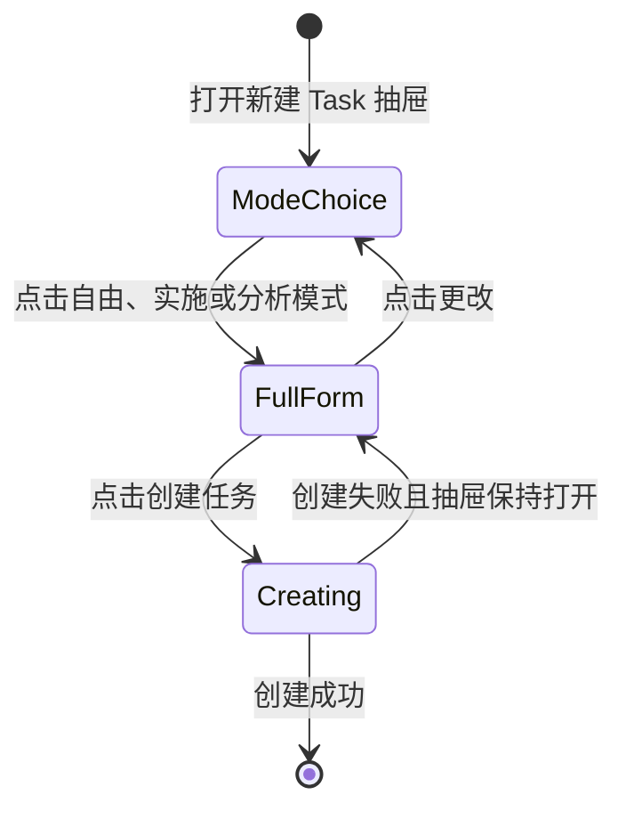
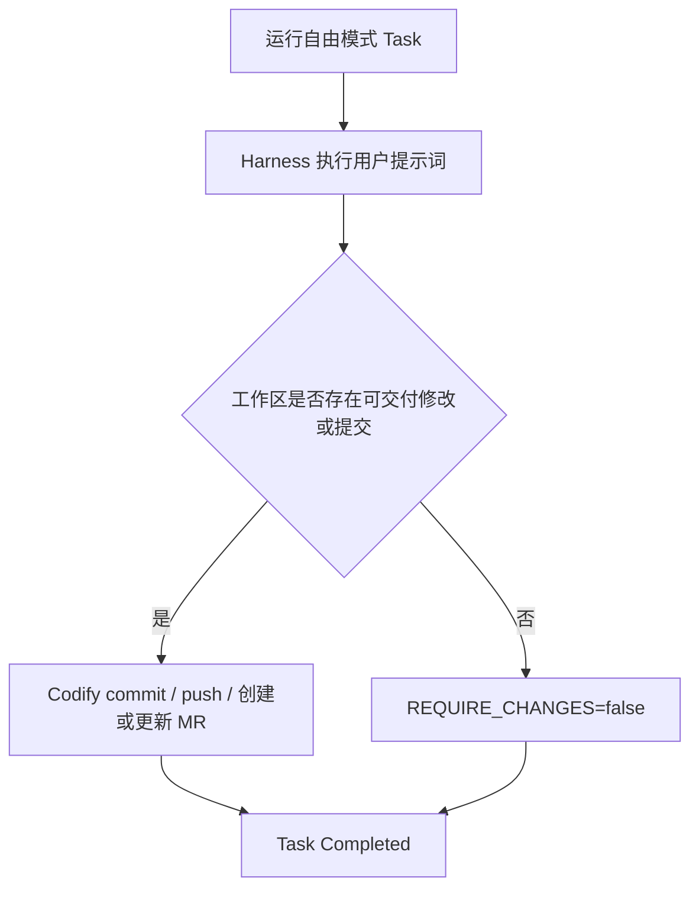
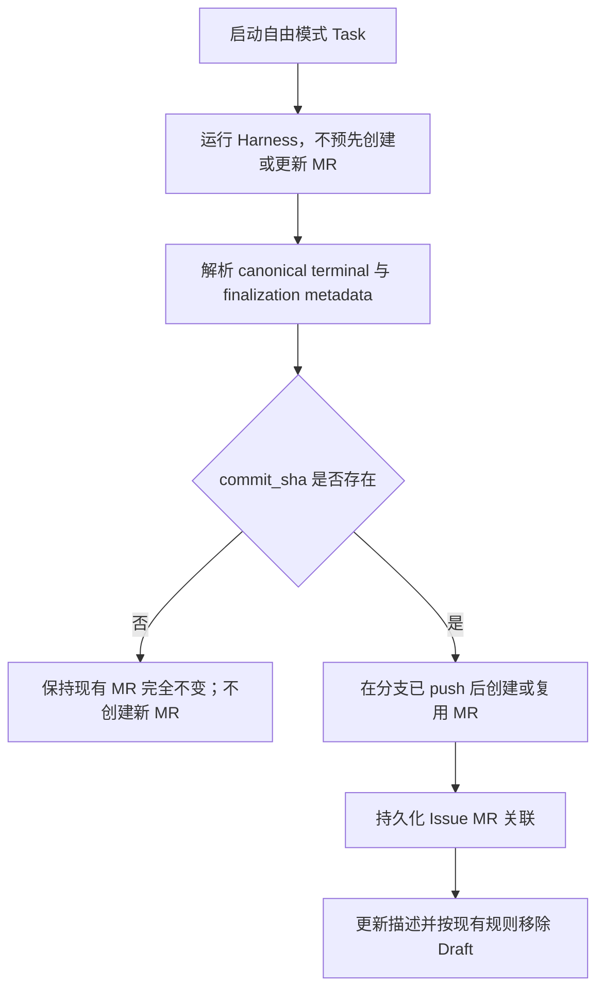

# Task 自由模式与模式优先创建流程设计

**Date:** 2026-08-14

**Status:** Approved Design

**Scope:** 新增 `freeform` Task 模式，并将新建 Task 抽屉调整为“先选择模式，再展示完整表单”的渐进式流程

**Related:**

- [Task Run Instruction Template Design](2026-06-18-task-run-instruction-template-design.md)
- [Worker Profiles Design](2026-06-24-worker-profiles-design.md)
- [CI Pipeline Auto-Repair Design](2026-06-13-ci-pipeline-auto-repair-design.md)
- [System Lifecycle Statistics Design](2026-08-09-system-lifecycle-statistics-design.md)
- [Multi-Harness Engine Design](2026-07-31-multi-harness-engine-design.md)

## 1. 结论

Codify 新增第三种正式 Task 模式：

```text
freeform / 自由模式 / Freeform
```

自由模式面向希望接近 Harness 原生使用方式的用户：Codify 只把 Task 级用户提示词交给 Harness，不附加实施或分析运行指令，由 Harness 自行判断应该回答、分析还是修改代码。

自由模式不是交互式终端，也不是绕过 Codify 托管能力的“裸运行”。Codify 仍负责会话、Skills、Provider、沙箱、超时、日志、Canonical Event、Git 和 MR 交付。

三种模式的产品语义为：

| 模式 | 内部值 | Task 级主提示词 | 文件行为 | 无代码变更 |
|---|---|---|---|---|
| 自由模式 | `freeform` | 仅渲染后的 `{{user_prompt}}` | Harness 自主决定；有修改则 Codify 自动交付 | 成功 |
| 实施模式 | `execute` | 实施模板 + 用户提示词 | 预期实施；是否强制产生提交由“要求代码变更”控制 | 取决于 `require_changes` |
| 分析模式 | `plan` | 分析模板 + 用户提示词 | 不允许保留文件修改；Worker 丢弃意外修改 | 成功 |

新建 Task 抽屉采用两个界面状态：

1. 模式选择入口：只显示三种模式的纵向选择列表。
2. 完整表单：选择模式后立即展示，并在顶部显示当前模式摘要和“更改”入口。

模式仍由用户手动选择，不默认选中。自由模式排在第一位。

## 2. 已确认产品决策

本设计已经确认以下决策，不再作为实施阶段开放项：

1. 高频场景是用户希望直接使用 Harness，让 Harness 自主判断是否需要修改代码。
2. 自由模式有代码变更时，Codify 自动 commit、push，并在 push 后创建或更新 MR。
3. 自由模式没有代码变更时，Task 正常完成，不因无提交而失败。
4. “仅使用提示词”只移除 Codify 的 Task 级实施/分析运行指令；以下能力继续沿用现有 Harness Adapter 和运行配置：
   - 当前 Harness 会话上下文，或用户显式选择的新会话；
   - Worker Profile 默认 Skills 和 Task 显式 Skills；
   - Provider system prompt（由支持该能力的 Harness Adapter 按现有规则应用）；
   - 仓库内由 Harness 原生识别的 `AGENTS.md`、`CLAUDE.md` 等项目指令；
   - Codify 沙箱、超时、权限、日志、事件和交付流程。
5. 自由模式没有实际提交时，Issue 保持 `open`；存在实际提交时才进入 `in_review`。
6. 创建 Task 时仍要求用户手动选择模式，不记忆上次模式，也不设置默认模式。
7. 模式顺序为 `自由模式 -> 实施模式 -> 分析模式`。
8. 选择模式后直接进入完整表单，不增加“下一步”按钮或步骤条。
9. 模式入口只用于新建 Task；编辑已有 Task 时直接打开完整表单。
10. 自由模式不允许自定义运行指令模板，现有“仅用提示词”快捷按钮移除。
11. 自由模式没有实际提交时，不新建 MR，也不把现有 MR 标记为 Ready 或改写其交付描述；只有出现实际提交后才进入 MR 交付流程。
12. 管理员系统统计新增独立 Task Mode Breakdown，明确区分 `freeform`、`execute`、`plan` 和历史 Unknown。

## 3. 背景与问题

当前 Task 创建表单提供实施模式和分析模式。运行指令位于模式下方的高级区域，“仅用提示词”是高级编辑器中的一个快捷操作，它把：

```text
run_instruction_template
```

设为：

```text
{{user_prompt}}
```

该快捷操作可以获得接近直接调用 Harness 的提示词内容，但存在三个产品问题：

1. 入口被埋在折叠的高级设置中，高频用户每次都需要展开后操作。
2. Task 仍保存为 `task_mode=execute` 或 `task_mode=plan`，任务详情、统计和生命周期逻辑无法识别用户真正选择的使用方式。
3. “提示词如何组装”和“没有代码变更是否成功”依赖前端组合多个字段，API 调用方可以创建出语义不一致的数据。

单纯把“仅用提示词”按钮挪到表单显眼位置，只解决入口深度，不解决持久化语义、统计分类、编辑复现和服务端不变量。因此本设计把自由使用 Harness 的意图升级为正式 Task 模式。

## 4. 目标

1. 为直接、自由使用 Harness 提供一级可见且可审计的 Task 模式。
2. 保证 `freeform` 在 API、数据库、提示词快照和 Worker 交付中的语义一致。
3. 允许 Harness 自主决定是否修改文件；有修改自动交付，无修改正常成功。
4. 让 Task 详情、Issue 状态、CI 自动修复和系统统计正确识别自由模式。
5. 通过模式优先的创建流程减少长表单中的前置噪声和漏选错误。
6. 保持现有 `execute`、`plan`、CI 自动修复、Retry 和历史 Task 的兼容性。
7. 保持移动端完整可读、可触摸，不把三种带描述的模式压缩到横向窄卡片中。

## 5. 非目标

- 不提供 Harness 交互式 TTY、逐轮人工输入或终端接管。
- 不绕过 Codify Harness Adapter、Canonical Event、Task Snapshot 或 Runtime Bundle。
- 不关闭 Provider system prompt、Skills、仓库项目指令或会话恢复。
- 不允许自由模式保留未提交工作区修改；有修改仍由 Codify 统一交付。
- 不为自由模式增加 Worker Profile 可配置模板。
- 不允许自由模式编辑任意自定义运行指令；需要自定义模板时使用实施模式或分析模式。
- 不把 CI 自动修复任务改为自由模式。
- 不为不同用户或 Issue 记忆默认任务模式。
- 不修改现有优先级、调度、Worker、Provider、Skills 或会话的选择规则。

## 6. 术语与边界

### 6.1 Task 模式

Task 模式描述本次运行的产品意图和交付语义，而不只是前端显示状态：

```text
execute  -> Codify 提供实施运行指令
freeform -> Codify 不提供实施/分析运行指令，由 Harness 自主判断
plan     -> Codify 提供分析运行指令，并禁止保留文件修改
```

### 6.2 自由模式不是“裸提示词”

“仅使用提示词”在本设计中只指 Task 级主提示词正文：

```text
rendered_prompt == normalized(Task.user_prompt)
```

它不会主动清除或绕过 Provider system prompt，也不意味着 Harness 不加载原生配置、Skills、会话历史或仓库说明文件。Provider system prompt 的实际支持范围继续由对应 Harness Adapter 的既有契约决定；自由模式不在本功能内新增或削弱该能力。

因此 UI 使用“自由模式”，不使用“原生模式”“裸模式”或“无系统提示词模式”。

### 6.3 Harness 与 Codify 的责任边界

自由模式下：

- Harness 决定如何理解提示词、是否调用工具、是否修改文件以及最终回答内容。
- Codify 决定运行环境、凭据、隔离、超时、会话绑定、日志、事件、验证、Git 和 MR 交付。

这是“接近 Harness 原生使用体验”，不是把 Task 生命周期委托给未托管的交互式进程。

## 7. 创建 Task 的模式优先流程

### 7.1 状态 A：模式选择入口

打开新建 Task 抽屉时，只展示：

```text
选择任务模式
模式决定 Harness 如何处理提示词和代码变更

[自由模式]
仅将提示词交给 Harness，由其自行判断是回答、分析还是修改代码；
无代码变更也可完成任务。

[实施模式]
Codify 指导 Harness 分析项目并实施代码修改；可要求必须产生代码提交。

[分析模式]
Codify 指导 Harness 回答问题、分析需求或输出方案；不保留文件修改。
```

规则：

- 使用纵向、全宽选择项，不在桌面端或移动端横向挤压三张描述卡片。
- 顺序固定为自由、实施、分析。
- 每项包含图标、标题、单句说明和清晰的 hover/focus 状态。
- 整行可点击，使用 `radiogroup` / `radio` 或语义等价的可访问控件。
- 不预选任何模式。
- 不显示禁用的“创建任务”按钮；完整表单 footer 只在进入状态 B 后出现。
- 抽屉关闭按钮始终可用。
- Worker、Provider、Skills 和模板默认值可以在后台预加载，但不得阻塞模式列表展示。

点击任一模式后立即进入完整表单，不出现“下一步”按钮。

### 7.2 状态 B：完整表单

完整表单顶部显示紧凑的模式摘要：

```text
自由模式 · Harness 自主决定是否修改代码                  更改
```

规则：

- “更改”返回模式选择入口。
- 返回入口时不清空已经填写的公共字段。
- 用户再次选择模式后回到完整表单。
- 进入完整表单后，提示词、优先级、调度、会话、执行环境和提交按钮沿用现有结构。
- 模式专属选项按第 7.4 节控制。



UI 不显示“步骤 1 / 步骤 2”或进度条。模式选择是完整表单的入口状态，不是需要用户理解的业务流程步骤。

### 7.3 新建与编辑差异

新建 Task：

- 初始 `taskMode = null`；
- 先显示模式入口；
- 选择后才挂载或激活完整表单；
- 每次重新打开一个已关闭的新建抽屉，仍要求重新选择模式。

编辑 `PENDING` / `QUEUED` Task：

- 直接打开完整表单；
- 顶部显示已保存模式摘要；
- 可以通过“更改”选择其他模式；
- 不先显示模式入口，避免给已有 Task 增加无意义的额外步骤。

### 7.4 模式专属表单状态

| 控件 | 自由模式 | 实施模式 | 分析模式 |
|---|---|---|---|
| 提示词 | 显示 | 显示 | 显示 |
| 要求代码变更 | 隐藏，固定 `false` | 显示 | 隐藏，固定 `false` |
| 高级运行指令 | 隐藏 | 显示 | 显示 |
| 会话设置 | 显示 | 显示 | 显示 |
| Worker / Harness / Provider / Skills | 显示 | 显示 | 显示 |
| 调度与优先级 | 显示 | 显示 | 显示 |

现有“仅用提示词”按钮、处理函数和对应 i18n key 应删除。自由模式成为唯一正式入口。

### 7.5 切换模式时的草稿保存

抽屉会话内分别保存公共草稿和模式专属草稿：

```text
commonDraft
  prompt
  priority
  schedule
  session
  harness/provider/skills

executeDraft
  require_changes
  run_instruction_template
  run_instruction_dirty

planDraft
  run_instruction_template
  run_instruction_dirty

freeform
  无可编辑的模式专属模板
```

切换规则：

1. 公共字段始终保留。
2. 实施和分析模式的模板草稿分别暂存，切回时恢复。
3. 自由模式不复用实施或分析模板，始终显示固定语义。
4. 因为模式专属草稿不会在切换时丢失，不需要每次弹出破坏性确认框。
5. 提交时只发送当前选中模式对应的数据。
6. 关闭抽屉而未提交时，仍按当前产品行为丢弃未保存草稿。

若为了降低首版实现复杂度而暂不缓存每个模式的模板草稿，则切换前必须保留现有确认行为；不得静默覆盖已编辑模板。推荐实现仍是按模式缓存。

### 7.6 渲染、动画与焦点

- 第一次选择模式后再渲染完整表单，或先后台准备数据再激活表单。
- 用户点击“更改”返回模式入口时，应保留完整表单状态；可保持组件挂载并使用 `inert`、`aria-hidden` 和受控可见性，避免子组件内部状态被销毁。
- 模式选择进入表单使用一次轻量过渡，不在每个字段上增加分散动画。
- `prefers-reduced-motion: reduce` 下禁用位移和高度动画。
- 进入完整表单后，把焦点移动到提示词输入区或第一个实际可编辑控件。
- 返回模式入口后，把焦点移动到当前模式选择项。
- 键盘必须可以遍历并选择三个模式；focus ring 不得依赖 hover。

### 7.7 移动端要求

- 390px 等窄视口使用单列全宽模式列表。
- 单个模式选择项的可触摸高度不低于 44px，推荐使用能完整容纳两行说明的更高行高。
- 说明文本允许自然换行，不做横向滚动或省略关键语义。
- 模式摘要中的“更改”保持可触摸且不与标题挤压；必要时换行。
- 抽屉 footer 遵循现有安全区和底部间距规则。
- 实施时必须在真实移动视口检查模式入口、完整表单进入动画、键盘唤起和返回选择后的滚动位置。

## 8. 数据模型与迁移

### 8.1 Task 模式值

应用层允许：

```text
execute
freeform
plan
```

`tasks.task_mode` 现有 `String(16)` 足以保存 `freeform`，不新增列。

现有数据库检查约束只允许 `execute` 和 `plan`。实施时新增 Alembic 迁移：

1. 删除现有 `ck_tasks_task_mode`。
2. 重新创建约束：

   ```sql
   task_mode IN ('execute', 'freeform', 'plan')
   ```

3. 保持 server default 为 `execute`，兼容省略 `task_mode` 的既有 API 调用方。

迁移 revision 必须在实施时基于仓库当前 Alembic head 分配，不在本设计中硬编码编号。

创建迁移前必须从 `backend/` 执行：

```bash
.venv/bin/alembic heads
```

结果必须且只能包含一个 head。若出现多个 head，先独立修复迁移拓扑并验证已部署数据库的 revision 状态；不得把不相关的历史分支修复塞进自由模式约束迁移，也不得在多 head 状态下猜测 `down_revision`。

截至 2026-08-16 本设计复核时，仓库已通过 `a5ebec09` 删除重复的 orphan migration，当前单一 head 为 `072_shared_per_item_inheritance`。实施时仍需重新检查，不能把该值作为永久约束。

Downgrade 时，在恢复旧约束前把已有 `freeform` 行映射为：

```text
task_mode = execute
require_changes = false
run_instruction_template 保持 {{user_prompt}} 快照
```

这样会丢失自由模式标签，但最大程度保留降级后的执行行为。

### 8.2 删除统计归档

`deleted_task_statistics.task_mode` 已是可容纳 `freeform` 的字符串字段，不需要新增列。删除前归档、当前表与归档表的统一查询、筛选序列化和 API 响应必须接受新值。

### 8.3 不新增模板来源字段

本设计不新增 `run_instruction_template_source`。

原因：

- `task_mode=freeform` 已经是明确的持久化来源语义；
- `run_instruction_template` 和 `rendered_prompt` 快照仍是实际运行真值；
- Retry 继续通过 `retry_source_task_id` 和快照表达继承；
- CI 自动修复继续通过 `trigger_source=ci_auto_repair` 表达专用模板路径。

## 9. 服务端不变量

### 9.1 Canonical 常量

应用层定义唯一的自由模式模板常量：

```text
FREEFORM_RUN_INSTRUCTION_TEMPLATE = "{{user_prompt}}"
```

所有创建、编辑、预览、回填和测试都引用同一常量，禁止在前端、API 和 Worker 中分别写字符串副本作为业务真值。

### 9.2 自由模式不变量

每个新建或成功编辑的自由模式 Task 必须满足：

```text
task.task_mode == "freeform"
task.require_changes is False
task.run_instruction_template == "{{user_prompt}}"
task.rendered_prompt == render("{{user_prompt}}", task_context)
```

服务端负责强制这些不变量，前端只是表达用户选择。

### 9.3 创建请求

`CreateTaskRequest.task_mode` 扩展为：

```python
Literal["execute", "freeform", "plan"]
```

默认值继续为 `execute`，不改变旧 API 客户端的省略行为。

当 `task_mode=freeform`：

- `require_changes` 缺省或显式为 `false` 均规范化为 `false`；
- 显式传 `require_changes=true` 也不能改变最终值，响应和持久化值必须为 `false`；
- `run_instruction_template` 省略时，服务端选择 canonical 自由模式模板；
- 显式模板等于 canonical 模板时允许；
- 显式模板为其他内容时返回 `422`，防止“自由模式 + 自定义包装”语义漂移；
- 渲染和快照持久化与其他模式处于同一创建事务。

建议错误 detail 使用稳定、可测试的语义：

```text
freeform mode only accepts the canonical user-prompt template
```

### 9.4 更新请求

`UpdateTaskRequest.task_mode` 同样接受 `freeform`。

更新 `PENDING` / `QUEUED` Task 时：

- 切换到 `freeform`：服务端强制 `require_changes=false` 并覆盖 canonical 自由模板；
- 自由模式只修改 `user_prompt`：重新渲染 `rendered_prompt`；
- 自由模式显式提交其他模板：返回 `422`；
- 从 `freeform` 切换到 `execute` 或 `plan`，且请求未显式提交模板：从冻结的 Task Worker Profile Snapshot 选择目标模式默认模板；
- 从 `freeform` 切换到其他模式时，不得继续沿用 `{{user_prompt}}` 作为隐式默认模板；
- 所有相关字段在同一事务中校验、渲染和持久化；
- 最终状态刷新和行锁继续防止编辑与 Scheduler claim 竞态。

### 9.5 Prompt 预览

预览请求的 `task_mode` 接受 `freeform`。自由模式预览使用 canonical 模板，并显示最终 Task 级提示词正文。

`RunInstructionTemplatePreviewRequest.run_instruction_template` 调整为可省略字段，并按模式执行以下规则：

- `execute` / `plan`：继续要求请求显式提供要预览的模板；省略时返回 `422`；
- `freeform`：省略或显式提交 canonical 模板均可；
- `freeform` 显式提交其他模板：返回与创建、更新一致的 `422`；
- `freeform` 的 `require_changes` 无论请求值为何，预览上下文都规范化为 `false`；
- 服务端始终使用 `FREEFORM_RUN_INSTRUCTION_TEMPLATE` 渲染自由模式预览，不直接渲染任意客户端模板。

虽然自由模式 UI 不展示高级模板编辑器，预览 API 仍应支持它，便于测试和后续 Task 详情展示复用。预览结果只表示 Codify 持久化的 Task 主提示词，不包含 Provider system prompt；相关 UI 文案必须明确这一边界。

### 9.6 Prompt 模板选择优先级

模板选择修订为：

```text
retry snapshot exists
-> inherit source Task template snapshot

else trigger_source == ci_auto_repair
-> CI auto-repair template

else task_mode == freeform
-> {{user_prompt}}

else task_mode == plan
-> plan template from frozen Worker Profile snapshot

else
-> execute template from frozen Worker Profile snapshot
```

CI 自动修复仍固定为 `task_mode=execute`，不会走自由模板。

### 9.7 Worker Profile

Worker Profile 继续只保存：

- 默认实施运行指令；
- 默认分析运行指令；
- CI 自动修复运行指令。

不新增 `default_freeform_run_instruction_template`。一旦允许管理员修改自由模板，自由模式就不再能保证“只使用用户提示词”。

Worker Profile Snapshot 也不需要新增自由模板字段。

### 9.8 默认模板 API

`GET /api/tasks/run-instruction-template-defaults` 的响应增加只读 `freeform` 项：

```json
{
  "freeform": {
    "content": "{{user_prompt}}",
    "available_placeholders": ["user_prompt"],
    "known_placeholders": [
      "user_prompt",
      "issue_title",
      "project_path",
      "branch_name",
      "base_branch",
      "target_branch",
      "task_mode",
      "require_changes",
      "previous_task_summaries_path",
      "ci_failure_context_path"
    ]
  }
}
```

示例只展示关键字段；`known_placeholders` 仍以服务端统一占位符清单为准。

该响应项直接来自 `FREEFORM_RUN_INSTRUCTION_TEMPLATE`，不是 System Config 或 Worker Profile 默认值，也不提供修改入口。它用于：

- 让前端三值 `TaskMode` 可以安全索引默认模板元数据；
- 避免前端复制 `{{user_prompt}}` 作为第二份业务真值；
- 支持自由模式 Prompt 预览和诊断。

前端即使隐藏自由模式高级编辑器，也不得把 `freeform` 回退到实施模板。创建自由 Task 时仍可省略 `run_instruction_template`，由服务端负责选择 canonical 模板。

### 9.9 Placeholder 文档

`{{task_mode}}` 的说明从：

```text
execute or plan
```

更新为：

```text
execute, freeform, or plan
```

自由模式 canonical 模板只使用 `{{user_prompt}}`。占位符说明仍必须接受并准确展示三种模式值，避免通用 Prompt 上下文、Task 详情或诊断代码继续假设只有二值。

## 10. Retry、Follow-Up 与自动任务

### 10.1 Retry

Retry 继续继承源 Task 的：

- `task_mode`；
- `require_changes`；
- `run_instruction_template`；
- `rendered_prompt` / 重新渲染规则；
- Worker、Provider、Harness 和 Runtime Bundle 快照；
- 会话 lineage 规则。

自由模式 Retry 因此仍是自由模式，并继承 canonical 模板。Retry API 不提供把 Retry 改成其他模式的捷径。

### 10.2 Follow-Up

手动追加 Follow-Up Task 与普通新建 Task 使用同一模式入口，不自动继承上一 Task 的模式。用户仍然明确选择自由、实施或分析。

这与“不记忆默认模式”的决策一致，也避免一次分析 Task 让后续实现 Task 被静默创建为分析模式。

### 10.3 CI 自动修复

CI 自动修复继续由服务端创建：

```text
task_mode = execute
trigger_source = ci_auto_repair
require_changes = true
```

自由模式只扩展手动 Task 的意图表达，不替代 CI 专用模板和确定性交付要求。

## 11. Worker 执行与交付

### 11.1 环境变量

自由模式 Task 进入 Worker 时：

```text
TASK_MODE=freeform
REQUIRE_CHANGES=false
CODIFY_TASK_PROMPT_FILE=/tmp/codify-runtime/task-prompt.md
```

`task-prompt.md` 内容来自持久化 `rendered_prompt`，不在 Worker 内重新组装。

### 11.2 Harness 执行

Harness Adapter 继续执行相同职责：

- Runtime 和 CLI 校验；
- Provider / Model 配置；
- 会话 start / resume；
- Skills 物化；
- 权限和沙箱；
- 原始事件转换与 Canonical Event；
- 超时、取消和进程回收。

自由模式不新增 Adapter capability，也不切换到交互式命令面。Claude 仍使用 headless runner，Codex 仍使用 `codex exec` / `codex exec resume`。

### 11.3 交付分支

Worker 只有 `plan` 进入“丢弃修改并直接完成”的专用分支。`freeform` 与 `execute` 一样进入常规交付检查：



自由模式不得新增“保留未提交修改”的结束状态。Task 容器退出前仍完成现有交付或明确确认无变更。

### 11.4 MR 生命周期

当前实施路径可能在容器启动前创建 Draft MR，并在进程成功退出后直接移除 Draft、更新 MR 描述。该时序不能直接复用于自由模式，因为“进程成功”不等于“产生代码交付”。

自由模式使用延迟 MR 交付：



具体不变量：

- 自由模式运行前不得为了展示“AI 正在执行”而创建 MR；
- Issue 已有关联 MR 时，运行自由 Task 可以继续使用同一工作分支，但在确认本 Task 有实际提交前，不向 Worker 暴露会触发 MR 状态或描述写入的交付上下文；
- canonical 结果解析并取得非空 `task.commit_sha` 后，才创建或复用 MR、持久化 `Issue.merge_request_iid/url`、更新描述并执行 Ready 转换；
- 自由 Task 无提交时，已有 MR 的 Draft/Ready 状态、标题和描述必须保持运行前值；
- `execute` 和 `plan` 的既有 MR 时序不在本设计中改变；
- 提交已 push 但 MR API 暂时失败时，沿用现有可诊断、可重试的 MR 交付失败处理，不伪造 MR 关联，也不清除已保存的 `commit_sha`。

实现上应把“Harness 进程退出成功”和“存在本次代码交付”拆成两个条件，不能继续只用 `exit_code == 0` 决定自由模式的 Undraft、MR 描述更新或交付通知。

### 11.5 无变更完成

当 Harness 只回答问题且工作区无变化时：

- Task 状态为 `COMPLETED`；
- `commit_sha` 保持 `NULL`；
- 不创建虚假 commit；
- 不创建新 MR，也不修改已有 MR 的 Draft/Ready 状态、标题或描述；
- 不因 `require_changes` 失败；
- 最终摘要、Token 和事件按当前可用能力保存；
- Issue 状态按第 12 节判断。

## 12. Issue 状态

当前“存在已完成且非 plan Task”对既有 `execute` 语义仍然成立，但不能直接覆盖新增的 `freeform`：自由模式可能完成但没有任何提交。

Issue 从 `in_progress` 退出时，保持现有实施模式行为，并为自由模式增加实际交付条件：

```text
存在 completed Task 且满足以下任一条件：
  - task_mode = execute
  - task_mode = freeform AND commit_sha IS NOT NULL
-> Issue = in_review

不存在上述 Task
-> Issue = open
```

规则针对整个 Issue 历史，而不是只检查最后一个 Task：

- 已完成实施 Task 继续按既有语义使 Issue 进入 `in_review`，不新增 `commit_sha` 前置条件；
- 先前实施 Task 已完成，之后自由模式只回答问题，Issue 仍保持 `in_review`；
- Issue 只有分析 Task 或无提交自由 Task，回到 `open`；
- 自由 Task 产生并交付提交，Issue 进入 `in_review`；
- Task 是否完成和是否产生代码交付是两个不同维度。

查询不得继续只使用：

```text
Task.task_mode != "plan"
```

因为它会把无提交自由 Task 错判为交付。也不得把 `commit_sha IS NOT NULL` 应用于所有模式，否则会改变允许无变更的既有实施 Task 和历史数据行为。

## 13. CI 自动修复关联

CI 自动修复当前多处使用 `task_mode=execute` 识别最近手动交付或活动代码任务。新增自由模式后按以下规则修订。

### 13.1 最近手动交付

重置 CI 自动修复尝试计数、选择最近任务优先级或关联最新交付时，保留已完成实施 Task 的既有资格，并只对自由模式增加提交条件：

```text
trigger_source = manual
status = completed
AND (
  task_mode = execute
  OR (task_mode = freeform AND commit_sha IS NOT NULL)
)
```

`plan` 始终排除。不得要求既有 `execute` Task 必须有 `commit_sha`，否则会改变当前 CI 尝试窗口重置和最近任务优先级继承规则。

无提交自由 Task 不重置 CI 自动修复尝试窗口，也不取代最近符合资格的实施或自由 Task。

### 13.2 活动分支写入者

检测一个 Issue 是否已有可能修改分支的活动 Task 时，使用：

```text
task_mode IN (execute, freeform)
status IN (pending, queued, running)
```

自由模式在执行前无法确定是否会修改文件，因此必须按潜在写入者处理。分析模式仍不属于分支写入者。

### 13.3 自动修复 Task 本身

自动修复新 Task 仍是 `execute`。自由模式只影响源交付识别和并发门禁，不改变 CI 修复 Task 的运行指令、`require_changes` 或触发来源。

## 14. 系统生命周期统计

### 14.1 模式维度

既有生命周期统计只实现 Project、Provider、Harness 三类 Breakdown；它虽然保存了 `task_mode` 维度，但没有 Task Mode Breakdown。本设计明确增加第四类 Breakdown，而不是假设已有分组。

`GET /api/admin/system-statistics/breakdowns` 响应新增：

```json
{
  "task_modes": [
    { "key": "freeform", "label": "freeform", "task_count": 12 },
    { "key": "execute", "label": "execute", "task_count": 40 },
    { "key": "plan", "label": "plan", "task_count": 8 }
  ]
}
```

示例省略与现有 BreakdownRow 相同的完成数、失败数、成功率、删除数、Token 和代码变更字段。

Task Mode Breakdown 契约：

- 使用当前 Task 与 `deleted_task_statistics` 的统一 `all_tasks` CTE，继续受 `project_id`、`provider_id`、`harness_key` 和 `data_state` 筛选影响；
- 复用现有 BreakdownRow 指标口径，不新增第二套成功率或已知性算法；
- `key` 返回数据库真实值 `freeform`、`execute`、`plan`；历史空值返回 `null`，不得回退为 `execute`；
- `label` 的本地化由前端基于 `key` 完成，后端不固化中文或英文产品文案；
- 前端固定按 `freeform -> execute -> plan -> Unknown` 排序，不对这个有界枚举使用 Top N 截断；
- API 新增 `task_modes` key 属于向后兼容的响应扩展，既有三个 Breakdown 不变。

新增正式模式值：

```text
freeform
```

旧任务继续保留 `execute` / `plan`；不回填或推断历史自由使用行为。

### 14.2 代码变更指标

现有“只有 `task_mode=execute` 才属于代码指标样本”的规则修订为：

```text
task_mode IN (execute, freeform)
AND status = completed
AND not deleted_before_terminal
```

已知性继续由 `change_data_available` 控制：

- 有可靠变更统计时计入 additions、deletions、total changes；
- 没有可靠变更统计时计入 eligible，但不伪造为精确 0；
- 分析模式因修改会被丢弃，不进入代码变更样本。

若 Worker 能可靠记录“已确认无变更”，可把自由模式无变更保存为已知 0；这属于统计质量增强，不阻塞自由模式上线。

### 14.3 成功率与时长

自由模式与其他模式一样计入 Task 总数、状态、执行时长和 Token 统计。管理员通过新增的 Task Mode Breakdown 单独查看它，不把自由模式成功率混写为实施模式。

### 14.4 删除归档

删除 Task 时原样归档 `task_mode=freeform`。当前表和删除归档的 `UNION ALL` 查询不得把未知非 plan 值回退成 execute 标签。

## 15. 前端设计与受影响界面

### 15.1 TaskFormDrawer

主要改造位于 `frontend/src/components/TaskFormDrawer.vue`：

- 增加模式入口状态和完整表单状态；
- 三种纵向模式选择项；
- 自由模式排第一；
- 点击即进入表单；
- 完整表单顶部模式摘要和“更改”；
- 新建不预选，编辑直接进入表单；
- 自由模式隐藏 `require_changes` 和高级运行指令；
- 实施/分析模板草稿分开缓存；
- 删除 `usePromptOnly()` 和对应按钮；
- 完整表单 footer 仅在模式选定后显示；
- 补齐移动端、focus、reduced motion 和 `inert` 行为。

### 15.2 类型与 API

以下前端类型扩展为三值：

```ts
type TaskMode = 'execute' | 'freeform' | 'plan'
```

包括：

- Task 响应；
- Create / Update Task 请求；
- Prompt 预览请求；
- 默认模板响应中的只读 `freeform` 元数据；
- Task form draft；
- mocks 和 fixtures。

API 省略 `task_mode` 的行为保持不变；只有 UI 仍要求手动选择。

### 15.3 Task 详情与当前执行

以下位置不能继续使用“是否为 plan，否则就是 execute”的二元表达：

- Task metadata panel；
- Task detail mode label；
- Issue current execution card；
- 任何 Task 列表、筛选或统计 breakdown。

自由模式显示独立图标、标签和视觉 modifier。视觉差异保持克制，不引入新的全局颜色体系。

### 15.4 文案

中文：

```text
自由模式
仅将提示词交给 Harness，由其自行判断是回答、分析还是修改代码；无代码变更也可完成任务。
```

英文：

```text
Freeform
Send only the task prompt to the Harness. It decides whether to answer, analyze, or modify code; the task may complete without code changes.
```

正常新建流程不会在未选择模式时展示提交按钮，因此不再依赖“提交后提示请选择模式”。若保留防御性校验及其文案，必须更新为三种模式，不得只解释实施与分析。

### 15.5 系统统计

`SystemStatistics.vue` 的基础 Breakdown 增加 Task Mode 卡片：

- 复用现有 Breakdown 表格列和 Unknown 展示，不新建图表库；
- 模式名称通过 `taskMode` i18n 映射显示为自由模式、实施模式、分析模式，Unknown 使用现有未知文案；
- 四张 Breakdown 在窄视口单列堆叠，在足够宽的桌面视口保持现有两列网格；Project 继续占整行，Task Mode 与 Provider/Harness 按实际空间排列；
- 新卡片必须覆盖 `390px`、`768px`、`1440px` 和宽桌面布局，不能因增加第四张表恢复横向裁切。

## 16. API 与响应示例

### 16.1 创建自由 Task

```http
POST /api/tasks
Content-Type: application/json

{
  "issue_id": 5,
  "user_prompt": "检查当前实现，有问题就直接修复",
  "task_mode": "freeform",
  "session_mode": "continue",
  "priority": 1
}
```

服务端规范化后的关键字段：

```json
{
  "task_mode": "freeform",
  "require_changes": false,
  "run_instruction_template": "{{user_prompt}}",
  "rendered_prompt": "检查当前实现，有问题就直接修复"
}
```

### 16.2 非法自定义自由模板

```http
POST /api/tasks
Content-Type: application/json

{
  "issue_id": 5,
  "user_prompt": "检查当前实现",
  "task_mode": "freeform",
  "run_instruction_template": "必须修改代码：{{user_prompt}}"
}
```

响应：

```http
422 Unprocessable Content
```

### 16.3 把待执行 Task 切换为自由模式

```http
PATCH /api/tasks/42
Content-Type: application/json

{
  "task_mode": "freeform"
}
```

服务端必须在同一事务中覆盖模板、关闭变更要求并重新渲染 Prompt，不依赖客户端同时提交另外两个字段。

### 16.4 预览自由模式 Prompt

```http
POST /api/tasks/render-run-instruction-template-preview
Content-Type: application/json

{
  "issue_id": 5,
  "user_prompt": "解释这个失败原因",
  "task_mode": "freeform",
  "require_changes": true
}
```

请求可以省略 `run_instruction_template`；服务端仍使用 canonical 模板，并把预览上下文中的 `require_changes` 规范化为 `false`。如果请求显式提交非 canonical 模板，则返回 `422`，与创建和更新契约一致。

## 17. 兼容性与发布

### 17.1 旧数据

- 现有 `execute` / `plan` Task 不修改。
- 不从 `run_instruction_template={{user_prompt}}` 反推历史自由模式，因为旧用户可能在实施或分析模式中有意自定义为该模板。
- 历史删除归档不回填。

### 17.2 API 兼容

- Create API 默认仍为 `execute`。
- 现有客户端显式发送 `execute` / `plan` 不受影响。
- 默认模板响应新增 `freeform` key，不删除或修改既有 `execute` / `plan` key。
- Prompt 预览只在 `task_mode=freeform` 时允许省略模板；既有实施/分析预览请求和校验语义保持不变。
- 系统统计 Breakdown 响应新增 `task_modes` key，既有 `projects`、`providers`、`harnesses` key 和行结构保持不变。
- 新后端和新前端应在同一发布窗口部署；旧前端可能把未知模式错误显示为实施模式。
- 后端序列化始终返回真实 `freeform`，不得为了旧前端回退为 `execute`。

### 17.3 Worker 兼容

当前 Worker 只对 `TASK_MODE=plan` 使用专用只读收尾，其余模式进入交付路径；从行为上可承载 `freeform`。发布前仍必须使用冻结 Runtime Bundle 做真实 Worker 验证，确认：

- Adapter 不校验二值 Task mode；
- `TASK_MODE=freeform` 能完整进入 Harness 和 finalization；
- 无变更且 `REQUIRE_CHANGES=false` 返回成功；
- 无变更时不创建、Undraft 或改写 MR；
- 有变更时先 commit / push，再创建或复用 MR，metadata 和 Issue MR 关联正常；
- Claude 与 Codex 两种已支持 Harness 都通过。

不因源代码看起来兼容就省略真实容器验证。

### 17.4 发布顺序

1. 在待发布 revision 上确认 `alembic heads` 只有一个结果，并完成迁移 upgrade / downgrade 测试。
2. 部署扩展检查约束的数据库迁移。
3. 部署接受并正确处理 `freeform` 的后端与 Scheduler。
4. 部署显示和创建自由模式、Task Mode Breakdown 的前端。
5. 使用新建 Issue / Task 和新冻结 Runtime Bundle 做 canary。
6. 分别验证自由模式有提交、无提交时的 MR、Issue、CI 门禁和系统统计，再开放给所有用户。

## 18. 安全与审计

- 自由模式不降低容器隔离或 Harness 权限策略。
- “只使用用户提示词”不主动清除 Provider system prompt，也不绕过组织级安全规则；实际注入仍遵循对应 Harness Adapter 的既有能力。
- Task Snapshot 继续冻结 Harness、Adapter、Provider 非密配置、Worker Profile、Skills 和 Runtime Bundle。
- `run_instruction_template` 和 `rendered_prompt` 继续作为可审计快照。
- Raw Harness events 和 Canonical Events 的保存规则不变。
- Git 写操作仍由 Codify delivery 所有；Harness 不直接接管 commit / push。
- 用户提示词仍按现有敏感数据边界处理，本设计不扩大其可见范围。

## 19. 实施影响面

### 19.1 Backend

预期涉及：

- `backend/app/api/task_schemas.py`
- `backend/app/api/task_creation_service.py`
- `backend/app/api/task_update_service.py`
- `backend/app/api/tasks.py`
- `backend/app/api/task_responses.py`
- `backend/app/core/task_prompt.py`
- `backend/app/core/worker_profiles.py`
- `backend/app/core/worker_runtime.py`
- `backend/app/core/worker_task_lifecycle.py`
- `backend/app/core/worker_gitlab.py`
- `backend/app/core/task_helpers.py`
- `backend/app/core/ci_failure_collector.py`
- `backend/app/api/system_statistics.py`
- `backend/app/api/system_statistics_queries.py`
- `backend/app/core/system_statistics_deletion.py`
- `backend/app/models.py`
- 新 Alembic migration

实施时以实际调用路径为准，不为了匹配文件清单制造无意义改动。

### 19.2 Frontend

预期涉及：

- `frontend/src/components/TaskFormDrawer.vue`
- `frontend/src/features/tasks/taskFormModel.ts`
- `frontend/src/features/tasks/useTaskFormSubmission.ts`
- `frontend/src/features/tasks/useRunInstructionPreview.ts`
- `frontend/src/api/tasks.ts`
- `frontend/src/api/index.ts`
- `frontend/src/components/TaskMetadataPanel.vue`
- `frontend/src/components/issue-detail/IssueCurrentExecution.vue`
- `frontend/src/views/TaskView.vue`
- `frontend/src/views/SystemStatistics.vue`
- `frontend/src/i18n/messages/en.ts`
- `frontend/src/i18n/messages/zh-CN.ts`
- 相关 mocks、unit tests 和 E2E tests

## 20. 测试策略

### 20.1 数据库与模型

- 创建自由模式迁移前 `alembic heads` 只有一个结果，新增迁移以该 head 为 `down_revision`。
- 新约束接受 `execute`、`freeform`、`plan`。
- 新约束拒绝其他值。
- downgrade 映射自由模式后能恢复旧约束。
- 删除统计归档能保存并查询 `freeform`。

### 20.2 Task API

- 创建自由 Task 自动保存 `require_changes=false`。
- 创建自由 Task 自动保存 canonical 模板和准确 `rendered_prompt`。
- 自由模式显式传其他模板返回 `422`。
- 自由模式修改用户提示词会原子重渲染。
- 从实施/分析切换到自由模式会覆盖模式专属字段。
- 从自由切回实施/分析且未传模板时使用冻结 Worker Profile Snapshot 默认模板。
- API 默认不传模式仍创建 `execute`。
- 默认模板 API 返回由应用 canonical 常量生成的只读 `freeform` 元数据。
- Prompt 预览接受省略模板或显式 canonical 模板的自由模式请求。
- Prompt 预览拒绝自由模式的非 canonical 模板，并把 `require_changes` 规范化为 `false`。
- 实施和分析模式预览省略模板时仍返回 `422`。
- Retry 保留自由模式和模板快照。

### 20.3 Worker

- 自由模式无文件变化且 `require_changes=false` 成功。
- 自由模式产生文件变化时自动 commit 和 push。
- 自由模式运行前不会创建 MR，也不会把已有 MR 上下文用于运行中状态写入。
- 自由模式无提交时不创建 MR，不改变已有 MR 的 Draft/Ready、标题和描述。
- 自由模式有提交时，在 push 后创建或复用 MR，持久化 Issue MR 关联，再更新描述和 Ready 状态。
- 已存在 Harness commit 时沿用现有发布规则。
- 自由模式不会抑制支持该能力的 Harness Adapter 注入 Provider system prompt。
- 默认 Skills 和 Task Skills 仍物化。
- `continue` 与 `fresh` 会话行为均保持。
- Claude 和 Codex Adapter 各完成一条真实容器 smoke。

### 20.4 Issue、CI 与统计

- 只有无提交自由 Task 时，Issue 回到 `open`。
- 自由 Task 有 `commit_sha` 时，Issue 进入 `in_review`。
- 先前已有提交、之后自由 Task 无提交时，Issue 仍为 `in_review`。
- 已完成实施 Task 即使没有 `commit_sha`，仍按既有语义使 Issue 进入 `in_review`。
- 无提交自由 Task 不重置 CI 自动修复尝试窗口。
- 已完成实施 Task 即使没有 `commit_sha`，仍可重置 CI 自动修复尝试窗口并提供最近任务优先级。
- 活动自由 Task 会阻止并发 CI 修复创建。
- Breakdown API 返回 `task_modes`，分别聚合 `freeform`、`execute`、`plan` 和历史 Unknown。
- Task Mode Breakdown 沿用 `data_state` 和其他维度筛选，并保持代码指标覆盖率分子不超过 eligible 分母。
- 有可靠变更数据的自由 Task 进入代码统计样本。
- 删除后的自由 Task 继续出现在生命周期统计中。

### 20.5 Frontend 单元测试

- 新建抽屉初始只显示三种模式列表。
- 三种模式顺序正确且均未默认选中。
- 点击模式无需“下一步”即可展示完整表单。
- 自由模式隐藏变更要求和高级模板。
- 实施模式显示变更要求和高级模板。
- 分析模式隐藏变更要求但显示高级模板。
- “更改”返回模式列表并保留公共字段。
- 实施/分析模式草稿切回后恢复。
- 编辑 Task 直接显示完整表单。
- 创建请求发送 `task_mode=freeform`，不依赖前端显式发送 canonical 模板。
- 选择自由模式不会从默认模板响应或 Worker Profile 误取实施模板。
- 任务详情和当前执行正确显示自由模式。
- 系统统计显示 Task Mode Breakdown，并按自由、实施、分析、Unknown 的固定顺序和本地化文案展示。
- 增加第四张 Breakdown 后，窄屏单列和宽屏两列布局不发生横向裁切。
- 不再存在“仅用提示词”按钮和对应 handler。
- radiogroup、键盘选择、焦点返回和 reduced-motion 行为可测试。

### 20.6 响应式与 E2E

至少验证：

- `390 x 844` 移动视口；
- `768px` 平板宽度；
- 桌面抽屉宽度。

覆盖：

- 三种模式说明完整换行；
- 触摸目标和底部安全区；
- 选择模式进入完整表单；
- 返回模式入口后字段和滚动位置保留；
- 自由模式创建无变更 Task 后确认没有 MR 副作用；
- 自由模式创建有变更 Task 并在 push 后完成 MR 交付；
- 系统统计 Task Mode Breakdown 在移动端、平板和桌面视口均可读。

## 21. 验收标准

满足以下条件才算完成：

1. 新建 Task 首屏只显示自由、实施、分析三种模式，且没有默认选择。
2. 自由模式排第一，点击后直接进入完整表单。
3. 自由模式 Task 在数据库、API 和所有展示面都保留 `task_mode=freeform`。
4. 服务端保证 canonical 模板和 `require_changes=false`，不存在依赖前端组合的旁路。
5. 自由模式继续使用现有会话、Skills、Harness Adapter 已支持的 Provider system prompt、沙箱和交付能力。
6. 有代码变化先 commit / push，再创建或更新 MR；无变化正常完成且不创建、Undraft 或改写 MR。
7. Issue 对 `execute` 保持既有完成语义；`freeform` 只有存在实际 `commit_sha` 才进入 `in_review`。
8. CI 自动修复保留已完成 `execute` 的既有资格，并识别自由模式的潜在写入和实际交付。
9. 系统统计通过新增 Task Mode Breakdown 独立显示 `freeform`、`execute`、`plan` 和 Unknown，并正确处理筛选、代码指标和删除归档。
10. 现有 execute / plan、Retry、CI 自动修复和旧 API 默认行为无回归。
11. 移动端真实视口下模式列表、完整表单和返回交互可用。
12. Claude 与 Codex 的真实 Worker smoke 均通过。

## 22. 方案修订关系

本设计对既有文档作以下增量修订：

- `Task Run Instruction Template Design` 中 `task_mode` 从二值扩展为三值；自由模式模板由应用内 canonical 常量提供，不由 System Config 或 Worker Profile 提供。
- 既有“显式 run_instruction_template 总是优先”规则对自由模式增加例外：自由模式只允许 canonical 模板。
- `Worker Profiles Design` 不新增自由模板字段，实施和分析默认模板规则保持不变。
- `System Lifecycle Statistics Design` 在既有 Project、Provider、Harness 基础上增加第四类 Task Mode Breakdown；代码样本从仅 `execute` 扩展为 `execute/freeform`，仍受数据已知性约束。
- `CI Pipeline Auto-Repair Design` 中最近任务查询保留已完成 `execute` 的既有资格，并把有实际 `commit_sha` 的 `freeform` 纳入；活动潜在写入者包含 `freeform`。
- 既有 Worker MR 时序对自由模式增加例外：只有解析到实际 `commit_sha` 后才允许创建、Undraft 或改写 MR。

若既有文档与本设计在自由模式相关语义上冲突，以本设计为准。
