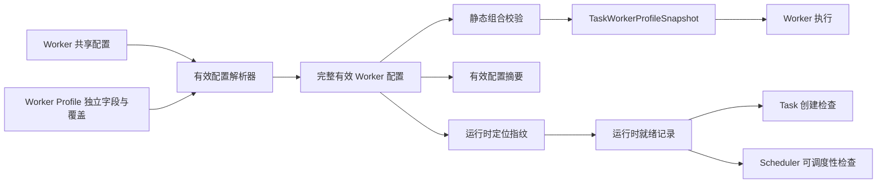

# Worker Profile 共享配置与运行时就绪设计

**Date:** 2026-08-14

**Status:** Draft

**Scope:** 系统 Worker 共享配置、Worker Profile 差异覆盖、Task Worker Snapshot、Worker Kit 可用性、Task 创建与调度阻塞

**Related:** [Worker Profiles Design](2026-06-24-worker-profiles-design.md)、[Task Run Instruction Template Design](2026-06-18-task-run-instruction-template-design.md)、[Multi-Harness Engine Design](2026-07-31-multi-harness-engine-design.md)、[Issue Task 有序回合设计](2026-08-08-issue-task-ordered-turns-design.md)、[Worker Kits](../../worker-kits.md)

## 1. 结论

Codify 应新增一份管理员维护的 **Worker 共享配置**，并让 Worker Profile 只保存宿主机、镜像等独立配置以及对共享配置的差异覆盖。创建 Task 时，Backend 把共享配置和 Profile 覆盖解析成完整有效配置，再写入不可变的 `TaskWorkerProfileSnapshot`。

本期不引入 Worker Profile 模板。模板只能完成一次性复制或批量写入，不能解决 Worker Kit、环境变量、脚本和运行指令需要持续同步的问题；如果让 Profile 持续跟随模板，模板实质上会演变成多级配置继承。当前 `arm64` 与 `amd64` Worker 的主要固定差异是 Docker Host，而两类宿主机可以约定相同的 Kit 和挂载路径，因此一份系统共享配置加 Profile 差异覆盖已经足够。

核心规则如下：

1. Worker Profile 是可编辑配置，Task Snapshot 是执行事实。
2. 系统共享配置更新只影响之后创建或被用户显式重新配置的 Task，不修改既有 Task Snapshot。
3. Worker Kit 的运行模式、版本和路径是一个原子配置组，只能整体继承或整体覆盖。
4. 环境变量按变量名合并；挂载按容器路径合并。Profile 可以设置、覆盖或屏蔽单项。
5. Docker Host、TLS、镜像、Harness、Skills、CodeGraph 等继续由 Profile 独立维护。
6. 保存系统共享配置只做本地静态校验，不要求所有 Docker Host 已安装新 Kit。
7. Task 创建时如果对应运行时指纹已经确定不可用，直接返回 `409 Conflict`。
8. 状态未知或 `ready` 已过期时允许创建；首次调度前探测失败的 Task 明确失败，其余同指纹 Task 保持 `PENDING` 并显示 `worker_runtime_unavailable`。
9. 不原地修改阻塞 Task 的 Snapshot。恢复方式是安装其 Snapshot 指定的 Kit 并重新验证，或者取消后创建新 Task。

## 2. 背景与问题

Worker Profile 已经把镜像、Worker Kit、Docker 目标、挂载、环境变量、脚本、运行指令、Harness 和 Skills 收敛到任务级快照。但部分字段在多个 Profile 间实际上是同一份运维基线：

- Worker Kit 版本与路径通常一起升级；
- 多个 Docker Host 使用相同的目录约定；
- 公共环境变量、挂载和前后置脚本需要同步；
- 执行、计划和 CI 自动修复运行指令通常应统一维护。

当前每个 Profile 保存完整值，升级公共配置需要逐一编辑，容易出现漏改、路径和版本不匹配、旧运行指令残留以及不同宿主机配置漂移。

现有旧全局 Worker 字段不能直接恢复为运行时动态来源。当前生产契约已经是：

```text
Worker Profile（可编辑）
  -> TaskWorkerProfileSnapshot（创建时冻结）
  -> Worker Runtime（只读快照）
```

新设计必须在这个契约前增加“有效配置解析”，而不是让 Worker 执行时重新读取系统配置。

### 2.1 方案评估

| 方案 | 能否解决持续同步 | 主要成本或问题 | 结论 |
|---|---|---|---|
| 系统共享配置 + Profile overlay | 能 | 需要继承解析、单项 mask、快照和迁移 | 本期采用 |
| 从模板创建 / 一次性应用模板 | 不能；应用后继续漂移 | 需要字段选择、diff 和批量事务 | 可作为未来管理工具，不作为配置真相 |
| Profile 持续绑定命名模板 | 能支持多套基线 | 实质是多级继承，来源、删除和变更传播复杂 | 当前只有一套公共基线，不采用 |
| 批量修改多个 Profile | 只能解决单次发布 | 每次升级仍需选择目标，无法表达长期继承 | 可作为运维辅助，不替代共享配置 |

如果以后出现真正独立升级、独立回滚的多套公共基线，再单独评估命名基线；不能因为 CPU 架构不同就预先引入继承树。

## 3. 目标

1. 管理员只修改一次共享配置，即可影响所有未覆盖该项的 Profile 所创建的后续 Task。
2. 保留 Worker Profile 的宿主机、镜像和能力差异。
3. 允许 Profile 对单个环境变量或挂载进行覆盖或屏蔽，同时继续继承其他共享项。
4. 保证 Task 创建后不因系统或 Profile 配置变化而漂移。
5. 允许系统配置先于各宿主机 Kit 部署保存，但对已知不可用运行时阻止创建新 Task。
6. 对缺失 Kit 提供明确、可恢复、可观察的失败和调度阻塞状态。
7. 尽量复用现有 Task 状态、`waiting_reason`、Profile 验证入口和 Worker Snapshot 路径，控制实现成本。

## 4. 非目标

- 不新增 Worker Profile 模板或多级继承树。
- 不支持基于 CPU 架构、项目语言、标签或任务类型自动选择 Profile。
- 不把 Docker Host 抽象成新的 WorkerNode 或 WorkerPool。
- 不在运行时把 Task 自动切换到另一个 Profile 或 Docker Host。
- 不修改已经创建的 Task Snapshot。
- 不新增 `BLOCKED` Task 生命周期状态。
- 不在第一期支持批量取消并重建阻塞 Task。
- 不因临时 Docker 网络或认证错误永久标记 Kit 不可用。

## 5. 术语

### 5.1 Worker 共享配置

管理员维护的一份系统级配置，只包含允许跨 Profile 继承的字段。它不是“系统默认 Worker Profile”；后者只负责决定默认选择哪个 Profile。

### 5.2 Profile 覆盖

Worker Profile 对共享字段的差异配置。标量字段使用“继承或显式覆盖”语义；集合字段使用按稳定身份合并的覆盖和屏蔽语义。

### 5.3 有效 Worker 配置

共享配置和 Profile 覆盖解析后的完整配置。所有 Profile 校验、Task Snapshot、Prompt 渲染和运行时指纹计算都必须使用有效配置。

### 5.4 有效配置摘要

对完整有效配置的规范化摘要，用于审计和确认两个 Task 是否冻结了相同的 Worker 配置。摘要变化不一定意味着需要重新探测宿主机。

### 5.5 运行时验证输入摘要

只覆盖 `verify-runtime` 实际检查输入的版本化摘要，用于判断现有 `verified_at` 是否仍与当前运行时验证目标一致。它与完整有效配置摘要相互独立。

### 5.6 运行时定位指纹

用于判断 Worker Kit 是否存在的稳定摘要，只包含：

- Docker daemon 逻辑身份；
- `runtime_mode`；
- `worker_kit_version`；
- `worker_kit_path`。

环境变量、脚本、运行指令或挂载变化不会产生新的 Kit 定位指纹。

### 5.7 运行时就绪状态

一个运行时定位指纹在目标 Docker Host 上的已观察状态：

- `unknown`：没有可用的持久化结论，或者此前 `ready` 已过期，允许首次探测；
- `ready`：最近一次确定性检查成功且仍在正缓存有效期内；
- `unavailable`：最近一次确定性检查确认 Kit 缺失、损坏或版本不匹配。

运行时就绪只回答“这个 Docker daemon 上是否有 Snapshot 指定的 Kit”，不等价于整个 Worker Profile 已完成镜像、Harness 和 CLI 验证。

`ready` 是有期限的正缓存；`unavailable` 是需要管理员修复或显式重新验证才能解除的确定性负结论。所有 Scheduler、Profile 验证和 Task Snapshot 验证都必须通过同一个带 generation 的 readiness 服务读写状态。

## 6. 配置范围

### 6.1 纳入共享配置

| 配置 | 继承粒度 | Profile 覆盖语义 |
|---|---|---|
| Worker Kit 运行模式、版本、路径 | 原子配置组 | 整组继承或整组覆盖 |
| 环境变量 | 单个变量名 | 设置、覆盖、屏蔽 |
| 存储卷挂载 | 单个容器路径 | 设置、覆盖、屏蔽 |
| 前置脚本 | 单字段 | 继承、覆盖、显式置空 |
| 后置脚本 | 单字段 | 继承、覆盖、显式置空 |
| 执行运行指令模板 | 单字段 | 继承或覆盖 |
| 计划运行指令模板 | 单字段 | 继承或覆盖 |
| CI 自动修复运行指令模板 | 单字段 | 继承或覆盖 |

### 6.2 保持 Profile 独立

以下字段不从共享配置继承：

- 名称、描述、启用状态、系统默认标记；
- Docker Host 和 TLS CA、证书、密钥路径；
- Worker 镜像、镜像 digest 和验证结果；
- Harness allowlist、默认 Harness、约束和 Harness runtime；
- 默认 Skills；
- CodeGraph 开关。

`arm64` 和 `amd64` Profile 通过不同 Docker Host 保持平台身份。只要各宿主机使用相同绝对路径约定，两类 Profile 可以继承相同的 Kit 路径和挂载；若某个宿主机以后必须使用不同 Kit 路径，对该 Profile 整组覆盖 Worker Kit 即可。

## 7. 配置解析规则

### 7.1 Worker Kit

Worker Kit 三个字段必须作为整体处理：

```text
Profile.worker_kit_source == system
  -> 使用共享 runtime_mode/version/path

Profile.worker_kit_source == profile
  -> 使用 Profile runtime_mode/version/path
```

不允许只覆盖版本却继承路径，也不允许 mounted-kit 只提供版本或只提供路径。最终值继续使用现有 `validate_worker_kit_config()` 和挂载冲突校验。

### 7.2 环境变量

环境变量以 `key` 为唯一身份：

```text
effective = shared variables

for each profile operation:
  set  -> effective[key] = profile value
  mask -> remove effective[key]
```

Profile 没有对应记录表示继承。删除 Profile 的 `set` 或 `mask` 记录都表示恢复继承，而不是删除系统项。

规则：

- 共享层和 Profile 层都使用同一套 key 格式及保留 key 校验；
- Profile secret 覆盖不得读取或回显共享 secret 明文；
- `mask` 不保存 value 或 `is_secret`；
- Snapshot 保存解析后的完整环境变量，并继续按现有规则加密 secret；
- 运行时才解密 Snapshot 中的 secret，不回查当前共享值。

### 7.3 存储卷挂载

挂载以规范化后的 `container_path` 为唯一身份：

```text
effective = shared mounts

for each profile override:
  set  -> effective[container_path] = profile mount
  mask -> remove effective[container_path]
```

规则：

- Profile 覆盖同一容器路径时完整替换 `host_path` 和 `mode`；
- 共享层和 Profile 层分别禁止重复容器路径；
- 同一个规范化 `container_path` 不得同时出现在 Profile 的 `set` 覆盖和 mask 列表中，保存时必须拒绝而不是依赖合并顺序；
- 合并后再次运行系统保留路径、Kit 挂载冲突和路径规范化校验；
- API 和 UI 的稳定排序仍以 `container_path` 为准；
- `host_path` 在目标 Docker Host 上解释，系统保存时不探测其实际存在性。

### 7.4 脚本

脚本需要三态语义：

- `NULL`：继承共享脚本；
- 非空字符串：Profile 覆盖；
- 空字符串：Profile 明确禁用共享脚本。

前置和后置脚本独立继承，避免 Profile 只需要覆盖其中一个时复制另一个。

### 7.5 运行指令模板

三个运行指令模板独立使用：

- `NULL`：继承共享模板；
- 非空字符串：Profile 覆盖。

空模板继续视为非法。Task 创建时从有效配置选择对应模板，渲染并持久化 `tasks.run_instruction_template` 与 `tasks.rendered_prompt`。系统模板后续变化不得重新渲染既有 Task。

### 7.6 解析结果与来源

管理员 API 应同时返回：

- Profile 保存的覆盖；
- 当前有效值；
- 每个标量或集合项的来源：`system`、`profile_override`、`profile_mask`；
- 共享配置 revision；
- 有效配置摘要和运行时定位指纹。

普通 Task API 只需要返回已经冻结的有效值摘要，不暴露 secret 或 Docker TLS 内容。

## 8. 总体架构



共享配置和 Profile 都不是执行时来源。Worker 只读取 Task Snapshot；运行时就绪记录只决定是否允许创建或调度，不替代 Snapshot 中的配置。

## 9. 数据模型

以下是推荐的逻辑模型。实际迁移编号应使用实施时的下一个 Alembic revision。

### 9.1 `worker_shared_configurations`

单例表，推荐固定 `id = 1`：

| 字段 | 说明 |
|---|---|
| `id` | 单例主键 |
| `revision` | 每次成功修改共享字段或共享环境变量时递增 |
| `runtime_mode` | `baked_image` 或 `mounted_kit` |
| `worker_kit_version` | mounted-kit 版本 |
| `worker_kit_path` | Docker Host 上的绝对路径 |
| `volume_mounts` | 共享挂载 JSON 列表 |
| `pre_script` | 共享前置脚本 |
| `post_script` | 共享后置脚本 |
| `default_execute_run_instruction_template` | 执行模板 |
| `default_plan_run_instruction_template` | 计划模板 |
| `ci_auto_repair_run_instruction_template` | CI 自动修复模板 |
| `created_at` / `updated_at` | 审计时间 |

不把它建模成特殊 Worker Profile，避免“默认选择 Profile”和“所有 Profile 的共享父配置”两个概念混在一起。

### 9.2 `worker_shared_environment_variables`

保存共享环境变量，字段与当前 Profile 环境变量相同：

- `id`；
- `key`，唯一；
- `value`；
- `is_secret`；
- `created_at` / `updated_at`。

secret 使用现有配置加密机制。共享配置和环境变量必须在同一事务内保存，成功后只递增一次 `revision`。

现有旧全局 `worker_environment_variables` 表可以在实施时选择重命名并复用；如果为降低迁移风险而新建表，则旧表只能作为迁移参考，不能同时成为运行时来源。

### 9.3 `worker_profiles`

在现有模型上增加或调整：

- `worker_kit_source = system | profile`；
- `volume_mounts` 重新定义为 Profile 的 `set` 覆盖项；
- `volume_mount_masks`，保存被 Profile 屏蔽的容器路径；
- `pre_script`、`post_script` 改为 nullable；
- 三个运行指令模板改为 nullable；
- `verified_runtime_configuration_digest`，记录最近一次 `verify-runtime` 所对应的运行时验证输入摘要。

既有镜像、Docker 目标、Harness、Skills、CodeGraph 等字段保持原义。

`verified_at` 只有在 `verified_runtime_configuration_digest` 与当前运行时验证输入摘要一致时才有效。影响验证输入的共享配置变化会自然使摘要不匹配，不需要批量清空所有 Profile 的 `verified_at`；名称、描述、运行指令等未进入验证器的字段变化不使运行时验证过期。

### 9.4 `worker_profile_environment_variables`

在现有表增加：

- `operation = set | mask`；
- `value` 允许为空，仅 `mask` 可不带值。

唯一约束仍为 `(worker_profile_id, key)`。现有记录全部迁移为 `operation=set`。

### 9.5 `task_worker_profile_snapshots`

继续保存完整有效配置，并新增：

- `shared_configuration_revision`；
- `effective_configuration_digest`；
- `runtime_locator_fingerprint`。

Snapshot 不保存动态继承引用。即使 Profile 使用共享配置，Snapshot 中的 Kit、挂载、环境变量、脚本和模板仍必须全部展开。

### 9.6 `worker_runtime_readiness`

按运行时定位指纹记录确定性观察结果：

| 字段 | 说明 |
|---|---|
| `runtime_locator_fingerprint` | 主键或唯一键 |
| `docker_daemon_key` | 规范化 daemon 身份，不包含 TLS secret |
| `runtime_mode` | 冻结用于诊断 |
| `worker_kit_version` | 冻结用于诊断 |
| `worker_kit_path` | 冻结用于诊断 |
| `status` | `unknown`、`ready` 或 `unavailable`；无记录也表示 `unknown` |
| `failure_code` | 如 `worker_kit_not_found`、`worker_kit_invalid`、`worker_kit_version_mismatch` |
| `failure_message` | 长度受限、经过敏感信息清理的错误 |
| `checked_at` | 最近确定性检查时间 |
| `ready_until` | `ready` 正缓存的过期时间；只对成功检查有值 |
| `check_generation` | 每次开始远端检查时原子递增，用于拒绝迟到结果 |
| `check_started_at` | 当前 generation 的检查开始时间 |
| `updated_at` | 记录更新时间 |

不以 `worker_profile_id` 作为就绪身份。同一 Docker daemon、模式、版本和路径组合可以被多个 Profile 或历史 Task Snapshot 复用；Profile 删除也不应让历史 Task 的诊断信息消失。

`status=ready` 且 `ready_until > now` 才是有效的 ready；无记录、`status=unknown` 或 ready 已过期都按 `unknown` 处理。`unavailable` 不自动过期，成功的后续检查才能替换它。

## 10. 摘要与指纹

### 10.1 有效配置摘要

使用版本化、规范化 JSON 计算，例如：

```json
{
  "schema": "codify.worker-effective-config/v1",
  "image": "registry.example.com/worker:java21",
  "runtime_mode": "mounted_kit",
  "worker_kit_version": "0.4.0",
  "worker_kit_path": "/opt/codify/worker-kits/0.4.0",
  "mounts": [],
  "environment": [],
  "pre_script": "",
  "post_script": "",
  "run_instruction_templates": {}
}
```

列表必须在摘要前按稳定身份排序。secret 不得放入日志或 API；摘要可使用存储密文的 digest，或者使用服务端密钥计算的 HMAC。不得保存明文 secret 的普通 SHA，也不能使用回显占位符，否则分别会带来低熵 secret 离线猜测风险或无法识别 secret 轮换。

Profile 身份、名称和描述不进入摘要；它们作为独立审计字段记录。Docker 目标、镜像、Harness、Skills 以及本设计纳入共享的所有有效执行字段都应进入摘要。

有效配置摘要只用于审计、Snapshot 比较和变更诊断，不能用来宣称 `verify-runtime` 已经验证了其中每一个字段。

### 10.2 运行时验证输入摘要

运行时验证器拥有独立、版本化的输入 schema，例如：

```text
codify.worker-runtime-verification/v1
```

该摘要只包含验证器实际读取或执行的输入，例如 Docker daemon 身份、镜像、传给验证容器的挂载和非 secret 环境、Worker Kit、Harness/CLI runtime、Harness constraints 以及是否要求 Skills support。验证器没有执行的运行指令模板和 pre/post scripts 不得进入；被验证流程明确省略的 secret 也不得进入。

规则：

- `verify-runtime` 开始前从实际验证请求构造规范化输入并计算摘要；
- 验证成功后把摘要保存到 `worker_profiles.verified_runtime_configuration_digest`；
- API 展示“已验证”前重新计算当前验证输入摘要并比较；
- 验证器增加或删除输入时必须升级 schema 版本；
- 完整有效配置摘要变化不必然使运行时验证过期，只有验证输入摘要变化才会。

### 10.3 运行时定位指纹

使用独立 schema：

```json
{
  "schema": "codify.worker-runtime-locator/v1",
  "docker_daemon_key": "tcp://worker-arm.internal:2376",
  "runtime_mode": "mounted_kit",
  "worker_kit_version": "0.4.0",
  "worker_kit_path": "/opt/codify/worker-kits/0.4.0"
}
```

指纹是上述规范化 JSON 的 SHA-256。TLS 证书文件名或凭据轮换不改变 daemon 上是否安装 Kit 的事实，因此不进入指纹；Docker Host 改变会产生新指纹。

## 11. 保存与校验

### 11.1 保存共享配置

保存流程：

1. 锁定共享配置单例行；
2. 构造新的共享配置和共享环境变量；
3. 对共享层自身做格式校验；
4. 加载所有启用 Profile，分别解析新的有效配置；
5. 对每个有效配置运行现有 Worker Kit、挂载、环境变量、模板和 Skills compatibility 静态校验；
6. 任一有效组合非法则整体回滚，并返回具体 Profile 和字段错误；
7. 保存共享配置及环境变量，`revision += 1`；
8. 不连接 Docker Host，不批量改变运行时就绪记录。

例如某台 Host 尚未安装新 Kit，不阻止保存；但共享 Kit 与某个 Profile 的覆盖挂载发生静态冲突时必须阻止保存。

### 11.2 保存 Profile

Profile 保存必须基于当前共享 revision 解析有效配置并校验。API 请求带上 `expected_shared_revision`，共享配置已经变化时返回 `409 shared_configuration_changed`，避免管理员在陈旧界面上保存覆盖。

只修改名称或描述不会改变有效配置摘要或运行时定位指纹。修改 Docker Host 或 Worker Kit 来源/覆盖会产生新指纹，其初始状态自然是 `unknown`，不能通过普通保存直接标记为 `ready`。

Profile 挂载保存时先规范化 `container_path`，再拒绝任何同时存在于 `volume_mounts` 和 `volume_mount_masks` 的路径。该冲突不能由“mask 优先”或“set 优先”等处理顺序隐式解决。

### 11.3 复制 Profile

现有复制操作复制的是 **配置意图**，不是当前有效配置的物化副本：

- 延续现有复制入口的生命周期语义：生成唯一名称、副本默认启用且不设为系统默认；
- 复制描述以及镜像、Docker 目标等声明性的 Profile 独立执行配置；
- 复制 `worker_kit_source`、标量继承/覆盖状态、挂载 set/mask、环境变量 set/mask；
- 共享继承项在副本中继续继承，不能把当前系统值写成显式覆盖；
- Profile secret `set` 覆盖继续通过加密存储复制，继承的共享 secret 不产生 Profile 副本；
- 复制声明性的 Harness、Skills 和 CodeGraph 配置；
- 清除 `verified_at`、`verified_runtime_configuration_digest`、`image_digest` 以及其他明确属于验证观察结果的字段；
- 不复制 readiness 行。若副本解析出相同运行时定位指纹，它可以自然复用该全局指纹已有的 readiness 结论。

复制完成后必须对副本的完整有效配置重新做静态校验。

## 12. Task 创建与快照

所有 Task 创建入口，包括普通 Task、重试、CI 自动修复以及未来 Goal continuation，都必须经过同一个有效配置和就绪检查服务。

### 12.1 普通创建

1. 解析 Issue 固定的 Worker Profile；
2. 在同一数据库事务中加载共享配置 revision 与 Profile 覆盖；
3. 解析并静态校验完整有效配置；
4. 计算有效配置摘要和运行时定位指纹；
5. 查询该指纹的就绪状态；
6. 如果有效状态为 `unavailable`，在插入 Task 和分配 `issue_sequence` 前返回 `409 Conflict`；
7. 如果有效状态为 `unknown` 或未过期的 `ready`，创建 Task 并保存完整 Snapshot；
8. 从 Snapshot 选择运行指令模板并持久化最终 Prompt。

结构化错误示例：

```json
{
  "code": "worker_runtime_unavailable",
  "message": "Worker Kit 0.4.0 is not installed for Worker Profile 'ARM Worker'",
  "worker_profile_id": 12,
  "runtime_mode": "mounted_kit",
  "worker_kit_version": "0.4.0",
  "worker_kit_path": "/opt/codify/worker-kits/0.4.0",
  "failure_code": "worker_kit_not_found",
  "checked_at": "2026-08-14T08:00:00Z"
}
```

错误响应不得返回 TLS 路径、证书内容或 secret 环境变量。

### 12.2 重试

重试继续复制来源 Task Snapshot，而不是重新解析当前系统或 Profile。复制前查询来源 Snapshot 的运行时指纹：

- 未过期的 `ready` 或 `unknown`：允许创建重试；
- `unavailable`：返回同样的 `409`。

不能把普通“重试”偷偷变成使用当前 Profile 的重新执行。如果未来增加“使用当前运行时重新创建”，它必须创建新 Snapshot，并用独立的 `supersedes_task_id` 或等价关系表达。

### 12.3 编辑未执行 Task

系统或 Profile 更新不会自动改变既有 Task。只有用户显式切换 Worker Profile 或执行明确的重新配置操作时，现有允许编辑的 `PENDING`/`QUEUED` Task 才重新解析当前共享配置、检查就绪状态并替换 Snapshot。

仅编辑提示词等不影响 Worker 选择的字段不得顺带刷新 Snapshot。

## 13. 调度与首次探测

### 13.1 不增加 Task 状态

继续使用现有生命周期：

```text
PENDING -> QUEUED -> RUNNING -> COMPLETED | FAILED | CANCELLED
```

运行时不可用是一种可恢复的调度阻塞原因，不是新的生命周期状态。阻塞 Task 保持 `PENDING`。

### 13.2 调度门禁

Scheduler 在提升和领取 Task 时都必须检查 Snapshot 的运行时定位指纹：

- `unavailable`：不提升为 `QUEUED`；
- 未过期的 `ready`：正常调度；
- 无记录、`unknown` 或已过期的 `ready`：在正式 Worker 容器创建前执行一次确定性 Kit 探测。

`baked_image` 不依赖 mounted Worker Kit，直接跳过 Kit readiness 门禁；它仍接受现有镜像和 Harness 验证流程。

若数据库中已有同指纹 `QUEUED` Task，而指纹刚被标记为 `unavailable`，Scheduler 将尚未领取的 Task 退回 `PENDING`。

第一期增加平台级 `worker_runtime_readiness_ttl_seconds`，默认 `900` 秒。它只控制成功观察的正缓存，不自动解除 `unavailable`。Task 创建时过期的 ready 按 unknown 处理，因此仍允许创建，由 Scheduler 在执行前延迟探测。

### 13.3 单指纹并发探测

当前生产约束是单 Scheduler 实例。Scheduler 内的按指纹异步锁用于减少重复探测，但不能作为结果一致性保障，因为 Profile 验证和 Task Snapshot 验证也会写同一 readiness 行。

所有检查入口必须调用统一服务：

1. `begin_runtime_check(fingerprint)` 在短数据库事务内创建或锁定 readiness 行，原子执行 `check_generation += 1`，记录 `check_started_at` 并返回 generation；
2. 释放数据库事务，再执行远端 Docker I/O；
3. `finish_runtime_check(fingerprint, generation, result)` 只在行的 `check_generation` 仍等于该 generation 时写入结果；
4. generation 已变化说明有更新检查开始，迟到结果必须丢弃并重新读取当前状态；
5. 不得持有数据库行锁或事务等待远端 Docker。

因此，后开始的管理员验证可以使较早的 Scheduler 失败结果失效；反向竞态也遵循同一“后开始检查获胜”规则。迟到的确定性失败既不能覆盖较新的成功，也不能据此把当前 Task 标记为 `FAILED`。Scheduler 此时重新读取 readiness：有效 ready 则继续，unavailable 则退回 `PENDING`，仍 unknown 则在下一周期重新探测。

Scheduler 的进程内指纹锁仍保留以减少同一实例内部的重复 Docker I/O。Scheduler 重启后重复一次 unknown 探测是安全的。未来多 Scheduler 可以换成跨实例 probe lease，但 generation/CAS 结果协议继续保留。

### 13.4 探测成功

探测成功后：

- 仅当 generation 仍为当前值时写入 `status=ready`、`checked_at=now`、`ready_until=now + ttl` 并清除失败字段；
- 当前 Task 继续正常领取和执行；
- 同指纹的其他 Task 在后续调度周期自动恢复。

ready 过期不需要后台任务批量改行；读取时根据 `ready_until` 派生为 unknown。若 Kit 在 TTL 内被删除，正式容器创建或启动出现 Kit mount/entrypoint 相关错误时必须立即运行同一个严格探测：确认 Kit 不可用后写入 unavailable，并用结构化 Kit 错误替换含糊的容器错误；若严格探测仍成功，则保留 ready，把原错误作为 Profile/镜像运行错误处理。

### 13.5 探测失败

只有确定性失败才标记 `unavailable`：

- Kit 路径不存在；
- Kit manifest 缺失或损坏；
- manifest 版本与 Snapshot 版本不一致；
- 必需入口文件不存在。

失败处理：

1. 仅当 generation 仍为当前值时写入 `status=unavailable`、失败字段并清除 `ready_until`；
2. 当前负责首次探测的 Task 只有在该失败结果成功提交时才变为 `FAILED`；
3. 写入明确、已清理的 `error_message`；
4. 同指纹其他未领取 Task 保持或退回 `PENDING`；
5. 后续新建和重试请求返回 `409`。

Docker daemon 临时不可达、超时、认证失败或探测所用镜像不可用都不证明 Kit 不存在，不应持久化为 `unavailable`。当前 generation 可以记录独立的 attempt diagnostics，但必须保留此前 readiness 结论；过期 ready 仍按 unknown 读取，已有 unavailable 仍保持 unavailable。

### 13.6 避免 Docker bind mount 假阳性

不能通过当前 `volumes={source: {bind, mode}}` 的短格式挂载后等待入口脚本报错来判断 Kit 是否存在。该路径可能创建空目录或只暴露含糊的 entrypoint 错误，现有 Profile `verify-runtime` 不能不经改造直接作为 readiness 探测器。

探测必须在正式 Worker 容器前主动检查目标 Host 上的：

- 安装目录；
- manifest；
- manifest version；
- launcher/entrypoint 可执行文件。

第一期采用以下无副作用探测协议：

1. 使用 Docker SDK `Mount(type="bind", source=worker_kit_path, target=/opt/codify-probe/kit, read_only=true)` 的严格 Mount API，不使用当前 `volumes`/Binds 短格式；
2. 创建 `start=false` 的临时检查容器。Docker Engine 在 bind source 不存在时应直接拒绝创建，探测代码将该确定性错误映射为 `worker_kit_not_found`；
3. 容器创建成功后，不运行 Profile entrypoint 或 shell，而通过 Docker archive/stat API 从停止容器读取 manifest，并检查 launcher/entrypoint 元数据；
4. Backend 解析 manifest，验证版本与必需文件；
5. 无论结果如何都删除临时容器，不向 Kit 路径写入任何内容；
6. 探测容器镜像不可用、Docker API 不支持停止容器 archive 或连接失败都按 transient failure 处理，不能写入 unavailable。

严格探测只判断 Kit 内容，不执行 Profile 镜像、Harness、CLI、环境变量或脚本，因此结果可以安全地在相同运行时定位指纹的多个 Profile 间共享。完整 `verify-runtime` 在严格 Kit 探测成功后另行运行现有 Profile-specific smoke；只有严格探测的 Kit 错误可以更新全局 readiness。

实施前必须在实际远程 Linux Docker daemon 上验证严格 Mount 对缺失 source 的行为、停止容器 archive 能力和零目录创建；该 smoke 是 Phase 2 的阻塞验收项。

## 14. Queue Context 与 Issue FIFO

新增有限枚举：

```text
waiting_reason = worker_runtime_unavailable
```

队列投影优先级：

1. `sequence_repair_required`；
2. 非队首 Task：`predecessor`；
3. 队首等待终态容器清理：`workspace_cleanup`；
4. 队首运行时不可用：`worker_runtime_unavailable`；
5. 队首尚未到预约时间：`scheduled`；
6. 否则可调度。

同一 Issue 有多个活跃 Task 时，只把队首显示为运行时不可用；后续 Task 显示等待该队首，避免每条记录重复同一个根因。

阻塞上下文应增加：

- `runtime_failure_code`；
- `runtime_failure_message`；
- `runtime_checked_at`；
- `runtime_locator_fingerprint` 仅对管理员返回。

`waiting_since` 可以使用 readiness 记录进入 `unavailable` 的时间。

## 15. 验证与恢复

### 15.1 验证当前 Profile

现有 `POST /api/worker-profiles/{id}/verify-runtime` 应改为先解析当前共享配置和 Profile 覆盖，并从 **实际传给验证器的输入** 计算运行时验证输入摘要。验证分成两层：

1. mounted-kit 先通过 generation/CAS readiness 服务执行严格 Kit 探测；
2. Kit ready 后再运行 Profile-specific 镜像、Harness、CLI 和 smoke 验证。

严格 Kit 探测成功可以把指纹写为 `ready`，即使后续 Profile-specific 验证失败；只有严格 Kit 探测返回确定性 Kit 错误才能写入 `unavailable`。镜像缺失、Harness/CLI 不兼容或 smoke 失败不能污染由多个 Profile 共享的 Kit readiness。

完整 Profile 验证成功后，重新加载 Profile 和共享 revision，并重新计算当前验证输入摘要：

- 摘要仍与本次验证输入一致：更新 `verified_at` 和 `verified_runtime_configuration_digest`；
- 摘要已经变化：不写验证成功，返回 `409 worker_profile_verification_superseded`；
- 当前输入发生确定性的 Profile-specific 验证失败：清除与该 Profile 关联的旧 `verified_at` 和验证摘要；
- transient failure：保留此前验证观察，但返回本次检查失败。

普通 Profile 保存不清除旧指纹记录。Kit 定位变化会产生新的 unknown 指纹；其他验证输入变化会使已存验证摘要自然不匹配。

API 和 UI 必须分别展示“Profile 运行时已验证”和“Worker Kit 已就绪”，不能因为 readiness 为 ready 就继续信任与旧验证输入摘要绑定的 CLI、Harness 或镜像结果。本设计不额外改变未验证 Profile 是否允许创建 Task 的既有产品规则；只对确定性 unavailable 增加创建和调度门禁。

### 15.2 验证历史 Task Snapshot

新增管理员操作：

```text
POST /api/tasks/{task_id}/verify-worker-runtime
```

它使用 Task Snapshot 中冻结的 Docker 目标、Kit 版本和路径，通过同一个 generation/CAS 服务严格验证该 Task 的确切指纹，但不把历史 Task 验证解释为当前 Profile 的完整运行时验证。这样即使当前共享配置或 Profile 已升级到新版本，管理员仍可在安装旧 Kit 后解除历史 Task 的阻塞。

### 15.3 不修改 Snapshot

不提供“把阻塞 Task 绑定到当前 Profile”的原地操作。原因包括：

- Worker Kit 变化可能改变入口、CLI、Harness 兼容性和 Skills 能力；
- 原地修改会破坏 Task 创建时配置的审计事实；
- `run_instruction_template`、最终 Prompt 和 Runtime Bundle 可能与新 Kit 不再匹配。

恢复路径只有：

1. 安装 Snapshot 要求的确切 Kit，验证后自动恢复调度；
2. 取消阻塞 Task，再创建使用当前有效配置的新 Task。

第一期不提供批量重建。由于首次确定失败后会拒绝同指纹新 Task，理论上的滞留窗口只存在于首次探测前已经创建的 Task，数量应有限。

## 16. API 设计

### 16.1 共享配置

```text
GET   /api/worker-shared-configuration
PATCH /api/worker-shared-configuration
```

仅管理员可访问。PATCH 请求带 `expected_revision`，响应返回新 revision、有效摘要以及受影响 Profile 的静态校验结果。

### 16.2 Profile

Profile 管理 API 应区分覆盖与有效值，避免客户端把继承值误提交为覆盖：

```json
{
  "overrides": {
    "worker_kit": null,
    "pre_script": null,
    "post_script": "",
    "volume_mounts": [],
    "masked_volume_mount_paths": [],
    "environment_variables": []
  },
  "effective": {
    "worker_kit_version": "0.4.0",
    "worker_kit_path": "/opt/codify/worker-kits/0.4.0"
  },
  "sources": {
    "worker_kit": "system",
    "pre_script": "system",
    "post_script": "profile_override"
  },
  "shared_revision": 7,
  "runtime_verification": {
    "verified_at": null,
    "verified_runtime_configuration_digest": null,
    "matches_current_input": false
  },
  "runtime_readiness": {
    "status": "unknown",
    "checked_at": null,
    "ready_until": null
  }
}
```

`runtime_readiness.status` 返回读取时派生的有效状态；数据库中已经过期的 `ready` 必须返回为 `unknown`，不能要求前端自行修正过期状态。`ready_until` 只用于解释最近一次正缓存和驱动倒计时/刷新提示，不改变服务端判定。

### 16.3 Task 错误

使用结构化错误码：

- `worker_runtime_unavailable`：已知不可用，创建或重试返回 `409`；
- `worker_runtime_check_failed`：当前首次探测 Task 的确定性失败；
- `worker_runtime_verification_transient_failure`：验证过程连接失败，没有持久化不可用结论；
- `worker_runtime_check_superseded`：本次 readiness 检查被更晚 generation 取代；
- `worker_profile_verification_superseded`：完整验证期间 Profile 或共享验证输入已经变化。

不要根据英文 message 驱动前端逻辑。

## 17. Worker 设置页面

### 17.1 页面结构

Worker 设置页增加“共享配置”入口，与 Worker Profile 列表明确分开。不要把共享配置伪装成一个不可删除的 Profile。

共享配置编辑器包含：

- Worker Kit；
- 公共挂载；
- 公共环境变量；
- 前置/后置脚本；
- 三种运行指令模板；
- revision 和最近更新时间。

Profile 编辑器继续包含全部独立字段，并在共享字段区显示有效值和来源。

### 17.2 继承、覆盖与屏蔽交互

Worker Kit 使用明确的“跟随系统配置”开关。关闭时一次性展示三个 Profile 字段；恢复跟随时删除整组覆盖。

脚本和模板提供“跟随系统”与“自定义”。脚本自定义为空表示禁用，应显示“已覆盖为空”，不能误显示为继承。

环境变量和挂载列表应展示来源：

- 系统项：只读展示，可执行“覆盖”或“在此 Profile 屏蔽”；
- Profile 覆盖：可编辑，可执行“恢复系统值”；
- 已屏蔽项：以弱化样式展示，可执行“恢复继承”；
- Profile 新增项：正常编辑和删除。

删除 Profile 自己新增且系统不存在的项表示彻底删除；删除覆盖或屏蔽记录表示恢复继承。

### 17.3 就绪提示

Profile 卡片和编辑器分别显示 Profile 运行时验证状态和当前有效运行时指纹状态。运行时验证通过要求 `verified_runtime_configuration_digest` 匹配当前运行时验证输入摘要；Kit 就绪状态包括：

- 已就绪；
- 未验证；
- 运行时不可用。

不可用状态展示版本、路径、最近错误和“验证运行时”操作。系统共享配置保存成功后，新指纹显示未验证，不应把所有 Profile 直接显示为失败。

### 17.4 Task 页面

阻塞 Task 显示：

```text
无法调度：Worker 运行时不可用
Worker Kit 0.4.0 未安装在该 Task 指定的 Worker 上。
```

管理员可执行：

- 重新检查此 Task 的运行时；
- 取消 Task。

非管理员只看到可操作的错误说明，不显示内部 Docker Host、TLS 或绝对证书路径。

移动端必须保证：

- 来源标签和操作按钮可换行；
- 覆盖/屏蔽操作有足够触摸区域；
- Kit 版本、路径和错误文本不会撑破卡片；
- 页面底部保存区考虑 safe-area；
- 至少在 `390x844` 真实视口验证共享配置、Profile 覆盖和运行时错误状态。

## 18. Migration

迁移目标是零行为漂移。

1. 创建共享配置、共享环境变量和带 generation/TTL 字段的运行时就绪表，并增加平台级 readiness TTL 配置。
2. 从当前 **系统默认 Worker Profile** 初始化共享配置，而不是直接相信可能已经漂移的旧全局 Worker 字段。
3. 所有现有 Profile 默认保持 `worker_kit_source=profile`，脚本、模板、挂载和环境变量继续作为显式覆盖，因此升级后有效配置不变。
4. 现有 Profile 环境变量迁移为 `operation=set`，mask 为空。
5. 现有 Profile 挂载保留为 `set` 覆盖，`volume_mount_masks=[]`。
6. 新建 Profile 默认继承共享 Worker Kit、脚本、模板、环境变量和挂载，但仍要求配置镜像和 Docker 目标规则。
7. 为 Profile 增加 `verified_runtime_configuration_digest`；既有 `verified_at` 没有可证明的输入摘要，升级后只作为历史时间保留，当前验证状态视为未验证，直到重新验证。
8. 为现有 Task Snapshot 回填有效配置摘要和运行时定位指纹；无法完整计算的历史终态 Snapshot 可保留 nullable，但所有活跃 Task 必须成功回填，否则迁移失败关闭。
9. 所有回填指纹初始没有 readiness 行，即视为 `unknown`。
10. 旧 `worker_volume_mounts`、`worker_pre_script`、`worker_post_script`、运行指令模板和全局环境变量存储只作为迁移参考；新解析路径只能有一个共享配置真相来源。
11. UI 分阶段引导管理员把现有 Profile 的重复覆盖切换为继承，不在迁移中自动猜测“相同值是否意味着希望长期继承”。

不自动把现有 Profile 中与共享值相同的字段改成继承。值相同只是当前事实，不足以推断管理员的长期意图。

## 19. 一致性与并发

- 共享配置保存使用单例行锁和 revision 乐观并发控制；
- Profile 保存带 `expected_shared_revision`；
- Task 创建在一个数据库事务内解析一次共享 revision，并把该 revision 写入 Snapshot；
- 所有 readiness 写入都必须经过 `begin_runtime_check` generation 和 `finish_runtime_check` CAS；
- Scheduler 进程内锁只减少重复 I/O，不能替代 generation；
- 迟到 generation 的结果不改变 readiness，也不改变 Task 状态；
- 有效 ready 由 `status` 和 `ready_until` 共同决定；
- Profile 完整验证写入前重新比较运行时验证输入摘要，拒绝已经过期的成功结果；
- Task 创建检查与 readiness 变化存在正常竞态：创建时为 `unknown` 可以成功，执行前仍必须重检；
- 已创建 Snapshot 永不因为共享 revision 变化而自动刷新。

## 20. 可观测性

结构化日志至少包含：

- `task_id`；
- `issue_id`；
- `worker_profile_id`；
- `shared_configuration_revision`；
- `effective_configuration_digest`；
- `runtime_locator_fingerprint`；
- `worker_kit_version`；
- `failure_code`；
- `readiness_before` / `readiness_after`。

不记录 secret、TLS 私钥路径内容或解密后的环境变量。

监控建议增加：

- 按状态统计运行时指纹数量；
- `worker_runtime_unavailable` 阻塞 Task 数量；
- 首次探测成功/失败次数；
- 因已知不可用被 `409` 拒绝的 Task 创建次数；
- 最老运行时阻塞持续时间。

## 21. 测试方案

### 21.1 Backend 单元与 API 测试

- Worker Kit 整组继承和整组覆盖；
- 脚本继承、覆盖和显式置空；
- 三个运行指令模板独立继承；
- 环境变量 set、override、mask、restore inheritance；
- secret 环境变量继承和覆盖不泄漏明文；
- 挂载按容器路径覆盖、屏蔽和恢复；
- 同一规范化容器路径同时 set 和 mask 时保存失败；
- 合并后保留路径及 Kit 冲突校验；
- 共享配置保存对所有启用 Profile 做静态组合校验并保持原子性；
- revision 冲突返回结构化 `409`；
- Task Snapshot 保存完整有效值、revision、摘要和指纹；
- 共享配置更新不改变既有 Task Snapshot；
- 已知不可用时普通创建、重试和 CI 自动修复均返回 `409`；
- `unknown` 时允许创建；
- 普通 Profile 编辑不错误清除 readiness；
- Profile 复制保留继承/覆盖/mask 意图，不物化有效值，也不复制验证观察；
- 有效配置摘要和运行时验证输入摘要按各自 schema 独立变化；
- 运行指令等非验证输入变化不使运行时验证过期；
- 当前 Profile 验证与历史 Task Snapshot 验证使用正确指纹；
- Profile-specific smoke 失败不污染共享 Kit readiness；
- 临时 Docker 连接错误不写入 `unavailable`。

### 21.2 Scheduler 测试

- 同一未知指纹并发候选只执行一次确定性探测；
- Scheduler 探测与管理员验证并发时，迟到 generation 不能覆盖较新结果；
- 迟到失败不能把 Task 错误标为 FAILED；
- 探测成功后当前和后续 Task 正常调度；
- 探测失败后当前 Task 失败并记录明确错误；
- 同指纹未领取 Task 保持或退回 `PENDING`；
- readiness 为 unavailable 的 Task 不被提升或领取；
- 恢复为 ready 后 Task 自动恢复；
- ready TTL 过期后按 unknown 延迟重新探测；
- TTL 内 Kit 被删除并触发容器错误时，严格复查将指纹降级为 unavailable 并返回结构化错误；
- 严格 Mount 探测缺失 source 不创建宿主机目录，并能区分 missing、invalid、version mismatch 与 transient failure；
- 同一 Issue 队首显示 runtime unavailable，后续显示 predecessor；
- 使用旧但 ready 指纹的 Task 不受当前 Profile 新指纹状态影响；
- Scheduler 重启后持久化 readiness 继续生效。

### 21.3 Frontend 测试

- 共享配置与 Profile 编辑器概念分离；
- 有效值和来源标签正确；
- Worker Kit 跟随/覆盖切换不会产生半配置；
- 环境变量和挂载覆盖、屏蔽、恢复操作提交正确 payload；
- secret 继承状态不暴露值；
- stale revision 错误提示并要求重新加载；
- Profile readiness 三种状态正确；
- ready 过期在 UI 中显示为未验证/需要重新检查，不显示为可用；
- 复制 Profile 后继承来源和 mask 展示不变，验证状态重置；
- Task runtime unavailable 提示和管理员操作正确；
- `409 worker_runtime_unavailable` 使用结构化错误码展示；
- 桌面和 `390x844` 移动视口无横向溢出，操作按钮可触达。

## 22. 实施分期

### Phase 1：共享配置和解析器

- 新增共享配置 schema/API；
- 实现标量继承、环境变量与挂载 overlay/mask；
- 更新 Profile 复制语义，保留继承/覆盖/mask 意图；
- 实现静态组合校验、revision 和有效配置摘要；
- 扩展 Snapshot 并切换所有 Task 创建入口；
- 保持现有 Profile 全部显式覆盖，验证零行为漂移。

### Phase 2：运行时就绪门禁

- 新增运行时定位指纹和带 generation/TTL 的 readiness 表；
- 实现严格 Mount + 停止容器 archive 的无副作用 Kit 探测，并完成远程 Linux daemon smoke；
- 扩展 Profile verify-runtime；
- 新增 Task Snapshot 验证接口；
- Task 创建和重试增加已知不可用 `409`；
- Scheduler 增加首次探测、阻塞、恢复和 queue context。

### Phase 3：Worker 设置 UI

- 增加共享配置编辑入口；
- Profile 显示继承、覆盖、屏蔽和有效值；
- 增加 readiness 和 Task 阻塞恢复交互；
- 完成桌面及移动端实际视口验证。

### Phase 4：兼容面清理

- 隐藏并停止写入旧全局 Worker 字段；
- 删除只为迁移保留的兼容代码；
- 更新 Worker Kit、挂载、配置和运维文档；
- 根据生产使用情况再评估批量切换覆盖为继承的管理工具。

## 23. 成本与取舍

整体实现成本为中等偏高，主要成本不在共享表本身，而在集合 overlay、secret、Snapshot 一致性和 Scheduler 可用性门禁。

控制成本的关键选择：

- 只有一份系统共享配置，不引入命名模板或多级继承；
- 复用现有 Profile、Task Snapshot、`waiting_reason` 和 verify-runtime；
- 不新增 Task 状态；
- 只对环境变量和挂载做单项 overlay/mask；
- 运行时指纹只追踪 Kit 定位，不因普通配置变化重复探测；
- 使用进程内锁减少单 Scheduler 重复探测，同时用数据库 generation/CAS 保证所有写入者的正确性；
- ready 只做带 TTL 的正缓存，unavailable 保持管理员可控恢复；
- 不实现 Snapshot 原地重绑定和批量重建。

相比模板方案，本设计的数据模型和解析器成本更高，但它直接消除长期同步成本，并保证后续共享配置更新不会再次退化为逐 Profile 手工操作。相比直接批量更新 Profile，本设计还保留了清晰的来源、覆盖和恢复继承语义。

## 24. 验收标准

1. 管理员更新系统 Worker Kit 后，所有继承 Profile 创建的新 Task 使用新版本和路径。
2. 已创建 Task、排队 Task 和重试来源 Snapshot 不发生自动漂移。
3. Profile 可以只覆盖一个环境变量或一个挂载，并继续继承其他系统项。
4. Profile 可以明确屏蔽系统环境变量或挂载，并可恢复继承。
5. Docker Host 和镜像等独立字段不被系统共享配置覆盖。
6. 某台 Host 未安装新 Kit 不阻止共享配置保存。
7. 未知指纹首次探测缺失 Kit 时，当前 Task 明确失败，其余同指纹 Task 显示无法调度。
8. 已知不可用指纹的新 Task、重试和 CI 自动修复创建返回结构化 `409`。
9. 安装 Snapshot 指定 Kit 并成功重新验证后，阻塞 Task 自动恢复调度。
10. 当前 Profile 已升级到新 Kit 时，管理员仍能验证历史 Task Snapshot 的旧指纹。
11. 系统不会自动回退旧 Kit、切换 Profile 或修改 Task Snapshot。
12. 共享配置、Profile 覆盖、Task Snapshot 和 readiness 全链路不泄漏 secret。
13. Scheduler、Profile 验证和 Task Snapshot 验证并发时，迟到结果不能覆盖较新 readiness，也不能错误改变 Task 状态。
14. ready 过期后会延迟重新探测；TTL 内 Kit 被删除也能在容器错误路径中被严格复查并转换为明确 Kit 错误。
15. Kit 探测不会因缺失 bind source 在 Docker Host 上创建目录，也不会把 Profile-specific 或 transient 错误写成全局 unavailable。
16. `effective_configuration_digest` 只用于审计，Profile 已验证状态只由匹配的 `verified_runtime_configuration_digest` 决定。
17. 复制 Profile 保留继承/覆盖/mask 意图并重置验证观察；挂载 set/mask 冲突在保存时被拒绝。
