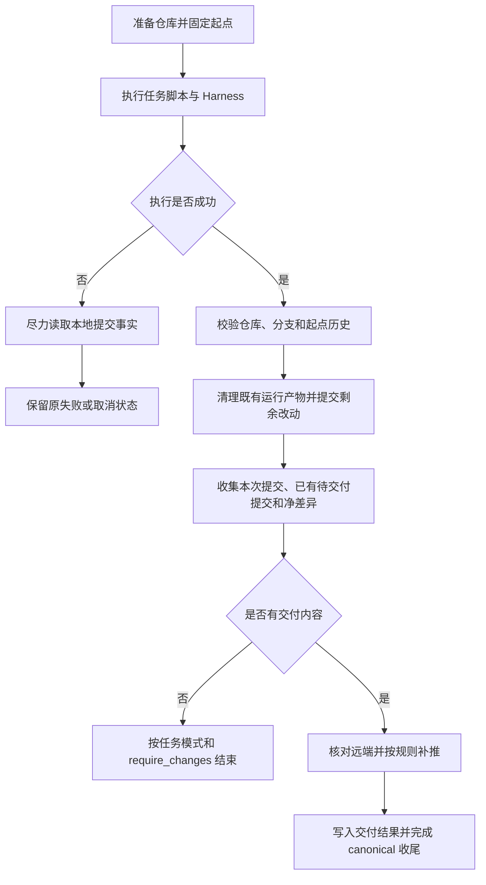

# Task 自主提交识别与可靠补推设计

**Date:** 2026-09-04

**Status:** Proposed — 范围已确认，方案待评审，尚未实施

**Scope:** `execute` / `freeform` Task 结束时识别本次提交、补推缺失提交、生成完整变更统计，并展示到 Task 结果与 MR 摘要；预计 3–5 人日

**Related:** [Task 自由模式设计](2026-08-14-task-freeform-mode-design.md)、[Worker Workspace 设计](2026-05-05-worker-workspace-session-unification-design.md)、[Task Runtime Artifacts 设计](2026-07-27-task-runtime-artifacts-design.md)、[Canonical Event 合同](../../architecture/worker-canonical-event-v1.md)

## 1. 决策

Worker 在任务结束时，以 Git 仓库事实统一核对交付结果：

1. 仓库准备完成、任务自定义脚本和 Harness 执行之前，固定本次执行的起始提交。
2. Harness 可以自行产生一个或多个提交，Worker 保留其 SHA、顺序和提交说明。
3. 剩余未提交变更继续由 Worker 提交，最终收集整个任务范围的提交和净文件差异。
4. 查询任务工作分支的真实远端状态；已包含最终提交则确认交付，否则在可安全快进时补推。
5. 提交事实与推送结果分别记录；推送未确认时不得宣告代码交付成功。
6. 结果复用 `Task.worker_metadata`，提供完整提交列表、整体统计、推送状态和错误原因。

实现集中在共享 Worker 收尾流程、Backend 结果投影和结果展示，不依赖 Harness 的工具调用文本，也不为各
Harness 增加 Git 事件解析。新增逻辑不需要模型调用。

## 2. 当前实现与已确认缺口

评估基线为 2026-09-04 工作区源码，HEAD `257d6c89`。以下是源码与临时本地 Git 仓库验证结论，不代表
线上 Runtime Bundle 已核验或本方案已实现。

| 当前路径 | 已有能力 | 缺口 |
| --- | --- | --- |
| `main.sh` 的未提交变更分支 | Worker 提交并推送，生成提交元数据 | 统计来自最后的 staged diff，遗漏此前 Harness 提交的变化 |
| `repo_has_unpublished_local_head` | 识别继承工作区中的待推送提交及不确定推送标记 | 需要与本次新增提交区分 |
| `repo_work_branch_ahead_of_base` | 工作区干净时仍可识别 Harness 提交 | 使用准备时的远端起点，缺少独立的本次本地起点 |
| `write_existing_commit_delivery_metadata` | 记录当前 HEAD 和最后一条提交说明 | 文件数组为空、增删统计为零，缺少多个提交 |
| `repo_push_work_branch_with_lease` | 保护准备时的远端提交；推送返回异常后可复查远端 | Harness 已推送部分提交时，旧 lease 会拒绝后续正常补推 |
| `main.sh` 的 Harness 提交分支 | 尝试补推后记录 SHA | `repo_push_work_branch_with_lease || true` 吞掉推送失败 |
| Backend / Task 结果卡 / MR 摘要 | 支持单个 SHA、提交说明及统计 | 缺少完整提交列表和明确的推送结果 |

临时 Git 仓库复现了以下行为：

- 自主提交未推送：可以补推并记录最后一个 SHA，但记录的 additions 为零。
- 自主提交并推送：可以记录最后一个 SHA，但记录的 additions 为零。
- 自主提交并推送 A，再提交 B：补推被拒绝，远端缺少 B，收尾分支仍返回 0 并记录 B。
- 远端拒绝推送：收尾分支仍返回 0 并记录本地 SHA。
- 工作分支只有先前任务的已推送提交：不会被这条正常路径当成本次新提交。

相关代码：[main.sh](../../../deploy/worker-entrypoint/main.sh)、[repository-helpers.sh](../../../deploy/worker-entrypoint/repository-helpers.sh)、[结果解析](../../../backend/app/core/worker_results.py)、[结果卡](../../../frontend/src/components/TaskResultPanel.vue)。

## 3. 范围与交付边界

### 3.1 本次包含

- 指定 `/workspace` 仓库、指定任务工作分支上的自主提交、部分推送和 Worker 收尾提交。
- 收尾时的完整提交列表、任务净差异、已存在远端的确认与缺失提交补推。
- 继承工作区中待交付提交的补交与单独展示。
- 推送失败时保留提交事实；正常失败退出时尽可能采集已有提交。
- Task 详情、MR 摘要、Canonical finalization 和数据库投影的一致性。
- 有意义的 Git 行为回归、前后端验证和冻结新 Runtime Bundle 上的最小真实 Task 验证。

### 3.2 本次不包含

- 运行中实时刷新每条 Git 提交、Git hook / 文件监听 / reflog 审计服务。
- 恢复最终已不可达的提交，或证明每个提交、每一行代码由哪个进程编写。
- 跨仓库、子模块内部仓库、多分支发布和推送到用户临时指定的其他 remote。
- 自动处理分叉、自动 rebase / reset / cherry-pick，或自动改写既有远端历史。
- Harness 失败、取消或超时后启动新的自动提交或补推。
- 新增 Task 状态、提交关系表、数据库迁移、功能开关或历史结果回填。

`plan` 不进入自动提交和补推流程。本方案不把分析任务中意外发生的自主写操作解释为获准交付，也不承诺
撤销 Harness 已自行推送的内容。

## 4. 提交归属与固定起点

定义以下独立值，全部使用完整对象 ID：

| 符号 | 含义 | 是否允许变化 |
| --- | --- | --- |
| `S` | 仓库准备完成后的本地任务分支 HEAD | 本次执行固定 |
| `R0` | 仓库准备时已确认的远端任务分支 HEAD；不存在时为 null | 本次执行固定 |
| `B0` | 准备时已确认的基础分支 HEAD | 本次执行固定 |
| `H` | 收尾提交完成后的本地任务分支 HEAD | 收集结果时固定 |
| `R` | 收尾时重新观察到的远端任务分支 HEAD | 每次远端观察记录实际值 |

在 `main.sh` 执行 pre script 前调用共享 helper 固定 `S/R0/B0`，关联当前 Task/attempt，写入 runtime
目录。仓库的 checkout、fetch 和复用同步已在这之前结束。pre/post script 的提交属于本次执行范围。
禁止用会被 push 更新的 `REPO_REMOTE_WORK_SHA` 同时充当任务归属起点。

### 4.1 本次新增提交

- 先证明 `S` 是 `H` 的祖先，再收集 `S..H`；按拓扑顺序、父提交在前展示。
- 每条至少记录完整 `sha` 和 `subject`；保留原有提交，不 squash、amend 或补写 trailer。
- 该列表表示本次执行最终新增到任务分支历史中的提交。merge / cherry-pick 引入的提交也可能在其中，
  界面称“本次提交”，不把列表全部标为“Harness 编写”。
- 仅在本次新提交范围内部进行 amend / rebase，且最终仍包含 `S`，可以按最终历史采集；被替换的中间 SHA
  不做审计。若操作改写或删除 `S`，则无法按本合同归属，停止自动交付并给出原因。

### 4.2 继承的待交付提交

- 当准备流程保留本地领先历史时，启动时固定 `R0..S` 中待交付的提交；远端分支从未存在时使用 `B0..S`。
- 现有 `codify.unpublishedPushSha` 表示上次推送尚未确认。只采纳可在当前任务分支中验证的标记提交，
  与上述列表按 SHA 去重；即使远端已含该 SHA，也可作为“已有提交的交付确认”。
- 这些提交单独记为 `recovered_commits`，不得混入本次 `commits`，也不得重复增加本次净差异统计。
- 本次没有新增提交但成功补交或确认了已有提交，保留现有恢复交付能力；结果明确显示“已有提交补交/确认”。
- `R0 == S == H` 且无待确认标记时，仅有历史提交，不构成本次交付。

继承的未提交文件继续沿用现有工作区续作机制。它们在本次被提交后属于本次落地的文件变化；本方案不追溯
每段未提交内容最早由哪次执行写入。

## 5. 统一收尾流程

1. 保留现有运行产物过滤、作者配置、Worker commit message 生成机制。清理并 stage 后重新检查 staged
   diff；没有实际 staged 变更时跳过 Worker commit，避免仅因临时文件产生空收尾提交。
2. 所有正常交付路径汇合到同一组“采集 → 发布 → 写结果”函数；消除 dirty / clean 两路不同的元数据口径。
3. 在 Git 查询、commit 或 push 失败的正常退出路径上保留已收集信息。不得用 `|| true` 吞掉交付失败。
4. Worker 自身只为剩余 staged 变更生成提交说明；Task/MR 总结使用完整提交列表和本次净差异，覆盖
   Harness 已提交的部分。结果统计由 Git 计算，不让模型估算。
5. 固定 `H` 时确认交付范围内没有剩余未提交变更；随后推送该 SHA 到明确的任务分支。若发布前发现本地分支
   再次移动或出现新的未提交变更，停止本轮发布，不让结果与推送内容脱节；不增加循环追赶后台写入者的机制。

### 5.1 统计口径

本次统计使用两个树端点 `git diff S H`，不是最后一次 `--cached` diff、MR 累计 diff 或逐提交行数相加：

- 统计 additions、deletions、total，以及新增/修改/删除文件；每个任务只有一份最终净差异。
- 重命名沿用 `--no-renames` 的删除加新增口径；二进制变化计入文件列表，行数不虚构。
- 使用 NUL 分隔的 Git 输出和结构化 JSON，正确处理逗号、空格、制表符等文件名。
- 有提交但净差异为零是有效结果，例如修改后 revert；`require_changes` 不以行数是否大于零判断。
- 起点缺失或关系不可验证时，统计是“未采集”，不能填零冒充已确认的零变更。

## 6. 远端核对与安全补推

推送目标来自任务既定仓库 URL 和 `BRANCH_NAME`。不使用 Harness 修改后的 upstream、push.default 或其他
remote 作为交付目标。保留现有凭据注入和敏感信息清理机制。

### 6.1 前置约束

- 当前仓库必须仍为任务仓库，HEAD 附着在既定任务分支，且 `S` 可达于 `H`。
- `R0` 存在时，当前远端分支仍须存在，且必须证明 `R0` 可达于 `R`；远端删除或回退不自动恢复。
- 必要时仅获取既定工作分支的对象，沿用已有 clone/fetch 深度策略。浅历史不足以证明关系时明确失败，
  不把命令错误当成“零提交”，也不隐式全量拉取仓库。

不能只把旧 lease 换成最新 SHA：必须先满足上述历史约束，再允许使用当前观察值。

### 6.2 决策表

无交付内容时先按任务模式结束，不做远端发布查询。其余远端关系决策在存在交付内容且前置约束成立后执行：

| 收尾观察 | 动作 | 推送结果 |
| --- | --- | --- |
| 无本次提交、无已有待交付提交 | 不发布 | `not_needed` |
| `R == H` | 无需重复 push | `already_present` |
| `H` 是 `R` 的祖先 | 远端已包含最终提交，保留其后续变化 | `already_present` |
| `R` 是 `H` 的严格祖先 | 用观察到的 `R` 作为精确 lease，将 `H` 推到任务分支 | 成功为 `pushed` |
| `R0` 与 `R` 均不存在 | 以“分支必须不存在”为 lease 创建任务分支 | 成功为 `pushed` |
| 历史分叉、关系不可证明、认证失败、网络不可确认 | 不覆盖远端，保留本地结果 | `failed` |

即使使用 `--force-with-lease`，也必须由上述祖先检查保证只允许快进；禁止无条件 force、自动合并或重写。
显式推送固定 `H:refs/heads/<任务分支>`，不重新从可变分支名选择源提交。

远端在观察后发生变化导致 push 被拒绝时，只做一次有界复查：若能证明远端已经包含 `H`，按
`already_present` 确认；否则记录失败，不重新取 lease 后无限重试。推送返回非零但服务端实际已完成写入，
同样走这次复查。网络不可确认意味着“交付未确认”，不声称提交一定未到达远端。

例：`S -> A -> B`，Harness 已把 A 推到远端。收尾观察为 `R=A`，满足 `R0 <= R <= H=B`，因此可以补推 B。
这解决当前使用任务开始时的旧 lease 拒绝 B 的问题。

## 7. 结果数据合同

复用 `Task.worker_metadata`，新增 `git_delivery` 对象，不增加数据库表或字段。推荐字段如下：

| 字段 | 内容 |
| --- | --- |
| `schema` | `codify.git-delivery.v1` |
| `attempt_id` | 当前 canonical attempt 标识，防止复用其他执行的结果 |
| `branch` | 任务工作分支名 |
| `start_sha` / `start_remote_sha` / `head_sha` | `S` / `R0` / `H`；未观察到的值为 null |
| `commits` | 本次提交的 `{sha, subject}` 数组；无法采集为 null |
| `recovered_commits` | 已有待交付提交的 `{sha, subject}` 数组；无法采集为 null |
| `diff` | 本次净差异 `{additions, deletions, total, new_files, modified_files, deleted_files}`；不可采集为 null |
| `push.status` | `not_needed`、`not_attempted`、`pushed`、`already_present`、`failed` |
| `push.remote_sha` | 最近确认的远端 tip，包括成功 push ACK 确认的 `H`；没有有效确认时为 null |
| `push.error` | null 或 `{code, message}`，描述无法确认交付的原因 |

提交数组为空表示确认没有对应提交，null 表示未能采集，界面不得把 null 显示成“0 个提交”。
`not_attempted` 用于执行失败等未进入发布的情况；它不代表 Harness 此前一定没有自行推送。
错误 code 可区分 `branch_changed`、`history_rewritten`、`history_unverifiable`、`remote_deleted`、
`remote_rewound`、`remote_diverged`、`remote_changed`、`push_failed`、`remote_unconfirmed`。它们是交付诊断，
不新增 TaskStatus 或 Harness failure kind。交付失败原因必须进入 `delivery.failed` 和
`run.failed.failure.message`，并投影到 `Task.error_message`；不能只保留在控制台，或笼统显示为模型执行失败。

### 7.1 既有字段投影

- `Task.commit_sha` 继续表示已确认远端包含的交付终点：有本次或恢复交付内容，且推送状态为 `pushed` /
  `already_present` 时写入 `H`。只有普通历史 HEAD 时不写入。
- 推送失败只在 `git_delivery.head_sha` 和列表中保留本地事实，不用未确认的 SHA 打开已有 MR/Issue 交付门禁。
- `Task.commit_message` 使用已确认交付终点的提交说明；多提交明细来自 `git_delivery.commits`。
- 成功结果的 `Task.additions/deletions/total_changes` 及顶层 task metadata 统计来自同一份 `diff`。
  失败结果可在 metadata 中保留本地 diff，不改变现有成功任务统计的采集口径。
- diff 为 null 时不得落成已采集的零统计，也不得退回 MR 累计统计冒充本次统计；真实零差异正常记录。

### 7.2 持久化与事件

1. 采集后的本地快照先原子写入 `task-metadata.json`；发布结果确定后原子更新。
2. `worker.finalization` 从同一快照携带完整 `git_delivery` 及已有 SHA/diff 投影，不重新独立执行 Git 计算。
   使用 JSON 文件传递列表，避免将完整数组拼成 shell 参数或逗号字符串。
3. Backend 从 canonical finalization 验证并投影 `git_delivery` 到 `Task.worker_metadata`；现有 artifact
   提取补齐 summary 等内容时保留该对象，不能用迟到的旧文件覆盖已确认的发布结果。
4. 消费方验证当前 Task/attempt、schema、SHA、字段类型、统计和顶层投影一致性，清理敏感文本；矛盾数据
   不用于判定交付，按已有协议错误路径处理，不从 Harness 自述或普通控制台日志补造结果。
5. 成功和失败结果均在容器删除前持久化；沿用停止容器的 archive 回收和 canonical backfill 路径。
6. 成功执行 Harness 后，事件依次为 `harness.completed`、`delivery.started`、`delivery.completed/failed`、
   `worker.finalization`、`run.completed/failed`，整个 attempt 只有一个 Task terminal。
   未进入 delivery 的失败沿用原终止顺序。

可正常执行 EXIT 收尾且起点仍可用的失败，尽力完成不访问网络的本地采集，保留原始失败/取消/超时原因；
采集失败不能替换原始错误，也不能触发 partial clone 的隐式对象下载或延长现有停止宽限期；缺少对象时记录
未采集。强杀、容器丢失等无法执行收尾的情况不保证完整提交明细，本次不增加后台恢复服务。

## 8. Task 模式、失败与 MR 语义

| 情况 | Task / 交付结果 | MR 与 Issue |
| --- | --- | --- |
| 成功且有本次提交或已有提交补交，远端已确认 | 正常完成，记录完整交付 | 沿用该模式既有交付流程 |
| `freeform` 无交付内容 | 正常完成，`not_needed` | 不创建 MR、不改 Ready、不更新交付描述 |
| `execute` 无交付内容，`require_changes=false` | 正常完成，`not_needed` | 保留 execute 既有资格，不收紧为必须有 SHA |
| `execute` 无交付内容，`require_changes=true` | 无变更失败 | 不伪造代码交付 |
| 有提交但净 diff 为零 | 提交仍可构成交付 | 不因统计为零丢弃提交 |
| 推送拒绝或无法确认 | `delivery.failed`、`run.failed`，保留提交事实 | 不执行成功交付的 Ready/创建操作 |
| Harness / hook 失败、取消、超时 | 保留原失败状态；不启动新的 commit/push | 不提升为成功交付 |

已有 execute MR 可按既有流程展示失败记录，但必须标明“交付未确认”；freeform 失败继续不触发其成功交付
专用的 MR 创建、Ready 和描述更新。MR API 失败沿用现有策略，不将已确认的 Git 推送改写成“未推送”。

## 9. API、Task 结果页与 MR 展示

- Task 详情提供经过归一化的 `git_delivery`；列表接口不批量携带完整提交数组，避免扩大轮询响应。
- 结果卡显示“本次 N 个提交”、整体 `+A/-D`、分支和推送结果；每条显示短 SHA 与提交标题。
- 已有提交补交/确认单独展示，不增加本次提交计数和行数统计。无本次提交时也能看到恢复交付结果。
- 只有确认远端包含完整交付范围时，统一提供提交页链接；未确认结果仍提供 SHA 复制，不显示可能失效的
  已交付链接，也不把整个范围断言为“全部未推送”。
- 失败结果提供可理解的原因，如“远端分支已变化，补推未完成”；不要求用户理解 lease、shell exit code。
- MR 每个 Task 明细展示本次提交列表、恢复交付列表、净差异和推送状态；聚合总结覆盖完整本次结果。
  MR 展示范围与 Task 详情来自同一归一化对象。
- 使用 Vue 文本渲染；MR 文本转义 Markdown/HTML 特殊内容；所有 UI 文案同步维护中英文。
- 长标题换行、多提交折叠后可展开全部；验证 390px 移动端、44px 触摸目标和桌面布局。
- 历史 Task 缺少 `git_delivery` 时，保留原单 SHA 展示；新推送状态显示“未记录”，不反推或补造历史列表。

## 10. 实施拆分与成本

按一位熟悉仓库的开发者估算；下表包含实现、针对性回归和最小真实环境验证，总计 **3–5 人日**。
本文件是方案，下面各项均尚未完成。

| 工作包 | 改动与结果 | 预计人日 |
| --- | --- | ---: |
| W1：Git 收尾 | 固定起点、统一采集、多提交与恢复归属、远端核对、失败传播 | 1–1.5 |
| W2：结果链路 | metadata/canonical 同源、Backend 投影、失败持久化、详情 API、MR 摘要 | 0.75–1 |
| W3：结果展示 | 提交列表、恢复交付、推送状态、中英文与移动端 | 0.5–1 |
| W4：验证与交付 | Git 行为回归、前后端验证、冻结 Bundle、最小真实 Task 验收 | 0.75–1.5 |

实施顺序为 W1 → W2 → W3 → W4；不另建发布状态机或独立提交服务。

### 10.1 文件与职责

| 模块 | 主要文件 | 职责 |
| --- | --- | --- |
| Git 采集与补推 | `deploy/worker-entrypoint/repository-helpers.sh`、`main.sh` | 固定起点、汇合收尾分支、补推规则及错误传播 |
| 结构化采集 | 新增 `deploy/worker-entrypoint/git-delivery.py` | 使用参数化 Git 调用和 NUL 输出生成提交/diff JSON，避免增加复杂 shell 文本解析 |
| 退出与 canonical | `deploy/worker-entrypoint/bootstrap.sh`、`harness/common.sh` | 有界本地失败采集、使用同一交付快照、保持唯一 terminal |
| 摘要输入 | `deploy/worker-entrypoint/delivery.sh`、`main.sh` | 区分 Worker 最后一次提交说明与整个 Task 的总结输入 |
| 结果持久化 | `backend/app/core/worker_results.py`、`worker_task_artifacts.py`、`worker_task_lifecycle.py` | 结果归一化、远端确认后的单 SHA 投影、失败/取消前持久化 |
| API 与 MR | `backend/app/core/task_helpers.py`、`backend/app/api/tasks.py`、`backend/app/core/worker_gitlab.py` | 详情投影、完整提交摘要；复用同一归一化规则 |
| 前端 | `frontend/src/api/tasks.ts`、`components/TaskResultPanel.vue`、两份 locale | 结果类型、提交列表、状态与响应式布局 |

不修改 Harness CLI、Provider 协议、Scheduler 排队规则或既有 Task Snapshot。新 helper 随已有
`worker-entrypoint` 受控源码树进入 Runtime Bundle。

## 11. 验证矩阵

### 11.1 本地 Git 行为测试

使用临时 bare remote 和真实 Git，调用生产 helper/收尾逻辑；Harness、摘要模型和 MR HTTP 可替身。
必须断言远端 refs、提交图、元数据与退出结果，不能仅检查源码是否出现某个字符串。

| 用例 | 必须证明 |
| --- | --- |
| 仅未提交变更 | Worker 创建一次提交，发布正确，统计完整 |
| 自主单次或多次提交未推送 | 全部识别并补推，工作区干净也能交付 |
| 自主提交已全部推送 | 识别完整列表并确认，保留 SHA，不额外提交 |
| 推送 A 后再提交 B | 可补推 B，不再被旧 lease 错误拒绝 |
| 自主提交后仍有未提交改动 | Worker 追加提交，总体 diff 覆盖全部改动 |
| 继承未发布提交，本次有/无新提交 | 归属分开，补交正确，不重复统计 |
| 上次 push 返回异常但远端已写入 | 依据标记确认已有交付，清理已确认标记 |
| 只有上次任务的已发布历史 | 本次列表为空，不冒充新交付 |
| 远端已含 H 并有后续提交 | 不覆盖远端，任务范围不吸收远端后续提交 |
| 分叉、远端删除/回退、查询到 push 之间有更新 | 保持远端内容，失败或经一次复查确认 H 已发布 |
| push 被拒绝或网络不可确认 | 失败非零，保留本地 SHA，已交付投影为空 |
| push 非零但远端已包含 H | 复查确认后成功，不错误报未交付 |
| 改写起始提交、切换分支、detached HEAD | 明确失败，不向错误分支发布 |
| 浅历史关系不明或起点对象缺失 | 不报零变更，不做隐式全量拉取 |
| 合并提交、空提交、修改后 revert | 最终可达提交正确，净统计可为零 |
| 逗号/空格/制表符文件名、重命名、二进制文件 | 列表和行数口径正确，无分隔符误拆 |
| 运行产物清理后无 staged diff | 不生成无意义 Worker 空提交 |
| Harness/hook 失败或正常信号退出 | 尽力保存已知提交，不新增 commit/push，不覆盖原错误 |

### 11.2 Backend 与 Frontend

- 扩展 `test_worker_repository_bootstrap.py`，新增 `test_worker_git_delivery.py` 覆盖 W1 的统一收尾。
- 扩展 `test_worker_results_v2.py`、`test_worker_task_artifacts.py`、`test_worker_task_lifecycle.py`：验证
  canonical 与 metadata 一致、已确认 SHA 门禁、失败/取消的持久化、停止容器 archive 回填和唯一 terminal。
- 扩展 `test_worker_freeform_delivery.py` 与 `test_task_api_contract.py`：验证 Task 模式、无变更、恢复交付、
  详情数据和历史缺字段行为；MR 聚合测试验证多提交、净统计和转义。
- 扩展 `TaskResultPanel.spec.ts` / `TaskResultPanel.behavior.spec.ts`，覆盖多提交、补交、失败、零差异及历史
  单提交；执行 frontend build，并在浏览器核对移动端和桌面结果卡。
- 实施时先运行这些目标用例；只有具体改动触及公共门禁或发现风险才扩大测试，不默认重跑无关完整协议矩阵。
  命令入口参见[测试指南](../../TESTING.md)。

### 11.3 最小真实 Task 验收

固定新 Backend/Frontend revision 与新 Runtime Bundle identity，使用受控测试仓库，在实际 Worker Host 验证：

1. 一个 Harness 自主生成两个提交且不推送，Worker 补推并完整显示。
2. 另一个 Harness 自主推送 A、再提交 B 并留下少量未提交改动，Worker 完成后续提交与补推。
3. 一次受控远端拒绝/并发分叉，确认 Task 失败、本地提交可见、远端受保护、MR 未被错误标记 Ready。

成功用例核对远端提交图、canonical 事件、Task API、结果卡和 MR；失败用例核对失败原因及持久化事实。
记录真实 Harness、Bundle、Host、Task 和验证结果，不把本地测试当作远端验收。该验证覆盖共享交付能力，
不替代 Open-Harness V2 原有发布计划中的独立验收要求。

## 12. 发布与完成条件

正常 Task 的收尾脚本来自不可变 Runtime Bundle，而非直接读取 Kit 内的可变脚本。本功能需要发布
Backend/Frontend 并让新建 Task 绑定包含修改的新 Bundle；通常不需要重建 Harness CLI 或整个 Worker Kit。
旧 Task/旧 Bundle 保持原有绑定，不原地替换历史运行内容；验证新行为必须创建使用新 Bundle 的 Task。

完成条件：

- [ ] 同一收尾路径覆盖自主提交、Worker 提交、全部/部分已推送和工作区补交。
- [ ] 本次提交范围、恢复交付范围、净差异和远端确认结果有明确且一致的合同。
- [ ] 推送失败不会产生成功 Task 或虚假的已交付 SHA，失败提交信息可在 Task 结果中查看。
- [ ] Task 详情与 MR 可展示多个提交，统计一致，历史记录和 Task 模式语义无回归。
- [ ] 验证矩阵中的适用目标测试、frontend build 和浏览器检查通过。
- [ ] 新 Runtime Bundle 上的最小真实成功与失败用例完成，并保存证据。

文档写入、Markdown 检查或单元测试通过分别只证明对应阶段；本文件中的工作包和验收项在实际完成前保持未勾选。
