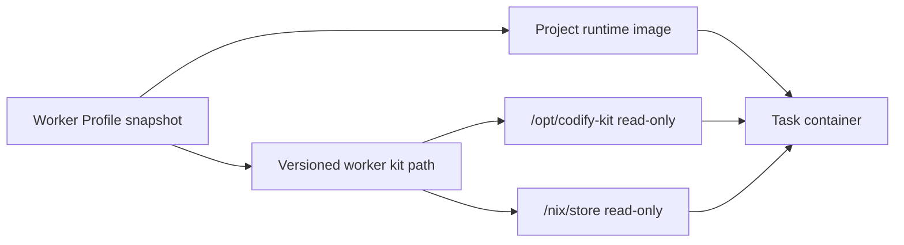

# Mounted Worker Kits

Codify supports two worker delivery modes:

- `baked_image`: deprecated legacy mode where the image contains both Codify tools and project
  runtimes. It remains available for existing non-Skill profiles, but Claude Skills are not
  supported.
- `mounted_kit`: the profile image contains only the project runtime. Codify mounts a
  versioned worker kit when each task container starts.

The mounted mode separates ownership: project teams own Java, Node.js, C++, and other
toolchains, while system operators distribute one audited Codify kit per platform.



## Why the kit uses a Nix closure

Copying `node`, `python`, or `git` into an arbitrary image is not portable because those
binaries depend on a particular libc and shared-library set. The kit exports a complete Nix
runtime closure whose binaries refer to immutable paths under `/nix/store`. The same kit can
therefore run inside glibc and musl-based images without borrowing libraries from the project
image. The target host does not need Nix installed.

The kit includes Bash, Git, curl, jq, Python, Node.js, SSH, ripgrep, CodeGraph, and the
Mermaid validator. Claude CLI is intentionally outside the kit and must be supplied by the
runtime image or a profile volume mount.

`deploy/Dockerfile.worker-java21-maven` builds `codify-worker/java21-maven:2026.07` as one
mounted-kit runtime image. It contains the project-side Java 21 and Maven toolchain, workspace,
and UID 1000 write setup, but no Python runtime, Codify entrypoint, Claude CLI, CodeGraph,
Mermaid npm bundle, or ci-claude script.

## Build and export

On a connected build machine:

```bash
make worker-kit-export WORKER_KIT_VERSION=0.3.9 WORKER_KIT_PLATFORM=linux/amd64
```

This creates an archive and checksum under `deploy/offline-bundle/kits/`. Kit versions are
immutable. The manifest records the actual nixpkgs version used by the build.
Version `0.3.0` adds the Issue-level shallow/partial repository preparation module and its
`[repo]` telemetry. Version `0.3.1` keeps the mounted kit on `PATH` inside the unprivileged
login shell, including for project runtime images that do not provide Git themselves. Version
`0.3.2` bounds Claude CLI shutdown after a final stream result and records process diagnostics
when the CLI or one of its descendants keeps the stream open. Version `0.3.3` makes CodeGraph
initialization use bounded plain-text progress and makes incremental sync non-interactive while
retaining a failure diagnostic. Version `0.3.4` adds bounded task-runtime artifact sealing and archive
packaging. Version `0.3.5` loads task-scoped Claude Skill directory packages from the Docker-API
runtime bundle via `--add-dir`, without adding a host bind mount or modifying the persistent Claude
home. Each package preserves its complete root `SKILL.md`, including supported Claude Code
frontmatter, plus its configured relative-path scripts, references, templates, and other supporting
files; executable files retain a controlled `0755` mode. Package paths reject absolute paths,
traversal, symlinks, and conflicts with the root `SKILL.md`. Tasks retain foreign-key-backed
immutable Skill version references, so later edits, disabling, or deletion do not change an
already-created task, while unreferenced versions can be reclaimed safely.
The root frontmatter must contain a Claude-compatible `name` matching the package directory and
a non-empty `description`; remaining frontmatter is preserved without reconstruction.
Task Skills also require Claude Code `2.1.33` or newer because earlier CLI releases do not discover
`.claude/skills` from `--add-dir`; the worker exits with an explicit compatibility error instead of
silently running without the selected Skills.
Version `0.3.6` preserves a locally created Issue branch when an earlier analysis task did not push
it, while continuing to reject deletion of a remote branch previously observed by the workspace.

Runtime verification for Worker Kit `0.3.5` and newer checks the Claude executable mounted into
the actual project image and fails when its version is older than `2.1.33`.
Version `0.3.7` adds Runtime Bundle contract/event compatibility metadata. Version `0.3.8`
adds the complete executable Adapter v1 operation gate, capability-driven CodeGraph/run-text
degradation, normalized failure propagation, and raw-Harness preservation in fallback archives.
Version `0.3.9` removes the remaining Claude-specific prompt, result, system-prompt, and session
preparation from the common task environment and keeps it behind the Claude Adapter boundary.
The actual Claude
Adapter version and digest come only from each Task's immutable Runtime Bundle manifest; the Kit
does not carry or declare a current Adapter. Existing mounted-kit profiles remain pinned to their
configured path: install `0.3.9`
on every eligible Docker host, verify it,
and then update the profile version and path. Merely deploying the Backend does not replace an
already installed kit.

## Phase 1 release boundary

The Phase 1 release is a coordinated hard cutover:

1. Stop scheduling and close every Issue created before the release. Its existing Tasks remain
   readable but cannot execute or retry because they have no immutable Runtime Bundle.
2. Install and verify Worker Kit `0.3.9` on every Docker Engine host eligible for scheduling.
3. Update every enabled Worker Profile to the immutable `0.3.9` version and absolute path. A host
   or profile left on an older Kit must remain disabled.
4. Deploy Backend/Scheduler and run the migration before accepting new Issues or Tasks, then
   resume scheduling.

Task execution without a Runtime Bundle manifest fails before orchestration starts. Neither the
Backend nor the Kit launcher backfills historical Tasks or falls back to Kit-local task scripts.
The Kit-local entrypoint remains available only to the `--verify` installation preflight.

The nixpkgs source is locked by revision and Nix content hash in
`deploy/worker-kit/nixpkgs.json`; builds do not follow a mutable Nix channel. Update both values
deliberately when upgrading nixpkgs, then publish a new worker-kit version. The manifest records
the locked revision for release auditing.
The installer rejects an existing version directory; build a new version instead of replacing
an installed directory in place.

## Supplying Claude CLI

Mounted worker kits default to `/usr/local/bin/claude`. The executable can come from the
runtime image, or an administrator can add a read-only file mount from the Docker host. For
example, add this profile mount:

```json
{
  "host_path": "/opt/codify/overrides/claude-2.1.200",
  "container_path": "/usr/local/bin/claude",
  "mode": "ro"
}
```

If you mount Claude somewhere else, also set `CODIFY_CLAUDE_BIN` in the Worker Profile:

```json
{
  "key": "CODIFY_CLAUDE_BIN",
  "value": "/opt/claude/claude"
}
```

The mounted file must exist on every selected Docker Engine host, be executable, match the
container CPU architecture, and be compatible with the runtime image's libc and loader. This is
especially important for Alpine images. `CODIFY_CLAUDE_BIN` must be an absolute path. Runtime
verification executes the effective `claude --version`, so verify every affected profile after
changing the file.

This delivery is operationally mutable: an existing task snapshot stores the mount path, not the
file content. Update the host file deliberately on every Docker Engine host that can run the
profile.

For headless runs, the kit defaults `CLAUDE_CODE_EXIT_AFTER_STOP_DELAY` to 5000 milliseconds and
uses a 30-second grace period for the output stream to close after receiving a final result. A
Worker Profile can override `CLAUDE_CODE_EXIT_AFTER_STOP_DELAY` and
`CI_CLAUDE_RESULT_EXIT_GRACE_SECONDS` when SessionEnd hooks need a longer shutdown window. A
shutdown timeout records the CLI PID and process group, Linux process state, parent PID, thread
count, direct child PIDs, process-group members, event count, and last event type in `console.log`
before terminating the CLI process group and stopping the stream processor.

## Offline installation

Copy the bundle into the offline environment, then run this on every Docker Engine host that
can execute mounted-kit profiles:

```bash
sudo ./scripts/install-worker-kit.sh \
  kits/codify-worker-kit-0.3.9-linux-amd64.tar.gz
```

The default installation path is:

```text
/opt/codify/worker-kits/0.3.9-linux-amd64
```

For remote Docker targets, this is a path on the Docker Engine host, not on the Backend or
Scheduler container. Install the kit at the profile's configured absolute path on each target.

Runtime images are not included in the offline Docker archive by default. List all project
runtime images in `config/worker-images.txt` before running `make offline-bundle-export`; those
images are then included explicitly. This also applies to the reference
`codify-worker/java21-maven:2026.07` image built from
`deploy/Dockerfile.worker-java21-maven`.

## Runtime verification

Verify the kit and one project runtime image before creating a profile:

```bash
./scripts/verify-worker-runtime.sh \
  --kit /opt/codify/worker-kits/0.3.9-linux-amd64 \
  --claude-host-path /opt/codify/overrides/claude-2.1.200 \
  --image team/java21-maven:2026.07 \
  --smoke 'java -version && mvn -version'
```

The verifier checks the manifest, kit mounts, the effective Claude executable, Codify tools,
Mermaid, CodeGraph, numeric UID/GID downgrade, workspace writes, and the optional project
command. If the runtime image already includes Claude at `/usr/local/bin/claude`, omit
`--claude-host-path`.

Administrators can run the same check through Codify after saving a profile:

```http
POST /api/worker-profiles/42/verify-runtime
Content-Type: application/json

{"smoke_command":"java -version && mvn -version"}
```

The API preflight applies the profile's non-secret environment variables and custom mounts.
Secret environment variables are deliberately omitted because the optional smoke command can
write arbitrary output; the response lists the omitted keys without exposing their values.

## Profile API

No UI is required. Create or update a Worker Profile through the existing admin API:

```json
{
  "name": "Java 21 and Maven",
  "image": "codify-worker/java21-maven:2026.07",
  "runtime_mode": "mounted_kit",
  "worker_kit_version": "0.3.9",
  "worker_kit_path": "/opt/codify/worker-kits/0.3.9-linux-amd64",
  "codegraph_enabled": true,
  "volume_mounts": [
    {
      "host_path": "/opt/codify/overrides/claude-2.1.200",
      "container_path": "/usr/local/bin/claude",
      "mode": "ro"
    }
  ],
  "environment_variables": []
}
```

Profiles remain editable configuration. Each task stores `runtime_mode`, image, kit version,
kit path, Docker target, mounts, and environment in its immutable worker snapshot. Retries use
that snapshot and are not silently moved to a newer kit.

## Constraints and security

- Kit and runtime image CPU architectures must match. Build separate `linux/amd64` and
  `linux/arm64` artifacts when both are used.
- `/opt/codify-kit` and `/nix/store` are reserved. Mounted-kit profiles reject custom mounts
  that overlap either path.
- The container starts as `0:0` for repository/bootstrap setup, then runs user hooks and Claude
  as `CODIFY_RUN_UID:CODIFY_RUN_GID`, defaulting to `1000:1000`. The runtime image does not need
  a named `codify` user.
- The kit is executable code with the same trust level as a worker image. Verify its checksum,
  restrict write access to the installation root, and distribute it through the same release
  approval process as Codify images.
- Custom CA files are exposed through Git, Node.js, and Python CA environment variables. In
  mounted mode Codify does not mutate the project image's JDK truststore; use a profile pre-script
  or a runtime image policy when Java tools require a private CA.
- Runtime images that use Nix themselves are incompatible with the reserved `/nix/store` mount.
  Prefer a non-Nix runtime image. The deprecated `baked_image` fallback cannot use Claude Skills.
- `codify-worker/java21-maven:2026.07` is a mounted-kit runtime image. Profiles that use it must set
  `runtime_mode=mounted_kit` and provide a worker kit path/version.
