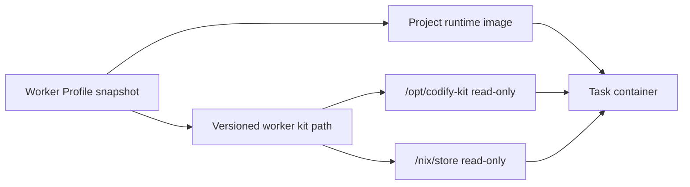

# Mounted Worker Kits

Codify supports two worker delivery modes:

- `baked_image`: the legacy worker image contains both Codify tools and project runtimes.
- `mounted_kit`: the profile image contains only the project runtime. Codify mounts a
  versioned worker kit when each task container starts.

The mounted mode separates ownership: project teams own Java, Node.js, C++, and other
toolchains, while system operators distribute one audited Codify kit per platform.



## Why the kit uses a Nix closure

Copying `node`, `python`, or `git` into an arbitrary image is not portable because those
binaries depend on a particular libc and shared-library set. The kit exports a complete Nix
runtime closure whose binaries refer to immutable paths under `/nix/store`. The same kit can
therefore run inside glibc and musl-based images without borrowing libraries from the project
image. The target host does not need Nix installed.

The kit includes Bash, Git, curl, jq, Python, Node.js, SSH, ripgrep, CodeGraph, and the
Mermaid validator. Claude CLI is intentionally outside the kit and must be supplied by the
runtime image or a profile volume mount.

`deploy/Dockerfile.worker-java21-maven` builds `codify-worker/java21-maven:2026.07` as one
mounted-kit runtime image. It contains the project-side Java 21 and Maven toolchain, workspace,
and UID 1000 write setup, but no Python runtime, Codify entrypoint, Claude CLI, CodeGraph,
Mermaid npm bundle, or ci-claude script.

## Build and export

On a connected build machine:

```bash
make worker-kit-export WORKER_KIT_VERSION=0.2.0 WORKER_KIT_PLATFORM=linux/amd64
```

This creates an archive and checksum under `deploy/offline-bundle/kits/`. Kit versions are
immutable. The manifest records the actual nixpkgs version used by the build.
The nixpkgs source is locked by revision and Nix content hash in
`deploy/worker-kit/nixpkgs.json`; builds do not follow a mutable Nix channel. Update both values
deliberately when upgrading nixpkgs, then publish a new worker-kit version. The manifest records
the locked revision for release auditing.
The installer rejects an existing version directory; build a new version instead of replacing
an installed directory in place.

## Supplying Claude CLI

Mounted worker kits default to `/usr/local/bin/claude`. The executable can come from the
runtime image, or an administrator can add a read-only file mount from the Docker host. For
example, add this profile mount:

```json
{
  "host_path": "/opt/codify/overrides/claude-2.1.200",
  "container_path": "/usr/local/bin/claude",
  "mode": "ro"
}
```

If you mount Claude somewhere else, also set `CODIFY_CLAUDE_BIN` in the Worker Profile:

```json
{
  "key": "CODIFY_CLAUDE_BIN",
  "value": "/opt/claude/claude"
}
```

The mounted file must exist on every selected Docker Engine host, be executable, match the
container CPU architecture, and be compatible with the runtime image's libc and loader. This is
especially important for Alpine images. `CODIFY_CLAUDE_BIN` must be an absolute path. Runtime
verification executes the effective `claude --version`, so verify every affected profile after
changing the file.

This delivery is operationally mutable: an existing task snapshot stores the mount path, not the
file content. Update the host file deliberately on every Docker Engine host that can run the
profile.

## Offline installation

Copy the bundle into the offline environment, then run this on every Docker Engine host that
can execute mounted-kit profiles:

```bash
sudo ./scripts/install-worker-kit.sh \
  kits/codify-worker-kit-0.2.0-linux-amd64.tar.gz
```

The default installation path is:

```text
/opt/codify/worker-kits/0.2.0-linux-amd64
```

For remote Docker targets, this is a path on the Docker Engine host, not on the Backend or
Scheduler container. Install the kit at the profile's configured absolute path on each target.

List all project runtime images in `config/worker-images.txt` before running
`make offline-bundle-export`; those images are then included in the offline Docker archive.

## Runtime verification

Verify the kit and one project runtime image before creating a profile:

```bash
./scripts/verify-worker-runtime.sh \
  --kit /opt/codify/worker-kits/0.2.0-linux-amd64 \
  --claude-host-path /opt/codify/overrides/claude-2.1.200 \
  --image team/java21-maven:2026.07 \
  --smoke 'java -version && mvn -version'
```

The verifier checks the manifest, kit mounts, the effective Claude executable, Codify tools,
Mermaid, CodeGraph, numeric UID/GID downgrade, workspace writes, and the optional project
command. If the runtime image already includes Claude at `/usr/local/bin/claude`, omit
`--claude-host-path`.

Administrators can run the same check through Codify after saving a profile:

```http
POST /api/worker-profiles/42/verify-runtime
Content-Type: application/json

{"smoke_command":"java -version && mvn -version"}
```

The API preflight applies the profile's non-secret environment variables and custom mounts.
Secret environment variables are deliberately omitted because the optional smoke command can
write arbitrary output; the response lists the omitted keys without exposing their values.

## Profile API

No UI is required. Create or update a Worker Profile through the existing admin API:

```json
{
  "name": "Java 21 and Maven",
  "image": "codify-worker/java21-maven:2026.07",
  "runtime_mode": "mounted_kit",
  "worker_kit_version": "0.2.0",
  "worker_kit_path": "/opt/codify/worker-kits/0.2.0-linux-amd64",
  "codegraph_enabled": true,
  "volume_mounts": [
    {
      "host_path": "/opt/codify/overrides/claude-2.1.200",
      "container_path": "/usr/local/bin/claude",
      "mode": "ro"
    }
  ],
  "environment_variables": []
}
```

Profiles remain editable configuration. Each task stores `runtime_mode`, image, kit version,
kit path, Docker target, mounts, and environment in its immutable worker snapshot. Retries use
that snapshot and are not silently moved to a newer kit.

## Constraints and security

- Kit and runtime image CPU architectures must match. Build separate `linux/amd64` and
  `linux/arm64` artifacts when both are used.
- `/opt/codify-kit` and `/nix/store` are reserved. Mounted-kit profiles reject custom mounts
  that overlap either path.
- The container starts as `0:0` for repository/bootstrap setup, then runs user hooks and Claude
  as `CODIFY_RUN_UID:CODIFY_RUN_GID`, defaulting to `1000:1000`. The runtime image does not need
  a named `codify` user.
- The kit is executable code with the same trust level as a worker image. Verify its checksum,
  restrict write access to the installation root, and distribute it through the same release
  approval process as Codify images.
- Custom CA files are exposed through Git, Node.js, and Python CA environment variables. In
  mounted mode Codify does not mutate the project image's JDK truststore; use a profile pre-script
  or a runtime image policy when Java tools require a private CA.
- Runtime images that use Nix themselves are incompatible with the reserved `/nix/store` mount.
  Keep those profiles in `baked_image` mode or provide a non-Nix runtime image.
- `codify-worker/java21-maven:2026.07` is a mounted-kit runtime image. Profiles that use it must set
  `runtime_mode=mounted_kit` and provide a worker kit path/version.
